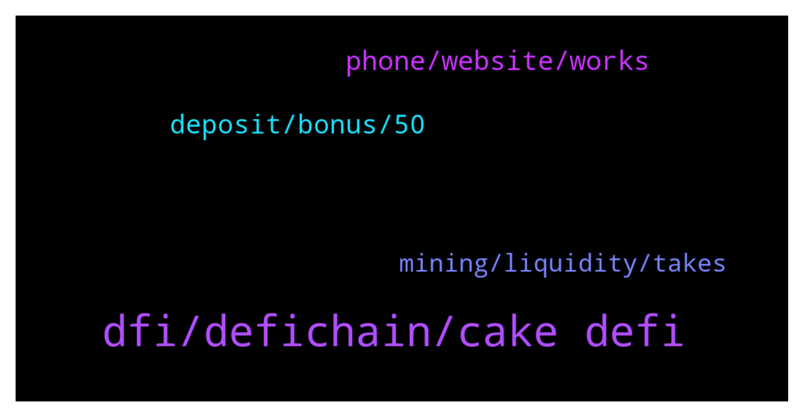

# **@CakeDeFi_EN**
 ## Analysis for **2022-01-15** - **2022-01-16**.

---

## 📊 **Basic Stats**

**n_messages_sent**: 167

---

---

## 🔝 **Top keywords and related messages**

1. **dfi, defichain, cake defi**

    @Dionis --- *Я к вам обращаюсь за помощью с верефикацией на cake I am asking you for help with cake verification* **--->** [TG Discussion](https://t.me/CakeDeFi_EN/165400)

    @Nazhadi57 --- *Ah okay. What’s the advantage of cake DeFi over using the DeFi chain DEX itself? They offer similar services right* **--->** [TG Discussion](https://t.me/CakeDeFi_EN/165306)

    @GOS13 --- *Bro, you are not very friendly telling me what I should do. I had my funds on defi, and I am forced to use cake to unwrap. I’m already taking it off and that is the problem. Take my complain seriously take a note and maybe devs can do something in the future.* **--->** [TG Discussion](https://t.me/CakeDeFi_EN/164882)

    @Kassius84 --- *https://www.defichain-value.com/d/-aHOfMT7z/03-stocks?orgId=1 https://www.defichain-analytics.com/vaultsLoans?entry=dTokenPrices  Only during minting, the oracle-price is used. Otherwise the DEX-price depends on supply and demand 👍* **--->** [TG Discussion](https://t.me/CakeDeFi_EN/165297)

    @Kassius84 --- *Hey, 0.0005 BTC is industry standard for platforms. Binance for example, charges 0.00077 BTC for withdrawals 👍 https://withdrawalfees.com/coins/bitcoin* **--->** [TG Discussion](https://t.me/CakeDeFi_EN/165275)

    @ferhat_lorem_ipsum --- *And you get 10 usd worth of dfi* **--->** [TG Discussion](https://t.me/CakeDeFi_EN/165308)

2. **phone, website, works**

    @Michael_Schredl --- *Works fine, what error do you get?* **--->** [TG Discussion](https://t.me/CakeDeFi_EN/165118)

    @Declan999 --- *Yes, I have tried both Chrome and FireFox and cleared caches in both cases.* **--->** [TG Discussion](https://t.me/CakeDeFi_EN/165128)

    @Declan999 --- *Hi. Not able to login to the website nor my smart phone all day today.  Rebooted the phone a few times. Is there any issue with the servers ? Thanks* **--->** [TG Discussion](https://t.me/CakeDeFi_EN/165117)

    @Cammy2904 --- *The app doesn't work. Or you mean to log through my mobile browser?* **--->** [TG Discussion](https://t.me/CakeDeFi_EN/165158)

    @Michael_Schredl --- *As Kassius already wrote, you need write the official Support - they can fix that in the backend https://cake.zendesk.com/hc/en-us/requests/new* **--->** [TG Discussion](https://t.me/CakeDeFi_EN/164915)

    @Kassius84 --- *Or can you try on the mobile website?* **--->** [TG Discussion](https://t.me/CakeDeFi_EN/165157)

3. **deposit, bonus, 50**

    @youngbillionaire9009 --- *It didn't say 8 have to make a deposit, before I can get 30$ bonus,, please read the advert posted on Facebook* **--->** [TG Discussion](https://t.me/CakeDeFi_EN/165074)

    @youngbillionaire9009 --- *Hello admin,I have not received the bonus after signing up* **--->** [TG Discussion](https://t.me/CakeDeFi_EN/165070)

    @Cryptogems05 --- *How much will referrer get when his referral deposit?* **--->** [TG Discussion](https://t.me/CakeDeFi_EN/165296)

    @ferhat_lorem_ipsum --- *Check your freezer, it should be there if the person you referred made a deposit already* **--->** [TG Discussion](https://t.me/CakeDeFi_EN/165310)

    @GK --- *I’m guessing this isn’t the place to ask tax questions. But if anyone can direct me to a group that can help it would be much appreciated* **--->** [TG Discussion](https://t.me/CakeDeFi_EN/165331)

    @mm_phoenix --- *above the picture it even says "Bonus of 30$ in DFI when you register for the first time and make your first deposit".* **--->** [TG Discussion](https://t.me/CakeDeFi_EN/165077)

4. **mining, liquidity, takes**

    @fadfunky --- *Helo why i dont see my btc at liquidity mining* **--->** [TG Discussion](https://t.me/CakeDeFi_EN/165354)

    @mm_phoenix --- *it can last up to 72h mostly within 1h* **--->** [TG Discussion](https://t.me/CakeDeFi_EN/164871)

    @fadfunky --- *But its should be in 1 hour to wait ya?* **--->** [TG Discussion](https://t.me/CakeDeFi_EN/165364)

    @redqueenof --- *You can get liquidated if you open in a higher position and price reverse 100x* **--->** [TG Discussion](https://t.me/CakeDeFi_EN/164960)

    @兵 --- *Are you all participating in DEFI mining?* **--->** [TG Discussion](https://t.me/CakeDeFi_EN/165250)

    @GOS13 --- *I feel this is a sensitive subject in here. Take a look at Binance. It is centralized but you can get the funds to decentralized in minutes. Because they have BSC. And on bsc there are bridges to mainnet* **--->** [TG Discussion](https://t.me/CakeDeFi_EN/164888)

