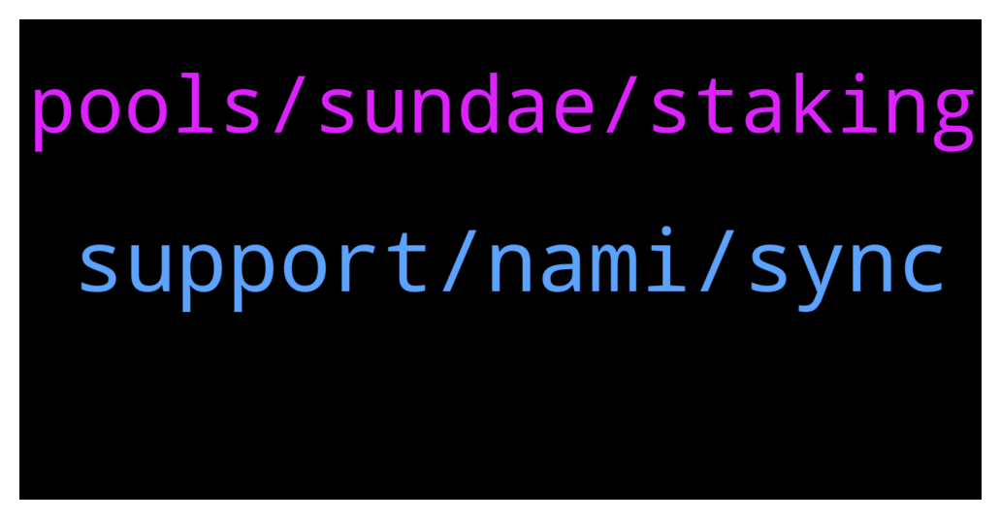

# **@Cardano**
 ## Analysis for **2022-01-15** - **2022-01-16**.

---

## 📊 **Basic Stats**

**n_messages_sent**: 97

---

---

## 🔝 **Top keywords and related messages**

1. **support, nami, sync**

    @TheBigBossK --- *About to buy a hardware wallet.  As Ledger S supports "up to three software apps", does it mean one can hold ADA, BTC, and ETH on it?* **--->** [TG Discussion](https://t.me/Cardano/769607)

    @BinK18 --- *yoroi is having synchronization issues- as always* **--->** [TG Discussion](https://t.me/Cardano/769469)

    @gauthamnag --- *Any issue Yorio web wallet not syncing at all , trying since 3 hours it keeps rotating simply* **--->** [TG Discussion](https://t.me/Cardano/769675)

    @frenske1 --- *It's unbelievable how bad Yoroi has gotten since Sebastian left. For both wallets I've been waiting 5+ minutes to sync, C's become O's, etc etc etc. Crazy how one-developer ventures have been able to absolutely overclass Yoroi such as cccault, NAMI and Gero wallet. Applause to them* **--->** [TG Discussion](https://t.me/Cardano/769447)

    @glitch04 --- *It's not limited to Yoroi at the epoch transition though* **--->** [TG Discussion](https://t.me/Cardano/769449)

    @Cucumber --- *Yes the sub-accounts fall under the same seed . If you uninstall nami for whatever reason on your browser and reinstall nami then import the primary wallet again with the seed all the sub-accounts will re-appear. Can confirm this works with brave browser on desktop. A little different to metamask where you require that additional key to restore sub accounts* **--->** [TG Discussion](https://t.me/Cardano/769262)

2. **pools, sundae, staking**

    @cysot --- *Hi all is there a problem with the network. I send Ada from binance over two hours ago, on block explore it shows funds in my address but on yoroi it says no transactions and funds not showing.* **--->** [TG Discussion](https://t.me/Cardano/769468)

    @Charis --- *Hi guys I have been staking Ada in binance for two months and today received my capital back… however without the staking rewards.. did this ever happen to anyone?* **--->** [TG Discussion](https://t.me/Cardano/769309)

    @TheC --- *To acquire Sundae through ISO participation, can we delegate ADA on Daedalus?* **--->** [TG Discussion](https://t.me/Cardano/769846)

    @ExInfernis --- *Yes you can. I am delegating from daedalus. Here you can find the eligible pools https://poolpeek.com/?s=09#/sundaeiso* **--->** [TG Discussion](https://t.me/Cardano/769858)

    @UleC0 --- *SUNDAESWAP is coming 20th, on this month!* **--->** [TG Discussion](https://t.me/Cardano/769896)

    @Barbedouce --- *Hi everybody, i heard somewhere about academic prizes win by ouroboros protocol, but i cannot find any related content. Share it please ! :)* **--->** [TG Discussion](https://t.me/Cardano/769785)

