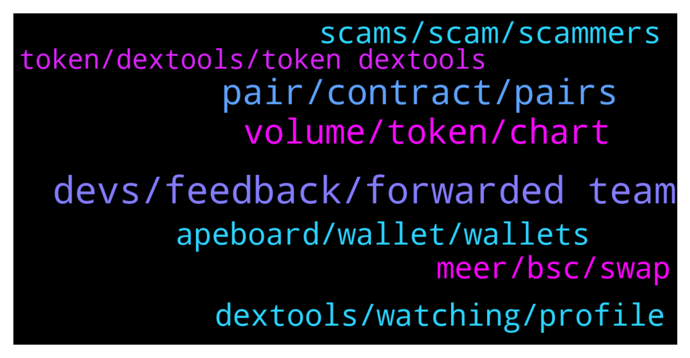

# **@DEXToolsCommunity**
 ## Analysis for **2022-01-14** - **2022-01-16**.

---

## 📊 **Basic Stats**

**n_messages_sent**: 317

---

---

## 🔝 **Top keywords and related messages**

1. **devs, feedback, forwarded team**

    @bastardganpunk --- *devs are checking… something is not correct here 😄* **--->** [TG Discussion](https://t.me/DEXToolsCommunity/324612)

    @bastardganpunk --- *thank you, the devs are on it 🙂* **--->** [TG Discussion](https://t.me/DEXToolsCommunity/324634)

    @bastardganpunk --- *yes, any bugs are great if you report them, that the devs can fix them* **--->** [TG Discussion](https://t.me/DEXToolsCommunity/324624)

    @bastardganpunk --- *@nate102 its legit 🙂 sorry for the doubts 😉* **--->** [TG Discussion](https://t.me/DEXToolsCommunity/324620)

    @binarygru --- *Thanks a lot man. Phew. I was so frightened by ETH 🙈* **--->** [TG Discussion](https://t.me/DEXToolsCommunity/325014)

    @Gigachadfi --- *Thank you ser. That was fast* **--->** [TG Discussion](https://t.me/DEXToolsCommunity/324813)

2. **pair, contract, pairs**

    @stanes --- *DEXT UNISWAP PAIR Chart and trade: https://www.dextools.io/app/uniswap/pair-explorer/0xa29fe6ef9592b5d408cca961d0fb9b1faf497d6d Contract: 0xfb7b4564402e5500db5bb6d63ae671302777c75a  DEXT PANCAKESWAP PAIR Chart and trade: https://www.dextools.io/app/pancakeswap/pair-explorer/0x4b729d5d871057f3a9c424792729217cde72410d Contract: 0xe91a8d2c584ca93c7405f15c22cdfe53c29896e3* **--->** [TG Discussion](https://t.me/DEXToolsCommunity/325009)

    @rpoole69 --- *Last time @napascual said they had to restart a backend server and it was updating, bsc/pair-explorer/0x88c9bf5e334e2591c6a866d5e20683e31226be3d and https://www.dextools.io/app/bsc/pair-explorer/0x1c183b23e8d7a8d287606364f741ddbdafec28de were the 2 I was monitoring* **--->** [TG Discussion](https://t.me/DEXToolsCommunity/324808)

    @ATX_987 --- *Are you having issues? At least on of your pairs is about 3 hours behind right now (0xb2ba36ee6ba6113a914f3e8812a0df094dec5994)* **--->** [TG Discussion](https://t.me/DEXToolsCommunity/324546)

    @bastardganpunk --- *this pair has just not been traded* **--->** [TG Discussion](https://t.me/DEXToolsCommunity/324631)

    @nate102 --- *I’ve actually noticed the data bug on a few pairs btw do u want me to send in some?* **--->** [TG Discussion](https://t.me/DEXToolsCommunity/324623)

    @stanes --- *Ok, thanks, any specific pair? I don't see any pb with some random ones.* **--->** [TG Discussion](https://t.me/DEXToolsCommunity/324803)

3. **volume, token, chart**

    @nate102 --- *https://www.dextools.io/app/ether/pair-explorer/0x98858a67b3975903b0e77ced4831105262aa7aa0 same story with this one also, however only third and fourth 1 minute candles. (About 200k volume in those 2 candles total and chart makes it appear like theres been 0 volume haha)* **--->** [TG Discussion](https://t.me/DEXToolsCommunity/324627)

    @Uturn --- *One more question, regards to the price alert feature, is there a way that Dev team can create a one reactivate button to reactivate all the price alert within one token? It’s really a hassle to reactivate one by one for just one token.* **--->** [TG Discussion](https://t.me/DEXToolsCommunity/325572)

    @jmorfeo --- *A screen to see return of investment I mean ..%day %week %month ... For a watchlist ...* **--->** [TG Discussion](https://t.me/DEXToolsCommunity/325226)

    @nate102 --- *I’ve noticed it on a few eth tokens, but only new pairs and then it fixes itself, I believe the price in the trade history is correct however the visible chart is off. You can see the first 3 minutes look like there’s 0 volume but there’s actually a tens of thousands haha* **--->** [TG Discussion](https://t.me/DEXToolsCommunity/324613)

    @bastardganpunk --- *Which kind of token returns do you mean? You can use the tools in the chart to see percentage growth of price.* **--->** [TG Discussion](https://t.me/DEXToolsCommunity/325206)

    @nate102 --- *https://www.dextools.io/app/ether/pair-explorer/0x7dec9d12a30eebe5c570fa1603a00c5fc705b5a7, I haven't checked if this one is legit either but regardless u can see there is clear volume (around 400k) first 3 minutes and price in trade history first 3 minutes is different on chart. same bug* **--->** [TG Discussion](https://t.me/DEXToolsCommunity/324625)

4. **apeboard, wallet, wallets**

    @stanes --- *You can hold 1k DEXT or pay the monthly membership. For that, connect your wallet to the app and follow instructions: https://www.dextools.io/app/user/account* **--->** [TG Discussion](https://t.me/DEXToolsCommunity/325005)

    @dougkey --- *hello how do we add multiple wallets? to standard subscription. been doing one wallet, but cant tell how to add multiple* **--->** [TG Discussion](https://t.me/DEXToolsCommunity/325393)

    @stanes --- *Apeboard let you have a look at all the holdings on all the chains for a specific wallet. It's complementary to Dextools.* **--->** [TG Discussion](https://t.me/DEXToolsCommunity/325415)

    @dougkey --- *hi - thanks, yes i have subscription (1000dext).  It says 'multiple wallets' where you add your wallet and 'up to 500 wallets'  there is a link to Apeboard.  do you do it on Apeboard?    so like, when I connect to dext, I want it to show / pull other wallets (without conneting each wallet separately)* **--->** [TG Discussion](https://t.me/DEXToolsCommunity/325410)

    @stanes --- *You can track all the wallets you want by adding them on "wallet info". But no way to see your positions directly in the charts for the moment.* **--->** [TG Discussion](https://t.me/DEXToolsCommunity/325397)

    @stanes --- *Hi, not sure what you mean, to access standard membership you need your 1k DEXT to be in one single wallet.* **--->** [TG Discussion](https://t.me/DEXToolsCommunity/325394)

5. **dextools, watching, profile**

    @fiesta_0604 --- *How to turn off dextools chart, thanks!* **--->** [TG Discussion](https://t.me/DEXToolsCommunity/325229)

    @GhosTMan96QuelloVeroDal2014 --- *Friend , do you have any other Dextools communities? I don't understand when you talk🥺🥺* **--->** [TG Discussion](https://t.me/DEXToolsCommunity/324364)

    @JollyBZ --- *Does anyone know why dextools is reporting the same buy and sell 5 times? Lol* **--->** [TG Discussion](https://t.me/DEXToolsCommunity/324645)

    @fastsafe01 --- *How can I add logo from dextools.* **--->** [TG Discussion](https://t.me/DEXToolsCommunity/324891)

    @stanes --- *Hi. The exact algorithm is undisclosed but it's mainly the number of people watching the pair on Dextools.* **--->** [TG Discussion](https://t.me/DEXToolsCommunity/325511)

    @nate102 --- *Any chance of AVAX chain being added to dextools?* **--->** [TG Discussion](https://t.me/DEXToolsCommunity/324366)

6. **scams, scam, scammers**

    @nate102 --- *https://www.dextools.io/app/ether/pair-explorer/0x8cff7e5eba9f1d2c5eddbeb312beb07dc0e2e43c, same story with this here* **--->** [TG Discussion](https://t.me/DEXToolsCommunity/324633)

    @stanes --- *Please DM @guillermorodriguez78 he is the person-in-charge.  Be aware of scammers, HE WILL NEVER DM YOU FIRST.* **--->** [TG Discussion](https://t.me/DEXToolsCommunity/325532)

    @stanes --- *Please be aware we can't avoid scams being created. We also can't stop smartcontracts doing what they are programmed to do.  We have some ways to alert people of a scam like the "contract details" and the community votes. Can we do more? Yes, we are working on adding more tools to reduce the risk for our users to fall into scams. But be sure there is no way to be secure if you don't DYOR.* **--->** [TG Discussion](https://t.me/DEXToolsCommunity/325424)

    @gumbercules --- *No one since that's not possible. Be careful with dms sir* **--->** [TG Discussion](https://t.me/DEXToolsCommunity/325069)

    @stanes --- *But you better DM me if there is something you don'T understand.* **--->** [TG Discussion](https://t.me/DEXToolsCommunity/325444)

    @JoeyDieleman --- *Indeed we will NEVER dm first* **--->** [TG Discussion](https://t.me/DEXToolsCommunity/324464)

7. **meer, bsc, swap**

    @su_allah --- *I want to swap MEER for USDT but I need to convert my MEER to MEER bsc  so I can swap MEER for USDT* **--->** [TG Discussion](https://t.me/DEXToolsCommunity/324847)

    @su_allah --- *I want to swap MEER bsc for USDT but to swap I need to exchange my MEER coin in my Kahf wallet to MEER bsc* **--->** [TG Discussion](https://t.me/DEXToolsCommunity/324851)

    @su_allah --- *We are using Binance smart chain but can you help to swap MEER bsc* **--->** [TG Discussion](https://t.me/DEXToolsCommunity/324839)

    @bastardganpunk --- *can you be more specific please? convert MEER to MEER bsc?* **--->** [TG Discussion](https://t.me/DEXToolsCommunity/324849)

    @su_allah --- *Hi Admin  how to convert MEER to MEER bsc on dextools?* **--->** [TG Discussion](https://t.me/DEXToolsCommunity/324832)

    @Damon_big_things --- *Anyone know of a faucet for bsc?* **--->** [TG Discussion](https://t.me/DEXToolsCommunity/324937)

