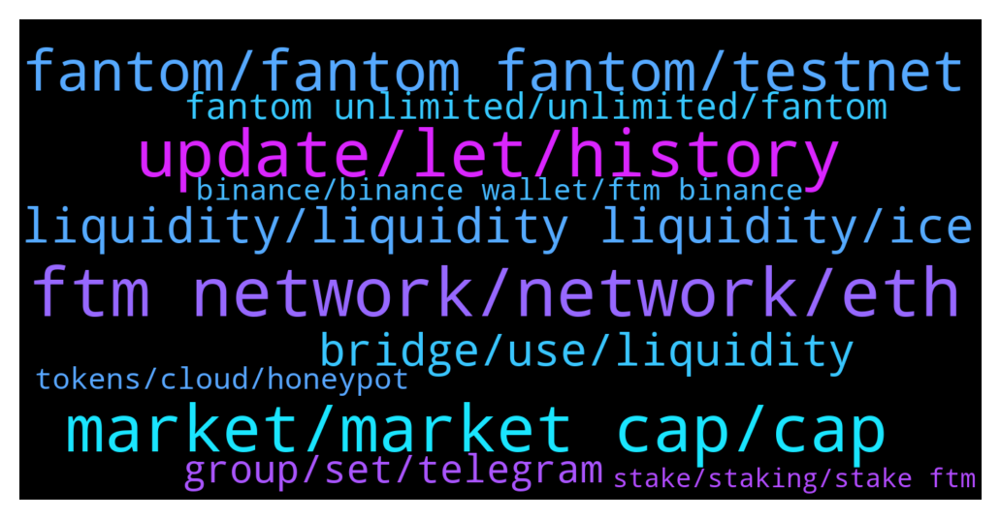

# **@Fantom_English**
 ## Analysis for **2022-01-15** - **2022-01-16**.

---

## 📊 **Basic Stats**

**n_messages_sent**: 417

---

---

## 🔝 **Top keywords and related messages**

1. **ftm network, network, eth**

    @Crypt22 --- *So, how do I get my erc20 ftm* **--->** [TG Discussion](https://t.me/Fantom_English/632869)

    @HungryCatapilar --- *Can anyone explain how to get FTM tokens on the FTM network. Not on BSC or Eth, but on FTM network. I cant even bridge networks because it costs 1.7 FTM. I would gladly pay that, but I cant even get it in the first place.* **--->** [TG Discussion](https://t.me/Fantom_English/631423)

    @Mcjig --- *no, you check that on ftmscan* **--->** [TG Discussion](https://t.me/Fantom_English/632852)

    @Rico --- *hi, i'm on tomb finance trying to stale TOMB-FTM LP but it does not seem possible, or am i missing smth ?* **--->** [TG Discussion](https://t.me/Fantom_English/632482)

    @JVogez --- *Is it safe to send another TX of FTM from ETH network to FTM network, even of the first one i did has not yet arrived?* **--->** [TG Discussion](https://t.me/Fantom_English/631628)

    @GASSadiq --- *How do I send to my wallet I just added the FTM on my MetaMask?* **--->** [TG Discussion](https://t.me/Fantom_English/632460)

2. **update, let, history**

    @believerx --- *but thanks for letting me know its not possible this way - was searching for some time* **--->** [TG Discussion](https://t.me/Fantom_English/631569)

    @Khu_Fu --- *Thank you again for the help ...* **--->** [TG Discussion](https://t.me/Fantom_English/631306)

    @Mcjig --- *first you have to locate it* **--->** [TG Discussion](https://t.me/Fantom_English/632872)

    @pajamasfreak --- *No, we don’t have one here* **--->** [TG Discussion](https://t.me/Fantom_English/632283)

    @Mcjig --- *of course it works i wouldnt tell you something that didnt* **--->** [TG Discussion](https://t.me/Fantom_English/632559)

    @fortunatus1314 --- *Thanks for the info. How to prevent this in future?* **--->** [TG Discussion](https://t.me/Fantom_English/631684)

3. **market, market cap, cap**

    @theblokchainbaker --- *FTM will be a One Hundred D0ll3r coin soon* **--->** [TG Discussion](https://t.me/Fantom_English/631990)

    @Icarus009 --- *That would make it 1/3rd the market cap of all cryptos* **--->** [TG Discussion](https://t.me/Fantom_English/631994)

    @theblokchainbaker --- *But I can Ftm is beautiful I can't say Ftm 1 0 0* **--->** [TG Discussion](https://t.me/Fantom_English/632473)

    @Heisenbvrg --- *Ftm will be lifechanging if u believe strong enough just hold onto it, i personally got enough fanties :)* **--->** [TG Discussion](https://t.me/Fantom_English/632231)

    @neshq --- *Lets go FTM, almost and i can buy lamberghini and order a dozen of prostitutes 😅* **--->** [TG Discussion](https://t.me/Fantom_English/632339)

    @theblokchainbaker --- *Market cap is an illusion. It's not real. The only thing seperating real from fake is your belief. FTM is what will propel financially independence to the future, the concept, the action, the future. Either hop in the bus or walk to your mc Donald's shift in the snow uphill 6 miles. Hello sir welcome to mc Donald's can I take your order* **--->** [TG Discussion](https://t.me/Fantom_English/631997)

4. **fantom, fantom fantom, testnet**

    @Hnefatafl --- *Where i can find Fantom roadmap?* **--->** [TG Discussion](https://t.me/Fantom_English/632403)

    @Crypt22 --- *I thought they were in myetherwallet. Not sure what exchange? Where would I find erc20 fantom on fantom network???* **--->** [TG Discussion](https://t.me/Fantom_English/632842)

    @tifa1001 --- *Is there something happening this week for fantom?* **--->** [TG Discussion](https://t.me/Fantom_English/632721)

    @M --- *Don’t answer them bro. Fantom will never call anyone* **--->** [TG Discussion](https://t.me/Fantom_English/632513)

    @CryptoBloc365 --- *Hello all! Newbie on fantom… I heard that’s the network is very centralized (less than 100 nodes) also will it have someday a mobile wallet on IOS and Android.  Thanks a lot 🙏* **--->** [TG Discussion](https://t.me/Fantom_English/631310)

    @xoratme --- *I'm trying to integrate my contracts deployed in the fantom testnet to the graph* **--->** [TG Discussion](https://t.me/Fantom_English/632078)

5. **liquidity, liquidity liquidity, ice**

    @retiredcoin --- *Thank you I'm finding this post https://www.reddit.com/r/FantomFoundation/comments/qstd1u/multichainxyz_bridging_erc20_ftm_to_opera_mainnet/ and it just has me worried so much.. why is there a liquidity problem at all to start with? Would you know how long it would take to complete?  Thank you for the reply 🙏* **--->** [TG Discussion](https://t.me/Fantom_English/631886)

    @JVogez --- *You mentioned we can see liquidity in advance using multichain.org. please can you elaborate as to where this can be seen? i'm about to do a tx on here but can't see where liquidity is specified. thanks* **--->** [TG Discussion](https://t.me/Fantom_English/631750)

    @Janevietani --- *https://ftmscan.com/address/0xE3e0C14bbCBF86b3Ff60E8666C070d34b84F3f73 you can check xyz liquidity at here* **--->** [TG Discussion](https://t.me/Fantom_English/631675)

    @Janevietani --- *no need liquidity, coz it will just got minted on destination chain when you bridge LINK from ethereum to fantom* **--->** [TG Discussion](https://t.me/Fantom_English/631567)

    @JVogez --- *is liquidity low for all tokens? for example if i now wanted to bridge some ICE from ETH to Fantom would that be the same story?* **--->** [TG Discussion](https://t.me/Fantom_English/631646)

    @Janevietani --- *like i said. there is no liquidity. once liquidity comes , you will get your funds* **--->** [TG Discussion](https://t.me/Fantom_English/631725)

6. **bridge, use, liquidity**

    @Janevietani --- *you mean bridge ? dont bridge now. bridge doesnt have liquidity* **--->** [TG Discussion](https://t.me/Fantom_English/631641)

    @Janevietani --- *do you mean bridge ?  you can use https://spookyswap.finance/bridge* **--->** [TG Discussion](https://t.me/Fantom_English/631347)

    @Janevietani --- *https://tools.defieye.io/bridge/ you can use this tools to check which bridge is the best to to use. it will show which bridge have the most liquidity* **--->** [TG Discussion](https://t.me/Fantom_English/631581)

    @wkaplan --- *Hi admin - who can help me with a bridge liquidity issue* **--->** [TG Discussion](https://t.me/Fantom_English/632606)

    @Mcjig --- *yes https://app.multichain.org/#/pool you can look at the pools for liquidity for what token you want to bridge* **--->** [TG Discussion](https://t.me/Fantom_English/632634)

    @gg7519 --- *Is there a way to bridge more quickly maybe though spiritswap or some?* **--->** [TG Discussion](https://t.me/Fantom_English/631836)

7. **group, set, telegram**

    @Mcjig --- *and no spanish group. might check out discord* **--->** [TG Discussion](https://t.me/Fantom_English/632689)

    @Antazarro --- *Hi guys! Any official russian group?* **--->** [TG Discussion](https://t.me/Fantom_English/632675)

    @KTO222 --- *Hi is there a german FTM Group ?* **--->** [TG Discussion](https://t.me/Fantom_English/632384)

    @Johnlxc --- *Is there a Chinese telegraph group?* **--->** [TG Discussion](https://t.me/Fantom_English/632365)

    @Am --- *Hey guys anybody know what is the telegram group of  pooch token?* **--->** [TG Discussion](https://t.me/Fantom_English/631656)

    @CryptoBKAY --- *Hi guys. Is there a Korean channel?* **--->** [TG Discussion](https://t.me/Fantom_English/631881)

8. **fantom unlimited, unlimited, fantom**

    @fastandmoon --- *FTM TO THE MOON. Low gas fee,fantastic Defi protocols and very real use case for fantom blockchain. we are only at the beginning, hold and buy now at discount. #FELIX #FANTY #TOMB  #BRUSH #ZOO #ICE #TSHARE to the moon 🚀🚀😍* **--->** [TG Discussion](https://t.me/Fantom_English/631215)

    @Siii --- *What’d you think is the best staking option on Fantom right now? I’m hearing a lot about Tomb finance but it’s high risk I like that but also want something just a bit safer* **--->** [TG Discussion](https://t.me/Fantom_English/632850)

    @Mcjig --- *❌ NO SHILL OR ASK FINANCIAL ADVICE! ❌  Price discussion and FA/TA trading:  • chat.fantom.network • @fantomtrading  Artion NFT, Defi, Yield Farming, Gaming, Developer: • chat.fantom.network  FTM ecosystem projects and discussion: • projects.fantom.network • https://discuss.fantom.digital/d/30-all-in-one-guide-for-fantom-newcomers • @FantomLoungeOfficial • @Fantomine • https://discord.gg/ftmalerts* **--->** [TG Discussion](https://t.me/Fantom_English/632907)

    @Mcjig --- *Alternative Routes to bring assets to Fantom ( straightforwad no liquidity required ) 1. WETH ( Ethereum) -> WETH (Fantom)  ( unlimited ) 2. MIM (Ethereum, all other chains) —>MIM (Fantom)   ( unlimited ) 3. DAI (Ethereum) —> DAI (Fantom )   ( unlimited ) 4. WBTC  ( Ethereum) >WBTC (Fantom)  ( unlimited ) 5. USDC (Ethereum) -->USDC ( Fantom)  ( unlimited ) 6. USDT ( Ethereum) -->fUSDT (Fantom)  ( unlimited ) 7. BNB (Binance Smart Chain) —>BNB (Fantom)   ( unlimited ) 8. UST ( Terra ) —> UST (Fantom)   ( unlimited ) other Defi like FRAX* **--->** [TG Discussion](https://t.me/Fantom_English/632798)

    @Janevietani --- *Alternative Routes to bring assets to Fantom ( straightforwad no liquidity required ) 1. WETH ( Ethereum) -> WETH (Fantom)  ( unlimited ) 2. MIM (Ethereum, all other chains) —>MIM (Fantom)   ( unlimited ) 3. DAI (Ethereum) —> DAI (Fantom )   ( unlimited ) 4. WBTC  ( Ethereum) >WBTC (Fantom)  ( unlimited ) 5. USDC (Ethereum) -->USDC ( Fantom)  ( unlimited ) 6. USDT ( Ethereum) -->fUSDT (Fantom)  ( unlimited ) 7. BNB (Binance Smart Chain) —>BNB (Fantom)   ( unlimited ) 8. UST ( Terra ) —> UST (Fantom)   ( unlimited ) other Defi like FRAX* **--->** [TG Discussion](https://t.me/Fantom_English/632784)

    @Janevietani --- *Alternative Routes to bring assets to Fantom ( straightforwad no liquidity required ) 1. WETH ( Ethereum) -> WETH (Fantom)  ( unlimited ) 2. MIM (Ethereum, all other chains) —>MIM (Fantom)   ( unlimited ) 3. DAI (Ethereum) —> DAI (Fantom )   ( unlimited ) 4. WBTC  ( Ethereum) >WBTC (Fantom)  ( unlimited ) 5. USDC (Ethereum) -->USDC ( Fantom)  ( unlimited ) 6. USDT ( Ethereum) -->fUSDT (Fantom)  ( unlimited ) 7. BNB (Binance Smart Chain) —>BNB (Fantom)   ( unlimited ) 8. UST ( Terra ) —> UST (Fantom)   ( unlimited ) other Defi like FRAX, Beefy* **--->** [TG Discussion](https://t.me/Fantom_English/631648)

9. **tokens, cloud, honeypot**

    @Vlad Vasyl --- *yes but what are they doing against this problem there are other poeple who stucked in sum 500000 tokens* **--->** [TG Discussion](https://t.me/Fantom_English/632777)

    @tnkytnky --- *can anyone tell me how there are honeypot detectors yet people can deploy contracts on this network all day long that are honeypots* **--->** [TG Discussion](https://t.me/Fantom_English/632121)

    @G --- *Just lost 2500000 tokens out of my wallet* **--->** [TG Discussion](https://t.me/Fantom_English/632109)

    @believerx --- *yeh thats not going to happen from ethereum lol* **--->** [TG Discussion](https://t.me/Fantom_English/631568)

    @I_am_FTM_CRV_Investor --- *Or when aws or google cloud or ali cloud or azure took down internet. Lolz. Gimmick.* **--->** [TG Discussion](https://t.me/Fantom_English/631314)

    @I_am_FTM_CRV_Investor --- *Is there anything decentralized? Look at BTC when they fuck kazakhthan* **--->** [TG Discussion](https://t.me/Fantom_English/631313)

10. **binance, binance wallet, ftm binance**

    @radovid5 --- *no, i have ftm in binance wallet* **--->** [TG Discussion](https://t.me/Fantom_English/631466)

    @Lucy_hill --- *Hi Everyone Hope you're all well.  I have made quite a major error with a substantial amount of FTM - and I am really hoping someone can help.  I sent FTM from Binance on FTM, to a friends exchange wallet - but the address he gave was for USDT and network Bep20. Also the exchange I sent to doesn't support FTM. Unsurprisingly, he hasn't received the FTM.  The transfer completed. And the transaction ID looks as though its an exchange - as the coins were moved out shortly after. And there are a lot of transactions linked to the destination address. I have contacted his  exchange (I also have an account with them) and they have their technical team looking into it... Anything else I can do?* **--->** [TG Discussion](https://t.me/Fantom_English/632268)

    @Mcjig --- *binance us listed about 1 month ago* **--->** [TG Discussion](https://t.me/Fantom_English/632521)

    @Mcjig --- *binance non us listed ftm a long time ago at least 2 years* **--->** [TG Discussion](https://t.me/Fantom_English/632520)

    @Paul --- *Hi guys when did binance list ftm* **--->** [TG Discussion](https://t.me/Fantom_English/632508)

    @Kekcatt --- *Unusual buying activity alert on FTM binance. whales playing.* **--->** [TG Discussion](https://t.me/Fantom_English/632332)

