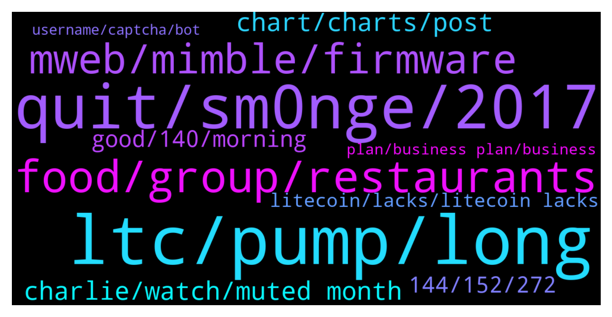

# **@Litecoin**
 ## Analysis for **2022-01-15** - **2022-01-16**.

---

## 📊 **Basic Stats**

**n_messages_sent**: 392

---

---

## 🔝 **Top keywords and related messages**

1. **ltc, pump, long**

    @K_arlso_n --- *long, long, long LTC we go to the 500* **--->** [TG Discussion](https://t.me/Litecoin/2048129)

    @Tiger --- *I want send half of my ltcs to charlie lee* **--->** [TG Discussion](https://t.me/Litecoin/2047437)

    @RorschachTesst --- *Why is ltc pumping though? Btc decoupling or dev news? I would hope for the latter* **--->** [TG Discussion](https://t.me/Litecoin/2047511)

    @Macro5674 --- *True and I think LTC gonna be huge in China !* **--->** [TG Discussion](https://t.me/Litecoin/2047434)

    @z323791 --- *What's his problem why he is so negative about LTC* **--->** [TG Discussion](https://t.me/Litecoin/2047006)

    @jrx486 --- *That’s significantly more than el salvador* **--->** [TG Discussion](https://t.me/Litecoin/2047551)

2. **quit, sm0nge, 2017**

    @TonyNakamoto --- *pr0bly gonna neeB some new ones cuz the 2017 coims r toast* **--->** [TG Discussion](https://t.me/Litecoin/2047701)

    @TonyNakamoto --- *any1 do rem0mbers the pot-d0pe coims of 2017?* **--->** [TG Discussion](https://t.me/Litecoin/2047693)

    @TonyNakamoto --- *v nice, have u backtested the 2018 bearm0rket 2 see how it performs under those m0rket conditioms?* **--->** [TG Discussion](https://t.me/Litecoin/2047795)

    @TonyNakamoto --- *lot of ppl useB'd 2 sm0nge* **--->** [TG Discussion](https://t.me/Litecoin/2047861)

    @TonyNakamoto --- *harB 2 quit, eBen harBer 2 stay quit'd* **--->** [TG Discussion](https://t.me/Litecoin/2047851)

    @TonyNakamoto --- *Hapn'd 2 me in 2015 iirc* **--->** [TG Discussion](https://t.me/Litecoin/2047012)

3. **food, group, restaurants**

    @jrx486 --- *He needs to change Employer...  "Two former McDonald’s employees spill insider secrets about working at the fast food chain: Employees are allowed a free meal when working, but there are a number of limitations to what they can order. "If you are on an seven-plus hour shift then you're allowed any medium Extra Value Meal. "If you're on a shift which is less than six hours then you're only allowed something small like a cheese burger and small fries."* **--->** [TG Discussion](https://t.me/Litecoin/2047736)

    @cofaceeee --- *I dont want donations or charity others i would ve asked for that* **--->** [TG Discussion](https://t.me/Litecoin/2047722)

    @RorschachTesst --- *You're better off talking to a charity in your city than a crypto group. Nobody is going to donate to you if that is your expectation. Life is tough and unfair at times* **--->** [TG Discussion](https://t.me/Litecoin/2047721)

    @arnego2 --- *You are in the wrong group* **--->** [TG Discussion](https://t.me/Litecoin/2048212)

    @RorschachTesst --- *Working in fast food joints is the worst thing ever. They only pay minimum wage. Restaurants are much better, you can soak up on all the tips lol* **--->** [TG Discussion](https://t.me/Litecoin/2047740)

    @RorschachTesst --- *Nah fam, restaurants waste a shit ton of food everyday. I've waited tables myself in college and seen a colossal amount of food being thrown out. Try to befriend someone at the restaurant and they'll be kind enough to help you out* **--->** [TG Discussion](https://t.me/Litecoin/2047734)

4. **mweb, mimble, firmware**

    @BennyBennyBlanco --- *There is proof, talk about here for the last few years is mimble wimble, nothing else* **--->** [TG Discussion](https://t.me/Litecoin/2048192)

    @bake_Crypto --- *Then why not L3+ and update firmware could do very well* **--->** [TG Discussion](https://t.me/Litecoin/2047641)

    @luigiciotti --- *I think MWEB is a huge move forward* **--->** [TG Discussion](https://t.me/Litecoin/2047600)

    @arnego2 --- *Ok any pointers on how to then?* **--->** [TG Discussion](https://t.me/Litecoin/2047799)

    @bake_Crypto --- *Hiveon can 1,5x your hash power with no danger to machine* **--->** [TG Discussion](https://t.me/Litecoin/2047647)

    @RorschachTesst --- *Yeah I tried this too, only problem with hiveos is that you need to do a usb firmware upgrade if you ever need to change* **--->** [TG Discussion](https://t.me/Litecoin/2047650)

5. **chart, charts, post**

    @TonyNakamoto --- *Or most other charting sites r imagine* **--->** [TG Discussion](https://t.me/Litecoin/2047131)

    @Bigcfidolla --- *please master bot can i post my analysis and charts* **--->** [TG Discussion](https://t.me/Litecoin/2047083)

    @arnego2 --- *Go to reddit and you'll find abundant Info* **--->** [TG Discussion](https://t.me/Litecoin/2047614)

    @TonyNakamoto --- *U can see the vol on a specific pair and exchange on the Tradingview chart* **--->** [TG Discussion](https://t.me/Litecoin/2047130)

    @saeed_talebi --- *i  do have a profession technikal chart* **--->** [TG Discussion](https://t.me/Litecoin/2047288)

    @ZombieBitcoin --- *Why don't you start by posting your analysis and charts* **--->** [TG Discussion](https://t.me/Litecoin/2047095)

6. **charlie, watch, muted month**

    @Forexjunkie --- *Please Explain more,  but dumb it down for me* **--->** [TG Discussion](https://t.me/Litecoin/2047568)

    @jrx486 --- *He can’t answer, he’s muted for a month* **--->** [TG Discussion](https://t.me/Litecoin/2047003)

    @crypto_charlie_b --- *doing a little reading today and come across this…..made me think about @coblee* **--->** [TG Discussion](https://t.me/Litecoin/2048178)

    @jericho2411 --- *id dont watch. out like shoes* **--->** [TG Discussion](https://t.me/Litecoin/2047987)

    @Forexjunkie --- *Watch this and just tell me your thoughts* **--->** [TG Discussion](https://t.me/Litecoin/2047526)

    @Forexjunkie --- *But it will be interesting to watch it all play out says the drunken Baker* **--->** [TG Discussion](https://t.me/Litecoin/2047502)

7. **good, 140, morning**

    @Pablocality --- *Idk.  Our Carrie said good afternoon. Not good morning* **--->** [TG Discussion](https://t.me/Litecoin/2047741)

    @Bigcfidolla --- *that is correct but she overbought* **--->** [TG Discussion](https://t.me/Litecoin/2047175)

    @BennyBennyBlanco --- *I been here longer than u. So I know what’s happening here* **--->** [TG Discussion](https://t.me/Litecoin/2048203)

    @Bigcfidolla --- *i just got here.  wow* **--->** [TG Discussion](https://t.me/Litecoin/2047116)

    @jrx486 --- *2 days in a row, good morning with 3 minutes difference* **--->** [TG Discussion](https://t.me/Litecoin/2047742)

    @Forexjunkie --- *Couldnt come at a better time, I really need to shave* **--->** [TG Discussion](https://t.me/Litecoin/2047328)

8. **144, 152, 272**

    @saeed_talebi --- *147.2 is hight resistsnt if it passes it goes to 152* **--->** [TG Discussion](https://t.me/Litecoin/2047325)

    @Bigcfidolla --- *144 should b the true pivot* **--->** [TG Discussion](https://t.me/Litecoin/2047267)

    @saeed_talebi --- *its kind eanugh to not think about 138* **--->** [TG Discussion](https://t.me/Litecoin/2047221)

    @saeed_talebi --- *yeahhhhhhhh  153. by tomarrow 😊* **--->** [TG Discussion](https://t.me/Litecoin/2047195)

    @saeed_talebi --- *4h fib ret......passing(1.272) 144.7 - > with high prediction next isfiv 2.272)= 152.4* **--->** [TG Discussion](https://t.me/Litecoin/2047035)

    @saeed_talebi --- *yeah we had a pull back in at 143 it mean... the trend i upward man.* **--->** [TG Discussion](https://t.me/Litecoin/2047216)

9. **litecoin, lacks, litecoin lacks**

    @BennyBennyBlanco --- *LItecoin lacks development. Very slow, while other projects are more ahead* **--->** [TG Discussion](https://t.me/Litecoin/2048188)

    @BennyBennyBlanco --- *Also litecoin should do what ethereum did and make Litecoin 2 where actually litecoin 2 u can stake and earn apy* **--->** [TG Discussion](https://t.me/Litecoin/2048202)

    @arnego2 --- *Any proof or is it just your statement? Look up the header and see what Litecoin is doing.* **--->** [TG Discussion](https://t.me/Litecoin/2048191)

    @arnego2 --- *Technically Litecoin is more up-to-date than most other coins, even Bitcoin* **--->** [TG Discussion](https://t.me/Litecoin/2048186)

    @arnego2 --- *Where Litecoin lacks is more on the public relations issues. Concrete action to convince Stripe Klarna and the lot* **--->** [TG Discussion](https://t.me/Litecoin/2048198)

    @arnego2 --- *Could be. litecoin is great as it is/was and needs more marketing. More usage in ecommerce.* **--->** [TG Discussion](https://t.me/Litecoin/2047602)

10. **plan, business plan, business**

    @RorschachTesst --- *I'm not in Europe and sorry that you're going through this difficult phase but crypto will probably not help. It's too volatile* **--->** [TG Discussion](https://t.me/Litecoin/2047702)

    @jrx486 --- *you can always rent a server. i personally don't trust other companies to do the trading for me. too many go bankrupt and run away with your money, especially overseas* **--->** [TG Discussion](https://t.me/Litecoin/2047809)

    @arnego2 --- *Well Telegram offers a payment gateway for groups and channels. Trading is not for me. Way too much stress. Plus we have an unstable electric/internet supply.* **--->** [TG Discussion](https://t.me/Litecoin/2047808)

    @jrx486 --- *what's the business plan behind these fembots? lure lonely crypto men into thinking they'll get an exotic bride who will come to their country and ask money?* **--->** [TG Discussion](https://t.me/Litecoin/2047752)

    @jrx486 --- *that's the plan. so it functions as an automated moneyprinter.* **--->** [TG Discussion](https://t.me/Litecoin/2047791)

    @RorschachTesst --- *If your goal is to setup a farm then go for it* **--->** [TG Discussion](https://t.me/Litecoin/2047646)

