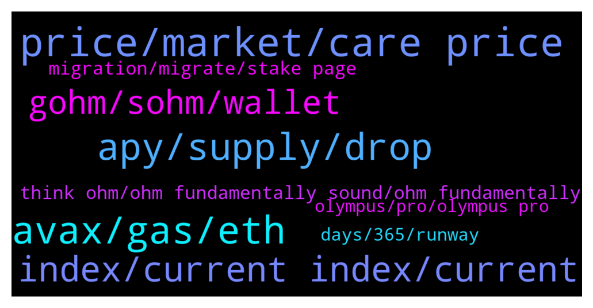

# **@OlympusTG**
 ## Analysis for **2022-01-15** - **2022-01-16**.

---

## 📊 **Basic Stats**

**n_messages_sent**: 859

---

---

## 🔝 **Top keywords and related messages**

1. **price, market, care price**

    @Cali_millionaire --- *I can understand that That’s why price is equallly important* **--->** [TG Discussion](https://t.me/OlympusTG/151101)

    @nfwaple --- *yea it sure is, but it may not solve your concern about price 😆😆* **--->** [TG Discussion](https://t.me/OlympusTG/151665)

    @cdp279 --- *Haha. For sure. But honestly. Chill bro. We don’t know what will happen but only up from here for sure. The price might go down a bit depends on the market.   But ohmies working hard and building the project for the future. Hang in there* **--->** [TG Discussion](https://t.me/OlympusTG/151187)

    @Ap0l1o --- *I bought at 1275$, in profit* **--->** [TG Discussion](https://t.me/OlympusTG/151092)

    @Ap0l1o --- *Btw, we don’t really care about the price* **--->** [TG Discussion](https://t.me/OlympusTG/151082)

    @Cixex --- *It worsens it.  I am not keen on the price.  I am interested in the reward rate to balance the swings in the market.* **--->** [TG Discussion](https://t.me/OlympusTG/151666)

2. **avax, gas, eth**

    @nfwaple --- *you can bridge using the Synapse bridge to AVAX, but you'll need AVAX for gas on the AVAX network, I think the Synapse bridge gives you some AVAX but I am not sure how much or if it would be enough* **--->** [TG Discussion](https://t.me/OlympusTG/151453)

    @nfwaple --- *ETH may cost you more than $100 in fee, AVAX fee is less than $1* **--->** [TG Discussion](https://t.me/OlympusTG/150739)

    @mario_99990 --- *I have one question  Why olympus ohm choose eth network with its high fees  And left other networks with low fees ?  Can i get answer ?* **--->** [TG Discussion](https://t.me/OlympusTG/150509)

    @lunag --- *Ok thanks!  Is the synapse bridge on the Avax website?* **--->** [TG Discussion](https://t.me/OlympusTG/151456)

    @mario_99990 --- *But price will avax is higher. ?* **--->** [TG Discussion](https://t.me/OlympusTG/150740)

    @scapiia --- *Indeed. I‘m still with eth but I‘ll take out monthly profits from december, thinking about moving to another chain so I dont need to pay gas fees every month. Would have around 230ohm then What do you think I should do?* **--->** [TG Discussion](https://t.me/OlympusTG/150906)

3. **apy, supply, drop**

    @Ap0l1o --- *read OIP's 18 and 63, you can find more information about the APY decrease there* **--->** [TG Discussion](https://t.me/OlympusTG/150549)

    @Franck --- *We are flirting with ATL in slow motion . With APY ATL as well. Let’s see where it leads us.* **--->** [TG Discussion](https://t.me/OlympusTG/152062)

    @CoachLuko --- *Any plans that the APY is going up again?* **--->** [TG Discussion](https://t.me/OlympusTG/151883)

    @ocelotquick --- *If he bought enough, there’s a delta that would cover that spread with the apy* **--->** [TG Discussion](https://t.me/OlympusTG/151127)

    @nfwaple --- *the range that the APY drops to also passed through a vote* **--->** [TG Discussion](https://t.me/OlympusTG/151766)

    @nfwaple --- *APY changes everyday at the moment* **--->** [TG Discussion](https://t.me/OlympusTG/150837)

4. **index, current index, current**

    @Ap0l1o --- *Multiply your gOhm with the current index* **--->** [TG Discussion](https://t.me/OlympusTG/151299)

    @nfwaple --- *gOHM is a wrapped form, and 1 gOHM contains multiple sOHM, if the current index is 60 (check on the dashboard), it means that 1 gOHM = 60 OHM or sOHM* **--->** [TG Discussion](https://t.me/OlympusTG/151795)

    @onehundredsh0tz --- *How comes my gohm is not increasing in value* **--->** [TG Discussion](https://t.me/OlympusTG/150608)

    @Ap0l1o --- *If you have 0.03859 gOhm, you should multiply it by the current index, which is around 68* **--->** [TG Discussion](https://t.me/OlympusTG/151306)

    @nfwaple --- *so today if the index is 50, it means 1 gOHM contains 50 sOHM, in the future when index is 100, it means 1 gOHM contains 100 sOHM* **--->** [TG Discussion](https://t.me/OlympusTG/151513)

    @nfwaple --- *number of gOHM = number of sOHM/current index* **--->** [TG Discussion](https://t.me/OlympusTG/150713)

5. **gohm, sohm, wallet**

    @richard1234566 --- *Just migrated to V2 and received sohm tokens. 2 questions, It seems that I still hold gohm separately in my wallet. Is that correct that you keep those? I thought that would be transferred to sohm.* **--->** [TG Discussion](https://t.me/OlympusTG/151788)

    @Hootinghyb --- *Do i need to move my gohm to my Eth wallet on MM? Thank you again in advance* **--->** [TG Discussion](https://t.me/OlympusTG/151500)

    @Andr3w_1 --- *How do I transfer my gohm from ethereum network to fantom network using the same wallet address?* **--->** [TG Discussion](https://t.me/OlympusTG/151134)

    @richard1234566 --- *Aha, so it would mean that the amount of gohm I see now in my wallet is equivalent to the total staked staked sohm I have after I just migrated?* **--->** [TG Discussion](https://t.me/OlympusTG/151799)

    @gyh94 --- *But where. Dont show on the site. Not in ohm sohm or gohm* **--->** [TG Discussion](https://t.me/OlympusTG/151285)

    @wokenot --- *They need to show sOHM rebases in MM wallets, because a lot of people don't understand gOHM and seeing the tokens growing is good way to encourage investors to hold and buy more. Program so that you can see both in MM the sOHM and gOHM.* **--->** [TG Discussion](https://t.me/OlympusTG/151442)

6. **think ohm, ohm fundamentally sound, ohm fundamentally**

    @nfwaple --- *learn about OHM so that you can assess whether OHM is fundamentally sound* **--->** [TG Discussion](https://t.me/OlympusTG/151844)

    @mybrobros --- *at maturity and upon claiming you get ohm?* **--->** [TG Discussion](https://t.me/OlympusTG/151694)

    @Kbuxton90 --- *How is OHM going to turn it around?* **--->** [TG Discussion](https://t.me/OlympusTG/151061)

    @nfwaple --- *you have to find the answer yourself, no one has a crystal ball. If you learn more about OHM then you'll figure out* **--->** [TG Discussion](https://t.me/OlympusTG/150877)

    @niftyspence --- *When will ohm be taken out of circulation or is there no plan on doing that?* **--->** [TG Discussion](https://t.me/OlympusTG/150479)

    @nfwaple --- *OHM didn't register with gate as far as I know, gate just decided to list OHM* **--->** [TG Discussion](https://t.me/OlympusTG/151429)

7. **migration, migrate, stake page**

    @gyh94 --- *I get alot of people telling me the migration is still on going, jump to the stake page. But I’m telling you its not there.* **--->** [TG Discussion](https://t.me/OlympusTG/151254)

    @PedjaP --- *is this the address to migrate?* **--->** [TG Discussion](https://t.me/OlympusTG/151873)

    @nfwaple --- *they have the ultimate power as the exchange on this issue, they need to take action to migrate, we cannot force them to migrate* **--->** [TG Discussion](https://t.me/OlympusTG/151451)

    @gyh94 --- *Today i Dont see migration button on the stake page* **--->** [TG Discussion](https://t.me/OlympusTG/151234)

    @Mylo --- *Still need to migrate... will do that tonight :)* **--->** [TG Discussion](https://t.me/OlympusTG/150922)

    @rothschild1992 --- *Hi when is deadline to migrate?* **--->** [TG Discussion](https://t.me/OlympusTG/151370)

8. **days, 365, runway**

    @onehundredsh0tz --- *How many days for 2x currently sir* **--->** [TG Discussion](https://t.me/OlympusTG/150835)

    @Olympus - Fcuk The Forks --- *at a fixed 1000% it's 106 days* **--->** [TG Discussion](https://t.me/OlympusTG/150838)

    @onehundredsh0tz --- *Isit not 2x every 61 days ?* **--->** [TG Discussion](https://t.me/OlympusTG/150831)

    @nfwaple --- *if you take out 1 x on the 2nd month, then at the 4th month you're only 3 x* **--->** [TG Discussion](https://t.me/OlympusTG/150911)

    @nfwaple --- *idk between 60 to 90 days I think* **--->** [TG Discussion](https://t.me/OlympusTG/150836)

    @nfwaple --- *yea sounds about right, 2 x 106 days, 4 x 212 days, 8 x 318 days, about 10 x 365 days* **--->** [TG Discussion](https://t.me/OlympusTG/150839)

