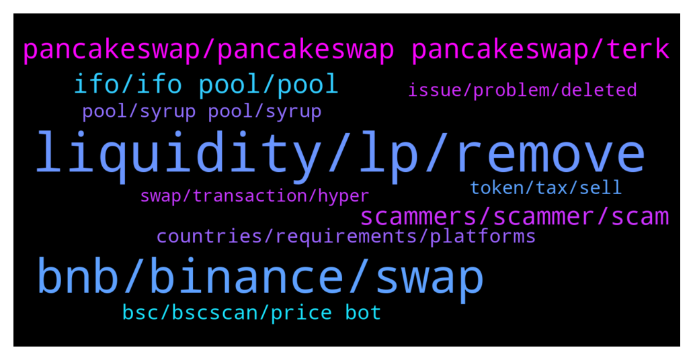

# **@PancakeSwap**
 ## Analysis for **2022-01-15** - **2022-01-16**.

---

## 📊 **Basic Stats**

**n_messages_sent**: 1288

---

---

## 🔝 **Top keywords and related messages**

1. **liquidity, lp, remove**

    @CLD_Callum --- *It was mentioned the other day that using 2 Cake-LP tokens to create an LP pair would be attacked by bots. How exactly would this happen? I can't imagine how they would negative impact your holdings, given enough time/trades.* **--->** [TG Discussion](https://t.me/PancakeSwap/2276792)

    @Million --- *no liquidity found! It normally shows up. Man, the amount of scammers PM'ing me is crazy* **--->** [TG Discussion](https://t.me/PancakeSwap/2274665)

    @albertcarloss --- *I can't remove liquidity, I can't confirm, stuck* **--->** [TG Discussion](https://t.me/PancakeSwap/2275509)

    @Dockters --- *never deploy ur token withoud know ur source code / function , alot of dev token always losing LP because they can't remove the LP, after add liquidity. bcs they just copy code other contract 😂* **--->** [TG Discussion](https://t.me/PancakeSwap/2278756)

    @albertcarloss --- *I am a token owner, my smart contract has a problem, I want to remove liquidity, why can't I?  stuck in the confirm section* **--->** [TG Discussion](https://t.me/PancakeSwap/2275586)

    @Poolz --- *I can’t find the liquidity there* **--->** [TG Discussion](https://t.me/PancakeSwap/2275913)

2. **bnb, binance, swap**

    @Vfa81 --- *So what haopened to my 7 dibs?* **--->** [TG Discussion](https://t.me/PancakeSwap/2276668)

    @TomorrowlandForLife --- *an this is your balance in BNB. Those are already added here* **--->** [TG Discussion](https://t.me/PancakeSwap/2274359)

    @A-one --- *Again someone transferred my bnb from my account to anyother* **--->** [TG Discussion](https://t.me/PancakeSwap/2275222)

    @Mang --- *Swap bcoin to BUSD but token like this binance pegged BUSD.* **--->** [TG Discussion](https://t.me/PancakeSwap/2274579)

    @ManBlyat --- *you just only have 12.73 dibs bro* **--->** [TG Discussion](https://t.me/PancakeSwap/2276664)

    @Stevens_Bc --- *hello can someone help? I unstaked from the cake/bnb farm and i got the green window on the left that said unstaking successful and my earning wen to wallet... its not there* **--->** [TG Discussion](https://t.me/PancakeSwap/2274803)

3. **pancakeswap, pancakeswap pancakeswap, terk**

    @Jeff --- *The app is calle Muffin by Pancakeswap on the Apple Store* **--->** [TG Discussion](https://t.me/PancakeSwap/2274159)

    @ziannnika --- *it is in the history on pancakeswap sir* **--->** [TG Discussion](https://t.me/PancakeSwap/2277627)

    @RangerApos --- *Ale transaction on pancakeswap will always be like this in bep20 format* **--->** [TG Discussion](https://t.me/PancakeSwap/2274581)

    @Shawn_I_am --- *CLear cache works. But additionally, you have to close nd reopen pancakeswap. All well now* **--->** [TG Discussion](https://t.me/PancakeSwap/2275829)

    @Bella --- *Hello guys, I'm new on pancakeswap and would love to learn how to transact on the app* **--->** [TG Discussion](https://t.me/PancakeSwap/2276112)

    @Siavash_fereydoni --- *Hello dear team Pancakeswap  Why can't I go Pancakeswap? What do I do? What's the problem?* **--->** [TG Discussion](https://t.me/PancakeSwap/2274269)

4. **ifo, ifo pool, pool**

    @collfopp --- *I have been staking in the IFO pool since the DPT offering, which I missed.  So I have a decent amount of IFO credits available for FROYO.  All CAKE that I own is in the IFO stake pool.  Do I need to have additional CAKE to commit to the IFO when it opens, or will I be able to use what I have staked?  Also, if I unstake some of my CAKE from the IFO pool right now, will my IFO credits decrease?  Appreciate any help anyone is willing to offer.* **--->** [TG Discussion](https://t.me/PancakeSwap/2277295)

    @Resilient109 --- *Hi. I want to join ifo but can't stake cake into pool. And says max cake i can stake is 0. I got 1700 cake to stake but nowhere to stake it 😢* **--->** [TG Discussion](https://t.me/PancakeSwap/2276887)

    @collfopp --- *So I need additional CAKE or should I unstake my CAKE from IFO when IFO goes live?  If my credits decrease if I unstake, seems I should just buy more to commit to the IFO?* **--->** [TG Discussion](https://t.me/PancakeSwap/2277318)

    @P --- *I have 9.425 IFO credit what I have to do now ? Please guide admin ....* **--->** [TG Discussion](https://t.me/PancakeSwap/2278647)

    @HAITIENLK --- *you can use cake in wallet or unstake from IFO pool to commit, it's up to you.* **--->** [TG Discussion](https://t.me/PancakeSwap/2277322)

    @Bambi --- *Hello , can i remove all cake i have in automatic restake pool to move it to ifo cake with no fees? i have staked for 1 yr* **--->** [TG Discussion](https://t.me/PancakeSwap/2274676)

5. **scammers, scammer, scam**

    @AndrWcrypto --- *Bro I think scammers already called to you and offered their help🤣🤣* **--->** [TG Discussion](https://t.me/PancakeSwap/2274018)

    @Kevin_BscDefi --- *So scammers flooding our inbox annoy me very much.* **--->** [TG Discussion](https://t.me/PancakeSwap/2275101)

    @Rokuro88 --- *i m still recieving a lot of scam* **--->** [TG Discussion](https://t.me/PancakeSwap/2278620)

    @Resilient109 --- *Idk how do they even sleep at night knowing they are one of the lowest scum on earth.* **--->** [TG Discussion](https://t.me/PancakeSwap/2277093)

    @raghav2019 --- *When someone unknown is very curious to help you and to have discussion with you even if you denied. He probably is scammer 💯 🤣🤣* **--->** [TG Discussion](https://t.me/PancakeSwap/2277412)

    @SecuestPcs --- *We know, there is a lot of scam groups* **--->** [TG Discussion](https://t.me/PancakeSwap/2278966)

6. **bsc, bscscan, price bot**

    @RangerApos --- *Yes you only pay gas fees to BSC* **--->** [TG Discussion](https://t.me/PancakeSwap/2274681)

    @AU_sam123 --- *Is the MOOR powered by BSC or its own blockchain?* **--->** [TG Discussion](https://t.me/PancakeSwap/2273891)

    @CakeCompounder --- *So on BscScan it is showing you have no funds?* **--->** [TG Discussion](https://t.me/PancakeSwap/2274315)

    @Ceddi200 --- *Maybe you would understand this way. Bsc network is slow. Lol.* **--->** [TG Discussion](https://t.me/PancakeSwap/2275804)

    @Calypso --- *The transaction isn’t there on BSC scan* **--->** [TG Discussion](https://t.me/PancakeSwap/2275681)

    @Ceddi200 --- *You don’t just post without proof from bscscan.com* **--->** [TG Discussion](https://t.me/PancakeSwap/2275508)

7. **countries, requirements, platforms**

    @TomorrowlandForLife --- *We've enabled IP block for some countries. As PancakeSwap is growing bigger, similar to other major trading platforms, it has to comply with legal requirements to continue providing our service.  These countries will be affected:  Belarus - BY Burma(Myanmar) - MM, Cote D'Ivoire (Ivory Coast) - CI Cuba - CU Democratic Republic of Congo - CD, Iran - IR Iraq - IQ Liberia - LR North Korea - KP Sudan - SD Syria - SY Zimbabwe - ZW* **--->** [TG Discussion](https://t.me/PancakeSwap/2274271)

    @SecuestPcs --- *We've enabled IP block for some countries. As PancakeSwap is growing bigger, similar to other major trading platforms, it has to comply with legal requirements to continue providing our service.  These countries will be affected:  Belarus - BY Burma(Myanmar) - MM, Cote D'Ivoire (Ivory Coast) - CI Cuba - CU Democratic Republic of Congo - CD, Iran - IR Iraq - IQ Liberia - LR North Korea - KP Sudan - SD Syria - SY Zimbabwe - ZW* **--->** [TG Discussion](https://t.me/PancakeSwap/2277987)

    @RangerApos --- *We've enabled IP block for some countries. As PancakeSwap is growing bigger, similar to other major trading platforms, it has to comply with legal requirements to continue providing our service.  These countries will be affected:  Belarus - BY Burma(Myanmar) - MM, Cote D'Ivoire (Ivory Coast) - CI Cuba - CU Democratic Republic of Congo - CD, Iran - IR Iraq - IQ Liberia - LR North Korea - KP Sudan - SD Syria - SY Zimbabwe - ZW* **--->** [TG Discussion](https://t.me/PancakeSwap/2274407)

    @Ceddi200 --- *As PancakeSwap is growing bigger, similar to other major trading platforms, it has to comply with legal requirements to continue providing service.* **--->** [TG Discussion](https://t.me/PancakeSwap/2276939)

    @CakeCompounder --- *We've have had to enable IP block for some countries. As PancakeSwap is growing bigger, similar to other major trading platforms, it has to comply with legal requirements to continue providing our service.* **--->** [TG Discussion](https://t.me/PancakeSwap/2276296)

    @Ceddi200 --- *As PancakeSwap is growing bigger, similar to other major trading platforms, it has to comply with legal requirements to continue providing service.  Belarus - BY Burma(Myanmar) - MM, Cote D'Ivoire (Ivory Coast) - CI Cuba - CU Democratic Republic of Congo - CD, Iran - IR Iraq - IQ Liberia - LR North Korea - KP Sudan - SD Syria - SY Zimbabwe - ZW* **--->** [TG Discussion](https://t.me/PancakeSwap/2274486)

8. **pool, syrup pool, syrup**

    @TomorrowlandForLife --- *I think you're not using the correct Pool* **--->** [TG Discussion](https://t.me/PancakeSwap/2277056)

    @Ceddi200 --- *Bro if you can’t try other alternative. Then I can’t be of much help. As most users isn’t complaining about that. From my end the pool works fine.* **--->** [TG Discussion](https://t.me/PancakeSwap/2276872)

    @QV_zz --- *yes thats what youre supposed to do (or unstake from other pools)* **--->** [TG Discussion](https://t.me/PancakeSwap/2275043)

    @Mobiletc --- *no in pools & farms it's not there* **--->** [TG Discussion](https://t.me/PancakeSwap/2278296)

    @TomorrowlandForLife --- *mmm that's weird. Can you try from Syrup Pool Tab as Luukku mentioned?* **--->** [TG Discussion](https://t.me/PancakeSwap/2278373)

    @TomorrowlandForLife --- *This is the correct Pool on IFO Tab or Syrup Pool tads* **--->** [TG Discussion](https://t.me/PancakeSwap/2277063)

9. **token, tax, sell**

    @TomorrowlandForLife --- *then clearly is some token's block or something like that. You should ask on token's community sir* **--->** [TG Discussion](https://t.me/PancakeSwap/2278403)

    @GALA1881 --- *question: is there a link that shows that a token is in both the ERC20 and BSC and MATIC network, friends.🤔🤔🤔* **--->** [TG Discussion](https://t.me/PancakeSwap/2277332)

    @johnoooo1 --- *This is my first token  If I want to add $100k liquidity but I still hesitating because of the tax fee* **--->** [TG Discussion](https://t.me/PancakeSwap/2275404)

    @Ceddi200 --- *Ask the community that owns the token* **--->** [TG Discussion](https://t.me/PancakeSwap/2274239)

    @RangerApos --- *Please ask the community of that token we have no effect on token settings, only token devs do.* **--->** [TG Discussion](https://t.me/PancakeSwap/2278571)

    @HAITIENLK --- *i think this rebase token, or the same, pls ask the team of that token.* **--->** [TG Discussion](https://t.me/PancakeSwap/2277288)

10. **issue, problem, deleted**

    @AramKurdo --- *Thats why i said you can only help me in DM Its screenshot* **--->** [TG Discussion](https://t.me/PancakeSwap/2276824)

    @Mightypm --- *This issue need to be addressed* **--->** [TG Discussion](https://t.me/PancakeSwap/2278396)

    @Clark |I WON’T DM FIRST --- *Can I dm you if I could render assistance?* **--->** [TG Discussion](https://t.me/PancakeSwap/2274868)

    @HAITIENLK --- *what your issue? pls chat here* **--->** [TG Discussion](https://t.me/PancakeSwap/2275976)

    @Siamezu --- *Sent u a dm,when u have some spare time pls check 🙏* **--->** [TG Discussion](https://t.me/PancakeSwap/2276877)

    @LearnToDev --- *sent you a DM of a photo regarding my problem* **--->** [TG Discussion](https://t.me/PancakeSwap/2276144)

