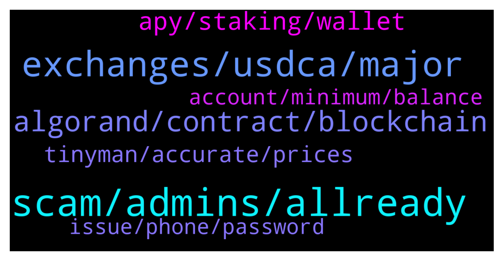

# **@algorand**
 ## Analysis for **2022-01-15** - **2022-01-16**.

---

## 📊 **Basic Stats**

**n_messages_sent**: 128

---

---

## 🔝 **Top keywords and related messages**

1. **scam, admins, allready**

    @Joshgeorge32 --- *I have a proposal that will grow this community to the moon  , who could i possibly dm guys* **--->** [TG Discussion](https://t.me/algorand/332818)

    @NightAlgorand --- *You can DM me with your proposal* **--->** [TG Discussion](https://t.me/algorand/332822)

    @MackDenver --- *Hey Maxim,  Glad to see you today. How are you doing?* **--->** [TG Discussion](https://t.me/algorand/332661)

    @S --- *Hate to break it to you, but she’s not real bro* **--->** [TG Discussion](https://t.me/algorand/332942)

    @Joshgeorge32 --- *Can you dm me buddy , I could dm you due to some privacy issues pal , could you just dm me @Joshgeorge32* **--->** [TG Discussion](https://t.me/algorand/332835)

    @ipearbdyz --- *sir ,. I received email and twitter  message* **--->** [TG Discussion](https://t.me/algorand/332828)

2. **exchanges, usdca, major**

    @TheRealGiulio --- *Fully agree. USDCa and USDta on big exchanges would be huge!* **--->** [TG Discussion](https://t.me/algorand/332977)

    @S --- *I’m not trying to find it for myself, My point is that I hope it’s a priority for the foundation to get USDCa listed on the top tier exchanges. That would be worth more than any marketing deal they could make for expanding exposure to the ecosystem.* **--->** [TG Discussion](https://t.me/algorand/332954)

    @S --- *Going to try asking again… Is the foundation working on getting USDCa and USDCt added to the major exchanges? Coinbase, Binance, etc? If so, what does this process look like? Is it up to the Algorand foundation to pay a listing fee and facilitate building it the infrastructure? Are Coinbase and there like deliberately disallowing USDCa on their platform due to their partnership with Ethereum products? It would be great to know why tors hasn’t happened yet…* **--->** [TG Discussion](https://t.me/algorand/332944)

    @S --- *Do you know what that process looks like and a possible timeline? Is it simply a matter of paying a fee to the exchange and helping them build out the infrastructure or does it require convincing the exchange to make the listing?* **--->** [TG Discussion](https://t.me/algorand/332793)

    @S --- *Is the foundation working on getting USDCa and USDCt added to the major exchanges? Coinbase, Binance, etc?* **--->** [TG Discussion](https://t.me/algorand/332789)

    @S --- *It would be better marketing than spending money on stadium ads.* **--->** [TG Discussion](https://t.me/algorand/332978)

3. **algorand, contract, blockchain**

    @Vytek --- *Algorand Italia 🇮🇹 Algorand fondato da Silvio Micali insieme a un rinomato team di luminari accademici. Algorand sta costruendo un futuro senza confini e definendo lo standard per la tecnologia blockchain. algorand.com  #algo #ita #algoita #algoitalia #algoranditalia https://t.me/AlgorandItalia* **--->** [TG Discussion](https://t.me/algorand/332757)

    @vbncrypto --- *hey guys, is there any other DEX in Algo ecosystem* **--->** [TG Discussion](https://t.me/algorand/332947)

    @Philonous --- *Could I get a contract address?* **--->** [TG Discussion](https://t.me/algorand/332838)

    @aplszczykowski --- *hello, which best swap for algorland?* **--->** [TG Discussion](https://t.me/algorand/332738)

    @mcmaxims --- *I am fine, thanks. Just woke up and continued working on a new kind of dex for Algorand. Didn't release the information yet, but it will be a new tech with unknown features yet ^^ The whitepaper will be released in the following days. I hope you guys like the innovation. How are you?* **--->** [TG Discussion](https://t.me/algorand/332663)

    @MackDenver --- *Announcing our partnership with USI Università della Svizzera italiana to support the development of the “Writing Smart Contracts”. Students will be introduced to the relevant theoretical concepts & provided a hands-on introduction to writing smart contracts on a modern blockchain using the #Python programming language.   The course will be offered during USI’s winter school from February 14 to 18, 2022, and is a comprehensive learning opportunity for students looking to learn more about blockchain.   👉https://algorand.foundation/news/usi-partnership* **--->** [TG Discussion](https://t.me/algorand/332678)

4. **apy, staking, wallet**

    @KeepItRealBro --- *Hi, guys. Can you recommend safe ways for multipliying my algos. Wanted to put them into staking on binance, but apy is so low, around 1%. I'm a newbie, sorry for noob question* **--->** [TG Discussion](https://t.me/algorand/332914)

    @Raghav --- *Hi  What’s the reward rate for storing also in algo wallet as of now . I have it on Coinbase and want to move it to algo wallet* **--->** [TG Discussion](https://t.me/algorand/332724)

    @MackDenver --- *Just keep it in your wallet and get staking rewards.* **--->** [TG Discussion](https://t.me/algorand/332918)

    @MackDenver --- *Please check the staking APY here: https://algoexplorer.io/rewards-calculator* **--->** [TG Discussion](https://t.me/algorand/332922)

    @KeepItRealBro --- *what is apy for staking in the wallet? do you mean wallets like trustwallet, right? not binance?* **--->** [TG Discussion](https://t.me/algorand/332920)

    @Raghav --- *Thankyou . Any minimums for algo staking ?* **--->** [TG Discussion](https://t.me/algorand/332730)

5. **tinyman, accurate, prices**

    @MackDenver --- *There is Timyman however, Tinyman is currently in the repair phase. You will need to wait for it to be fixed. A few other DEXs are already in the works* **--->** [TG Discussion](https://t.me/algorand/332739)

    @NightAlgorand --- *Not so sure about that one.* **--->** [TG Discussion](https://t.me/algorand/332799)

    @hapsarinuha --- *Is there another dex except tinyman?* **--->** [TG Discussion](https://t.me/algorand/332933)

    @KAPIBAYSIDE --- *Where has the most accurate prices on ASAs because tiny chart and the commandbot  seem to be in accurate* **--->** [TG Discussion](https://t.me/algorand/332614)

    @MackDenver --- *Please contact the tinyman team about this  https://t.me/tinymanofficial* **--->** [TG Discussion](https://t.me/algorand/332746)

    @MackDenver --- *There are a few but these are being worked on.* **--->** [TG Discussion](https://t.me/algorand/332949)

6. **issue, phone, password**

    @Cesnili_Kanka --- *had an issue once where my phone bill lapsed and I had been connected to WiFi,  when I left the WiFi ranged and having forgot my phone bill was due I saw full bars and didn't know why my apps were not working for like 5 minutes before realising I needed to pay for phone service lol* **--->** [TG Discussion](https://t.me/algorand/332908)

    @MackDenver --- *I got you but it is working fine at my end. This is why I asked you to reinstall the wallet. If it doesn't work, I will forward the issue to the tech team.* **--->** [TG Discussion](https://t.me/algorand/332907)

    @Cesnili_Kanka --- *Read the top message it's giving you. It saying the service is unreachable. Like their servers are down or something, or your telecom provider is strangling the connection, etc. If it's a legitimate message, and not a local issue, then no matter how many times you reinput your password or install the wallet it will give the same error.* **--->** [TG Discussion](https://t.me/algorand/332906)

    @cityrttg --- *What's problem with login in app Android? Always wrong my password* **--->** [TG Discussion](https://t.me/algorand/332896)

    @MackDenver --- *Well, if this is the case then please reinstall the wallet with your private phrase.* **--->** [TG Discussion](https://t.me/algorand/332902)

    @MackDenver --- *Hello Anton, Please make sure you are using the correct password.* **--->** [TG Discussion](https://t.me/algorand/332898)

7. **account, minimum, balance**

    @Vitualcop --- *Every account on Algorand must have a minimum balance of 100,000 microAlgos.* **--->** [TG Discussion](https://t.me/algorand/332776)

    @mlats4 --- *guys how is myalgo wallet minimum requirement counted?* **--->** [TG Discussion](https://t.me/algorand/332774)

    @mlats4 --- *but I have 7.5 algos and it wont let me send more than 6.63, so that is 0.9 algos approximately, so how come?* **--->** [TG Discussion](https://t.me/algorand/332778)

    @Vitualcop --- *A single Algorand account is permitted to create up to 1000 assets. For every asset an account creates or owns, its minimum balance is increased by 0.1 Algos (100,000 microAlgos). Before a new asset can be transferred to a specific account the receiver must opt-in to receive the asset. This process is described below in Receiving an asset. If any transaction is issued that would violate the maximum number of assets for an account or not meet the minimum balance requirements, the transaction will fail.* **--->** [TG Discussion](https://t.me/algorand/332787)

    @Vitualcop --- *Minimum is also determine by asset holding your account has* **--->** [TG Discussion](https://t.me/algorand/332783)

    @mlats4 --- *but how does the minimujm balance increase, thats what im asking* **--->** [TG Discussion](https://t.me/algorand/332781)

