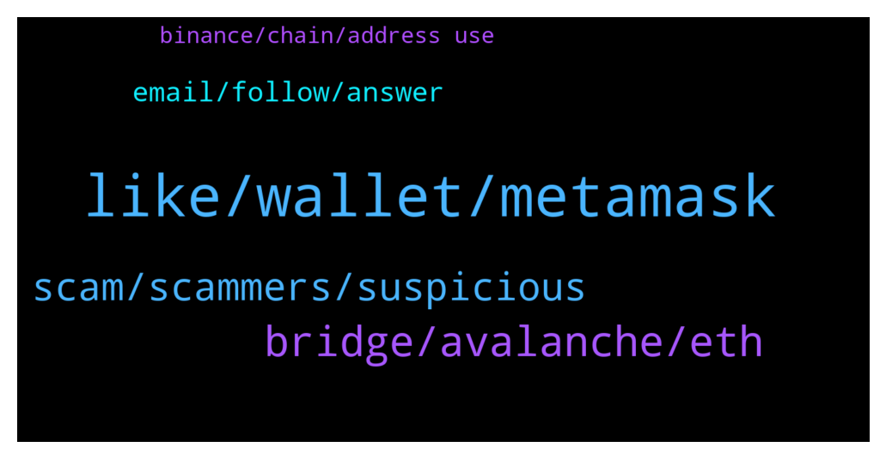

# **@avalancheavax**
 ## Analysis for **2022-01-15** - **2022-01-16**.

---

## 📊 **Basic Stats**

**n_messages_sent**: 121

---

---

## 🔝 **Top keywords and related messages**

1. **like, wallet, metamask**

    @itamarcps --- *AVME, not yet running in subnets but we are building prototypes already* **--->** [TG Discussion](https://t.me/avalancheavax/322431)

    @jenlianl --- *Does it have to be metamask? Im trying to use it within my hardware that isnt metamask compstible the way ledger and trezor are i think* **--->** [TG Discussion](https://t.me/avalancheavax/322395)

    @SnowslideV --- *Oh yeah! "Interact with EVM", right? I feel dumb, LoL! Thank you so much! 😆* **--->** [TG Discussion](https://t.me/avalancheavax/322521)

    @pokerfinance --- *do we know any project already running on Avax subnet?* **--->** [TG Discussion](https://t.me/avalancheavax/322429)

    @oathtobarbatos --- *It depends on the contract, as far as I know. A swap should cost less than a dollar and, the current med gas price is $0.05 (25 nAVAX)* **--->** [TG Discussion](https://t.me/avalancheavax/322385)

    @AceInTheHat --- *Do you know the fee to use synapse?* **--->** [TG Discussion](https://t.me/avalancheavax/322471)

2. **bridge, avalanche, eth**

    @Nicolas_A --- *Bridge.avax.network wrap your eth into WETH and then bridge it to Avalanche. Use a dex such as Pangolin or TraderJoe to buy TIME* **--->** [TG Discussion](https://t.me/avalancheavax/322366)

    @GMfrensWAGMI --- *Thank you. How to wrap ETH into WETH? UniSwap (on Ethereum)?* **--->** [TG Discussion](https://t.me/avalancheavax/322372)

    @mkchaves --- *Use Avalanche C-Chain instead of Mainnet* **--->** [TG Discussion](https://t.me/avalancheavax/322520)

    @Nicolas_A --- *Yes using the bridge I just mentioned above* **--->** [TG Discussion](https://t.me/avalancheavax/322468)

    @greatday888 --- *Hi, If I bridge USDT in Wormhole from Polygon to Avax Network, can I get the same USDT.e?* **--->** [TG Discussion](https://t.me/avalancheavax/322455)

    @AceInTheHat --- *Can you bridge BSC USDC to AVAX USDC.e?* **--->** [TG Discussion](https://t.me/avalancheavax/322465)

3. **scam, scammers, suspicious**

    @jenlianl --- *Lol wow the scammers here are alot hahah* **--->** [TG Discussion](https://t.me/avalancheavax/322386)

    @w4zii --- *Thanks...tried all that..no luck.  F**k me these scammers are bugging me* **--->** [TG Discussion](https://t.me/avalancheavax/322619)

    @BinanceApe --- *That’s just toxic lol just get a lay and get it over with. What you’re doing is a crime* **--->** [TG Discussion](https://t.me/avalancheavax/322531)

    @Nicolas_A --- *Was just a scam don’t over think it* **--->** [TG Discussion](https://t.me/avalancheavax/322532)

    @Yoopez --- *Guys, I need some smart guys to look at suspicious tx (to get proof of scammers. Some are intersted to look on it with me ? (for those who know about EVRT scam)* **--->** [TG Discussion](https://t.me/avalancheavax/322683)

    @Leah555 --- *If you have got verified coinbase linked and got high limit purchase.   Save my contact, While I save yours, let's make some real cash outta it!* **--->** [TG Discussion](https://t.me/avalancheavax/322641)

4. **email, follow, answer**

    @omnirick --- *Thank you. I got the correct email and sent an application.* **--->** [TG Discussion](https://t.me/avalancheavax/322697)

    @selimaykut --- *this is their official email: blizzard@avalabs.org* **--->** [TG Discussion](https://t.me/avalancheavax/322668)

    @Nicolas_A --- *Why would it be terminated ? I just assumed that if they don’t answer they might have not been interested. Fund is just getting started. You could send a follow up* **--->** [TG Discussion](https://t.me/avalancheavax/322677)

    @Patrick --- *Was just a question, a bit strange to have no news about it since 3 months, no answer to mail, no coms, no tweet etc.. thats why I was asking* **--->** [TG Discussion](https://t.me/avalancheavax/322680)

    @Patrick --- *We ssnd an email with our projects and our company presentation. We never had a feedback* **--->** [TG Discussion](https://t.me/avalancheavax/322648)

    @selimaykut --- *The folks at the Fund are backlogged a lot (as you can expect) Just follow up -- they're an extremely friendly and receptive bunch.* **--->** [TG Discussion](https://t.me/avalancheavax/322669)

5. **binance, chain, address use**

    @Nicolas_A --- *You can but might want to ask Binance instead* **--->** [TG Discussion](https://t.me/avalancheavax/322687)

    @oathtobarbatos --- *Try to get in contact with Binance support, you could also ask for help in the Avalanche discord server chat.avax.network* **--->** [TG Discussion](https://t.me/avalancheavax/322618)

    @w4zii --- *I sent some BnB from avax chain on metamask to binance ... accidentally chose to send to smart chain....anything I can do to retrieve it?  Tried to get in contact with binance, but no help* **--->** [TG Discussion](https://t.me/avalancheavax/322617)

    @vulposz --- *Binance generates a C-Chain address for you, use that one for depositing from another exchange/wallet* **--->** [TG Discussion](https://t.me/avalancheavax/322690)

    @geekmidget --- *Well, here is the thing, there are 3 networks available to generate the receiving address, which one should someone use for sending from Binance US to Binance Global?  - Avalanche  - AVAX C-Chain  - Binance Smart Chain (BEP20)* **--->** [TG Discussion](https://t.me/avalancheavax/322688)

