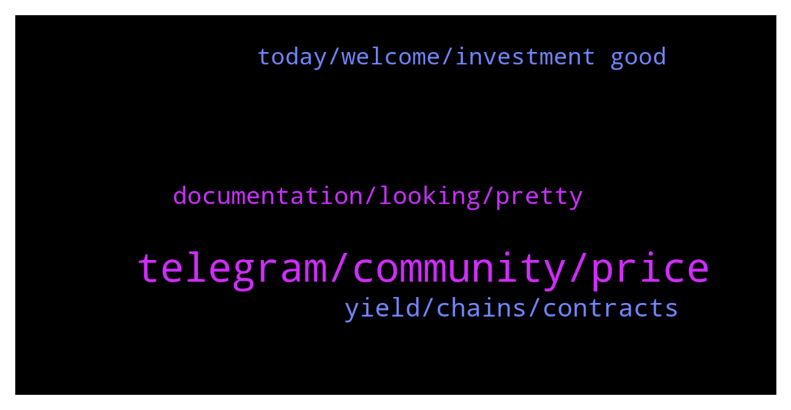

# **@chainlinkofficial**
 ## Analysis for **2022-01-15** - **2022-01-16**.

---

## 📊 **Basic Stats**

**n_messages_sent**: 114

---

---

## 🔝 **Top keywords and related messages**

1. **telegram, community, price**

    @Linkederic --- *I dont understand what youre asking. You cant send BEP20 (BSC) tokens to Matic.* **--->** [TG Discussion](https://t.me/chainlinkofficial/364749)

    @Linkederic --- *Yes absolutely, there are many oracles live now delivering data like weather, sports information, etc. https://market.link/search/data-providers* **--->** [TG Discussion](https://t.me/chainlinkofficial/364891)

    @Luckygirlkate --- *Currently we use Chainlink’s VRF to pick random winners from our Zaps, as we expand across additional chains, VRF will be used for native Zaps on each one.* **--->** [TG Discussion](https://t.me/chainlinkofficial/364689)

    @elizabeth_baker --- *Hi admin. Can I use Chainlink keepers to automatically trigger the minting of Nft assets? 💆‍♀* **--->** [TG Discussion](https://t.me/chainlinkofficial/364868)

    @H --- *Why chainlink don't have own Blockchain 🤔* **--->** [TG Discussion](https://t.me/chainlinkofficial/364738)

    @Luckygirlkate --- *We plan on having a long and healthy relationship with Chainlink.* **--->** [TG Discussion](https://t.me/chainlinkofficial/364691)

2. **yield, chains, contracts**

    @Luckygirlkate --- *Further along the road, we’ll be releasing among other features:  Support for more chains, Polygon, MultiVac, Ethereum of course and more.  A bond market, a reactor-powered secondary market to purchase Recharge tokens at a discount, funding a yield-earning treasury that increases the protocol yield.* **--->** [TG Discussion](https://t.me/chainlinkofficial/364712)

    @marcromeron --- *Kate Wilson -Recharge (Will not DM first): We’ve been hard at work on V2 which we expect to release this spring which will have a number of improvements notably optimized yield, compatibility with newer DEX protocols, the foundations for a fully decentralized DAO and a lot more. You can find out more here:  https://medium.com/recharge-finance/whats-coming-in-v2-2bc373e5ee87* **--->** [TG Discussion](https://t.me/chainlinkofficial/364710)

    @Luckygirlkate --- *The more you utilize the recharge ecosystem and participate with r3fi and rcore the more opportunity you have to be a driving force for change.* **--->** [TG Discussion](https://t.me/chainlinkofficial/364704)

    @m0crypto --- *Any developer can hook into our reactor contracts to create extensions of the Recharge ecosystem for any purpose, drawing on existing token yield pools to fund the extensible protocols.* **--->** [TG Discussion](https://t.me/chainlinkofficial/364697)

    @m0crypto --- *We're building an entire economy based on decentralized taxation and decentralized, unbiased distribution with no middle-man. A fair and rewarding tax economy with a variety of financial products vs a token only focused on the economy of attention.* **--->** [TG Discussion](https://t.me/chainlinkofficial/364684)

    @Luckygirlkate --- *This is a bit of a long answer, but well detailed for the communities.   Recharge is a cross-chain ecosystem built around the idea of working together as a community for mutual benefit. The DeFi space is exciting but extremely fragmented across multiple chains with thousands of tokens, each requiring constant staking, unstaking and bridging to benefit from. We’re doing away with all of that with a token that builds value directly in your wallet on any supported blockchain.  With Recharge, there are no extra steps, no staking or lockups, it just works and because of this, is instantly available for use and can be stored in any type of wallet. Being in possession of your tokens at all times reduces risks by limiting the number of contracts you need to interact with while offering completely passive yield similar to a traditional savings account.  The Recharge token is the just tip of the iceberg, with our native bridge we can expand seamlessly across supported chains and fairly distribute the yield across them. Recharge Assets will enable the same seamless and passive yield on stable, wrapped assets, again seamlessly on multiple chains.  Another interesting feature, our Reactors—a mutualized yield pool where the yield is redirected and powers custom contracts and different reward mechanisms. Developers can implement their own contracts and get voted in to draw from this yield. Recharge holders can swap for RCORE, effectively donating their yield to the reactor in exchange for various rewards.  Our first Chainlink integration is actually powered by one of the reactors, Recharge Zaps draw yield from it and distribute it through giveaways secured by Chainlink’s VRF. Thanks to the passive yield generation the zaps are funded at no cost and allow anyone to enter with no financial barriers as part of our commitment to bring more people to decentralized finance as a member of the GoodFi movement* **--->** [TG Discussion](https://t.me/chainlinkofficial/364677)

3. **documentation, looking, pretty**

    @Linkederic --- *This is a great overview https://blog.chain.link/levels-of-data-aggregation-in-chainlink-price-feeds/* **--->** [TG Discussion](https://t.me/chainlinkofficial/364889)

    @m0crypto --- *We have documentation here which covers most of our features:  https://docs.recharge.finance/* **--->** [TG Discussion](https://t.me/chainlinkofficial/364726)

    @mgfreedom --- *you have a very powerful but extremely underrated project* **--->** [TG Discussion](https://t.me/chainlinkofficial/365179)

    @Luckygirlkate --- *Indeed! We are a very in depth project.* **--->** [TG Discussion](https://t.me/chainlinkofficial/364680)

    @Jeu_gen --- *Hey everyone ! Pretty sure that in this group I'll fined right people ! I'm dummy at coding for now  Long time been looking for solution for my idea It's pretty easy, but some puzzle piece are missing for me  That's why I call for a help* **--->** [TG Discussion](https://t.me/chainlinkofficial/364752)

    @marcromeron --- *Do you have any docs site for deep dive as  a developer?* **--->** [TG Discussion](https://t.me/chainlinkofficial/364724)

4. **today, welcome, investment good**

    @Lily886 --- *Hi good evening and have a nice weekend everyone🥰* **--->** [TG Discussion](https://t.me/chainlinkofficial/364899)

    @Daphe --- *I'm new here hope I'm welcome* **--->** [TG Discussion](https://t.me/chainlinkofficial/364861)

    @m0crypto --- *Hi everyone, thanks for having us here!* **--->** [TG Discussion](https://t.me/chainlinkofficial/364665)

    @Luckygirlkate --- *Hello everyone👋 greetings from Recharge! We're happy to be with you today.* **--->** [TG Discussion](https://t.me/chainlinkofficial/364664)

    @the_real_laurent --- *Sorry I interrupt the beautiful AMA I don't realize :) very interesting* **--->** [TG Discussion](https://t.me/chainlinkofficial/364626)

    @Luckygirlkate --- *Thank you so much for having us today Marc!* **--->** [TG Discussion](https://t.me/chainlinkofficial/364729)

