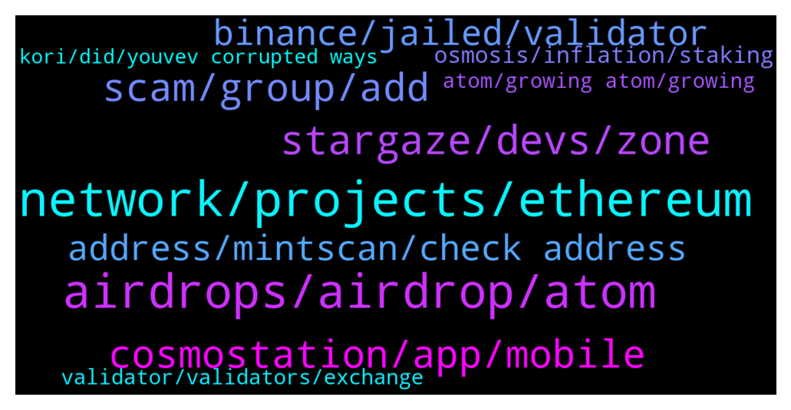

# **@cosmosproject**
 ## Analysis for **2022-01-15** - **2022-01-16**.

---

## 📊 **Basic Stats**

**n_messages_sent**: 348

---

---

## 🔝 **Top keywords and related messages**

1. **network, projects, ethereum**

    @Niko --- *Hi guys, what exactly makes you so excited about Cosmos* **--->** [TG Discussion](https://t.me/cosmosproject/475102)

    @DAD_DEFI --- *Yes. Imagine your favorite ETH APPS coming to cosmos.* **--->** [TG Discussion](https://t.me/cosmosproject/474966)

    @KellySlaterKook --- *Its helps to deploy clone of eth dapps on cosmos?* **--->** [TG Discussion](https://t.me/cosmosproject/474963)

    @AtomJazz --- *I mean this has nothing to do with Cosmos network. It was sent from Binance to Ethereum.* **--->** [TG Discussion](https://t.me/cosmosproject/474501)

    @vladc1 --- *Follow the most recent Cosmos Proposals using this bot. It also tracks proposals from other Cosmos Ecosystem Networks. Proved to be a great toll to keep yourself updated and always vote on time.* **--->** [TG Discussion](https://t.me/cosmosproject/475261)

    @nu1rl --- *Are there any way to check how/if you voted in a specific proposal on Cosmos hub ??* **--->** [TG Discussion](https://t.me/cosmosproject/474467)

2. **airdrops, airdrop, atom**

    @Ron --- *Question. Do most of the airdrops go to Keplr wallet users as opposed to staking from the ledger? Anyone know cause there are some airdrops I didn’t receive* **--->** [TG Discussion](https://t.me/cosmosproject/475005)

    @GSn0w --- *Are there gonna be frecuently airdrops in the future?* **--->** [TG Discussion](https://t.me/cosmosproject/474532)

    @staycat1on --- *I suddenly received a good number of HUAHUA 9 hours before. Was that a airdrop that I didn’t notice of?* **--->** [TG Discussion](https://t.me/cosmosproject/475584)

    @faisalsahi --- *And what valideter is racommended for airdrop???* **--->** [TG Discussion](https://t.me/cosmosproject/475018)

    @Vadim_everstake --- *To low risks yes, although there is a chance that some airdrops can let them in as well.* **--->** [TG Discussion](https://t.me/cosmosproject/475176)

    @AtomJazz --- *As far as airdrops go, there's no one rule, usually the more you have staked the bigger airdrop you receive* **--->** [TG Discussion](https://t.me/cosmosproject/474530)

3. **stargaze, devs, zone**

    @TicoJohnny --- *Im sure you don’t but it’s not exactly accesible for any development team with a novel idea and limited funding 😂 these rent seeking behaviors limit innovation* **--->** [TG Discussion](https://t.me/cosmosproject/474694)

    @vladc1 --- *We made the @Cosmosproject Ecosystem Proposal Tracker — t.me/govproposalsbot  It is a #Telegram bot that tracks new proposals in networks related to the #CosmosEcosystem  To activate the bot follow the link t.me/govproposalsbot and press “Start”  $ATOM* **--->** [TG Discussion](https://t.me/cosmosproject/475259)

    @Emil --- *we can trust in technical assistance that write us  ?* **--->** [TG Discussion](https://t.me/cosmosproject/475097)

    @AtomJazz --- *For technical questions, discord is your place to be https://discord.gg/vcExX9T* **--->** [TG Discussion](https://t.me/cosmosproject/474894)

    @Cordtus --- *"just invest in solid tech and people behind it, I can sleep better at night."  This is a view many many people dumping money into crypto without having a clue about the projects behind the tokens need to adopt* **--->** [TG Discussion](https://t.me/cosmosproject/474699)

    @TicoJohnny --- *We have cheqd, stargaze, lum, desmos, comdex recently* **--->** [TG Discussion](https://t.me/cosmosproject/474610)

4. **scam, group, add**

    @jorgetuli --- *If someone reaches out this group could I get scammed?* **--->** [TG Discussion](https://t.me/cosmosproject/474502)

    @ltunited --- *Guys, it is being said that admins will never dm you. But Johnny B having asdmin badge tried to call me and message me first.* **--->** [TG Discussion](https://t.me/cosmosproject/474856)

    @kodive --- *Hi folks ..is Lum a genuine project ? Or a rug pull coated with honey ?* **--->** [TG Discussion](https://t.me/cosmosproject/475413)

    @rafaelp_eth --- *Hey guys, any tooling for DAOs pn Cosmos? ( Scammers, get out)* **--->** [TG Discussion](https://t.me/cosmosproject/474703)

    @Cordtus --- *Pretty much all DMs are scam* **--->** [TG Discussion](https://t.me/cosmosproject/475141)

    @Cinnamon --- *Ok thanks, these scams are getting very good* **--->** [TG Discussion](https://t.me/cosmosproject/475552)

5. **cosmostation, app, mobile**

    @Grgiorgi --- *Where can I buy cosmos and not have to wait a week to send to wallet like Coinbase ?* **--->** [TG Discussion](https://t.me/cosmosproject/475531)

    @Censinohhh --- *What’s the best wallet for ios?* **--->** [TG Discussion](https://t.me/cosmosproject/474817)

    @movefaster --- *Is Keplr better or Cosmostatjon better?* **--->** [TG Discussion](https://t.me/cosmosproject/475436)

    @ZoltanAtom --- *Both are recommended one. I do use Cosmostation mobile app and Keplr web wallet. It’s up to you. Links are at the #3 pinned message.* **--->** [TG Discussion](https://t.me/cosmosproject/475438)

    @OctoberXIV --- *Are you familiar with crypto wallets? (seed phrase, hardware vs software and so on?)* **--->** [TG Discussion](https://t.me/cosmosproject/474578)

    @ZoltanAtom --- *Cosmostation and Keplr are the most recommended wallets.At this moment Keplr mobile app is supported by only 4 chains, Cosmostation app is supported almost all Cosmos chains. Links are at the #3 pinned message.* **--->** [TG Discussion](https://t.me/cosmosproject/474827)

6. **address, mintscan, check address**

    @jorgetuli --- *So there is no way to recover the transaction?* **--->** [TG Discussion](https://t.me/cosmosproject/474500)

    @oldyouth1 --- *Not seeing my withdrAwals and deposits from past 20 mins* **--->** [TG Discussion](https://t.me/cosmosproject/474454)

    @bitangel84 --- *https://cosmos.network/rpc and select the last version* **--->** [TG Discussion](https://t.me/cosmosproject/475230)

    @Ft79vop --- *undelegating at the moment as it wouldn't let me redelegate* **--->** [TG Discussion](https://t.me/cosmosproject/474853)

    @jorgetuli --- *I copied my Metamask address and pasted on the transaction* **--->** [TG Discussion](https://t.me/cosmosproject/474484)

    @marcome91 --- *How much is the fee to undelegate?* **--->** [TG Discussion](https://t.me/cosmosproject/474560)

7. **binance, jailed, validator**

    @TicoJohnny --- *You don't want to delegate to binance* **--->** [TG Discussion](https://t.me/cosmosproject/474624)

    @Ft79vop --- *its not on binance the exchange, its staked to the binance validator from keplr wallet* **--->** [TG Discussion](https://t.me/cosmosproject/474846)

    @Prometheus_Zeus --- *I can’t find Binance under the validators anymore. Have they renamed? Or did they unstaked?* **--->** [TG Discussion](https://t.me/cosmosproject/475073)

    @Pahini2 --- *Anyone tell me when Blockpool  was jailed?* **--->** [TG Discussion](https://t.me/cosmosproject/474586)

    @jorgetuli --- *Ok so should I reach out to Binance support?* **--->** [TG Discussion](https://t.me/cosmosproject/474503)

    @atom2024 --- *I cannot see Binance on atom Validator list.* **--->** [TG Discussion](https://t.me/cosmosproject/474622)

8. **osmosis, inflation, staking**

    @KellySlaterKook --- *When more ppl unstaking inflation get higher, so if there is inflation mechanism that is health we need also deflation mechanism, no?* **--->** [TG Discussion](https://t.me/cosmosproject/474918)

    @KellySlaterKook --- *Staking percentage went from 62% last month to 58% today, is there burn mechanism on ibc transaction s to fight that inflation?* **--->** [TG Discussion](https://t.me/cosmosproject/474904)

    @AtomJazz --- *Ah ok I understand. People are unstaking due to other opportunities (LPing on Osmosis) but it's not a problem since liquid staking is coming with the next upgrade (theta)* **--->** [TG Discussion](https://t.me/cosmosproject/474915)

    @KellySlaterKook --- *I'm talking about the precantage of token staked/circulation supply* **--->** [TG Discussion](https://t.me/cosmosproject/474913)

    @Xahriwi --- *Only in crypto can $5 to $40 in about a year be considered stagnant* **--->** [TG Discussion](https://t.me/cosmosproject/474939)

    @AtomJazz --- *With liquid staking there won't be a need for dynamic inflation anymore. Changes are already being prepared* **--->** [TG Discussion](https://t.me/cosmosproject/474920)

9. **validator, validators, exchange**

    @Vadim_everstake --- *Usually validators owned by exchanges may be excluded as well as validators with 0% fee. Other conditions regarding threshold, date of snapshot etc vary from drop to drop.* **--->** [TG Discussion](https://t.me/cosmosproject/475170)

    @Pastashooter105 --- *Never use exchange validator they keep all rewards.* **--->** [TG Discussion](https://t.me/cosmosproject/474849)

    @Xahriwi --- *Is it possible to run a chain with only 1 validator? For testing purposes* **--->** [TG Discussion](https://t.me/cosmosproject/474538)

    @WaterWorldArt --- *So basically Avoid exchange and 0% validators?* **--->** [TG Discussion](https://t.me/cosmosproject/475174)

    @Julien --- *I have some cosmos on my keplr Wallet now and i have to chose validator for staking, i see voting power i suppose i have to take a big voting power but what about commission ? I see 4, 10, 15, 20, … 100%  ?* **--->** [TG Discussion](https://t.me/cosmosproject/474660)

    @GSn0w --- *Which validators do you recommend for staking atom?* **--->** [TG Discussion](https://t.me/cosmosproject/474515)

10. **atom, growing atom, growing**

    @TicoJohnny --- *No you don’t need atom to start a new chain* **--->** [TG Discussion](https://t.me/cosmosproject/474667)

    @KosukiOdenn --- *I have some Questions about $Atom Cosmos IBC is growing up but $Atom got noting. So how Atom grow up?* **--->** [TG Discussion](https://t.me/cosmosproject/474932)

    @Buri7xxx --- *Atom is the new NWO coin 🤔🙌* **--->** [TG Discussion](https://t.me/cosmosproject/475420)

    @AtomJazz --- *So you don't think ATOM is growing? ATOM accrued massive amount of value through IBC projects like Osmosis or Juno for example* **--->** [TG Discussion](https://t.me/cosmosproject/474933)

    @TicoJohnny --- *For ATOM? 0.0025 - 0.1 ATOM, about a dime* **--->** [TG Discussion](https://t.me/cosmosproject/474564)

    @DSCstakingClub --- *Kava 9 is almost here!   Are you ready for the ATOM Surge?   Guide and FAQs here ⬇️  https://t.co/xQoVKnn03H* **--->** [TG Discussion](https://t.me/cosmosproject/474723)

