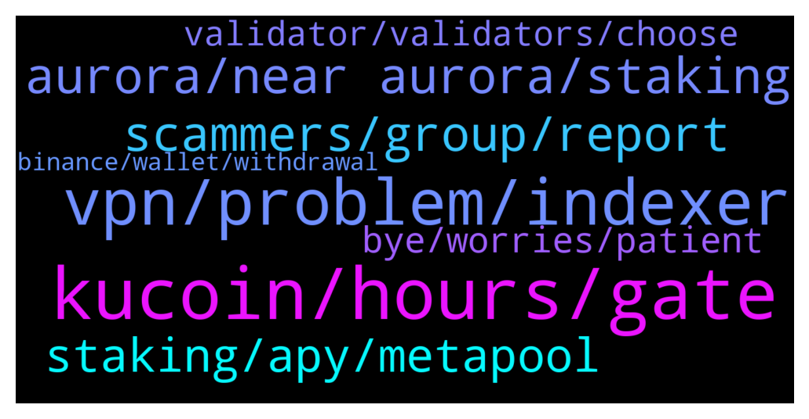

# **@cryptonear**
 ## Analysis for **2022-01-15** - **2022-01-16**.

---

## 📊 **Basic Stats**

**n_messages_sent**: 932

---

---

## 🔝 **Top keywords and related messages**

1. **kucoin, hours, gate**

    @A --- *ffs still waiting on kucoin to confirm the tx* **--->** [TG Discussion](https://t.me/cryptonear/286531)

    @iamkemoo --- *KuCoin had issues as far as I know. Try againg and if it not works contact KuCoin.* **--->** [TG Discussion](https://t.me/cryptonear/287564)

    @abundone8 --- *Sometimes Kucoin takes awhile to transfer out.* **--->** [TG Discussion](https://t.me/cryptonear/286656)

    @the1cheeto --- *I have been trying to move  some NEAR from kucoin to a new wallet and its been processing for over a day now.  Should I just try again or what?* **--->** [TG Discussion](https://t.me/cryptonear/287560)

    @the1cheeto --- *NEAR newb here.  Trying to setup my wallet and my initial deposit from kucoin has hung up for an hour now.  Normal?* **--->** [TG Discussion](https://t.me/cryptonear/286165)

    @33zebras --- *I have had the same problem and have one transaction pending from Kucoin for over a day; the previous day I had to increase the amount I was sending before it went through. Frustrating* **--->** [TG Discussion](https://t.me/cryptonear/287651)

2. **vpn, problem, indexer**

    @Kripto_Raptor --- *I understand. I ve reported this to the team, some other users are facing the same issue. Blockchain is running fine but i think it has something to do with the indexer. Please try again in a few hours. I expect a response from the team. Thanks for your feedback* **--->** [TG Discussion](https://t.me/cryptonear/288615)

    @Diederiek --- *Ok thanks (but it seems I m not the only one with this problem)* **--->** [TG Discussion](https://t.me/cryptonear/288573)

    @cero --- *Hi, I have the same problem. Can you help me out? will send back 1 $NEAR* **--->** [TG Discussion](https://t.me/cryptonear/286699)

    @iamkemoo --- *hey, i am facing the same issue now too. it seems like they have server problems. check in a few hrs again* **--->** [TG Discussion](https://t.me/cryptonear/287400)

    @soldegenalpha --- *I am only able to upload 20-30 NFTs before it stops and then I have to try again after sometime.* **--->** [TG Discussion](https://t.me/cryptonear/287421)

    @larry_lang --- *hmm how about using another browser, or open a incognito tab and log in* **--->** [TG Discussion](https://t.me/cryptonear/288461)

3. **aurora, near aurora, staking**

    @solovey4ik --- *hi all,  can some one tell me , staking near for aurora im just geting aurora or both near + aurora?* **--->** [TG Discussion](https://t.me/cryptonear/286362)

    @ieatapple --- *Just wondering why are people staking for Aurora rewards? What can we do with Aurora ?* **--->** [TG Discussion](https://t.me/cryptonear/286939)

    @bailey_12 --- *Hi, You will receive both $Near and $Aurora as the rewards of your staking  For further question on Aurora, don’t hesitate to join and ask the community on  https://t.me/auroraisnear* **--->** [TG Discussion](https://t.me/cryptonear/286703)

    @Onilgrg --- *Anyone palnning to stake in Aurora. I will be from Mon* **--->** [TG Discussion](https://t.me/cryptonear/287444)

    @GeorgePro1 --- *The reward for this is $Aurora only ($Near spent for Aurora)  Check the apy for this pool: https://forum.aurora.dev/t/aurora-validator-v-2-0-setup/100  How to stake: https://twitter.com/auroraisnear/status/1482052357424775172?s=21* **--->** [TG Discussion](https://t.me/cryptonear/287064)

    @FritzWagner --- *Hello, there is staking on Aurora ? Or it is a DEX where you are providing liquidity ?* **--->** [TG Discussion](https://t.me/cryptonear/286258)

4. **scammers, group, report**

    @FritzWagner --- *Scammers ? Why are they like that ? Hahaha 🤣 can't tell, I can't understand why anyone will decide to harm and steal from others instead of just have fun and being a valuable person, the reward is immense in friends and good moments when you are just nice.* **--->** [TG Discussion](https://t.me/cryptonear/286387)

    @MAJ10 --- *How do I report an account as a potential scam. Sending me dm* **--->** [TG Discussion](https://t.me/cryptonear/287371)

    @joelsf --- *be carefull there is a scammer on this group trying to steal wallets: "FritzWagner "* **--->** [TG Discussion](https://t.me/cryptonear/286366)

    @ieatapple --- *A lot of scammers are dm-ing me.* **--->** [TG Discussion](https://t.me/cryptonear/286821)

    @SultanOfStock --- *There is scammer impersonators of me and some other public figure frens maybe could be why* **--->** [TG Discussion](https://t.me/cryptonear/286647)

    @bailey_12 --- *It is scam group. Pls report it* **--->** [TG Discussion](https://t.me/cryptonear/286855)

5. **staking, apy, metapool**

    @antieco --- *Hi I want to begin staking* **--->** [TG Discussion](https://t.me/cryptonear/288583)

    @FritzWagner --- *For staking take a look here:  https://medium.com/nearprotocol/a-starters-guide-to-the-near-wallet-and-staking-process-d2c8f3b61f43* **--->** [TG Discussion](https://t.me/cryptonear/286369)

    @FritzWagner --- *APY on staking ? around +10%* **--->** [TG Discussion](https://t.me/cryptonear/286303)

    @BrockAngelo --- *Is there going to be a lockup period for staking?* **--->** [TG Discussion](https://t.me/cryptonear/286072)

    @FritzWagner --- *oh hahahaha I see, yeah take a look on metapool.app for the next time, it has more features regarding to staking ;)* **--->** [TG Discussion](https://t.me/cryptonear/286261)

    @iamkemoo --- *The exact APY are not released yet as far I know* **--->** [TG Discussion](https://t.me/cryptonear/287242)

6. **bye, worries, patient**

    @FritzWagner --- *I am doing it now yes hahaha* **--->** [TG Discussion](https://t.me/cryptonear/286336)

    @larry_lang --- *give it some time guys, i am just eager as u are* **--->** [TG Discussion](https://t.me/cryptonear/288489)

    @iamkemoo --- *I'm so sorry about the situation but we can not change that. ☹️* **--->** [TG Discussion](https://t.me/cryptonear/287419)

    @FritzWagner --- *hahaha is not what we do now ? woao* **--->** [TG Discussion](https://t.me/cryptonear/286572)

    @NearFritz --- *Thanks Rahul, I can't tag or send www right now 🙈* **--->** [TG Discussion](https://t.me/cryptonear/287685)

    @Satti123456 --- *Ok. I am ready to do that.* **--->** [TG Discussion](https://t.me/cryptonear/288012)

7. **validator, validators, choose**

    @cryptoheitzii --- *What I have to do as a validator?* **--->** [TG Discussion](https://t.me/cryptonear/286171)

    @jayendra10 --- *U should remove validators asking 100%..so that people are not trapped* **--->** [TG Discussion](https://t.me/cryptonear/286161)

    @Paragism --- *I hve delegated NEAR to an inactive validator by mistake. Now I can not see the delegation. What is the solution ?* **--->** [TG Discussion](https://t.me/cryptonear/288169)

    @kv9990 --- *Don't stake with Validator who has 100% fees, they're private pools 👀 choose the lower ones* **--->** [TG Discussion](https://t.me/cryptonear/286119)

    @NearFritz --- *There is help for validators also can you join discord server ? There is a channel for this topic* **--->** [TG Discussion](https://t.me/cryptonear/287707)

    @kv9990 --- *Just check the Validator you want to stake is in the list.* **--->** [TG Discussion](https://t.me/cryptonear/286142)

