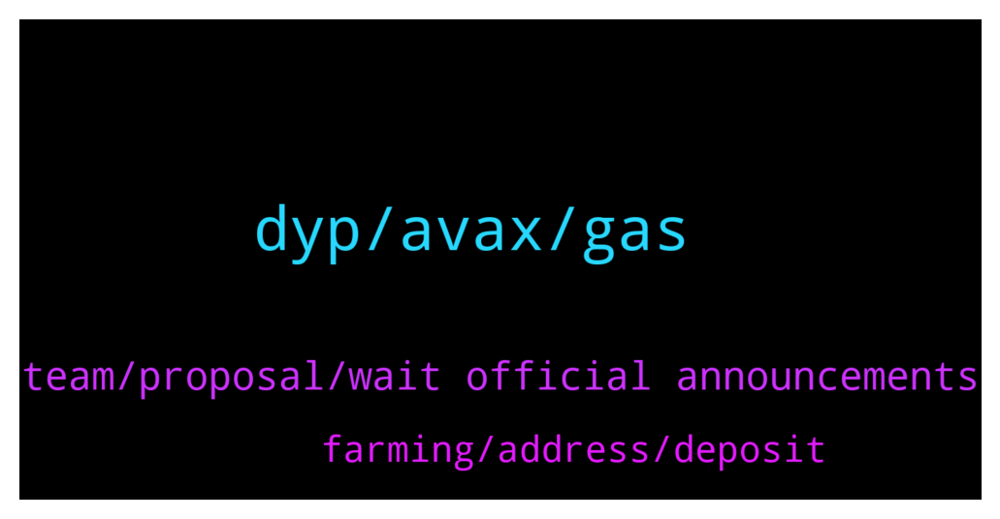

# **@dypfinance**
 ## Analysis for **2022-01-15** - **2022-01-16**.

---

## 📊 **Basic Stats**

**n_messages_sent**: 96

---

---

## 🔝 **Top keywords and related messages**

1. **dyp, avax, gas**

    @appliepietrade --- *i am doing avax farming, so if the avax token price rise, the lp value that I am currently farming will also increase, is this a fair statement?* **--->** [TG Discussion](https://t.me/dypfinance/240058)

    @Jabirbobo001 --- *Please explain the iDYP, i hve DYP tokens, does that mean iDYP price can go up and DYP price wont go, since its not the same token* **--->** [TG Discussion](https://t.me/dypfinance/240079)

    @DhoniMSD516 --- *Nope you are wrong our supply is divided to different chains 65% in BSC in 100% from BSC and not from overall* **--->** [TG Discussion](https://t.me/dypfinance/240164)

    @amzuf --- *Dyp is like DEGO, DEGO price on kucoin was 0.4$ _ 0.6$ With binance listing 40$* **--->** [TG Discussion](https://t.me/dypfinance/240211)

    @Twittsbets --- *Why is it claiming my DYP in ETH its so expensive. Reward is $700+ and my gas is $400+ gwei is like 117 as of this tim* **--->** [TG Discussion](https://t.me/dypfinance/240004)

    @H --- *Team they must offer dyp to Binance to listen on Binance exchange* **--->** [TG Discussion](https://t.me/dypfinance/240201)

2. **team, proposal, wait official announcements**

    @DhoniMSD516 --- *At this moment I can only say wait for official announcements :)  https://t.me/dypannouncements* **--->** [TG Discussion](https://t.me/dypfinance/240236)

    @nkemboxoffice --- *Is the NFt minting still scheduled for 17th jan?* **--->** [TG Discussion](https://t.me/dypfinance/239942)

    @aaadminn1 --- *Hi! I am have a proposal, where should i send DM? 📩* **--->** [TG Discussion](https://t.me/dypfinance/239852)

    @PapaAis --- *Hi, marketing team. I would like to offer  you trading proposal.  Are you interested to doing with us? Please dm me* **--->** [TG Discussion](https://t.me/dypfinance/240182)

    @iamJubi --- *Hello. No exact date for minting yet. Please stay tuned for announcement. https://t.me/dypannouncements* **--->** [TG Discussion](https://t.me/dypfinance/239944)

    @DhoniMSD516 --- *Ok team will get back if they found it needed :)* **--->** [TG Discussion](https://t.me/dypfinance/240193)

3. **farming, address, deposit**

    @Justin --- *I have a question about an old farm I deposited 27 Defiyield into about 14 months ago. I cant see it list in the dapp but can see it on Etherscan..can I still remove it and sell it back to Eth?* **--->** [TG Discussion](https://t.me/dypfinance/240118)

    @iamJubi --- *Hello. Done digging into your wallet, apologies it took time as etherscan is under maintenance.  You added liquidity (DYP-ETH pair) and approved but I think you did not deposit on the farming pool as I can not find the deposit transaction you made. Remove liquidity here https://app.uniswap.org/#/remove/v2/0x961C8c0B1aaD0c0b10a51FeF6a867E3091BCef17/ETH* **--->** [TG Discussion](https://t.me/dypfinance/240122)

    @appliepietrade --- *question to admin: if i currently have a farming going on and i want to do another farming, do i see a separate farming or whether the new farming will add to the existing one?* **--->** [TG Discussion](https://t.me/dypfinance/240041)

    @Otthrice --- *and one last question: saw your launchpad can we participate while we farming?* **--->** [TG Discussion](https://t.me/dypfinance/240060)

    @Futtetenne --- *is it allowed to present a new staking and farming project ?* **--->** [TG Discussion](https://t.me/dypfinance/240151)

    @Otthrice --- *i just joined and started to farm, and must say really impressed* **--->** [TG Discussion](https://t.me/dypfinance/240059)

