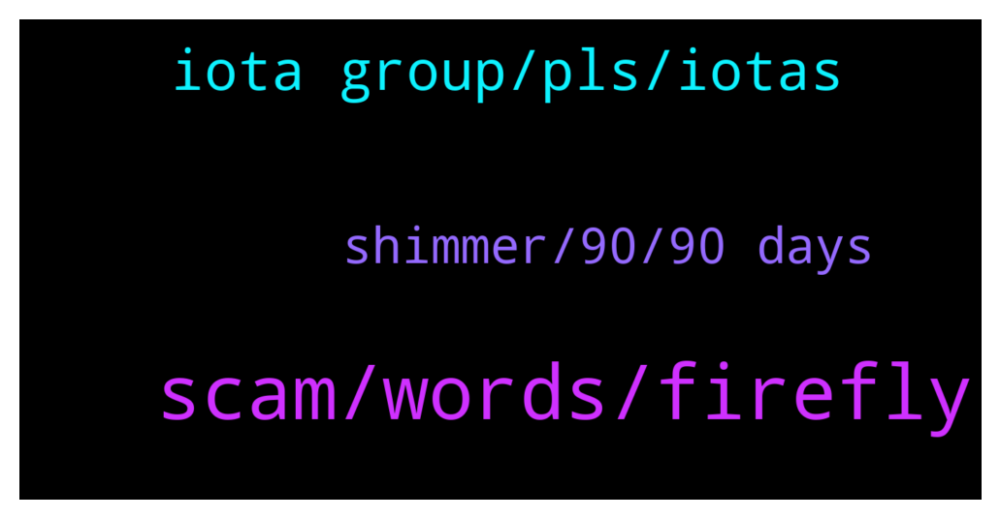

# **@iotatangle**
 ## Analysis for **2022-01-15** - **2022-01-16**.

---

## 📊 **Basic Stats**

**n_messages_sent**: 68

---

---

## 🔝 **Top keywords and related messages**

1. **scam, words, firefly**

    @xyogazen --- *Just like I was delete in another IOTA Tech Airdrop group* **--->** [TG Discussion](https://t.me/iotatangle/306869)

    @Incog --- *Get their address and send 😂* **--->** [TG Discussion](https://t.me/iotatangle/306833)

    @KoolN --- *I was unable to send to that address…it would not let me. I thought it was a user error* **--->** [TG Discussion](https://t.me/iotatangle/306902)

    @KoolN --- *Damn, okay I was trying to  avoid using firefly but it looks like it’s my only option…dcent is way easier to use for me* **--->** [TG Discussion](https://t.me/iotatangle/306900)

    @xyogazen --- *Something also fish here as my words got deleted very fast* **--->** [TG Discussion](https://t.me/iotatangle/306866)

    @Wesley_Timez --- *Thanks. Wondering why it is trending outside but not here* **--->** [TG Discussion](https://t.me/iotatangle/306960)

2. **iota group, pls, iotas**

    @xyogazen --- *Is this group in any connection to IOTA Tech Airdrop group ?* **--->** [TG Discussion](https://t.me/iotatangle/306861)

    @⠠⠵ Lucas! --- *You likely buyed wrapped IOTAs, which are not IOTAs* **--->** [TG Discussion](https://t.me/iotatangle/306901)

    @⠠⠵ Lucas! --- *That is not an IOTA address* **--->** [TG Discussion](https://t.me/iotatangle/306899)

    @KoolN --- *Who holding their IOTA in D’CENT!??* **--->** [TG Discussion](https://t.me/iotatangle/306855)

    @G --- *Hey! Long term iota hodler here from Spain 🇪🇸🇪🇸🇪🇸* **--->** [TG Discussion](https://t.me/iotatangle/306931)

    @holdencf --- *I'm sending to someone who does not know about iota yet* **--->** [TG Discussion](https://t.me/iotatangle/306834)

3. **shimmer, 90, 90 days**

    @YomanTt --- *What news you wanna hear? Guess there will be some near the end of staking period about dates of mainnet launch* **--->** [TG Discussion](https://t.me/iotatangle/306845)

    @iam_anihnuella --- *Staked my iota, what could be the value of shimmer and asm when released* **--->** [TG Discussion](https://t.me/iotatangle/306985)

    @notyourloulou --- *Any News on asmb or smr ?* **--->** [TG Discussion](https://t.me/iotatangle/306844)

    @emanuel --- *After staking whats the next step ? Just holding it and wait the price to go up?* **--->** [TG Discussion](https://t.me/iotatangle/306962)

    @Vassily --- *1Miota+X Shimmer + Y Assembly = 1-2$ initial price)* **--->** [TG Discussion](https://t.me/iotatangle/306986)

    @Basti --- *+ smart contracts /tokenization on Shimmer and mainnet afterwards* **--->** [TG Discussion](https://t.me/iotatangle/306970)

