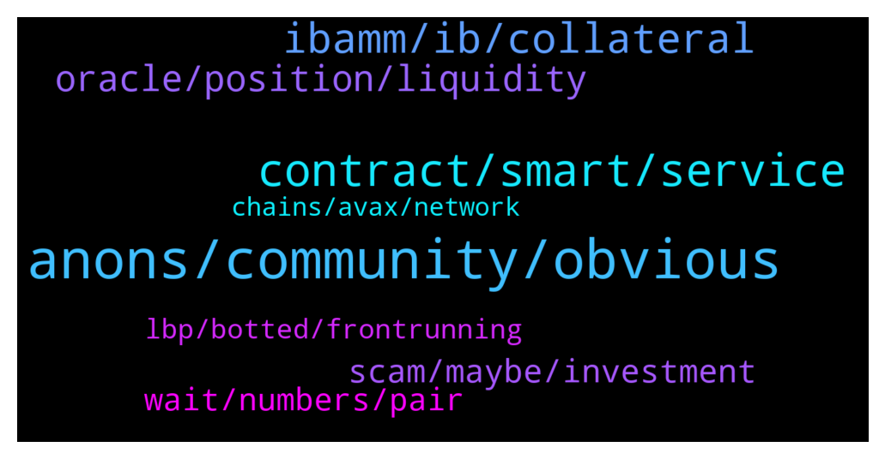

# **@lobsters_chat**
 ## Analysis for **2022-01-15** - **2022-01-16**.

---

## 📊 **Basic Stats**

**n_messages_sent**: 239

---

---

## 🔝 **Top keywords and related messages**

1. **anons, community, obvious**

    @LilMoonLamboX3 --- *near is what everyone thought solana was gonna be* **--->** [TG Discussion](https://t.me/lobsters_chat/315681)

    @ivangbi --- *https://twitter.com/nikitaamashkov/status/1481380388559859716 dunno if real but OP has brains* **--->** [TG Discussion](https://t.me/lobsters_chat/315848)

    @xecordoteth --- *not sure what to think of it* **--->** [TG Discussion](https://t.me/lobsters_chat/315913)

    @rasikhmorani --- *The comments were made in 13-14 right, I feel like this is an overreaction for someone being dumb 10 years ago* **--->** [TG Discussion](https://t.me/lobsters_chat/315662)

    @ivangbi --- *Anons r simping, having fun, let em. But this moron is now typing “muh brand creator thesis community” like bro relax* **--->** [TG Discussion](https://t.me/lobsters_chat/315936)

    @paulogouveia --- *anons? you see loads of 'known' people simping* **--->** [TG Discussion](https://t.me/lobsters_chat/315939)

2. **contract, smart, service**

    @andrecronje --- *Can use the contract directly via etherscan if need be, I do* **--->** [TG Discussion](https://t.me/lobsters_chat/315748)

    @colingplatt --- *If anyone is interested I'm working on a contract to gather as much WTF as possible and power dump it back on them. https://twitter.com/colingplatt/status/1482052300780748802?t=Rcd_HiOiSIMG_Al1Wy82eg&s=19* **--->** [TG Discussion](https://t.me/lobsters_chat/315634)

    @ustunuzum --- *Is there a crypto attestation service for real life collectables?* **--->** [TG Discussion](https://t.me/lobsters_chat/315902)

    @rocket_fuel --- *simply because it is centralized does not mean it cannot be trustless. it does however require trusted supply chain for the meatspace object in question, so even if verification is trustless, the initial setup will def be trusted. Seems to work for some ZK dapps, don't see why it cannot work with physical objects.* **--->** [TG Discussion](https://t.me/lobsters_chat/315911)

    @ustunuzum --- *Thats what i am trying to understand. An attestation service by design is a centralised thing. Wondered if anyone took a stab at it. Kleros style service might be an option.* **--->** [TG Discussion](https://t.me/lobsters_chat/315909)

    @cryptoq11 --- *If you are interested in smart contracts in the Cosmos ecosystem, then please take a look at Cyber(Bostrom). They also support Cosmwasm smart contracts. Smart contracts section is in the test app now. Main app is also released. They have other interesting modules in Bostrom.  https://rebyc.cyber.page/codes/* **--->** [TG Discussion](https://t.me/lobsters_chat/315672)

3. **ibamm, ib, collateral**

    @PmRiviere --- *Could someone ELI5 what’s happening under the hood when swapping on ibAMM? Eg this (random) swap tx 1/ User swaps in ibAMM, sending his $MIM to Keep3r proxy contract 2/ Keep3r do some work (do what?)  3/ ibAMM borrows ibEUR from Yearn ibEUR vault 4/ ibAMM transfers ibEUR to user (EUR/MIM market rate)  Also two Qs: Does ibAMM has special rights to borrow from Iron Bank at just 100% collateral (instead of over-collateralized)? Who’s paying the interest on the loan here?* **--->** [TG Discussion](https://t.me/lobsters_chat/315729)

    @andrecronje --- *Same as any other IB loan, when required, no different than ib<>alpha, or ib<>yearn, or ib<>pleasrdao, or ib<>rune* **--->** [TG Discussion](https://t.me/lobsters_chat/315751)

    @PmRiviere --- *actually how are the ib* streamed back to Iron Bank? When / on what trigger does ibAMM repay the debt ? Not sure I understand what is “monitored” and by who* **--->** [TG Discussion](https://t.me/lobsters_chat/315746)

    @andrecronje --- *Same tools as any debt based position, you're overthinking it, its just an standard IB loan* **--->** [TG Discussion](https://t.me/lobsters_chat/315749)

    @xRugMe --- *Leverage PLP position an abra or borrow MIM* **--->** [TG Discussion](https://t.me/lobsters_chat/315777)

    @andrecronje --- *1. IB offers 0 collateral loans to protocols. It uses that. 2. Interest is paid by kp3r protocol.   To expand on above, mim is used to farm yvmim in yearn, so right now its outperforming interest, yvmim interest is used to settle forex diff + debt, last resort is kp3r treasury to settle* **--->** [TG Discussion](https://t.me/lobsters_chat/315730)

4. **oracle, position, liquidity**

    @Oxdev0 --- *In simple terms, Wild Credit calculated UniV3 position values like this:  It starts by asking the price oracle what the current token prices of each token in a Uniswap pair are.  Say it's a MKR-ETH pair.  1) It will ask the oracle what are the price of MKR and ETH.  2) Then it will use those prices to answer the question "What would token amounts of this position look like given those token prices, liquidity and ticks?"  3) Finally, it converts both calculated token amounts back to the USD value.* **--->** [TG Discussion](https://t.me/lobsters_chat/315808)

    @Monkeyontheloose --- *What if one wanted to supply liquidity on his own schedule, like a different curve ,is that possible? Does balancer let you do this?* **--->** [TG Discussion](https://t.me/lobsters_chat/315875)

    @Monkeyontheloose --- *i think this can be done without an outside oracle  and example use case would be, say I want to supply liquidity and cash out my 1BTC when the value reaches 10m$* **--->** [TG Discussion](https://t.me/lobsters_chat/315925)

    @sonicblend --- *I believe Dodo Exchange let's you do this with their PMM (Proactive Market Maker):  > Parameters such as asset ratio and curve slope can be flexibly set. At the same time, an oracle machine can be introduced to guide prices or price discovery by the market on the chain. This oracle also gathers more funds near the market price and provides sufficient liquidity.* **--->** [TG Discussion](https://t.me/lobsters_chat/315924)

    @sonicblend --- *Ahhh I thought you wanted flexibility on the curve. Not concentrated liquidity with a limit sell? (And perhaps stop loss)* **--->** [TG Discussion](https://t.me/lobsters_chat/315926)

    @ivangbi --- *Thanks, I guess can be oracle deviation at some points in time?* **--->** [TG Discussion](https://t.me/lobsters_chat/316000)

5. **scam, maybe, investment**

    @Joel_john --- *its more so memetic theory in markets ( abc had done x returns on certain investment, so i will ape with them on this new bag they are shilling at 15x fdv and make a return)* **--->** [TG Discussion](https://t.me/lobsters_chat/315695)

    @tesslerc --- *They are geniuses, it's a pretty smart scam model.  Make public scam, dismiss all community warnings as fud, launch and scam many people, write post mortem about how sad you are, keep scammed funds.* **--->** [TG Discussion](https://t.me/lobsters_chat/315797)

    @Joel_john --- *even venture investment has the same - just different way of doing it ("fund xyz is investing in abc so its the next big thing, we will also invest" )* **--->** [TG Discussion](https://t.me/lobsters_chat/315693)

    @LilMoonLamboX3 --- *it's beyond investing tho this mindstate happens in so many areas* **--->** [TG Discussion](https://t.me/lobsters_chat/315686)

    @colingplatt --- *It's a protest (maybe a hissy fit), not an investment* **--->** [TG Discussion](https://t.me/lobsters_chat/315647)

    @metacoin --- *Capital efficiency maybe? Not having an insurance module would allow for better usage of capital at rest and maybe better long run, especially if it is never needed. It's a bet on whether the trade-off of having the fund will attract more deposits vs using that capital for expenditures now would attract more deposits via work paid for by spending it. Ofc this is speculation maybe someone from Compound can chime in here* **--->** [TG Discussion](https://t.me/lobsters_chat/315887)

6. **wait, numbers, pair**

    @Xeke65 --- *Yeah I got 40k $MIST for 1 eth, didn't have to bot.* **--->** [TG Discussion](https://t.me/lobsters_chat/315988)

    @Darrenlautf --- *Oh wait its 10m kek sorry ivan only you have that much stables* **--->** [TG Discussion](https://t.me/lobsters_chat/315997)

    @Jin_CG --- *Ahhhh thank you for the heads up, I think just saw this happening on some of the pairs. Will investigate!* **--->** [TG Discussion](https://t.me/lobsters_chat/315832)

    @syed_jafri --- *11M on NEAR pair, big diff in 4 weeks* **--->** [TG Discussion](https://t.me/lobsters_chat/315709)

    @syed_jafri --- *Last time I checked, top AMM pair on Aurora was 750K USD daily vol* **--->** [TG Discussion](https://t.me/lobsters_chat/315707)

    @Darrenlautf --- *Give me 30 mins i can swap and report back* **--->** [TG Discussion](https://t.me/lobsters_chat/315994)

7. **lbp, botted, frontrunning**

    @Sp33dyTT --- *I participated in almost every LBP in late 2021 and 2022* **--->** [TG Discussion](https://t.me/lobsters_chat/315981)

    @zmherron --- *True in some ways, although it seems like on BSC, validators collude with certain frontrunning bots and don’t respect gas ordering (a select few frontrunning bots always end up first in the block regardless of if they are outbid on gas). I wrote a thread about it here if you’re curious about learning more: https://twitter.com/__zherron__/status/1481730745290924045?s=20* **--->** [TG Discussion](https://t.me/lobsters_chat/315633)

    @Xeke65 --- *10 to 15 percent would've made it worth it taking a shot. But 5, no. LBP cannot be botted, though, by design.* **--->** [TG Discussion](https://t.me/lobsters_chat/315974)

    @Cryptographic --- *Copper is the best example of anti bot lbp measures makes 0 sense to bot a copper launch* **--->** [TG Discussion](https://t.me/lobsters_chat/315992)

    @Xeke65 --- *I've looked at every single LBP every conducted. Are u new to this? 1 lbp was botted and it was HydraDX and it was front run for $50k* **--->** [TG Discussion](https://t.me/lobsters_chat/315980)

    @Xeke65 --- *Starts at top left @ much higher starting price and drops until it is met by a sizable demand. Really good lbps usually drop 50-65 percent, and then begin to rise in price.* **--->** [TG Discussion](https://t.me/lobsters_chat/315976)

