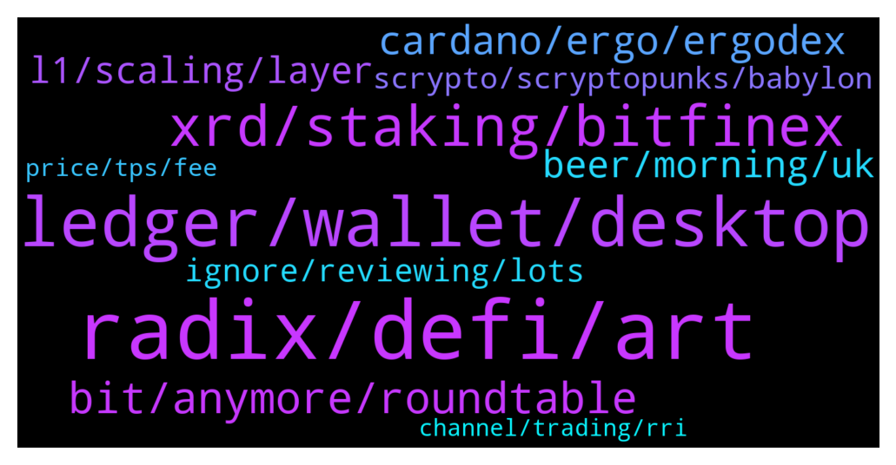

# **@radix_dlt**
 ## Analysis for **2022-01-15** - **2022-01-16**.

---

## 📊 **Basic Stats**

**n_messages_sent**: 594

---

---

## 🔝 **Top keywords and related messages**

1. **radix, defi, art**

    @tesslerc --- *There's a community initiative to do some additional marketing activities. We've been active since Radix has launched as an ERC20 and have recently ramped up activities when we brought on Stefan 🙂  You can read more in the other channels, but I think we're going to do super cool stuff together 🙂 I believe we'll see the tube red-orange-yellow colors a lot more (https://getradix.com/) as a way to represent community initiatives going forward (and differentiate from the core team activities).* **--->** [TG Discussion](https://t.me/radix_dlt/339908)

    @happyDog44647 --- *Hello, I checked the team on Website. What is the diff b/t Radix Token annd Radix Works? Looks like they are 2 diff companies, rite?* **--->** [TG Discussion](https://t.me/radix_dlt/339799)

    @happyDog44647 --- *Just went through Radix whitepaper, as a non-tech guy it got me dizzy. Barely understand anything. Can anyone summarize or have a explainnation video?* **--->** [TG Discussion](https://t.me/radix_dlt/339746)

    @happyDog44647 --- *I was surprised It’s that short. Why is it so short compared to other chains?* **--->** [TG Discussion](https://t.me/radix_dlt/340260)

    @AfterWave2 --- *Love the Demo and the playful jousting. Enjoy the Fam time. Used your link in response to Ben Cohen call to ADA demos. Ben's okay, a supposed nuclear scientist gone BTC maxi, just not sure of his in depth network knowledge. Youtube influencer with almost 700k subscribers. Let's invite him for more teachings on Radix. https://twitter.com/intocryptoverse/status/1482221672035983361* **--->** [TG Discussion](https://t.me/radix_dlt/340037)

    @Cpt_Charles --- *His bio says he’s with Messari, didn’t Radix have a partnership with them a while ago? When I checked Radix page on Messari it was quite abandoned/not updated  https://messari.io/asset/radix* **--->** [TG Discussion](https://t.me/radix_dlt/339902)

2. **ledger, wallet, desktop**

    @Adam_XRD --- *Everyone got the Ledger Live version of the Radix app running soonth?* **--->** [TG Discussion](https://t.me/radix_dlt/339870)

    @Bent --- *Is it possible to have multiple wallet addresses on the ledger?* **--->** [TG Discussion](https://t.me/radix_dlt/339551)

    @WAGMI --- *Nab sorry for all the questions they were dumb it just makes a new address for the hardware wallet* **--->** [TG Discussion](https://t.me/radix_dlt/339516)

    @aus87 --- *just for any funds in the desktop wallet, will have nothing to do with your ledger wallet* **--->** [TG Discussion](https://t.me/radix_dlt/339474)

    @RavesCrypto --- *so now we can install it directly from ledger live? really? 😃* **--->** [TG Discussion](https://t.me/radix_dlt/339497)

    @art4xis --- *to see Radix app in Ledger Live you need to turn on "Developer mode" first if anyone wondering where it is* **--->** [TG Discussion](https://t.me/radix_dlt/339496)

3. **xrd, staking, bitfinex**

    @Avaunt --- *@Adam_XRD @Jacob_XRD @Bfargher This is from the author of the Staking Rewards Article  https://twitter.com/CabronElBufon/status/1482312334458724355* **--->** [TG Discussion](https://t.me/radix_dlt/339893)

    @samuskycoin --- *ISO4217 - currency codes requires any 3 digit non-country specific currency to start with an X. No official country code can begin with an X (ISO 3166) and therefore it ensures a currency starting with an X will never clash with a country specific code. https://en.m.wikipedia.org/wiki/ISO_4217* **--->** [TG Discussion](https://t.me/radix_dlt/340446)

    @mattiabe98 --- *Guys, help me convert a Cardano maxi to XRD 😂 https://twitter.com/0xMattia/status/1482675730374971395* **--->** [TG Discussion](https://t.me/radix_dlt/340349)

    @Avaunt --- *🦂🦂Avaunt Staking - Abandoned Scorpion Air Drop🦂🦂  To celebrate 2022, the year of Babylon we will be air dropping  an Abandoned Scorpion 🦂 to every new delegator who stakes 1000 XRD or more with Avaunt Staking until the 13th of Feb, 2022 or until our stocks last.  SECONDLY, as a thankyou we will also be airdropping TWO!! Abandoned Scorpions 🦂🦂to all existing Avaunt Staking Delegators. A snapshot of all existing delegator addresses was taken on the 8th Jan 2022 @ 1000 UTC.  Avaunt Staking Validator ID: rv1qdn4mwharah5c3w5sw4zfyagvkftrj47ruwatjfr6z2r7pmvk5uuu84j45v Staking Guide: https://avaunt-staking.com/radix-delegation-guide/    Note: Both existing and new delegators will receive their Scorpions 🦂 after the end of the promotion in late February. Avaunt Staking has reserved 500 scorpions 🦂 and the eligible participants will receive a random scorpion(s) 🦂🦂 from this pool. https://radstrike.com/scorpions/wallet/?addr=rdx1qsptwk20ultcmjc3h9f53ftrztj8kvccgv8emjwynr99vyq7ygf5jdg078he8* **--->** [TG Discussion](https://t.me/radix_dlt/339639)

    @matias_cobi --- *If e-Radix has been send to Bitfinex. How is the mechanism to get it changed to XRD? Thanks* **--->** [TG Discussion](https://t.me/radix_dlt/340180)

    @Tamás --- *You can only stake XRD in the Radix Desktop Wallet.* **--->** [TG Discussion](https://t.me/radix_dlt/340522)

4. **bit, anymore, roundtable**

    @Cpt_Charles --- *I only see this short bit on there https://messari.io/article/radix-joins-the-messari-registry?referrer=asset:radix* **--->** [TG Discussion](https://t.me/radix_dlt/339904)

    @Avaunt --- *it goes on a bit here https://messari.io/asset/radix/profile* **--->** [TG Discussion](https://t.me/radix_dlt/339909)

    @Cpt_Charles --- *Hmm, that fixed it for me 🤔* **--->** [TG Discussion](https://t.me/radix_dlt/339621)

    @Zloliver --- *I had a custom one set up.. the community one :<* **--->** [TG Discussion](https://t.me/radix_dlt/339620)

    @Jacob_XRD --- *No, but it’s a good #Roundtable question. I’ll follow up for the recording end of this month.* **--->** [TG Discussion](https://t.me/radix_dlt/340306)

    @AV_7744 --- *Pretty sure someone's already working on it 😂* **--->** [TG Discussion](https://t.me/radix_dlt/339952)

5. **cardano, ergo, ergodex**

    @dopermon12 --- *Ive never heard of anyone using cardano's network. How is that guy saying 1.2m people use it* **--->** [TG Discussion](https://t.me/radix_dlt/339590)

    @Null_v0id --- *I don’t hate Cardano because it’s Cardano. I like variety, but Cardano tech just doesn’t stack up..* **--->** [TG Discussion](https://t.me/radix_dlt/339631)

    @happyDog44647 --- *Cardano aint do anything well. It’s Ergo performed that transaction. But I get your point.* **--->** [TG Discussion](https://t.me/radix_dlt/339815)

    @TheWarOnDrugs --- *hope he's ready for the cardano cult* **--->** [TG Discussion](https://t.me/radix_dlt/339564)

    @happyDog44647 --- *yes, Cardano now is living off Ergo’s ability, both are using eUTXO models. There must be some reasons Kushti left Cardano to create Ergo, I guess 🙂    https://twitter.com/RichardMcCrackn/status/1480945016336154624* **--->** [TG Discussion](https://t.me/radix_dlt/339768)

    @Bent --- *I feel like Cardano chose exactly the wrong type of dapp to showcase the strengths of their UTXO model when they're going so strong on DeFi so soon. There must be other types of dapps that would be better served by their architecture.* **--->** [TG Discussion](https://t.me/radix_dlt/339666)

6. **beer, morning, uk**

    @danhughes --- *Morning? Where the hell are you? Still 2 hrs of beer time left in the uk* **--->** [TG Discussion](https://t.me/radix_dlt/340131)

    @CryptoRadix --- *Bourbon o clock in the US* **--->** [TG Discussion](https://t.me/radix_dlt/340143)

    @Adam_XRD --- *How's everyone doing this fine Saturday?* **--->** [TG Discussion](https://t.me/radix_dlt/339869)

    @danhughes --- *Does 1:03am count as morning in aus?* **--->** [TG Discussion](https://t.me/radix_dlt/340220)

    @Stefan --- *2am in Germany, beer hours over soon* **--->** [TG Discussion](https://t.me/radix_dlt/340222)

    @CaptainMooseInc --- *https://twitter.com/XRDScan/status/1482220151592439808?s=20  Vegetables for breakfast?! Make sure to save room... we hope you'll eat this announcement up at 4pm UTC.* **--->** [TG Discussion](https://t.me/radix_dlt/339717)

7. **l1, scaling, layer**

    @Bent --- *I can see there being L2s for highly specialized use cases that are poorly suited for the L1. E.g. you could have an L2 file storage chain which would make sense because 1) the L1 architecture is poorly suited for storage of large binary data and 2) files are read way more often than they are written to so cross-chain synchronization is very rarely needed.* **--->** [TG Discussion](https://t.me/radix_dlt/339681)

    @samuskycoin --- *@piersr @jacob_XRD  What do you think of the idea discussed in Trader channel for a Radix slogan competition? Some feedback on current slogan (10x, 100x etc.) suggests it is not hitting home. Neither is the messaging about 1000x better than Algorand or whatever - seems that one is possibly counterproductive.  “Building the base layer of global, scalable DeFi.”  ^There’s my entry if we have such a competition.* **--->** [TG Discussion](https://t.me/radix_dlt/340481)

    @fpieper --- *I would say yes, maybe we will have one or two others, but IMHO definitely not more.  The current situation with 10s-100s of competing layer 1 is because no DLT was truly capable of scaling and delivering a safe environment for developers and users yet.* **--->** [TG Discussion](https://t.me/radix_dlt/339781)

    @aus87 --- *I have been thinking about this lately, dont have any good examples.  Also Ive been seeing some L1s out there having their own proprietary "enterprise" layer or some secret centralized setup in order to increase speeds.  I wonder if that sort of thing will have any popularity.  Personally I am all about maximum decentralization.* **--->** [TG Discussion](https://t.me/radix_dlt/339672)

    @fpieper --- *Also ETH is still number one besides others being faster, but this shows how strong network effects are.* **--->** [TG Discussion](https://t.me/radix_dlt/339784)

    @mx471 --- *You need L2 scaling solutions when you have failed with L1 scaling. Or are there other reasons?* **--->** [TG Discussion](https://t.me/radix_dlt/339678)

8. **ignore, reviewing, lots**

    @TheWarOnDrugs --- *Just be ready for them to ignore your arguments, latch onto something they can pull out of context, and then form an echo chamber of "you don't know what you're talking about", as if they do.* **--->** [TG Discussion](https://t.me/radix_dlt/339572)

    @Cpt_Charles --- *Yea, they’re not that good at debates either. They refuse to elaborate their claims and just send you some link to one of the peer-reviewed pappers, that most of the time touches a totally different subject 😂* **--->** [TG Discussion](https://t.me/radix_dlt/339837)

    @MaratCerby --- *It is a cult I guess, you can't convince him in anything else.* **--->** [TG Discussion](https://t.me/radix_dlt/339835)

    @ITProfligate --- *The article if anyone is interested. https://medium.com/asecuritysite-when-bob-met-alice/when-distributed-ledgers-and-trust-infrastructures-just-become-as-natural-as-ethernet-and-sql-bf49eff6c3af* **--->** [TG Discussion](https://t.me/radix_dlt/340162)

    @danhughes --- *Lots of noise means lots of eyes. Good for us* **--->** [TG Discussion](https://t.me/radix_dlt/339571)

    @hanisome --- *Just reviewing stuffs. Don't mind me. 😂* **--->** [TG Discussion](https://t.me/radix_dlt/340420)

9. **scrypto, scryptopunks, babylon**

    @Jazzer9F --- *The November Radix Roundtable is now live.   Catch up with Piers, Russell, Matt, & Adam from RDX Works as they talk about:  🖥 The Scrypto Debut ✅ Community Scrypto code examples 🛠 Radix API refactor 📣 2022 marketing plans & more!  Watch now: https://youtu.be/HUTBCoz5esE* **--->** [TG Discussion](https://t.me/radix_dlt/339915)

    @Stuart_RadixPool --- *I am only referring to how it works with Olympia/Alexandria at the moment.* **--->** [TG Discussion](https://t.me/radix_dlt/339945)

    @Jazzer9F --- *We’re pleased to announce that Radix Alexandria has launched!  Scrypto is a game-changer for DeFi, developers, you can get started with Scrypto now.  Full Announcement: https://www.radixdlt.com/post/alexandria-scrypto-is-here* **--->** [TG Discussion](https://t.me/radix_dlt/340021)

    @peterkimkz --- *Babylon would launch on this year right?* **--->** [TG Discussion](https://t.me/radix_dlt/340356)

    @fpieper --- *Scala is probably used for Ergo's off ledger execution bots.  Scrypto is the smart contract language of Radix. Scrypto uses more or less Rust syntax and provides native asset as a feature for the devs at their fingertips.  It is very easy and safe to learn and drastically reduces the risk for hacks and exploits and reduces the time to market for developers.  Scrypto is a game changer and Radix's unfair advantage.* **--->** [TG Discussion](https://t.me/radix_dlt/339758)

    @nikolandis --- *Who has the telegram link to Scryptopunks* **--->** [TG Discussion](https://t.me/radix_dlt/340438)

10. **price, tps, fee**

    @ahsimon --- *AFAIK the plan was always to decrease fees (as measured in XRD) so that fees (as measured in dollars) stays about the same 1c-10c.  I expect the team will make a manual adjustment as soon as more urgent tasks are behind them.  After Babylon, I expect an oracle based SC to automate the process, so I don't expect a lot of future  deflation.   Plus, the whole fee model is likely to change once there is time to address the 40-year cliff, which I think comes with or after  Xi'an.* **--->** [TG Discussion](https://t.me/radix_dlt/340087)

    @tesslerc --- *Don't forget that if we're running millions of TPS then due to the burn rate the price must go up (at the current price at millions of TPS it is highly deflationary).  And when price goes up, the same emissions are now worth much more.* **--->** [TG Discussion](https://t.me/radix_dlt/340076)

    @happyDog44647 --- *Appeciate this. Every solution always carries pros and cons. Those were the pros you mentioned, what about the cons? I would imagine more energy consumed or more fee costed?* **--->** [TG Discussion](https://t.me/radix_dlt/340293)

    @tesslerc --- *I still don't get the issue here. Why would 300m XRD not be sufficient?  At 1 million TPS the price of each XRD needs to be way over $200 in order for it not to be deflationary. This means that unless the price goes up dramatically (at 1m TPS) then the supply will start burning really fast (until price goes up).  So those 300m XRD will be worth a lot more in $ terms by the time we successfully utilize the network at 1m TPS.* **--->** [TG Discussion](https://t.me/radix_dlt/340440)

    @Mik3ology --- *Just a quick example. Maybe slightly touching on price talk. With a 1 cent tx fee and a stable token price of $10 for one year, the tx fee would be 0.001 XRD.  If the network ran for one year at an average 100K tps. We would have burnt 3.1536 billion xrd.* **--->** [TG Discussion](https://t.me/radix_dlt/340120)

    @tesslerc --- *It's all a complex economic system just like Bitcoin mining. Hash rate affects price but it also works the other way around.  Topic slightly touches price talk and speculation so I won't dig deeper into this stuff.* **--->** [TG Discussion](https://t.me/radix_dlt/340078)

