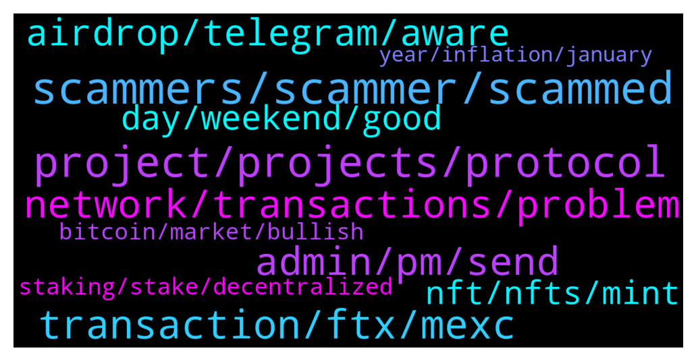

# **@solana**
 ## Analysis for **2022-01-15** - **2022-01-16**.

---

## 📊 **Basic Stats**

**n_messages_sent**: 440

---

---

## 🔝 **Top keywords and related messages**

1. **scammers, scammer, scammed**

    @Joyner --- *How do you know it’s scammers if you’ve not been scammed ?* **--->** [TG Discussion](https://t.me/solana/903433)

    @VelocityX --- *You're getting atleast 10 scammers on your DM for this question.* **--->** [TG Discussion](https://t.me/solana/903756)

    @Ayham --- *Isn't scammer an insult too or are u the one who determines what is an insult* **--->** [TG Discussion](https://t.me/solana/904222)

    @keeptrying641 --- *There are alot of dumb scammers on this group pretending to be admins 😂* **--->** [TG Discussion](https://t.me/solana/905271)

    @Cryptogod --- *I was naive blinded by my excitement to start building an extra stream of income so I ignored all red flags about this company. Once they took my money leaving me with an overdraft above £45,000 then I realised I’ve been scammed. All I wanted was to withdraw my money that’s where the games begun. They kept asking me to pay for the bonuses they had added into my trading account promising that it’s all going to come back to me and I believed them.It took months until I got in touch with ' cryptofirewall . tech who worked in conjunction with my bank to recoup all I had ever lost to this company Please don’t ignore these reviews like I did and lost over £50,000.00 it’s too painful* **--->** [TG Discussion](https://t.me/solana/904600)

    @HellfireAndFury --- *So many scammers. Throwing around qr codes and dapp sites* **--->** [TG Discussion](https://t.me/solana/903389)

2. **project, projects, protocol**

    @UnknownIdentity --- *What the . Hello I'm a fan of this project.. Everybody here is for same motive . Getting increased the value of holding is needed right . Solana is good project . I know in and out of it ok . solana involved in Physical layer of web3.0 and it should be known to all. Thanks for considering me as noob lol* **--->** [TG Discussion](https://t.me/solana/904126)

    @stanelop3 --- *hi any good yield farming for solana?* **--->** [TG Discussion](https://t.me/solana/904503)

    @Kidongsky --- *Is Sol pro under the projects of Solana? Or not Thanks* **--->** [TG Discussion](https://t.me/solana/904389)

    @Bahago12 --- *Hi guys am new to SOLANA block chain am look for some good project on SOLANA with use case and low marketcap* **--->** [TG Discussion](https://t.me/solana/904487)

    @UnknownIdentity --- *Admin please made a post in twitter about solana projects and its strength with fund raisers details. So it will get people to look into it to invest better* **--->** [TG Discussion](https://t.me/solana/903951)

    @BertSanti --- *How can a new project be listed at solana dot com /ecosystem? We've submitted our project January 5, but until now it's not officially listed.* **--->** [TG Discussion](https://t.me/solana/904812)

3. **transaction, ftx, mexc**

    @CrypTippiToe --- *guys question. I sent SOL from fantom wallet to MEXC, transaction is marked as successfull on solscan, but I did not receive my SOL on MEXC. Any ideas why?* **--->** [TG Discussion](https://t.me/solana/904249)

    @Musmanr11 --- *Hi i have transfer 0.30sol token from sollet wallet to my ftx wallet but i didn't receive in my ftx wallet now what i should to do? Please help* **--->** [TG Discussion](https://t.me/solana/903999)

    @pogojam --- *Your right , just had the one transaction go through . Must have gotten lucky because things seem broken now* **--->** [TG Discussion](https://t.me/solana/904557)

    @Musmanr11 --- *More than 8 hours gone but still i did not receive my deposit and no one help me😞😢* **--->** [TG Discussion](https://t.me/solana/904286)

    @polv89 --- *now i don't know why i can't approva a transaction* **--->** [TG Discussion](https://t.me/solana/904572)

    @Musmanr11 --- *But i deposit in FTx exchange now what i should  to do? Kindly help me* **--->** [TG Discussion](https://t.me/solana/904288)

4. **admin, pm, send**

    @AlexATB --- *Admin can I message you?   I’ve got an important situation* **--->** [TG Discussion](https://t.me/solana/904492)

    @Real_Penguin --- *Thank you but I will need a confirmation from admin* **--->** [TG Discussion](https://t.me/solana/904973)

    @Musmanr11 --- *Dear sir i didn't know how to check it kindly guide me* **--->** [TG Discussion](https://t.me/solana/904009)

    @cryptolover1987 --- *Please send me your txid in pM* **--->** [TG Discussion](https://t.me/solana/904014)

    @cryptolover1987 --- *I don’t think so…send me the link in pm.* **--->** [TG Discussion](https://t.me/solana/904369)

    @mahib45 --- *Please forward your issue to gate tech support* **--->** [TG Discussion](https://t.me/solana/903290)

5. **network, transactions, problem**

    @Abuggi --- *I can never stop aquiring Sol* **--->** [TG Discussion](https://t.me/solana/904920)

    @Javier --- *I was providing liquidity for ray/sol pair at raydium.io* **--->** [TG Discussion](https://t.me/solana/904336)

    @ChainAnalytics --- *Last year feb, i barely had money to afford 1 ETH, bought Solana instead, now i have 2.87 BTC, all thanks to Solana.* **--->** [TG Discussion](https://t.me/solana/904722)

    @sridhar --- *can some one explain more about solana network to me* **--->** [TG Discussion](https://t.me/solana/904268)

    @ardatug --- *Guys, what's the problem at solana network? I mean almost everywhere it says it's slow and a few issues more and those issues are now effects it's value. So what's the solution to it?* **--->** [TG Discussion](https://t.me/solana/904153)

    @Javier --- *I got my rewards and decided to sell a little bit, Solana was trading at 230 at the time* **--->** [TG Discussion](https://t.me/solana/904334)

6. **airdrop, telegram, aware**

    @Kidongsky --- *There is Solana Pro airdrops happening in trust wallet, i just wanna know is that is legit. If only i could send the capture.  Than you* **--->** [TG Discussion](https://t.me/solana/904363)

    @I522175723 --- *When will the airdrop be sent?* **--->** [TG Discussion](https://t.me/solana/905102)

    @Ayham --- *Hey guys just wanna make sure there is an airdrop of sol going on with a telegram bot right* **--->** [TG Discussion](https://t.me/solana/904204)

    @maxordan --- *Solana air drop is real ?* **--->** [TG Discussion](https://t.me/solana/904380)

    @Gülsema --- *Can anyone help me with my other account's ban in this telegram group? I have been asked to answer a math question and after 2sec a guy named solana texted me privately and I thought I was supposed to answer to him, which it was a dumb move 💀💀, anyway my banned account's name is Arda Tuğ, I'm ready to take the question again thanks* **--->** [TG Discussion](https://t.me/solana/903447)

    @cryptolover1987 --- *No, there’s isn’t any airdrop operational from our side.* **--->** [TG Discussion](https://t.me/solana/904370)

7. **day, weekend, good**

    @RussianKarina --- *A pleasant holiday weekend is over* **--->** [TG Discussion](https://t.me/solana/905072)

    @A da --- *good afternoon, today is another good day😊😊* **--->** [TG Discussion](https://t.me/solana/904877)

    @qazsd125 --- *Another day is about to pass, everyone can share today's harvest together* **--->** [TG Discussion](https://t.me/solana/905117)

    @quan7869 --- *The best life is to wake up every day with a calm smile* **--->** [TG Discussion](https://t.me/solana/903699)

    @qazsd125 --- *Another day goes by, and hopefully we're not wasting our time. do what you want to do. Fight for what you want.* **--->** [TG Discussion](https://t.me/solana/904034)

    @Monterrey_Rice --- *Good afternoon Solana!! How we doing?* **--->** [TG Discussion](https://t.me/solana/905217)

8. **nft, nfts, mint**

    @Baldyo7 --- *Bought my first NFT on the solana network last night. I bought one from the gangster gorilla collection 👊🏼* **--->** [TG Discussion](https://t.me/solana/905012)

    @tugrult --- *hello. there is a site named ''officialsolanarares''. they sent me a nft to mint. is it legit ?* **--->** [TG Discussion](https://t.me/solana/903630)

    @mahib45 --- *Hello  Beware of scam! #Solana is not giving away any NFT* **--->** [TG Discussion](https://t.me/solana/905170)

    @R4ftel --- *did anyone else get a random nft in their phantom wallet that they can supposedly mint a solana metaverse nft with? is this a fake?* **--->** [TG Discussion](https://t.me/solana/905161)

    @My_rules_My_life --- *The First #Solana Audio-NFT Marketplace Where Artists and Creators Can Buy/Sell Audio-NFT Samples.  Joined November 2021 $VITAL is the first of its kind with it’s Team fully doxxed, and the project just filed as an official company within its jurisdiction! Only 500k VITAL tokens are in the supply and there are also NFTs for sale! 97 left!  Sound NFT market has arrived on the solana blockchain and the total token supply is only 500k so grab ur $VITAL at serum or raydium  Check in coingecko. Soon in coinmarketcap 😉 👍🏻 LFG 🚀🚀🚀🚀🔥🔥🔥🔥🥳🥳🥳🥳👍🏻* **--->** [TG Discussion](https://t.me/solana/905006)

    @Adel --- *No NFT'S community will dm first telling you to mint their Art, you must be the one to come across them and check out their site link and social media accounts/community or group* **--->** [TG Discussion](https://t.me/solana/903675)

9. **staking, stake, decentralized**

    @GabrielaTarabuta --- *Hi guys! 😊 If you want to find out more about staking versus trading, we've written an article on this topic. You can check it out here 👇  Check it out here: https://stake2earn.medium.com/staking-or-trading-what-do-you-choose-f5f6ade01669* **--->** [TG Discussion](https://t.me/solana/903995)

    @Adel --- *You can never transfer to stake  😂😂, it's a commitment you do on your regular exchange, not too anybody in person, so that Decentralized.. Staking can never be Centralized which would be in form of like P2P* **--->** [TG Discussion](https://t.me/solana/903692)

    @GabrielaTarabuta --- *In centralized validators, staking apy varies based on what they want. If you make the average per an year you might see that you didn’t earn as much as you could with a decentralized validator. Also, if you want to redeem earlier your amount you cannot or you can but you loose what you earned so far. This is not happening in decentralized environment* **--->** [TG Discussion](https://t.me/solana/903677)

    @Karthik --- *Hello all..Which platform is giving the best APY for SOL to stake?* **--->** [TG Discussion](https://t.me/solana/903487)

    @C_Sonita --- *Remember. If you want to stake but you don’t know how to stake. I can help you out here* **--->** [TG Discussion](https://t.me/solana/903868)

    @GabrielaTarabuta --- *I don’t think we are talking about the same thing. Providers that manage the entire Amount and staking process on behalf of the user is centralized. These services are often provided by crypto exchanges, such as Binance or Coinbase. Users simply deposit or transfer their funds into the exchange and the provider will handle the rest.  The decentralized staking is a trustless implementation for staking and hence do not retain custody over its users assets in any way. In sol, this means a service that is provided by a validator set-up and management, but does not hold user private validator keys AND withdrawal keys. This is an important distinction as many services will claim to be decentralized and non-custodial although they maintain custody over user validator keys.  Decentralized Staking Benefits are:  • Complete control over private keys and Sol  • Mitigates security risks  • Promotes network and industry decentralization* **--->** [TG Discussion](https://t.me/solana/903700)

10. **bitcoin, market, bullish**

    @A da --- *What do you think about the market?* **--->** [TG Discussion](https://t.me/solana/905016)

    @morrisvseslav --- *what is the forecast in five months?* **--->** [TG Discussion](https://t.me/solana/903365)

    @Tumull --- *Regular levels in crypto implied volatilities would signal alarm and panic in the equity space, but since the second week of December, crypto’s implied vols have drifted down.* **--->** [TG Discussion](https://t.me/solana/905295)

    @Javier --- *What do you mean suggestion for the price? What’s your timeline for this coin? The whole crypto market is still trading lower due to latest fed news and inflation report* **--->** [TG Discussion](https://t.me/solana/903300)

    @Assianani --- *Many altcoins started to increase again. This past week was a green one for cryptocurrencies. On the other hand, not all cryptos increased by the same percentage.* **--->** [TG Discussion](https://t.me/solana/905090)

    @Nunanunah --- *The recovery phase for cryptocurrencies is imminent. While Bitcoin managed to hold its ground above the 40k level* **--->** [TG Discussion](https://t.me/solana/905030)

