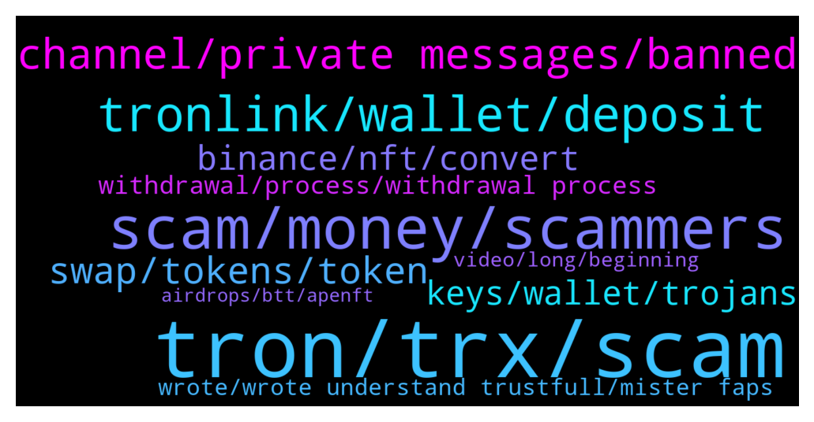

# **@tronnetworkEN**
 ## Analysis for **2022-01-15** - **2022-01-16**.

---

## 📊 **Basic Stats**

**n_messages_sent**: 382

---

---

## 🔝 **Top keywords and related messages**

1. **tron, trx, scam**

    @N/A --- *I was scammed for $400 from a fake Tron site yesterday so any compensation would be welcome here* **--->** [TG Discussion](https://t.me/tronnetworkEN/3835029)

    @simon866 --- *📢 We just keep winning these votes 🤷‍♂️ think its about time everyone realizes how strong the Tron community is 😎  https://twitter.com/VitalikButerin/status/1481738461417672704?t=lbdms9Z7Nm3WEX8ljU4ShA&s=19* **--->** [TG Discussion](https://t.me/tronnetworkEN/3831282)

    @PiterSpain --- *📢 This vote is important for obvious reasons so smash that vote for TRX 👊👊👊  https://twitter.com/VitalikButerin/status/1481738461417672704* **--->** [TG Discussion](https://t.me/tronnetworkEN/3830983)

    @Carlos_TRX --- *but you wouldn't have been able to participate in TRON events for 4 years. 😍 you have to see the positive way mate XD* **--->** [TG Discussion](https://t.me/tronnetworkEN/3832961)

    @agentpiki --- *Make good example of bitcoin.  Bitcoin growth is smaller compared to altcoins (in terms of percentage)  In tron network, tron is the bitcoin and trx family acts as altcoins.* **--->** [TG Discussion](https://t.me/tronnetworkEN/3834789)

    @Moneyversac --- *I could have skipped the last 4 years and start now with TRX, would have made no difference expect I could buy lower now 😂* **--->** [TG Discussion](https://t.me/tronnetworkEN/3832957)

2. **scam, money, scammers**

    @Nguyễn Hưng Phong --- *If you say so cause I know nothing about the scammer or scam format* **--->** [TG Discussion](https://t.me/tronnetworkEN/3832203)

    @agentpiki --- *Maybe pinned message or guardian bot telling that these scam platforms are scams is needed* **--->** [TG Discussion](https://t.me/tronnetworkEN/3833038)

    @Surajzero --- *Scammers are really clever they use their username as admin 😢* **--->** [TG Discussion](https://t.me/tronnetworkEN/3832316)

    @Carlos_TRX --- *Scam, nobody will give you free money* **--->** [TG Discussion](https://t.me/tronnetworkEN/3835403)

    @simon866 --- *Some scam platform that has nothing to do with us 😂* **--->** [TG Discussion](https://t.me/tronnetworkEN/3833033)

    @Carlos_TRX --- *Someone tells you to send him your money that he is going to give you back more, do you find the logic in that?* **--->** [TG Discussion](https://t.me/tronnetworkEN/3832319)

3. **tronlink, wallet, deposit**

    @Certis --- *I used the address Collectibles - APENFT - contact address. Which is listed in my TronLink wallet, it's been about 40 minutes and still nothing has come* **--->** [TG Discussion](https://t.me/tronnetworkEN/3834712)

    @FA --- *Then I clicked on trx and hit deposit* **--->** [TG Discussion](https://t.me/tronnetworkEN/3832019)

    @mada6344 --- *Can i deposit trc20 to tronlink* **--->** [TG Discussion](https://t.me/tronnetworkEN/3835245)

    @FA --- *TronLink wallet. I clicked on trx and hit deposit.* **--->** [TG Discussion](https://t.me/tronnetworkEN/3831932)

    @MilNoslen --- *Not exactly mate, you have to select ERC20 when you deposit into the Tron option* **--->** [TG Discussion](https://t.me/tronnetworkEN/3833713)

    @Zohaib --- *But now it looks like zero in deposit. And 102 TRX is seen elsewhere. There is option to invest then go to 5% option then my balance is visible there.* **--->** [TG Discussion](https://t.me/tronnetworkEN/3831960)

4. **channel, private messages, banned**

    @reallibra12 --- *sir I want to promote my channel* **--->** [TG Discussion](https://t.me/tronnetworkEN/3834698)

    @Zohaib --- *Then how can I send a screenshot so that I can be helped* **--->** [TG Discussion](https://t.me/tronnetworkEN/3831978)

    @agentpiki --- *Only admins and mods can post pictures* **--->** [TG Discussion](https://t.me/tronnetworkEN/3831969)

    @Chandresh --- *But my question is not against all of these* **--->** [TG Discussion](https://t.me/tronnetworkEN/3830800)

    @atsolasuh --- *Why bot use to banned if we use the word    s c a m* **--->** [TG Discussion](https://t.me/tronnetworkEN/3834472)

    @agentpiki --- *@Magnavox_Business keep trolling in channel. You know it is not tolerated* **--->** [TG Discussion](https://t.me/tronnetworkEN/3832018)

5. **swap, tokens, token**

    @taotao2529 --- *Thk, which site is best to swap in your opinion* **--->** [TG Discussion](https://t.me/tronnetworkEN/3831854)

    @Tshi --- *Thank you. My balance is below 100 000. I guess moving the tokens back to the exchange might be a better option* **--->** [TG Discussion](https://t.me/tronnetworkEN/3835084)

    @metacrylic --- *what can i do with jUSDJ tokens ?* **--->** [TG Discussion](https://t.me/tronnetworkEN/3834561)

    @metacrylic --- *Hello Jason i can't restake jUSDJ on any platform ?* **--->** [TG Discussion](https://t.me/tronnetworkEN/3834567)

    @7777777777777777777 --- *How can receive if dont have coin in list?* **--->** [TG Discussion](https://t.me/tronnetworkEN/3835430)

    @Rick --- *yea thats what I figured. Was hoping to find someone directly from the project to do the exchange* **--->** [TG Discussion](https://t.me/tronnetworkEN/3833742)

6. **binance, nft, convert**

    @Rick --- *Hi Jason, I cannot use Binance* **--->** [TG Discussion](https://t.me/tronnetworkEN/3833738)

    @Rick --- *Issue with Binance is its limited to which coumntry they allow you to trade* **--->** [TG Discussion](https://t.me/tronnetworkEN/3833706)

    @Fasoadex --- *Which wallet is the best wallet to shake on because binance wallet rate is too low* **--->** [TG Discussion](https://t.me/tronnetworkEN/3832020)

    @simon866 --- *Yeah currently if you still hold ETH version it is automatically converted on binance* **--->** [TG Discussion](https://t.me/tronnetworkEN/3833692)

    @MilNoslen --- *No, it's only on international Binance. Your best bet is to VPN to somewhere in southeast Asia* **--->** [TG Discussion](https://t.me/tronnetworkEN/3833719)

    @Sambeya --- *I have Freecoin and PAL to convert. Thanks* **--->** [TG Discussion](https://t.me/tronnetworkEN/3831396)

7. **keys, wallet, trojans**

    @Moneyversac --- *If you have your pk on a file on your pc trojans give access to those files as well* **--->** [TG Discussion](https://t.me/tronnetworkEN/3832462)

    @Carlos_TRX --- *then you probably have a trojan, format your device and don't save your keys there again* **--->** [TG Discussion](https://t.me/tronnetworkEN/3832324)

    @Carlos_TRX --- *what I can recommend is that you clean all your devices of viruses and Trojans, create a new wallet and send the funds that you have left there, and do not put your private keys in any device again* **--->** [TG Discussion](https://t.me/tronnetworkEN/3832344)

    @agentpiki --- *Malwares now can hack wallets? 🤣* **--->** [TG Discussion](https://t.me/tronnetworkEN/3832449)

    @agentpiki --- *Well windows security is strong now to detect all 🤣* **--->** [TG Discussion](https://t.me/tronnetworkEN/3832465)

    @Surajzero --- *I stored my secret keys as notepad on my computer and some transffered, i dont know how?* **--->** [TG Discussion](https://t.me/tronnetworkEN/3832322)

8. **withdrawal, process, withdrawal process**

    @agentpiki --- *Plenty of these kinds here, crying for withdraw help. 🤣* **--->** [TG Discussion](https://t.me/tronnetworkEN/3832837)

    @Gurvinder --- *I withdrawal many time from this* **--->** [TG Discussion](https://t.me/tronnetworkEN/3832373)

    @Gurvinder --- *My withdrawal is pending till from yesterday evening* **--->** [TG Discussion](https://t.me/tronnetworkEN/3832345)

    @Mian --- *Why we are not getting our withdrawls?* **--->** [TG Discussion](https://t.me/tronnetworkEN/3832821)

    @Omkar --- *Help me anyone about Tron24 withdrawal process* **--->** [TG Discussion](https://t.me/tronnetworkEN/3831852)

    @Sharmaadarsh --- *Sir aaj withdrawal ku nahi ho raha hai* **--->** [TG Discussion](https://t.me/tronnetworkEN/3834841)

9. **wrote, wrote understand trustfull, mister faps**

    @Surajzero --- *It is really hard then 😢* **--->** [TG Discussion](https://t.me/tronnetworkEN/3832334)

    @FA --- *Agreed ☝️ I messed up too I think* **--->** [TG Discussion](https://t.me/tronnetworkEN/3832048)

    @Tshi --- *Thank you so much. Now i understand* **--->** [TG Discussion](https://t.me/tronnetworkEN/3835092)

    @xPommepote --- *Try to find a trustfull person that can do it for you maybe 🤷🏼‍♂️* **--->** [TG Discussion](https://t.me/tronnetworkEN/3833729)

    @FA --- *Then what did I do? 😆* **--->** [TG Discussion](https://t.me/tronnetworkEN/3832003)

    @Magnavox_Business --- *I'm so sorry, Harold. I didn't mean to.* **--->** [TG Discussion](https://t.me/tronnetworkEN/3832022)

10. **video, long, beginning**

    @Surajzero --- *No sir i never click on that kind of link* **--->** [TG Discussion](https://t.me/tronnetworkEN/3832325)

    @Moneyversac --- *Yesterday I tried to do a quick new Video but there was just sooo many things I could explain that the video was already to long. I ended up deleting it 😅* **--->** [TG Discussion](https://t.me/tronnetworkEN/3835339)

    @TERRIFICZ --- *Hahaha  It's updated now 4 months before it was* **--->** [TG Discussion](https://t.me/tronnetworkEN/3834496)

    @agentpiki --- *Scroll up and read. There is a long post* **--->** [TG Discussion](https://t.me/tronnetworkEN/3834310)

    @Abubakar --- *The  one in home page* **--->** [TG Discussion](https://t.me/tronnetworkEN/3833017)

    @xPommepote --- *Yeah they change it now since the beginning of the year at least for some countries* **--->** [TG Discussion](https://t.me/tronnetworkEN/3833726)

