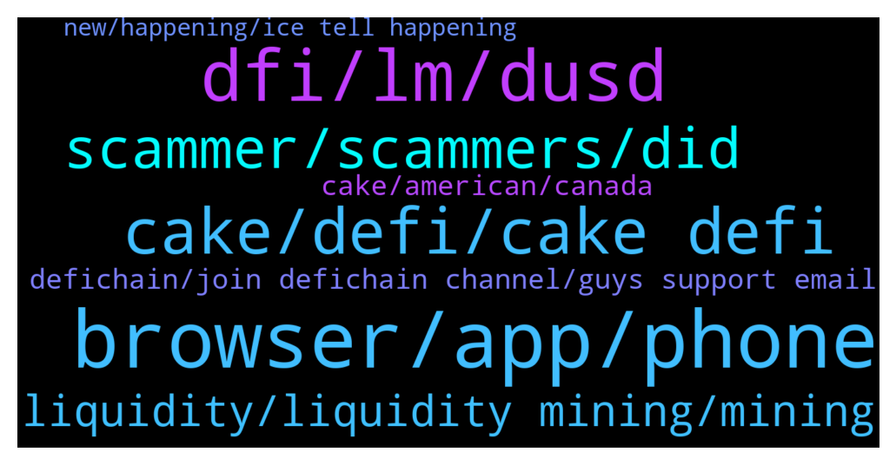

# **@CakeDeFi_EN**
 ## Analysis for **2022-01-16** - **2022-01-17**.

---

## 📊 **Basic Stats**

**n_messages_sent**: 155

---

---

## 🔝 **Top keywords and related messages**

1. **browser, app, phone**

    @Declan999 --- *Yes, I have tried both Chrome and FireFox and cleared caches in both cases.* **--->** [TG Discussion](https://t.me/CakeDeFi_EN/165128)

    @Declan999 --- *Hi. Not able to login to the website nor my smart phone all day today.  Rebooted the phone a few times. Is there any issue with the servers ? Thanks* **--->** [TG Discussion](https://t.me/CakeDeFi_EN/165117)

    @Michael_Schredl --- *Works fine, what error do you get?* **--->** [TG Discussion](https://t.me/CakeDeFi_EN/165118)

    @Cammy2904 --- *The app doesn't work. Or you mean to log through my mobile browser?* **--->** [TG Discussion](https://t.me/CakeDeFi_EN/165158)

    @Kassius84 --- *Or can you try on the mobile website?* **--->** [TG Discussion](https://t.me/CakeDeFi_EN/165157)

    @William --- *Sorry.  I am looking at my “activity” but don’t see “export”* **--->** [TG Discussion](https://t.me/CakeDeFi_EN/165470)

2. **dfi, lm, dusd**

    @rent_e_motion --- *What is better : stacking 2000 usd as dfi or mining with 1000 dusd/ dfi? What are ups and downs of both methods?* **--->** [TG Discussion](https://t.me/CakeDeFi_EN/165652)

    @GK --- *Hi, I've set up a DFI wallet on my desktop. I've also set up a receive address and given it a label. I know this is probably obvious, but if I want to add DFI tokens can I confirm that I now simply use the new receive address for a withdrawal from my cake dfi wallet?* **--->** [TG Discussion](https://t.me/CakeDeFi_EN/165526)

    @busukman --- *Q: lets say total assets worth usd 100, and my rewards is usd1. Does that reward usd1 already included in my total assets worth?* **--->** [TG Discussion](https://t.me/CakeDeFi_EN/165560)

    @ferhat_lorem_ipsum --- *And you get 10 usd worth of dfi* **--->** [TG Discussion](https://t.me/CakeDeFi_EN/165308)

    @Basti_850 --- *Why is DUSD not 1 Dollar? I dont understand* **--->** [TG Discussion](https://t.me/CakeDeFi_EN/165620)

    @DmgBautista --- *It will depend on the tax laws of your country. Currently there is only 4 or 5 crypto friendly countries in the world were crypto is not taxed in any way. I believe you know what will be the answer to your question.   As for the taxes, you'll need to check the laws in you country therefore.   There are countries that do not tax gains if you hold the coins for a year at least (long term), others tax even the act of converting one token into other as a gain. Some tax stacking as income gain just like in fiat money and tax like it, others tax any gain you make like gains in stock markets.   There is so much differences between countries, fruit of the unregulated market in which crypto gets inserted, that is impossible to answer to that question. The only person who can adress that will be yourself with the help of an accountant* **--->** [TG Discussion](https://t.me/CakeDeFi_EN/165347)

3. **cake, defi, cake defi**

    @Nazhadi57 --- *Ah okay. What’s the advantage of cake DeFi over using the DeFi chain DEX itself? They offer similar services right* **--->** [TG Discussion](https://t.me/CakeDeFi_EN/165306)

    @BerndMack --- *there is no 130$ Fee for depositing BTC.* **--->** [TG Discussion](https://t.me/CakeDeFi_EN/165435)

    @fadfunky --- *Hi i got a question regarding on btc withdrawal fees.  Why the cakedefi charge BTC 0.0005 (usd 21) for each withdrawal? While I check on the average transaction fee at ycharts is equal around to usd 1.67  🤔* **--->** [TG Discussion](https://t.me/CakeDeFi_EN/165272)

    @zachgax --- *You know I do have a question about withdrawal fees. Cake charges a fixed withdrawal for each type of coin right. But if I’m executing a DEX swap from cake, it’s a 0.5% fee instead.   Does this mean that if I’m swapping a larger amount of coin where the 0.5% is greater than the fixed withdrawal, it would be cheaper to manually withdraw to the light wallet, then execute the swap myself, then send it back to Cake?* **--->** [TG Discussion](https://t.me/CakeDeFi_EN/165398)

    @Kassius84 --- *As referrer, you will get up to 1% p.a. of the funds, your referral has deposited and allocated to the services on Cake DeFi.* **--->** [TG Discussion](https://t.me/CakeDeFi_EN/165298)

    @William --- *I transferred BTC to cake and was charged $130 for a wallet. I use taxbit to gather automatically my transactions for tax purposes. Their guide says for defi transactions I need to give them my public wallet address. Where do I find that for cake?* **--->** [TG Discussion](https://t.me/CakeDeFi_EN/165431)

4. **scammer, scammers, did**

    @Kassius84 --- *Watch out for scammers which sends you a direct message.* **--->** [TG Discussion](https://t.me/CakeDeFi_EN/165152)

    @William --- *Some guy named Shawn just DM me and called me on my cell phone saying he was from cake support. How did he get my phone number? He could barely speak English.* **--->** [TG Discussion](https://t.me/CakeDeFi_EN/165457)

    @ferhat_lorem_ipsum --- *I did the same and now they are on fire. I usually got 1-2 scammers daily, but today I blocked already almost 20 of them. I might have landed on a scammer list 🤷🏻‍♂️* **--->** [TG Discussion](https://t.me/CakeDeFi_EN/165605)

    @ferhat_lorem_ipsum --- *Tip to everyone: don’t talk back to scammers, just block them.* **--->** [TG Discussion](https://t.me/CakeDeFi_EN/165580)

    @Dionis --- *Good day, sorry there was a misunderstanding, I thought you were a scammer* **--->** [TG Discussion](https://t.me/CakeDeFi_EN/165399)

    @misterpiggie49 --- *It's a scammer, they later DMed me.* **--->** [TG Discussion](https://t.me/CakeDeFi_EN/165223)

5. **liquidity, liquidity mining, mining**

    @TaosBE --- *Hello, anyone got trouble when he wants to add liquidity ? I always got 'price expired' right after confirmation page pops up 😥* **--->** [TG Discussion](https://t.me/CakeDeFi_EN/165487)

    @fadfunky --- *Helo why i dont see my btc at liquidity mining* **--->** [TG Discussion](https://t.me/CakeDeFi_EN/165354)

    @freedfidotcom --- *I like wasting their time - it's a pastime of mine* **--->** [TG Discussion](https://t.me/CakeDeFi_EN/165590)

    @DmgBautista --- *I guess you should take not much to see liquidity shares, the rewards however will take up to something between 12 to 24h kicking in* **--->** [TG Discussion](https://t.me/CakeDeFi_EN/165371)

    @ClarenceChanYJ --- *Yes I'm doing some liquidity mining* **--->** [TG Discussion](https://t.me/CakeDeFi_EN/165261)

    @Susan --- *Is this all about liquidity mining in the wallet?* **--->** [TG Discussion](https://t.me/CakeDeFi_EN/165452)

6. **defichain, join defichain channel, guys support email**

    @rbteixeira7 --- *Hello guys, I need support !!!!! Do you have a email?* **--->** [TG Discussion](https://t.me/CakeDeFi_EN/165669)

    @YSL --- *Pls join defichain channel, moderator in defichain ll be able to assist you   https://t.me/defiblockchain* **--->** [TG Discussion](https://t.me/CakeDeFi_EN/165563)

    @lzy1004 --- *Let me have a look first* **--->** [TG Discussion](https://t.me/CakeDeFi_EN/165559)

    @DmgBautista --- *You can DM me if you dont want to share it here* **--->** [TG Discussion](https://t.me/CakeDeFi_EN/165358)

    @jnskn2210 --- *You can send me those pictures if you don’t mind. I will get them removed* **--->** [TG Discussion](https://t.me/CakeDeFi_EN/165281)

    @TwoDsireCrypto --- *Please keep discussions friendly and on topic* **--->** [TG Discussion](https://t.me/CakeDeFi_EN/165227)

7. **cake, american, canada**

    @BerndMack --- *cake is a company, not a blockchain. At the moment cake supports the following blockchains: Bitcoin, Ethereum, Defichain, Dash, Litecoin, BitcoinCash* **--->** [TG Discussion](https://t.me/CakeDeFi_EN/165443)

    @Dionis --- *Я к вам обращаюсь за помощью с верефикацией на cake I am asking you for help with cake verification* **--->** [TG Discussion](https://t.me/CakeDeFi_EN/165400)

    @moneydelics --- *I’m American too and I talk about Cake on my YouTube channel 😎* **--->** [TG Discussion](https://t.me/CakeDeFi_EN/165218)

    @Helge --- *Can u enroll Cake in Canada?* **--->** [TG Discussion](https://t.me/CakeDeFi_EN/165359)

    @zachgax --- *That’s one of the main reasons to use Cake and why we’re here. 👍* **--->** [TG Discussion](https://t.me/CakeDeFi_EN/165265)

    @misterpiggie49 --- *Yes, I am an American, and Americans can use this platform, so I would assume there are others here too.* **--->** [TG Discussion](https://t.me/CakeDeFi_EN/165215)

