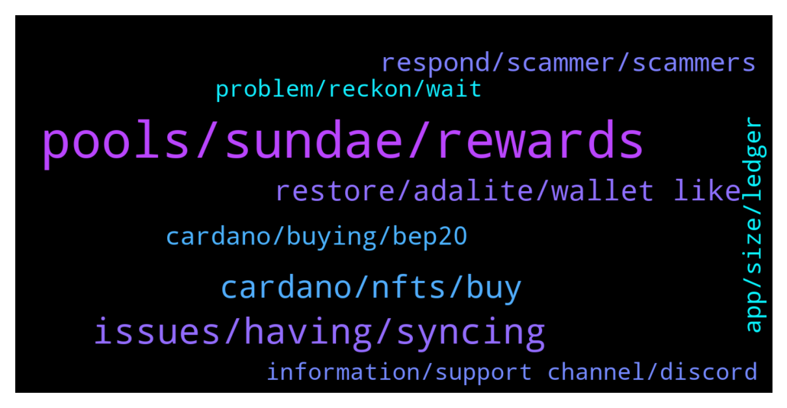

# **@Cardano**
 ## Analysis for **2022-01-16** - **2022-01-17**.

---

## 📊 **Basic Stats**

**n_messages_sent**: 223

---

---

## 🔝 **Top keywords and related messages**

1. **pools, sundae, rewards**

    @TheC --- *To acquire Sundae through ISO participation, can we delegate ADA on Daedalus?* **--->** [TG Discussion](https://t.me/Cardano/769846)

    @glitch04 --- *As long as you are holding an asset that fluctuates it will continue to do so, Unless you are planning to sell all now and wait for that asset to drop and re-buy at a lower price later ada will continue to rise and fall with the markets.  So If you want to take some profit from the holdings you can just send the amount you want to convert to stables to the exchange directly. You may have to claim your rewards first depending on how much that is you want to send over to the exchange.* **--->** [TG Discussion](https://t.me/Cardano/770494)

    @Heather --- *Im confused. Im only wanting to take profits from.my total investment..Once i have done this. I would like to restake.* **--->** [TG Discussion](https://t.me/Cardano/770491)

    @glitch04 --- *If you are completely finished with your investment never to stake again you would want to use the red button when you claim your rewards but be warned this would void your 2 pending epochs of rewards by doing so* **--->** [TG Discussion](https://t.me/Cardano/770486)

    @glitch04 --- *If you are done staking you would claim your rewards so they are part of your balance send them to your choice of exchange then sell them to a stable coin or convert to your preferred currency* **--->** [TG Discussion](https://t.me/Cardano/770483)

    @Heather --- *What Id like to do is take profit from my total investment. Not just my rewards. Do I have to take the rewards from yoroi and then restake. Sorry.. feeling out of my depth.* **--->** [TG Discussion](https://t.me/Cardano/770480)

2. **issues, having, syncing**

    @Heather --- *Thank you so much for that confirmation. I think yproi has had an upgrade so, just soring tbis now..* **--->** [TG Discussion](https://t.me/Cardano/770488)

    @BinK18 --- *yoroi is having synchronization issues- as always* **--->** [TG Discussion](https://t.me/Cardano/769469)

    @glitch04 --- *It's not limited to Yoroi at the epoch transition though* **--->** [TG Discussion](https://t.me/Cardano/769449)

    @awilliams_8 --- *Yeah, I just get an error message saying "Error received from server".. I have contacted Yoroi support and waiting for a reply* **--->** [TG Discussion](https://t.me/Cardano/769961)

    @gauthamnag --- *Any issue Yorio web wallet not syncing at all , trying since 3 hours it keeps rotating simply* **--->** [TG Discussion](https://t.me/Cardano/769675)

    @Sexy_Stacie --- *Is anyone else having problems with Yoroi Wallet and syncing issues?* **--->** [TG Discussion](https://t.me/Cardano/769941)

3. **cardano, nfts, buy**

    @franzxzd --- *What’s most popular ntf on cardano?* **--->** [TG Discussion](https://t.me/Cardano/770334)

    @StigMarshall --- *Where can we buy, and what time will the launch be in New Zealand?* **--->** [TG Discussion](https://t.me/Cardano/770415)

    @the_boxer12 --- *The article explains why Cardano outperform Ethereum. The most decentralized public chain including security is Cardano.  https://cardao.medium.com/why-cardao-chose-cardano-b4f1acc9d188* **--->** [TG Discussion](https://t.me/Cardano/770704)

    @glitch04 --- *Would like to see a multi asset native Cardano wallet that allows you to store multiple different network assets* **--->** [TG Discussion](https://t.me/Cardano/769455)

    @jax1188 --- *And where all these transactions on Cardano coming from?* **--->** [TG Discussion](https://t.me/Cardano/770405)

    @Thghh --- *Where can I buy cardano NFTs?* **--->** [TG Discussion](https://t.me/Cardano/769669)

4. **restore, adalite, wallet like**

    @glitch04 --- *No need to transfer the data is on the block chain not the wallet interface just be careful where you enter those recovery seeds as they are the master key to your wallet* **--->** [TG Discussion](https://t.me/Cardano/770575)

    @Zyroxa --- *You can restore your balance in any other wallet like adalite.io or Typhon.* **--->** [TG Discussion](https://t.me/Cardano/770568)

    @lassikem --- *lol all of my Yoroi wallets have become basically unusable in the past few days.* **--->** [TG Discussion](https://t.me/Cardano/770556)

    @Zyroxa --- *You can also restore your balance on a other wallet like adalite.io if Yoroi has some issues right now.* **--->** [TG Discussion](https://t.me/Cardano/770490)

    @... --- *Hi can you restore a yoroi wallet in to a Nami wallet? Or do you actually have to move funds?* **--->** [TG Discussion](https://t.me/Cardano/770500)

    @Naheem --- *Hi ive got yori wallet i had 706 coins in there then i put in another 700 coins in total over 1400 BUT today i checked wallet it says total 706 again??* **--->** [TG Discussion](https://t.me/Cardano/770600)

5. **respond, scammer, scammers**

    @glitch04 --- *Don't respond to anyone that dm's you acting as support use the channel listed above* **--->** [TG Discussion](https://t.me/Cardano/770562)

    @glitch04 --- *Anyone trying to dm you is a scammer and not support so please block and report those users.* **--->** [TG Discussion](https://t.me/Cardano/770232)

    @Sexy_Stacie --- *Also you all be aware there is a SCAMMER in this group who sent me a direct message and he wanted me to connect my wallet to their website.* **--->** [TG Discussion](https://t.me/Cardano/769971)

    @dmitry_stas --- *do you miss the scammers in DM? :)))* **--->** [TG Discussion](https://t.me/Cardano/769852)

    @glitch04 --- *Don't respond to anyone that dm's you acting like support they are scammers ^- use the channel listed above* **--->** [TG Discussion](https://t.me/Cardano/769678)

    @Tustyrusty --- *You really fell for that?! That's why scammers are out there and will continue to be.* **--->** [TG Discussion](https://t.me/Cardano/769632)

6. **cardano, buying, bep20**

    @MrBrinker --- *Bep20 is not ADA the native currency of Cardano blockchain, it is a token o  Binance Chain. If you want to stake or use any other native Cardano Dapp you need to have native ADA* **--->** [TG Discussion](https://t.me/Cardano/770262)

    @BabyImReckless --- *hey, I'm just wanting to know what the difference between Bep20 and just your standard ADA?  it all benefits ADA?* **--->** [TG Discussion](https://t.me/Cardano/770260)

    @jandr021 --- *Withdraw ADA from coinbase is still disable?* **--->** [TG Discussion](https://t.me/Cardano/769482)

    @xiaohu66772 --- *What is the URL of the ADA chain to view the K-line?* **--->** [TG Discussion](https://t.me/Cardano/769569)

    @lassikem --- *Dunno, got a lot of ada and NFTs ‘locked’ in them.* **--->** [TG Discussion](https://t.me/Cardano/770558)

    @BinK18 --- *Coinbase doesn’t has liquidity for ada!! It happens from time to time on Binance and KuCoin ! With FTM Matic n one* **--->** [TG Discussion](https://t.me/Cardano/769506)

7. **app, size, ledger**

    @TheBigBossK --- *About to buy a hardware wallet.  As Ledger S supports "up to three software apps", does it mean one can hold ADA, BTC, and ETH on it?* **--->** [TG Discussion](https://t.me/Cardano/769607)

    @glitch04 --- *Full node wallets are not recommended unless the hardware can handle them* **--->** [TG Discussion](https://t.me/Cardano/770292)

    @DJKuns --- *In my case, my nano s only support cardano (because of the app size). How much app can be installed depends on its size* **--->** [TG Discussion](https://t.me/Cardano/769614)

    @Apath00 --- *It depends on app size, Ledger S comes with so little memory, i would recommend going for Ledger nano X, and getting maybe S for backup device* **--->** [TG Discussion](https://t.me/Cardano/769613)

    @glitch04 --- *Yes if the apps do not cause the device to run out of space* **--->** [TG Discussion](https://t.me/Cardano/769608)

    @MrBrinker --- *Yes, Daedalus is a full node client so you have a copy of the blockchain, this days you would need at least 16GB RAM to have a good experience* **--->** [TG Discussion](https://t.me/Cardano/770284)

8. **information, support channel, discord**

    @Thghh --- *How comes no-one talks in this chat?* **--->** [TG Discussion](https://t.me/Cardano/769753)

    @glitch04 --- *The best source of information is their support channel on Discord https://discord.gg/YTYqQZnJ* **--->** [TG Discussion](https://t.me/Cardano/770423)

    @djmmts --- *no. you should join their discord here: https://discord.gg/YTYqQZnJ* **--->** [TG Discussion](https://t.me/Cardano/770043)

    @shoemafia --- *At least it’s good information to know* **--->** [TG Discussion](https://t.me/Cardano/770577)

    @Comeonmanyouknowthething --- *is it allowed to share a retweet from Charles ? :D* **--->** [TG Discussion](https://t.me/Cardano/770280)

    @glitch04 --- *The first thing to pay attention to is their profile, they are typically not joined to the same channel as you.* **--->** [TG Discussion](https://t.me/Cardano/769536)

