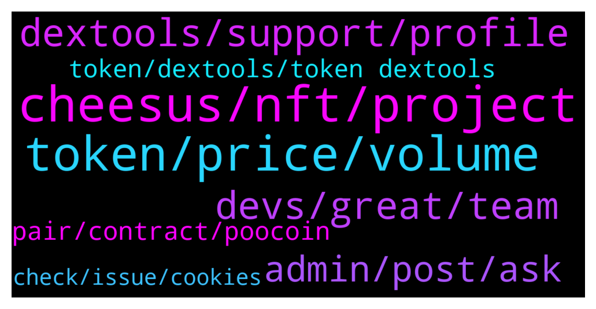

# **@DEXToolsCommunity**
 ## Analysis for **2022-01-15** - **2022-01-17**.

---

## 📊 **Basic Stats**

**n_messages_sent**: 409

---

---

## 🔝 **Top keywords and related messages**

1. **cheesus, nft, project**

    @Natalia_Ave --- *well it depends on feature itself  Main things we’ve done already: - Beta tools launch on https://cheesus.ai/en  - Analyzed Uniswap and Pancakeswap Trading activity https://uniswap.defirating.finance/  - list of the most profitable wallets trading on Uni & Pancake - list of the most tradable tokens on Uni & Pancake - DeFi & NFT projects report https://888defi.biz/crypto/  - NFT Holders report  - Token - token holders report for ETH, BSC, Avalanche and Polygon  - Profit - tracking all trading history on ETH and BSC networks  - NFT market data for all NFT projects on Opensea with inside information - Flippers - report of Flippers and Diamond Hands (real holders) ETH, BSC, Avalanche, Polygon tokens - Avalanche and Polygon expansion  - NFT Metaverse tracker   Our long term plans are quite simple:  1. Expanding on other blockchains: Solana, Polkadot, Kusama  2. Implementing new features: Tax calculation, Bridge analytics, more DEXes to track more projects and data to review. 3. Updating current features   it's all for Q1-Q2 2022!  done* **--->** [TG Discussion](https://t.me/DEXToolsCommunity/326073)

    @xbtwael --- *I saw Cheesus launched  https://cheesus.ai/en/main can you share what that is?* **--->** [TG Discussion](https://t.me/DEXToolsCommunity/326058)

    @Natalia_Ave --- *well the first to test and to launch some features was Ethereum network  Then it's Binance Smart Chain like step 2  but next is more various way to choose next network, so we took 2 Avalanche and Polygon due to their development and trading volume.  Off course we want to take Solana next in terms of NFT Metaverses and more EVM compatible chains  done* **--->** [TG Discussion](https://t.me/DEXToolsCommunity/326077)

    @Natalia_Ave --- *we outperform with help of 2 points:   The first one is for NFT Metaverse Tracker  This unique feature opens unlimited access to the truth about any NFT metaverse! Choose the best NFT projects to follow, discover fake NFT wallets, market makers and pumpers and, find projects with live communities. Dive into NFT metaverses, take a look to see in-depth data and understand where any particular metaverse is headed.  and as for Onchain Truth  This feature gives you access to things that are hidden in blockchain in form of reports for  - Flippers and Diamond hands  - The most profitable wallets  - Gem tokens  - Insider, fake wallets  done* **--->** [TG Discussion](https://t.me/DEXToolsCommunity/326069)

    @Natalia_Ave --- *Cheesus provides pure data and objective metrics to give you onchain truth, but we don't give you any financial advices or fully ensure security of any project  So metrics for every project includes: - project profit and loss  - different types of holders e.g. traders, who bring life by selling and buying tokens, holders, who just hold tokens, do nothing with them, freeloaders who receive tokens by airdrop or any free distribution. Moreover we can track bots and fake wallets who pump prices and increase trading volume.  These data show how active the project are and you can conclude whether the project is worth investing in.  done* **--->** [TG Discussion](https://t.me/DEXToolsCommunity/326087)

    @Natalia_Ave --- *Right! TGE is scheduled on 20 January and let's look through utilities  Paying for API access - our API is open and you can create your own applications and tools using our data and pay for it with the Cheesus token.  Paying for subscriptions  We are making 5 types of subscription where one of them is fully free.  As I've mentioned before MVPs are ready to use and some features are available.  According to our subscription system you'll need fixed amount of tokens to get access to expanded features including copytrading bot, VIP chat, API access and others.   Staking/Farmig token rewards   Data mining rewards + DAO governance  For this purpose we've made an achievement system, where it is users who decide to give achievement or not! Also you can create new ones.  For example they are: best researcher, best NFT researcher, best language localizator, project auditor.   and as we are launching soon, we prepared some perks for users!  Unlimited access to Cheesus’ premium services Access to private airdrops A passkey to NFT drops Bonuses when using Strong & Weak Hands staking A subscription to weekly newsletters with project reviews Access to a closed Discord channel with insider info Private Diamond Hands & Flippers report  done* **--->** [TG Discussion](https://t.me/DEXToolsCommunity/326064)

2. **token, price, volume**

    @Uturn --- *One more question, regards to the price alert feature, is there a way that Dev team can create a one reactivate button to reactivate all the price alert within one token? It’s really a hassle to reactivate one by one for just one token.* **--->** [TG Discussion](https://t.me/DEXToolsCommunity/325572)

    @nate102 --- *https://www.dextools.io/app/ether/pair-explorer/0x98858a67b3975903b0e77ced4831105262aa7aa0 same story with this one also, however only third and fourth 1 minute candles. (About 200k volume in those 2 candles total and chart makes it appear like theres been 0 volume haha)* **--->** [TG Discussion](https://t.me/DEXToolsCommunity/324627)

    @murej3 --- *Admin please I want to to trend my token on your website* **--->** [TG Discussion](https://t.me/DEXToolsCommunity/325066)

    @grathius --- *Guys, do you know any sites/platforms/applications/scripts/bots/portfolio trackers, etc., where you can watch tokens in this format? if there are resources with changes over the last 2, 3, 4, 5 hours, then it’s generally ideal* **--->** [TG Discussion](https://t.me/DEXToolsCommunity/325346)

    @JoeyDieleman --- *Please give the contract of the token.* **--->** [TG Discussion](https://t.me/DEXToolsCommunity/325986)

    @vururaffetmez --- *It was alive there many big eth buys* **--->** [TG Discussion](https://t.me/DEXToolsCommunity/326025)

3. **devs, great, team**

    @bastardganpunk --- *yes, any bugs are great if you report them, that the devs can fix them* **--->** [TG Discussion](https://t.me/DEXToolsCommunity/324624)

    @bastardganpunk --- *thank you, the devs are on it 🙂* **--->** [TG Discussion](https://t.me/DEXToolsCommunity/324634)

    @bastardganpunk --- *devs are checking… something is not correct here 😄* **--->** [TG Discussion](https://t.me/DEXToolsCommunity/324612)

    @Olliver --- *Okey thanks!! :D How do i get in contact with real support then haha* **--->** [TG Discussion](https://t.me/DEXToolsCommunity/325653)

    @xbtwael --- *Hey @Natalia_Ave, its a pleasure to have you here! Can you introduce your self?* **--->** [TG Discussion](https://t.me/DEXToolsCommunity/326048)

    @kemosabemontoya --- *I see you have Fantom and Cronos live! Great Updates team!* **--->** [TG Discussion](https://t.me/DEXToolsCommunity/325812)

4. **dextools, support, profile**

    @Natalia_Ave --- *To be honest DEXtools was one of things for my personal inspiration, especially your UI. There so many sources of info, things in one place and they don't seem like mess, but matches perfectly!   Future of DeFi is very hard to predict, but I believe that step by step DeFi will enter our daily routine in different ways!  done* **--->** [TG Discussion](https://t.me/DEXToolsCommunity/326110)

    @fiesta_0604 --- *How to turn off dextools chart, thanks!* **--->** [TG Discussion](https://t.me/DEXToolsCommunity/325229)

    @xbtwael --- *Thanks for all the time you gave us today!!!! I have 2 questions to wrap all this up. What do you think about DEXTools? And the future of DeFi?* **--->** [TG Discussion](https://t.me/DEXToolsCommunity/326107)

    @Olliver --- *The DEXTools community support profile sent me this link is it from dextools or a fake one?* **--->** [TG Discussion](https://t.me/DEXToolsCommunity/325645)

    @KevinSchmidt --- *Last year I bought dext and forgot about it. It looks like it may have migrated since then. Am I still eligible to get the new version?* **--->** [TG Discussion](https://t.me/DEXToolsCommunity/325040)

    @Kris --- *Those listing on Dext, too many are rug pull. Would be good if you can come up with some system to minimize it. Please !!!!!!!* **--->** [TG Discussion](https://t.me/DEXToolsCommunity/325418)

5. **admin, post, ask**

    @INF_king --- *Ok i can't post links I'll give the contract address 0x22F91a81c850994523b5c16bB42365b88ba47B40* **--->** [TG Discussion](https://t.me/DEXToolsCommunity/325756)

    @stanes --- *Hi, what is the contract address?* **--->** [TG Discussion](https://t.me/DEXToolsCommunity/324800)

    @bastardganpunk --- *what do you mean by that, can you be more specific please?* **--->** [TG Discussion](https://t.me/DEXToolsCommunity/325231)

    @bastardganpunk --- *i think you mean this one? https://www.dextools.io/app/bsc/pair-explorer/0x84d75c398ea09fa8f2b803d6b4b0cdea148e5e9c* **--->** [TG Discussion](https://t.me/DEXToolsCommunity/324827)

    @hmk18990 --- *no, he means you need to post https://t.me/DEXTtraderslounge* **--->** [TG Discussion](https://t.me/DEXToolsCommunity/324956)

    @DODZILLA_CN --- *i want to ask a question* **--->** [TG Discussion](https://t.me/DEXToolsCommunity/325697)

6. **pair, contract, poocoin**

    @Ri_maxy --- *I know this might sound dumb but please, where to I see the pair explorer?* **--->** [TG Discussion](https://t.me/DEXToolsCommunity/325912)

    @stanes --- *DEXT UNISWAP PAIR Chart and trade: https://www.dextools.io/app/uniswap/pair-explorer/0xa29fe6ef9592b5d408cca961d0fb9b1faf497d6d Contract: 0xfb7b4564402e5500db5bb6d63ae671302777c75a  DEXT PANCAKESWAP PAIR Chart and trade: https://www.dextools.io/app/pancakeswap/pair-explorer/0x4b729d5d871057f3a9c424792729217cde72410d Contract: 0xe91a8d2c584ca93c7405f15c22cdfe53c29896e3* **--->** [TG Discussion](https://t.me/DEXToolsCommunity/325009)

    @bastardganpunk --- *this pair has just not been traded* **--->** [TG Discussion](https://t.me/DEXToolsCommunity/324631)

    @stanes --- *Ok, thanks, any specific pair? I don't see any pb with some random ones.* **--->** [TG Discussion](https://t.me/DEXToolsCommunity/324803)

    @stanes --- *When you are on a pair page it's the pair explorer. https://www.dextools.io/app/ether/pair-explorer/* **--->** [TG Discussion](https://t.me/DEXToolsCommunity/325914)

    @rpoole69 --- *Last time @napascual said they had to restart a backend server and it was updating, bsc/pair-explorer/0x88c9bf5e334e2591c6a866d5e20683e31226be3d and https://www.dextools.io/app/bsc/pair-explorer/0x1c183b23e8d7a8d287606364f741ddbdafec28de were the 2 I was monitoring* **--->** [TG Discussion](https://t.me/DEXToolsCommunity/324808)

7. **token, dextools, token dextools**

    @DEXTOOLS34 --- *I want to trend my token on dextools who can I pm* **--->** [TG Discussion](https://t.me/DEXToolsCommunity/324559)

    @binarygru --- *Can anyone help me here. I want to subscribe to DexTools standard plan to get Telegram alerts for some coin pairs* **--->** [TG Discussion](https://t.me/DEXToolsCommunity/325004)

    @Gaex99 --- *Hello guys, sorry for the question, but what does the trend of a token on dextools depend on?* **--->** [TG Discussion](https://t.me/DEXToolsCommunity/325505)

    @bastardganpunk --- *you should contact the support from this token. this is dextools support 🙂* **--->** [TG Discussion](https://t.me/DEXToolsCommunity/325672)

    @Rob --- *My tokens dex listing has the wrong TG link attached* **--->** [TG Discussion](https://t.me/DEXToolsCommunity/325032)

    @DonSquid --- *How do i add socials for my coin on Dextool profile ?* **--->** [TG Discussion](https://t.me/DEXToolsCommunity/325475)

