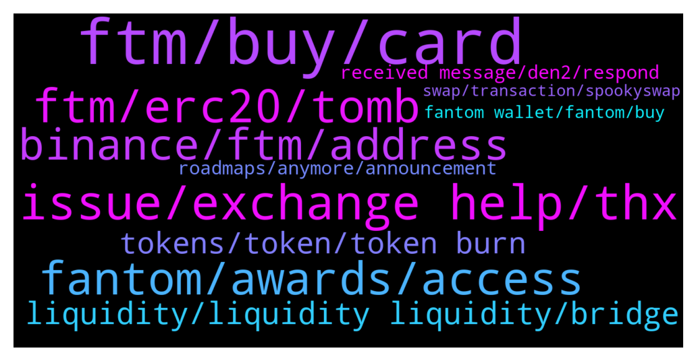

# **@Fantom_English**
 ## Analysis for **2022-01-16** - **2022-01-17**.

---

## 📊 **Basic Stats**

**n_messages_sent**: 508

---

---

## 🔝 **Top keywords and related messages**

1. **ftm, buy, card**

    @theblokchainbaker --- *FTM will be a One Hundred D0ll3r coin soon* **--->** [TG Discussion](https://t.me/Fantom_English/631990)

    @tomorrowsbread --- *Is FTM gonna keep on dipping? I want to buy at a good entry* **--->** [TG Discussion](https://t.me/Fantom_English/633950)

    @theblokchainbaker --- *But I can Ftm is beautiful I can't say Ftm 1 0 0* **--->** [TG Discussion](https://t.me/Fantom_English/632473)

    @JustinBouchure --- *What is the rule here? Are we allowed to talk about FTM price?* **--->** [TG Discussion](https://t.me/Fantom_English/633711)

    @Michael --- *Good evening everyone. Can anyone give me an estimate of gas fees for moving ftm to my ftm wallet?* **--->** [TG Discussion](https://t.me/Fantom_English/632984)

    @theblokchainbaker --- *Market cap is an illusion. It's not real. The only thing seperating real from fake is your belief. FTM is what will propel financially independence to the future, the concept, the action, the future. Either hop in the bus or walk to your mc Donald's shift in the snow uphill 6 miles. Hello sir welcome to mc Donald's can I take your order* **--->** [TG Discussion](https://t.me/Fantom_English/631997)

2. **issue, exchange help, thx**

    @hansolowalker --- *Thanks for looking into my problem though, i appreciate it.* **--->** [TG Discussion](https://t.me/Fantom_English/633904)

    @Mcjig --- *then i dont need to know* **--->** [TG Discussion](https://t.me/Fantom_English/633357)

    @zenkert --- *I hope you will get your issue solved 🙏* **--->** [TG Discussion](https://t.me/Fantom_English/634021)

    @hansolowalker --- *THANK YOU SOO MUCH, I'm freaking out!!!* **--->** [TG Discussion](https://t.me/Fantom_English/633871)

    @Ewajwz --- *No i think thats about it hope the team looking in to it can fix the problem for you 🤞* **--->** [TG Discussion](https://t.me/Fantom_English/632275)

    @wkaplan --- *Ok that’s what I was concerned about!  Thx* **--->** [TG Discussion](https://t.me/Fantom_English/632641)

3. **ftm, erc20, tomb**

    @Crypt22 --- *So, how do I get my erc20 ftm* **--->** [TG Discussion](https://t.me/Fantom_English/632869)

    @Zemmie --- *any us exchange sell ftm on the ftm chain?* **--->** [TG Discussion](https://t.me/Fantom_English/632137)

    @wealth24x7 --- *apologies if this has been asked before. I would like to stake FTM in the native wallet. FWallet only accepts Opera, not ERC20. I have FTM on an exchange which only sends using ERC20.   Does anyone know of an exchange which accepts both, so I can send FTM using ERC20 to the exchange and then transfer it off using Opera?  Is there a better way to do this?* **--->** [TG Discussion](https://t.me/Fantom_English/633519)

    @GASSadiq --- *Please where can I get Ftm contract address I want to transfer my Ftm to my new wallet from an exchange and I can’t find the Ftm opera address?* **--->** [TG Discussion](https://t.me/Fantom_English/632457)

    @Rico --- *hi, i'm on tomb finance trying to stale TOMB-FTM LP but it does not seem possible, or am i missing smth ?* **--->** [TG Discussion](https://t.me/Fantom_English/632482)

    @Mcjig --- *are you using rpc.ftm.tools as your rpc url* **--->** [TG Discussion](https://t.me/Fantom_English/632590)

4. **fantom, awards, access**

    @Hnefatafl --- *Where i can find Fantom roadmap?* **--->** [TG Discussion](https://t.me/Fantom_English/632403)

    @Joe --- *Which platform is the fantom launch site  And how can you have access to the idos* **--->** [TG Discussion](https://t.me/Fantom_English/633716)

    @M --- *Don’t answer them bro. Fantom will never call anyone* **--->** [TG Discussion](https://t.me/Fantom_English/632513)

    @samsamna --- *Hi,are you admin on fantom tg?* **--->** [TG Discussion](https://t.me/Fantom_English/632551)

    @Crypt22 --- *So, the fantom mainnet address is not an erc20? Also, when I access my mainnet wallet, erc20 is greyed out.* **--->** [TG Discussion](https://t.me/Fantom_English/632862)

    @tifa1001 --- *Is there something happening this week for fantom?* **--->** [TG Discussion](https://t.me/Fantom_English/632721)

5. **binance, ftm, address**

    @Connor --- *Any UK guys have a decent way to buy FTM now that Binance blocks most bank accounts? I’ve sold a big chunk of shares and the 4% + that KuCoin charges is too high. Any advice appreciated* **--->** [TG Discussion](https://t.me/Fantom_English/633908)

    @pajamasfreak --- *There is nothing we could as it is a custodian wallet owned by Binance. We have no control on users’ wallets..* **--->** [TG Discussion](https://t.me/Fantom_English/633750)

    @Lucy_hill --- *Hi Everyone Hope you're all well.  I have made quite a major error with a substantial amount of FTM - and I am really hoping someone can help.  I sent FTM from Binance on FTM, to a friends exchange wallet - but the address he gave was for USDT and network Bep20. Also the exchange I sent to doesn't support FTM. Unsurprisingly, he hasn't received the FTM.  The transfer completed. And the transaction ID looks as though its an exchange - as the coins were moved out shortly after. And there are a lot of transactions linked to the destination address. I have contacted his  exchange (I also have an account with them) and they have their technical team looking into it... Anything else I can do?* **--->** [TG Discussion](https://t.me/Fantom_English/632268)

    @Kekcatt --- *Unusual buying activity alert on FTM binance. whales playing.* **--->** [TG Discussion](https://t.me/Fantom_English/632332)

    @Paul --- *Hi guys when did binance list ftm* **--->** [TG Discussion](https://t.me/Fantom_English/632508)

    @Mcjig --- *binance non us listed ftm a long time ago at least 2 years* **--->** [TG Discussion](https://t.me/Fantom_English/632520)

6. **liquidity, liquidity liquidity, bridge**

    @Mcjig --- *yes https://app.multichain.org/#/pool you can look at the pools for liquidity for what token you want to bridge* **--->** [TG Discussion](https://t.me/Fantom_English/632634)

    @Mcjig --- *your funds are safe/ your waiting on liquidity/ when there is liquidity then all transactions will start going thru* **--->** [TG Discussion](https://t.me/Fantom_English/631885)

    @retiredcoin --- *Thank you I'm finding this post https://www.reddit.com/r/FantomFoundation/comments/qstd1u/multichainxyz_bridging_erc20_ftm_to_opera_mainnet/ and it just has me worried so much.. why is there a liquidity problem at all to start with? Would you know how long it would take to complete?  Thank you for the reply 🙏* **--->** [TG Discussion](https://t.me/Fantom_English/631886)

    @wkaplan --- *Hi admin - who can help me with a bridge liquidity issue* **--->** [TG Discussion](https://t.me/Fantom_English/632606)

    @Fantom Foundation --- *Is liquidity low for all tokens? for example if i now wanted to bridge some ICE from ETH to Fantom would that be the same story?* **--->** [TG Discussion](https://t.me/Fantom_English/631942)

    @pajamasfreak --- *Multichain might be cheap enough but do check on pool/liquidity before you bridge any asset over* **--->** [TG Discussion](https://t.me/Fantom_English/633595)

7. **tokens, token, token burn**

    @slickrick6 --- *Proper FUSD will be released in Q1. You will be able to swap for new token pegged 1:1* **--->** [TG Discussion](https://t.me/Fantom_English/633907)

    @Janevietani --- *If you have ever approved any of these 6 tokens, pls log in https://app.multichain.org/#/approvals asap to revoke the approvals, otherwise, your assets are at risk.* **--->** [TG Discussion](https://t.me/Fantom_English/634067)

    @Vlad Vasyl --- *yes but what are they doing against this problem there are other poeple who stucked in sum 500000 tokens* **--->** [TG Discussion](https://t.me/Fantom_English/632777)

    @hansolowalker --- *@Johnnyfantom I hear Proper FUSD will be released in Q1. You will be able to swap for new token pegged 1:1, was there an official announcement for this? Did you look into my issue? thnxx* **--->** [TG Discussion](https://t.me/Fantom_English/633959)

    @dylansmi --- *yes my tokens are on erc20 L1* **--->** [TG Discussion](https://t.me/Fantom_English/633260)

    @Abdulsalam --- *Is there any possibility for token burn???* **--->** [TG Discussion](https://t.me/Fantom_English/633199)

8. **roadmaps, anymore, announcement**

    @wkaplan --- *How can I get more info on this?* **--->** [TG Discussion](https://t.me/Fantom_English/632627)

    @Littlesanchez --- *Hello, anyone can tell me about ve(3,3) Andre Tweeted about it.* **--->** [TG Discussion](https://t.me/Fantom_English/633517)

    @Mcjig --- *just check out those links and ask around* **--->** [TG Discussion](https://t.me/Fantom_English/633208)

    @Craze33 --- *Can you help me with the names* **--->** [TG Discussion](https://t.me/Fantom_English/633176)

    @Crypt22 --- *I thought they were in myetherwallet years ago but can’t find them* **--->** [TG Discussion](https://t.me/Fantom_English/632823)

    @hansolowalker --- *Was there an announcement about this, can i read about it?* **--->** [TG Discussion](https://t.me/Fantom_English/633914)

9. **received message, den2, respond**

    @Jake_H65 --- *Can you check my DM?  Appreciated!* **--->** [TG Discussion](https://t.me/Fantom_English/634120)

    @JC --- *When i join this group, there are more than 6 DMs me.. impersonation* **--->** [TG Discussion](https://t.me/Fantom_English/633591)

    @HQ --- *Can I dm you? Or must my question be asked here* **--->** [TG Discussion](https://t.me/Fantom_English/633458)

    @Crypt22 --- *Stop DM me. Respond to me in the chat, please!* **--->** [TG Discussion](https://t.me/Fantom_English/632843)

    @Lis --- *No DMs please.  I do not respond.* **--->** [TG Discussion](https://t.me/Fantom_English/632671)

    @MoneycapBr --- *I received a message about 5 scans in dm...* **--->** [TG Discussion](https://t.me/Fantom_English/632063)

10. **fantom wallet, fantom, buy**

    @Loggo --- *Hi any suggestion on the best fantom wallet? Not cold wallet pls🙏. Thank you😊* **--->** [TG Discussion](https://t.me/Fantom_English/633432)

    @javadi1998 --- *where is the best place to do a presale/ buy for new fantom tokens* **--->** [TG Discussion](https://t.me/Fantom_English/633203)

    @Loggo --- *Sorry for noob question, so I can buy and store all the fantom based tokens on any of the fantom wallet right?* **--->** [TG Discussion](https://t.me/Fantom_English/633436)

    @levison007 --- *Where can i find fantom wallet?* **--->** [TG Discussion](https://t.me/Fantom_English/633113)

    @Sebonacci --- *But how could it be with 2 wallets and only on fantom ?* **--->** [TG Discussion](https://t.me/Fantom_English/633079)

    @Vickytara --- *How to buy and sell in fantom ecosystem* **--->** [TG Discussion](https://t.me/Fantom_English/634109)

