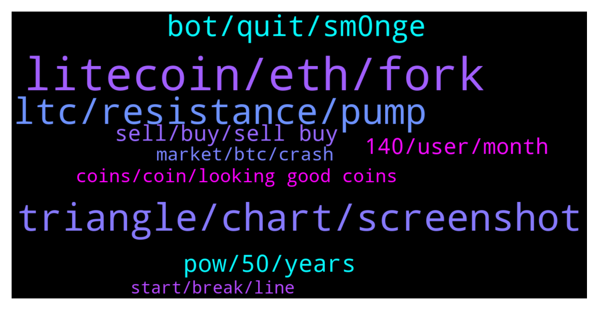

# **@Litecoin**
 ## Analysis for **2022-01-16** - **2022-01-17**.

---

## 📊 **Basic Stats**

**n_messages_sent**: 252

---

---

## 🔝 **Top keywords and related messages**

1. **litecoin, eth, fork**

    @BennyBennyBlanco --- *LItecoin lacks development. Very slow, while other projects are more ahead* **--->** [TG Discussion](https://t.me/Litecoin/2048188)

    @arnego2 --- *Any proof or is it just your statement? Look up the header and see what Litecoin is doing.* **--->** [TG Discussion](https://t.me/Litecoin/2048191)

    @Macro5674 --- *And I heard litecoin the 3rd largest transferred coin out there ! So people are indeed using it as as payments and means of exchange and moving money ! But I think people just not using as store value yet and so the price more of less stable 🤔i think !* **--->** [TG Discussion](https://t.me/Litecoin/2048259)

    @arnego2 --- *Technically Litecoin is more up-to-date than most other coins, even Bitcoin* **--->** [TG Discussion](https://t.me/Litecoin/2048186)

    @Macro5674 --- *But litecoin.com says its can ! https://litecoin.com/en/news/litecoin-smart-contracts-daos-tokenised-assets-and-nfts-are-here ! This kind of marketing then creates alot 😕 confusion then !* **--->** [TG Discussion](https://t.me/Litecoin/2048274)

    @ryanswright --- *Moving money with Litecoin is a great use case. Me and the boys use it for such a purpose and more. MWEB is what we've all been waiting for.* **--->** [TG Discussion](https://t.me/Litecoin/2048627)

2. **triangle, chart, screenshot**

    @professional --- *I’m looking right now and can’t find a descending triangle* **--->** [TG Discussion](https://t.me/Litecoin/2048563)

    @professional --- *Check it on your chart and screenshot* **--->** [TG Discussion](https://t.me/Litecoin/2048595)

    @arnego2 --- *A statement is not a proof. Nor is YouTube* **--->** [TG Discussion](https://t.me/Litecoin/2048201)

    @professional --- *I’m watching chart and no triangle is there , i mean it’s not triangle* **--->** [TG Discussion](https://t.me/Litecoin/2048571)

    @jrx486 --- *You said you give false info here on purpose* **--->** [TG Discussion](https://t.me/Litecoin/2048576)

    @jrx486 --- *That’s a descending triangle, mr professional* **--->** [TG Discussion](https://t.me/Litecoin/2048555)

3. **ltc, resistance, pump**

    @TonyNakamoto --- *r don't think LTC is gonna go PoS anytime s00n if eBer* **--->** [TG Discussion](https://t.me/Litecoin/2048230)

    @K_arlso_n --- *long, long, long LTC we go to the 500* **--->** [TG Discussion](https://t.me/Litecoin/2048129)

    @雜 --- *Can ltc be used for smart contract ?* **--->** [TG Discussion](https://t.me/Litecoin/2048264)

    @jrx486 --- *today is the first day of ltcbtc trend reversal* **--->** [TG Discussion](https://t.me/Litecoin/2048710)

    @jrx486 --- *LTCBTC right now looks a lot loge DOGEBTC a year ago* **--->** [TG Discussion](https://t.me/Litecoin/2048644)

    @jrx486 --- *Let assume there isn’t one. So the resistance line there does not exist then? One so many people are talking about? Ltcbtc has not been declining against the same line for years? Maybe crypto doesn’t exist too then?* **--->** [TG Discussion](https://t.me/Litecoin/2048592)

4. **bot, quit, sm0nge**

    @jrx486 --- *my bot bought back too. (not selling the bot or any service btw) 🚀🚀🚀* **--->** [TG Discussion](https://t.me/Litecoin/2048525)

    @TonyNakamoto --- *but if u addict 2 real cigar00t they do nothing 4 u, neeB sm0nge the whole pack* **--->** [TG Discussion](https://t.me/Litecoin/2047870)

    @TonyNakamoto --- *bih cost, ppl all aware of de health effects, can't sm0nge anywhere anym0re* **--->** [TG Discussion](https://t.me/Litecoin/2047876)

    @TonyNakamoto --- *harB 2 quit, eBen harBer 2 stay quit'd* **--->** [TG Discussion](https://t.me/Litecoin/2047851)

    @TonyNakamoto --- *dey hev 'Americam Spirit' cigar00t here* **--->** [TG Discussion](https://t.me/Litecoin/2047868)

    @TonyNakamoto --- *just tobacc0 without all de chemicals n shit* **--->** [TG Discussion](https://t.me/Litecoin/2047869)

5. **pow, 50, years**

    @Zer0fact0r --- *Anything can happen in 50 years. We won't be around to see whose right. I think there will be another attempt to fork btc in the future.* **--->** [TG Discussion](https://t.me/Litecoin/2048522)

    @morningzone --- *Without PoW it's not Bitcoin anymore.* **--->** [TG Discussion](https://t.me/Litecoin/2048500)

    @trustbtc --- *And when will it finally be activated?* **--->** [TG Discussion](https://t.me/Litecoin/2048286)

    @Macro5674 --- *But pow is switching to renewable source at great pace and POS is less secure than POW as it needs far less capital to 51%  attack !* **--->** [TG Discussion](https://t.me/Litecoin/2048458)

    @morningzone --- *Doesn't matter when it would happen. Today or in 50 years.* **--->** [TG Discussion](https://t.me/Litecoin/2048524)

    @Zer0fact0r --- *I think BTC will eventually switch out of pow. Maybe in 50-100 years. It's makes no sense to continue pow at the tailend of the emission.* **--->** [TG Discussion](https://t.me/Litecoin/2048456)

6. **140, user, month**

    @BennyBennyBlanco --- *I been here longer than u. So I know what’s happening here* **--->** [TG Discussion](https://t.me/Litecoin/2048203)

    @TonyNakamoto --- *MumbleGrumble coming within 2x weeks r guess* **--->** [TG Discussion](https://t.me/Litecoin/2048302)

    @Ben --- *All in for how long? 140 secs? 140 mins? 140 days? Or 140 weeks? 🤔* **--->** [TG Discussion](https://t.me/Litecoin/2048150)

    @arnego2 --- *What's the difference between a user of 3 years and a user of 1 month? More value in .....* **--->** [TG Discussion](https://t.me/Litecoin/2048206)

    @TonyNakamoto --- *mayB get 1x 6-pack per month or sth* **--->** [TG Discussion](https://t.me/Litecoin/2047839)

    @Tiger --- *Are u enjoying ur life now?* **--->** [TG Discussion](https://t.me/Litecoin/2048685)

7. **sell, buy, sell buy**

    @ck42069 --- *U sell and buy at lower price* **--->** [TG Discussion](https://t.me/Litecoin/2048373)

    @ck42069 --- *If you panic solded the 290 to 200 drop and loaded within the past two weeks then u good* **--->** [TG Discussion](https://t.me/Litecoin/2048378)

    @shahabszd --- *Sell know and buy to 600$ after a month))* **--->** [TG Discussion](https://t.me/Litecoin/2048308)

    @BennyBennyBlanco --- *If I had the chance when it was $90!from 2019 should of bought* **--->** [TG Discussion](https://t.me/Litecoin/2048211)

    @🔺ᬼ⃝ℝ🔺 --- *We can't see that I just wait 300$* **--->** [TG Discussion](https://t.me/Litecoin/2048067)

    @jericho2411 --- *wold bought just for fun none..* **--->** [TG Discussion](https://t.me/Litecoin/2047922)

8. **coins, coin, looking good coins**

    @professional --- *I’m looking for good coins for investment* **--->** [TG Discussion](https://t.me/Litecoin/2048159)

    @Mary --- *I came seen a crypto fantasy coin that I'd like to follow, everything is in the game* **--->** [TG Discussion](https://t.me/Litecoin/2048639)

    @jrx486 --- *for a coin with so many active addresses compared to other coins* **--->** [TG Discussion](https://t.me/Litecoin/2048634)

    @jrx486 --- *There are many trolls and no-coiners here* **--->** [TG Discussion](https://t.me/Litecoin/2048544)

    @Macro5674 --- *When coins really pump top 3 positions is so simple !* **--->** [TG Discussion](https://t.me/Litecoin/2048494)

    @jrx486 --- *you can't compare these coins. totally different use case.* **--->** [TG Discussion](https://t.me/Litecoin/2048675)

9. **market, btc, crash**

    @professional --- *Maybe eth is new Btc and Ada is new LTC* **--->** [TG Discussion](https://t.me/Litecoin/2048671)

    @ck42069 --- *I think btc crash will trigger the ratio breakout* **--->** [TG Discussion](https://t.me/Litecoin/2048566)

    @ck42069 --- *I think btc bear market is confirmed* **--->** [TG Discussion](https://t.me/Litecoin/2048380)

    @z323791 --- *whole Crypto market is down except ADA FTM and BNB it will pickup as soon as BTC price rise. we are in 🐻market* **--->** [TG Discussion](https://t.me/Litecoin/2048320)

    @arnego2 --- *Wait when those NFT come crashing down* **--->** [TG Discussion](https://t.me/Litecoin/2048210)

    @rakshithkulal412 --- *Crypto market will crash in coming weeks because February 1 is indian budget so crypto bill will be released so that day crypto market will crash above 10% and also pakisthan are going to ban crypto as well* **--->** [TG Discussion](https://t.me/Litecoin/2048499)

10. **start, break, line**

    @professional --- *So check yourself and you will get still didn’t break the line* **--->** [TG Discussion](https://t.me/Litecoin/2048599)

    @professional --- *If break this line It will start ranging* **--->** [TG Discussion](https://t.me/Litecoin/2048613)

    @professional --- *If break one of the lines Price will start ranging* **--->** [TG Discussion](https://t.me/Litecoin/2048579)

    @jrx486 --- *Look how explosive this line is* **--->** [TG Discussion](https://t.me/Litecoin/2048490)

    @Bigcfidolla --- *the stop light change every min lol* **--->** [TG Discussion](https://t.me/Litecoin/2047911)

    @jericho2411 --- *mabi not the best start put start nonentheless* **--->** [TG Discussion](https://t.me/Litecoin/2047887)

