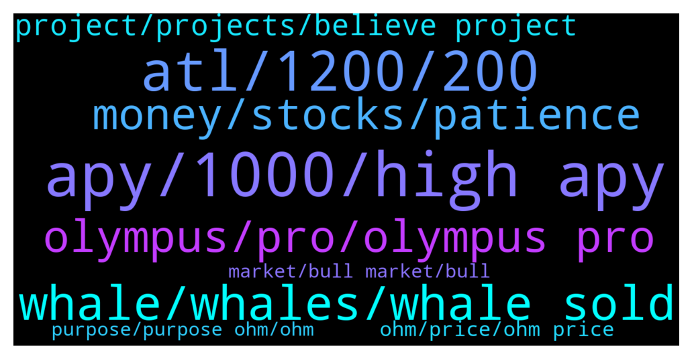

# **@OlympusTG**
 ## Analysis for **2022-01-16** - **2022-01-17**.

---

## 📊 **Basic Stats**

**n_messages_sent**: 2578

---

---

## 🔝 **Top keywords and related messages**

1. **apy, 1000, high apy**

    @regoor --- *That means almost 300% apy per month* **--->** [TG Discussion](https://t.me/OlympusTG/155905)

    @Jon --- *Basically at some point the price and APY should make it so you’re not losing value.* **--->** [TG Discussion](https://t.me/OlympusTG/152790)

    @Jon --- *If you can sell at the sweet spot, you’ll benefit from the price surge and APY* **--->** [TG Discussion](https://t.me/OlympusTG/152770)

    @Cixex --- *My understanding is that APY increases while price depletes to attract more stakes. I may be wrong.* **--->** [TG Discussion](https://t.me/OlympusTG/151659)

    @hootie1233 --- *Market down trend i get. But is the drop in apy at this time a good idea. It is clearly spooking people into thinking price drop, apy drop. All negative points atm. I get the fundamentals and everything that has gone on in the last few weeks with migration and such but is it all too much too soon.* **--->** [TG Discussion](https://t.me/OlympusTG/151761)

    @nfwaple --- *but APY trends down with token supply* **--->** [TG Discussion](https://t.me/OlympusTG/155922)

2. **atl, 1200, 200**

    @chitangxxx --- *yeah me too! first got in pre-pump to 1100 last August at about 250 - already cashed out initial plus profit on that bull run, now it's all free money - won't worry yet until it goes down to backing price, then it's time to worry lol* **--->** [TG Discussion](https://t.me/OlympusTG/153009)

    @crypto1Q --- *Have been waiting for a position like this to enter, I got in when it was $740. Thanks to those that sold, will be back to check my profits in a couple of months time 😊* **--->** [TG Discussion](https://t.me/OlympusTG/155131)

    @MW2140 --- *Are we ALL loosing $  ??   I started with 20K and now my amount is now 10K....* **--->** [TG Discussion](https://t.me/OlympusTG/152756)

    @Newton --- *Wow. This shit is really going to 10$ lol* **--->** [TG Discussion](https://t.me/OlympusTG/152281)

    @hanzheng --- *Don’t sell now.  We at ATL* **--->** [TG Discussion](https://t.me/OlympusTG/153148)

    @Shakti --- *Ive been 3,3 ing since May, was up 250k ...now down 20k but still have faith in ohm and ohmies* **--->** [TG Discussion](https://t.me/OlympusTG/153428)

3. **whale, whales, whale sold**

    @nfwaple --- *post transactions here so we can look into the whales wallets* **--->** [TG Discussion](https://t.me/OlympusTG/151633)

    @PE4M0 --- *whales keep dumping so why should i buy* **--->** [TG Discussion](https://t.me/OlympusTG/152997)

    @nfwaple --- *the whale also confessed about selling on twitter, so it's not a secret* **--->** [TG Discussion](https://t.me/OlympusTG/153280)

    @Ahmad --- *A whale sold. So that's it....now I know I guess. Well can't be angry at him. He is just doing what whales supposed to do.* **--->** [TG Discussion](https://t.me/OlympusTG/153289)

    @melfalou --- *so is this whale who sold the millions still holding in his wllet* **--->** [TG Discussion](https://t.me/OlympusTG/154274)

    @mikelg1 --- *Is this whale control time as well?* **--->** [TG Discussion](https://t.me/OlympusTG/153339)

4. **olympus, pro, olympus pro**

    @Keegan --- *If you work for Olympus you should care about my money!* **--->** [TG Discussion](https://t.me/OlympusTG/153056)

    @Mother fudder --- *That why he just sold Olympus on the top* **--->** [TG Discussion](https://t.me/OlympusTG/152550)

    @Cryptok_Cryptok --- *Is this the Olympus that provides Liquidity Pool locking services?* **--->** [TG Discussion](https://t.me/OlympusTG/155860)

    @chicoRicos --- *Is there any financial benefit to using Olympus "give"? I read the medium, but I don't think there is.  What do you think?* **--->** [TG Discussion](https://t.me/OlympusTG/152693)

    @Host --- *you guys know whats going on with olympus pro* **--->** [TG Discussion](https://t.me/OlympusTG/151583)

    @Chris --- *For any new players out there, if you're keen to learn how to use Olympus DAO, how their business model works, how to stake and unstake and wrap - you can check out my tutorial here too: https://youtu.be/OnpVN_wx6wk* **--->** [TG Discussion](https://t.me/OlympusTG/155865)

5. **money, stocks, patience**

    @theMagicUnicorn --- *ive gotten in high many times in crypto, it just requires that you hold longer to get your money back and then profit...it was easy for me because i knew something was good so i held...when you know a project is good, it gives you confidence to hold, even while children wrongly sell or panic* **--->** [TG Discussion](https://t.me/OlympusTG/152568)

    @gyh94 --- *Im just going to consider it as a write off at this point. Like I appreciate everyone thats is trying to help and give answers but literally they are all the basic checks i already done before coming here. I know my way around a PC and blockchain. Even had a few people under me take a look and it’s miraculously disappeared…* **--->** [TG Discussion](https://t.me/OlympusTG/151293)

    @Rory --- *At the end of the day all crypto is ROI. Great to believe in a project and that it stands for and is doing but everyone still bottom line wants a return. Rebases/compounding are great if there’s a value to it.* **--->** [TG Discussion](https://t.me/OlympusTG/151402)

    @ccryii --- *The winter of crypto has been told months ago . Normal and we are changing issues here* **--->** [TG Discussion](https://t.me/OlympusTG/152324)

    @timon_k --- *Still am disappointed though but that's crypto haha. Luckily I have other investments also.* **--->** [TG Discussion](https://t.me/OlympusTG/151972)

    @JKSuleyman --- *Because many people do not understand this crypto market* **--->** [TG Discussion](https://t.me/OlympusTG/152165)

6. **project, projects, believe project**

    @Valihora --- *I know a lot about this project. I'm here from the beginning. And even contributing and donate. But I'm not happy with result. Seriously.* **--->** [TG Discussion](https://t.me/OlympusTG/154911)

    @crypticcrypto_0 --- *If its a strong project it wont matter what people fud* **--->** [TG Discussion](https://t.me/OlympusTG/155023)

    @Jon --- *I’m a fan of these projects, but really there is a sweet spot to get out otherwise the future is cloudy* **--->** [TG Discussion](https://t.me/OlympusTG/152761)

    @Gg --- *No matter how amazing a project is, sadly if it's not hyped it can tank tremendously suddenly* **--->** [TG Discussion](https://t.me/OlympusTG/153397)

    @cdp279 --- *Even worse. You clearly are not following the project* **--->** [TG Discussion](https://t.me/OlympusTG/152028)

    @praxistechnologies --- *This project is done and you people are toxic af* **--->** [TG Discussion](https://t.me/OlympusTG/156080)

7. **ohm, price, ohm price**

    @theseedoflife --- *I have a very important question;  minim price of ohm is 1$  however the fair value of OHM is due to the amount of treasury divided by the ohm tokens out there  what is meant by “ohm out there”?  circ supply or unstaked OHM?  Unstaked OHM = 951k circ supply = 8,3mil   so the fair value is either:  1) 593 mio treasury / 951k (unstaked ohm out there) = 643$  OR 2) 593 mio treasury / 8,3 mil (circ supply out there) = 70$* **--->** [TG Discussion](https://t.me/OlympusTG/152421)

    @Psycho_ward --- *Mate the $$ is more important then the amount of OHM,thats what u cash out with in the end* **--->** [TG Discussion](https://t.me/OlympusTG/154259)

    @Deadpool0006 --- *That address of ohm is  showing price of  25000* **--->** [TG Discussion](https://t.me/OlympusTG/154098)

    @ocelotquick --- *$1 is not the floor. 😅 wtf happened to this group? Too many Normies? What YouTuber shilled ohm?* **--->** [TG Discussion](https://t.me/OlympusTG/152084)

    @nfwaple --- *it is not like OHM rug or something, there are real developments, and some of you just want to complain about the price, when price is down you reassess the fundamental, the summary of the fundamental is in the pinned message* **--->** [TG Discussion](https://t.me/OlympusTG/154976)

    @theMagicUnicorn --- *the price is a representation and maybe sad testament to the public or market that choose to sell and dont appreciate ohm, but that has nothing to do with ohm itself, the project itself, the price in the market doesnt accurately reflect the great value of ohm, just read the pinned message, there are too  many great things goingon with ohm, that most people dont take the time to understand* **--->** [TG Discussion](https://t.me/OlympusTG/152492)

8. **purpose, purpose ohm, ohm**

    @CarcodilDundur --- *Their an OHM partner don't you know* **--->** [TG Discussion](https://t.me/OlympusTG/153673)

    @nfwaple --- *OHM is not related to them* **--->** [TG Discussion](https://t.me/OlympusTG/153719)

    @bike4peace --- *you show only that you have no idea what you talk about... you dont know anything about OHM, when you do those comments.* **--->** [TG Discussion](https://t.me/OlympusTG/154862)

    @Rory --- *Ohm is literally the gayest thing ever* **--->** [TG Discussion](https://t.me/OlympusTG/152583)

    @unclejimmmmmy --- *the purpose of OHM is ............* **--->** [TG Discussion](https://t.me/OlympusTG/155945)

    @fairwinds --- *What is the purpose of OHM ? No idea what it does or is trying to do ?* **--->** [TG Discussion](https://t.me/OlympusTG/155932)

