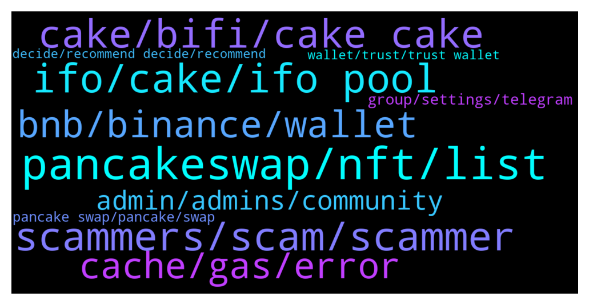

# **@PancakeSwap**
 ## Analysis for **2022-01-16** - **2022-01-17**.

---

## 📊 **Basic Stats**

**n_messages_sent**: 1097

---

---

## 🔝 **Top keywords and related messages**

1. **pancakeswap, nft, list**

    @Mariusz --- *Why can't I sell the MINITESLA token on pancakeswap? He rejects non-stop.* **--->** [TG Discussion](https://t.me/PancakeSwap/2279649)

    @ashokpk68 --- *i have a coin . Its in presale . wish to list in pancakeswap . if anybody can help  and have full flow process knowledge please DM me . ( already  3  CEX exchanges confirmed for listing > ) but before that I have to do a DEX  thats the reason .* **--->** [TG Discussion](https://t.me/PancakeSwap/2279136)

    @arnavthakur1 --- *Sir where I can trade my pancake bunny nfts* **--->** [TG Discussion](https://t.me/PancakeSwap/2277187)

    @Hi --- *How to buy shiba2k22 on pancakeswap* **--->** [TG Discussion](https://t.me/PancakeSwap/2277597)

    @ziannnika --- *it is in the history on pancakeswap sir* **--->** [TG Discussion](https://t.me/PancakeSwap/2277627)

    @Ceddi200 --- *Learn about pancakeswap for beginner:  https://youtu.be/4nSLa3vJbOY* **--->** [TG Discussion](https://t.me/PancakeSwap/2281141)

2. **scammers, scam, scammer**

    @Resilient109 --- *Idk how do they even sleep at night knowing they are one of the lowest scum on earth.* **--->** [TG Discussion](https://t.me/PancakeSwap/2277093)

    @Mrnixson --- *omg how manny scamers messagfe you when you join* **--->** [TG Discussion](https://t.me/PancakeSwap/2280249)

    @Crvena --- *Could you please set up your in-site support? Scammers are everywhere* **--->** [TG Discussion](https://t.me/PancakeSwap/2279981)

    @raghav2019 --- *When someone unknown is very curious to help you and to have discussion with you even if you denied. He probably is scammer 💯 🤣🤣* **--->** [TG Discussion](https://t.me/PancakeSwap/2277412)

    @Luis --- *I had five people contact me for scams that* **--->** [TG Discussion](https://t.me/PancakeSwap/2279499)

    @mariotidakteguh --- *many scammer from here inbox me* **--->** [TG Discussion](https://t.me/PancakeSwap/2280121)

3. **ifo, cake, ifo pool**

    @collfopp --- *I have been staking in the IFO pool since the DPT offering, which I missed.  So I have a decent amount of IFO credits available for FROYO.  All CAKE that I own is in the IFO stake pool.  Do I need to have additional CAKE to commit to the IFO when it opens, or will I be able to use what I have staked?  Also, if I unstake some of my CAKE from the IFO pool right now, will my IFO credits decrease?  Appreciate any help anyone is willing to offer.* **--->** [TG Discussion](https://t.me/PancakeSwap/2277295)

    @Ceddi200 --- *No you don’t loose your stake cake. Instead you earn more.   Also Your cake tokens spent in IFO is your price to get the tokens of the IFO project   So you only get a refund of your unspent fund if there was an overflow plus ifo tokens* **--->** [TG Discussion](https://t.me/PancakeSwap/2279458)

    @LetsGoBrandon00 --- *Do I lose amount of cake that is staked once I apply my IFO credit?* **--->** [TG Discussion](https://t.me/PancakeSwap/2279454)

    @P --- *Date time is running on IFO froyo  page ...What I have to do when time will finish...Do I have to commit all my cake or what ?And when I will receive froyo coins ? Instantly or any time* **--->** [TG Discussion](https://t.me/PancakeSwap/2278743)

    @collfopp --- *So I need additional CAKE or should I unstake my CAKE from IFO when IFO goes live?  If my credits decrease if I unstake, seems I should just buy more to commit to the IFO?* **--->** [TG Discussion](https://t.me/PancakeSwap/2277318)

    @HAITIENLK --- *you can use cake in wallet or unstake from IFO pool to commit, it's up to you.* **--->** [TG Discussion](https://t.me/PancakeSwap/2277322)

4. **cake, bifi, cake cake**

    @vitaliyunn --- *Eth not dumping my dude. Cake 60-70 from ath* **--->** [TG Discussion](https://t.me/PancakeSwap/2280671)

    @hoseiinnnna --- *cake is the bitcoin of defi* **--->** [TG Discussion](https://t.me/PancakeSwap/2276868)

    @DefiTheFuture --- *Hi, do you know what the inflation rate of Cake is per year?* **--->** [TG Discussion](https://t.me/PancakeSwap/2280522)

    @slawek1211 --- *have another question... we'll be buying using cake or busd?* **--->** [TG Discussion](https://t.me/PancakeSwap/2279398)

    @Bberko32 --- *No I look at cake but you tell me is it healthy that we can’t even recover one bit and what’s the reason for this?* **--->** [TG Discussion](https://t.me/PancakeSwap/2279616)

    @rob1_kk --- *Anyone can give me a suggestion for a high apr farm for cake?* **--->** [TG Discussion](https://t.me/PancakeSwap/2280189)

5. **bnb, binance, wallet**

    @defenderofdogecoin --- *Need help getting my BNB out of my contract address. I do not have recall function on my contract* **--->** [TG Discussion](https://t.me/PancakeSwap/2277447)

    @KavaTonga --- *Ok got it! Thank you so much! I will send my BNB to smartchain BNB* **--->** [TG Discussion](https://t.me/PancakeSwap/2279007)

    @defenderofdogecoin --- *Anybody know how I can get BNB that was automatically sent to my contract address?* **--->** [TG Discussion](https://t.me/PancakeSwap/2277133)

    @KavaTonga --- *Quick question, so when I connect using trust wallet (wallet connect) my BNB balance shows 0? I have BNB and I’m connected just no balance* **--->** [TG Discussion](https://t.me/PancakeSwap/2278989)

    @defenderofdogecoin --- *Need help will To pay. My contract automatically sold and sent BNB to my contract address. Anybody help me get them out?* **--->** [TG Discussion](https://t.me/PancakeSwap/2277150)

    @LIQUIDATION --- *Hi sir How can I get my bnb through this router . Not pancake router* **--->** [TG Discussion](https://t.me/PancakeSwap/2278482)

6. **cache, gas, error**

    @Kaynathon --- *I use metamask, i use google chrome , I use pc, I swapped 5$ to path, and received 0.0000000026$* **--->** [TG Discussion](https://t.me/PancakeSwap/2278924)

    @Ceddi200 --- *That’s why I asked you to try alternative wallet, since you said you clear cache and cookies and still experience that* **--->** [TG Discussion](https://t.me/PancakeSwap/2276866)

    @QV_zz --- *check ur connection, toggle between 4g and wifi, try a diff wallet, try again later* **--->** [TG Discussion](https://t.me/PancakeSwap/2277545)

    @castrox --- *tried 25 still not working  not giving any error too* **--->** [TG Discussion](https://t.me/PancakeSwap/2276951)

    @Crvena --- *May I ask whether there's a problem with the second step of setting up my profile? I checked the browser and found that there's a JavaScript cannot be fetched called 10.59a2d49e.chunk.js:1* **--->** [TG Discussion](https://t.me/PancakeSwap/2280002)

    @goobis_crypto --- *Everytime I pay gas the transaction is stuck now it has a red 5 next to it* **--->** [TG Discussion](https://t.me/PancakeSwap/2279483)

7. **admin, admins, community**

    @Winshaz --- *Admin, Still showing me same problem   What now ?* **--->** [TG Discussion](https://t.me/PancakeSwap/2277541)

    @BillJustus --- *Hi who is the admin here please?* **--->** [TG Discussion](https://t.me/PancakeSwap/2276713)

    @MasterCryo --- *Is this an admin too? If so then why I got a dm from this user ?* **--->** [TG Discussion](https://t.me/PancakeSwap/2279358)

    @AramKurdo --- *Instead of admins helping me i get numerous scammers 😑* **--->** [TG Discussion](https://t.me/PancakeSwap/2276832)

    @Goga Gogaladge --- *I have sended my error in your dm* **--->** [TG Discussion](https://t.me/PancakeSwap/2278097)

    @SecuestPcs --- *Admins have a tags next to their name e.g. Community, Chef, Owner, Hammer, duck .    If you need help type your message in the chat to get help from the community or wait for an admin to respond.     BEWARE OF DMs FROM SCAMMERS. Admins will never DM YOU FIRST.* **--->** [TG Discussion](https://t.me/PancakeSwap/2276718)

8. **group, settings, telegram**

    @TomorrowlandForLife --- *Support is here in the group Did you do what I've just told you?* **--->** [TG Discussion](https://t.me/PancakeSwap/2278431)

    @ManBlyat --- *you can create function "Anti Bot" on ur contract.* **--->** [TG Discussion](https://t.me/PancakeSwap/2276797)

    @todamun --- *I'm not sure if this is the official chat group. lol* **--->** [TG Discussion](https://t.me/PancakeSwap/2277459)

    @Oluwashine93 --- *I received a call from support to screenshot my secret phrase to them* **--->** [TG Discussion](https://t.me/PancakeSwap/2280959)

    @edumohbMc --- *i’ve received about 5 calls and messages claiming support support, too annoying* **--->** [TG Discussion](https://t.me/PancakeSwap/2276564)

    @TomorrowlandForLife --- *no, it's not. Maybe you've been banned... Go to this group  https://t.me/pancakebanappeal* **--->** [TG Discussion](https://t.me/PancakeSwap/2277369)

9. **pancake swap, pancake, swap**

    @ashokpk68 --- *my coin is  1 billion , planning to keep  25% for pancake sale  .  price per coin  0.005 now  how much liquidity ( in usd)  have to be kept in pancake swap for selling this coin at  0.05 usd  .* **--->** [TG Discussion](https://t.me/PancakeSwap/2279268)

    @HAITIENLK --- *join pancake and swap bro.  —> https://pancakeswap.finance/swap* **--->** [TG Discussion](https://t.me/PancakeSwap/2277609)

    @Haitham --- *How can I contact pancake swap support team* **--->** [TG Discussion](https://t.me/PancakeSwap/2276625)

    @Jamie --- *Can someone help me with swapping my metanet to smartchain on Pancakeswap keeps failing* **--->** [TG Discussion](https://t.me/PancakeSwap/2277260)

    @Mrnixson --- *I would just go on to the pancake swap site don't follow any links DM to you* **--->** [TG Discussion](https://t.me/PancakeSwap/2280302)

    @Tobesucessful --- *Pancake swap you are doing a nice job.* **--->** [TG Discussion](https://t.me/PancakeSwap/2277977)

10. **wallet, trust, trust wallet**

    @Ceddi200 --- *If u are finding difficulties in using that wallet u can do this for the main time.   You can import your wallet to any other wallets that works with Pancakeswap if you want. You can continue to use same wallet with your seed. That seed is not special for safepal or trust wallet or metamask. You can use it in any wallet app   You will write the seed words to new app with choosing "I have already a wallet" or " Import Wallet"* **--->** [TG Discussion](https://t.me/PancakeSwap/2278096)

    @Winshaz --- *On laptop how to connect wallet trust wallet ?* **--->** [TG Discussion](https://t.me/PancakeSwap/2277551)

    @snehalyr --- *Anyone can help me in Trust Wallet?* **--->** [TG Discussion](https://t.me/PancakeSwap/2280784)

    @Rush_lover --- *U can IMPORT your trustwallet into Metamask.. Check google how to do so. Dont trust them who call or dm u. Those are scammers, all of them* **--->** [TG Discussion](https://t.me/PancakeSwap/2277554)

    @L --- *My trust wallet delete but I don't no my recovery key 😭😭* **--->** [TG Discussion](https://t.me/PancakeSwap/2278464)

    @Ceddi200 --- *👉Try trustwallet or safepal is work on 100%👈  ✅ Metamask - PC ✅ Safepal - iphone, android ✅ Trustwallet - android  Don't use metamask with phone ❌ Don't use Binance wallet with pc ❌ ---------------------------------------------------  You can import your wallet to any other wallets that works with Pancakeswap if you want. You can continue to use same wallet with your seed. That seed is not special for safepal or trust wallet or metamask. You can use it in any wallet app  You will write the seed words to new app with choosing "I have already a wallet" or " Import Wallet"  Trust ➜  Safepal Guide👇🏻👇🏻👇🏻 https://youtu.be/FSGmEW9fFA0* **--->** [TG Discussion](https://t.me/PancakeSwap/2278114)

