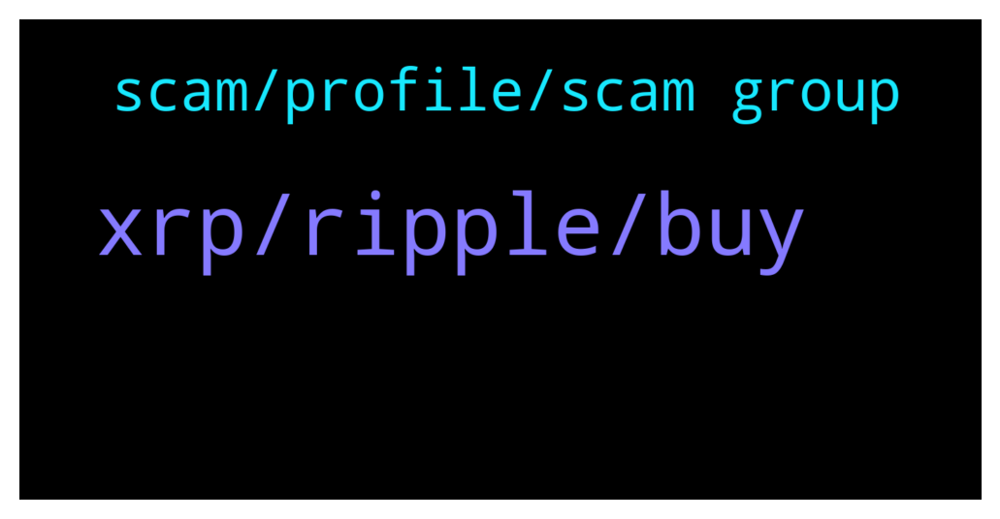

# **@Ripple**
 ## Analysis for **2022-01-16** - **2022-01-17**.

---

## 📊 **Basic Stats**

**n_messages_sent**: 150

---

---

## 🔝 **Top keywords and related messages**

1. **xrp, ripple, buy**

    @Maxence --- *Its a good time to buy ripple right* **--->** [TG Discussion](https://t.me/Ripple/3041214)

    @anuj90322 --- *I am not talking about risk due to volatility...the government may just seize ur xrp coins* **--->** [TG Discussion](https://t.me/Ripple/3040833)

    @Chikku_VP --- *In NOV I bought XRP  @98 Rs  indian money ($1.28) NOW it is around  Rs 62.12 ($0.84).. If i buy now it will get average or not* **--->** [TG Discussion](https://t.me/Ripple/3040913)

    @Pbgis --- *Hi friends I have a question In case Ripple replaces Swift. What will be the exact use of xrp?* **--->** [TG Discussion](https://t.me/Ripple/3041397)

    @Voltaire123 --- *Hopefully change it in a good way. Positive. Are you that sure they will win the lawsuit?* **--->** [TG Discussion](https://t.me/Ripple/3041247)

    @scott5271 --- *Should I be storing my coins in a cold wallet?* **--->** [TG Discussion](https://t.me/Ripple/3041288)

2. **scam, profile, scam group**

    @xiaolang122 --- *It's say no news for this security Is there something wrong with ur language* **--->** [TG Discussion](https://t.me/Ripple/3041346)

    @Karen --- *My name is not showing either?* **--->** [TG Discussion](https://t.me/Ripple/3041142)

    @Karen --- *I didn't realize it was private* **--->** [TG Discussion](https://t.me/Ripple/3041137)

    @GULUacityinUganda --- *the pump group has indeed been replaced with this one, although many veterans like yourself have gone as well. the admins in this group have been very good with banning bots/scammers/shillers etc* **--->** [TG Discussion](https://t.me/Ripple/3040932)

    @JesusJames --- *yes now please get a @username* **--->** [TG Discussion](https://t.me/Ripple/3041139)

    @chuckwagon --- *He’s wrong. Most people buckle over sec pressure. They’ve finally met their David.* **--->** [TG Discussion](https://t.me/Ripple/3041117)

