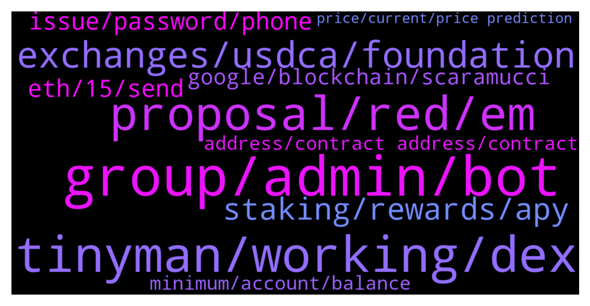

# **@algorand**
 ## Analysis for **2022-01-16** - **2022-01-17**.

---

## 📊 **Basic Stats**

**n_messages_sent**: 206

---

---

## 🔝 **Top keywords and related messages**

1. **group, admin, bot**

    @Wurzelbear --- *This is an Algorand group and not a promotion group for scammers.* **--->** [TG Discussion](https://t.me/algorand/333142)

    @Rb_71dex --- *admin enable verification bot for new members* **--->** [TG Discussion](https://t.me/algorand/333292)

    @S --- *The number of obvious bots in this channel is absurd. Would be nice if an admin cleaned this place out* **--->** [TG Discussion](https://t.me/algorand/333276)

    @TinyBit --- *Really, could you share link with more info pls?* **--->** [TG Discussion](https://t.me/algorand/333087)

    @Fundzbtc --- *lol calling admin right now to send u outta the group* **--->** [TG Discussion](https://t.me/algorand/333251)

    @NightAlgorand --- *Please speak English here as this is a English speaking group.* **--->** [TG Discussion](https://t.me/algorand/333304)

2. **tinyman, working, dex**

    @Nelsonok --- *Please what other app can I swap algo project with aside from tinyman* **--->** [TG Discussion](https://t.me/algorand/333188)

    @vbncrypto --- *hey guys, is there any other DEX in Algo ecosystem* **--->** [TG Discussion](https://t.me/algorand/332947)

    @hapsarinuha --- *Is there another dex except tinyman?* **--->** [TG Discussion](https://t.me/algorand/332933)

    @plymak3r --- *Hi guys,   Any thing like dextools, poocoin for Algo?* **--->** [TG Discussion](https://t.me/algorand/333204)

    @S --- *If they are working to try to do that, it’s disappointing. If they are, I’m wondering what it’s going to take to make to happen.* **--->** [TG Discussion](https://t.me/algorand/332955)

    @NightAlgorand --- *Not so sure about that one.* **--->** [TG Discussion](https://t.me/algorand/332799)

3. **proposal, red, em**

    @SonTrab --- *có bác nào VN đầu tư con này ko cho em hỏi xíu, em cảm ơn* **--->** [TG Discussion](https://t.me/algorand/333302)

    @NightAlgorand --- *You can DM me with your proposal* **--->** [TG Discussion](https://t.me/algorand/332822)

    @Joshgeorge32 --- *I have a proposal that will grow this community to the moon  , who could i possibly dm guys* **--->** [TG Discussion](https://t.me/algorand/332818)

    @JorAlc --- *Hola, no sé mucho sobre la red algorand. ¿Cuáles son los principales intercambiadores de esta red?* **--->** [TG Discussion](https://t.me/algorand/333015)

    @NightAlgorand --- *Hey, there is a spanish chat here https://t.me/algorand_es* **--->** [TG Discussion](https://t.me/algorand/333017)

    @NightAlgorand --- *Hi RIV , you can see the details here 👉 https://algorand.foundation/news/algorand-governance-rewards-period-2* **--->** [TG Discussion](https://t.me/algorand/333033)

4. **exchanges, usdca, foundation**

    @S --- *Going to try asking again… Is the foundation working on getting USDCa and USDCt added to the major exchanges? Coinbase, Binance, etc? If so, what does this process look like? Is it up to the Algorand foundation to pay a listing fee and facilitate building it the infrastructure? Are Coinbase and there like deliberately disallowing USDCa on their platform due to their partnership with Ethereum products? It would be great to know why tors hasn’t happened yet…* **--->** [TG Discussion](https://t.me/algorand/332944)

    @S --- *I’m not trying to find it for myself, My point is that I hope it’s a priority for the foundation to get USDCa listed on the top tier exchanges. That would be worth more than any marketing deal they could make for expanding exposure to the ecosystem.* **--->** [TG Discussion](https://t.me/algorand/332954)

    @tfv_algo --- *And where can we sell aside from that two* **--->** [TG Discussion](https://t.me/algorand/332850)

    @MackDenver --- *You can find it on Kucoin, gate and at a few other exchanges. I don't have enough information about Binance and Coinbase.* **--->** [TG Discussion](https://t.me/algorand/332950)

    @TheRealGiulio --- *Fully agree. USDCa and USDta on big exchanges would be huge!* **--->** [TG Discussion](https://t.me/algorand/332977)

    @S --- *Is the foundation working on getting USDCa and USDCt added to the major exchanges? Coinbase, Binance, etc?* **--->** [TG Discussion](https://t.me/algorand/332789)

5. **staking, rewards, apy**

    @KeepItRealBro --- *Hi, guys. Can you recommend safe ways for multipliying my algos. Wanted to put them into staking on binance, but apy is so low, around 1%. I'm a newbie, sorry for noob question* **--->** [TG Discussion](https://t.me/algorand/332914)

    @NightAlgorand --- *Please check the staking APY here 👉 https://algoexplorer.io/rewards-calculator* **--->** [TG Discussion](https://t.me/algorand/333089)

    @TinyBit --- *Sorry for the news but no staking anymore* **--->** [TG Discussion](https://t.me/algorand/333064)

    @MackDenver --- *Just keep it in your wallet and get staking rewards.* **--->** [TG Discussion](https://t.me/algorand/332918)

    @MackDenver --- *Please check the staking APY here: https://algoexplorer.io/rewards-calculator* **--->** [TG Discussion](https://t.me/algorand/332922)

    @KeepItRealBro --- *what is apy for staking in the wallet? do you mean wallets like trustwallet, right? not binance?* **--->** [TG Discussion](https://t.me/algorand/332920)

6. **issue, password, phone**

    @Cesnili_Kanka --- *had an issue once where my phone bill lapsed and I had been connected to WiFi,  when I left the WiFi ranged and having forgot my phone bill was due I saw full bars and didn't know why my apps were not working for like 5 minutes before realising I needed to pay for phone service lol* **--->** [TG Discussion](https://t.me/algorand/332908)

    @MackDenver --- *I got you but it is working fine at my end. This is why I asked you to reinstall the wallet. If it doesn't work, I will forward the issue to the tech team.* **--->** [TG Discussion](https://t.me/algorand/332907)

    @Cesnili_Kanka --- *Read the top message it's giving you. It saying the service is unreachable. Like their servers are down or something, or your telecom provider is strangling the connection, etc. If it's a legitimate message, and not a local issue, then no matter how many times you reinput your password or install the wallet it will give the same error.* **--->** [TG Discussion](https://t.me/algorand/332906)

    @cityrttg --- *What's problem with login in app Android? Always wrong my password* **--->** [TG Discussion](https://t.me/algorand/332896)

    @MackDenver --- *Well, if this is the case then please reinstall the wallet with your private phrase.* **--->** [TG Discussion](https://t.me/algorand/332902)

    @MackDenver --- *I'm glad that the issue is solved.* **--->** [TG Discussion](https://t.me/algorand/332909)

7. **eth, 15, send**

    @G --- *send me my 15 eth back please!* **--->** [TG Discussion](https://t.me/algorand/333230)

    @开心 --- *Attention everyone, the guy who just said he wanted to buy my bitcoin is a liar* **--->** [TG Discussion](https://t.me/algorand/333150)

    @开心 --- *I only have 15 bitcoins myself* **--->** [TG Discussion](https://t.me/algorand/333130)

    @TheRealGiulio --- *potentially it could be an Ether killer* **--->** [TG Discussion](https://t.me/algorand/332982)

    @Belfegor --- *And I allready have my VPS* **--->** [TG Discussion](https://t.me/algorand/332863)

    @bigboy87183 --- *Man! All asian hot women are in to crypto!!!* **--->** [TG Discussion](https://t.me/algorand/333122)

8. **google, blockchain, scaramucci**

    @jakaaaas --- *Algorand has blockchain patents in their name. I could not see patents of other crypto's. They are really researching and developing new blockchain technologies.* **--->** [TG Discussion](https://t.me/algorand/333013)

    @jakaaaas --- *US government to address the ramifications of cryptocurrencies on January 20th* **--->** [TG Discussion](https://t.me/algorand/333008)

    @jakaaaas --- *US will probably ban Energy consuming Mining, Proud that ALGO is already Carbon Negative and a Green Crypto* **--->** [TG Discussion](https://t.me/algorand/333005)

    @TheRealGiulio --- *But yeah, imagine tens of thousands of crypto users being drawn to exchange Tether and Circle via Algorand instead of Ethereum* **--->** [TG Discussion](https://t.me/algorand/332981)

    @anh Toan --- *ALGO will become the “Google” of cryptocurrency  January 16, 2022 at 21:59 287  Facebook    SkyBridge Capital founder Anthony Scaramucci says that Algorand (ALGO) will challenge top competitors in the crypto industry just like Google did in the early days of the Internet.   In a new interview with Digital Asset News, Scaramucci said that he is investing heavily in ALGO because he thinks it will displace many of its competitors.   “Currently, I have invested $250 million in ALGO.  I think Algorand will become Google.   You and I, when we were kids, we logged onto the Internet with AltaVista.  We use Lycos, America Online – even Prodigy, if you can remember that.  In 1998 the company was called Google and people were saying, “Why do I need it?  I've got all the other tools to get on the internet," and then people say, "You know it's faster.  It has machine learning, more common algorithms.  It gives better results.  So Google has convinced people, and I think that's going to happen with Algorand."   Algorand is a PoS blockchain that allows developers to build decentralized applications (dApps) for financial services.  This smart contract platform even challenges Ethereum, aiming to speed up transactions with lower costs.    “I think when the big businesses get into the tokenization side of the market and they start working in the DeFi world, they will need something as scalable, secure and decentralized as Algorand.  So they won't have to worry about inflation - the erratic deflation of the methods they are using to exchange value.   Algorand for me is the future.  More and more people will study it in depth and make a decision to choose it.”   In an interview on CNBC's Halftime Report in December, Scaramucci said that Algorand has the potential to topple Ethereum, the leading smart contract platform today.   At the time of writing, ALGO is trading at $1.39.   algo   Source: Tradingview   Join Bitcoin Magazine Telegram to follow news and comment on this article:* **--->** [TG Discussion](https://t.me/algorand/332946)

    @daniela2i --- *Algorand still among top 30 cryptocurrency to look out for this year* **--->** [TG Discussion](https://t.me/algorand/333030)

9. **address, contract address, contract**

    @karlos1878 --- *Does it not have an address sorry for the newby question* **--->** [TG Discussion](https://t.me/algorand/333185)

    @MackDenver --- *In the Algo, you don't need a contract address like ERC-20.* **--->** [TG Discussion](https://t.me/algorand/333195)

    @nferdazel --- *Depends, Algorand token does have contract address for ERC20* **--->** [TG Discussion](https://t.me/algorand/333186)

    @NightAlgorand --- *there is no contract address as Algorand is not ERC* **--->** [TG Discussion](https://t.me/algorand/332972)

    @angelo9007 --- *There is no contract address as Algorand is not ERC* **--->** [TG Discussion](https://t.me/algorand/332839)

    @NightAlgorand --- *If it’s a ERC20 then yes* **--->** [TG Discussion](https://t.me/algorand/332802)

10. **minimum, account, balance**

    @Vitualcop --- *Every account on Algorand must have a minimum balance of 100,000 microAlgos.* **--->** [TG Discussion](https://t.me/algorand/332776)

    @mlats4 --- *guys how is myalgo wallet minimum requirement counted?* **--->** [TG Discussion](https://t.me/algorand/332774)

    @Vitualcop --- *A single Algorand account is permitted to create up to 1000 assets. For every asset an account creates or owns, its minimum balance is increased by 0.1 Algos (100,000 microAlgos). Before a new asset can be transferred to a specific account the receiver must opt-in to receive the asset. This process is described below in Receiving an asset. If any transaction is issued that would violate the maximum number of assets for an account or not meet the minimum balance requirements, the transaction will fail.* **--->** [TG Discussion](https://t.me/algorand/332787)

    @Vitualcop --- *Minimum is also determine by asset holding your account has* **--->** [TG Discussion](https://t.me/algorand/332783)

    @mlats4 --- *but how does the minimujm balance increase, thats what im asking* **--->** [TG Discussion](https://t.me/algorand/332781)

    @Vitualcop --- *If ever a transaction is sent that would result in a balance lower than the minimum, the transaction will fail. The minimum balance increases with each asset holding the account has.* **--->** [TG Discussion](https://t.me/algorand/332777)

