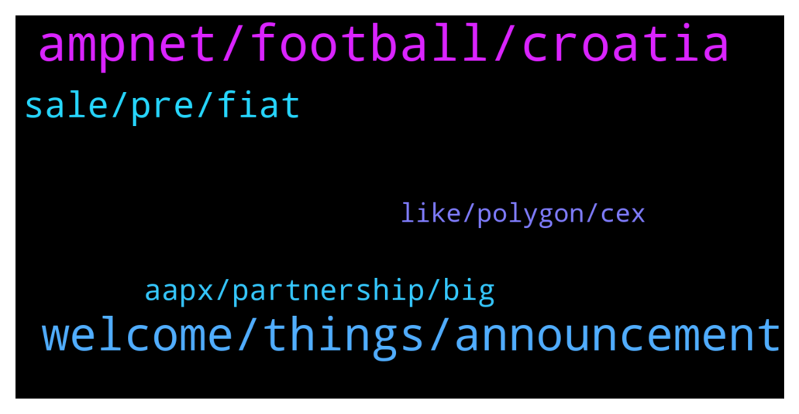

# **@ampnetapxchat**
 ## Analysis for **2022-01-12** - **2022-01-17**.

---

## 📊 **Basic Stats**

**n_messages_sent**: 108

---

---

## 🔝 **Top keywords and related messages**

1. **ampnet, football, croatia**

    @panos_dim --- *So AMPnet is focused purely in Croatia market?* **--->** [TG Discussion](https://t.me/ampnetapxchat/36550)

    @mislavjavor --- *Yes - players will directly marekt* **--->** [TG Discussion](https://t.me/ampnetapxchat/36385)

    @Cy --- *Great... but could you say The Croatian National Selection :D That would be a lot clearer for non croatians ˆˆˆ* **--->** [TG Discussion](https://t.me/ampnetapxchat/36304)

    @tradingjo98 --- *partnership with a national football team, oh god this must be kinda bullish* **--->** [TG Discussion](https://t.me/ampnetapxchat/36338)

    @mislavjavor --- *As always, there will be buybacks - the revenue for those, however, will not be coming only from the successfull collection of funds to the campaign, but also continuously - since AMPnet has several other fees included in the loyalty token business model. As for visibility - AMPnet has been assigned as the main sponsor for the HNS-CFF season and will be featured prominently on all football federation materials.* **--->** [TG Discussion](https://t.me/ampnetapxchat/36371)

    @mislavjavor --- *When there is a chargeable event on AMPnet* **--->** [TG Discussion](https://t.me/ampnetapxchat/36374)

2. **welcome, things, announcement**

    @TroopSep --- *Hi @jakovtradingmentor! Thanks for taking care of us! Welcome! 😊* **--->** [TG Discussion](https://t.me/ampnetapxchat/36423)

    @mislavjavor --- *Yes - details still being panned out, don’t want to rush with announcement* **--->** [TG Discussion](https://t.me/ampnetapxchat/36388)

    @tradingjo98 --- *Maybe you wanna tell us some things about you?* **--->** [TG Discussion](https://t.me/ampnetapxchat/36422)

    @tradingjo98 --- *I think a exchange listing will be next* **--->** [TG Discussion](https://t.me/ampnetapxchat/36345)

    @jakovtradingmentor --- *Thanks for the warm welcome :D* **--->** [TG Discussion](https://t.me/ampnetapxchat/36421)

    @jakovtradingmentor --- *looking forward to hanging out with you all* **--->** [TG Discussion](https://t.me/ampnetapxchat/36424)

3. **sale, pre, fiat**

    @Hydayashi --- *Will the foobal token be sold for crypto or only for fiat? it doesnt say anywhere...* **--->** [TG Discussion](https://t.me/ampnetapxchat/36382)

    @matejmz --- *How many tokens are going to be sold during this ICO? I only found total supply info.* **--->** [TG Discussion](https://t.me/ampnetapxchat/36373)

    @North --- *That answers partially, thanks. And the fees from VATRENI are collected on each token transaction or some other way?* **--->** [TG Discussion](https://t.me/ampnetapxchat/36384)

    @Tinus_Tussengas_1984 --- *When will the team make it possible to claim pre sale tokens on polygon network to avoid us to pay gas fees?* **--->** [TG Discussion](https://t.me/ampnetapxchat/36488)

    @matejmz --- *Is this token first of its kind in region?* **--->** [TG Discussion](https://t.me/ampnetapxchat/36389)

    @Cy --- *how does it compare to other fan token ? Psg for exemple ?* **--->** [TG Discussion](https://t.me/ampnetapxchat/36392)

4. **aapx, partnership, big**

    @North --- *I really hope so. There are no details on how it benefits AAPX holders yet though which is unfortunate, but at least we have a great partner and some exposure now* **--->** [TG Discussion](https://t.me/ampnetapxchat/36339)

    @scemodonore --- *guess aapx will benefit from buybacks but let's wait for the ama later* **--->** [TG Discussion](https://t.me/ampnetapxchat/36341)

    @Hydayashi --- *Stop selling people...let it grow. This guys will make it in the end. Mark my words.* **--->** [TG Discussion](https://t.me/ampnetapxchat/36294)

    @Tenken34 --- *none of the big influencers that used to be invested in $AAPX are tweeting about this huge news* **--->** [TG Discussion](https://t.me/ampnetapxchat/36352)

    @tradingjo98 --- *tbh I‘m still here for $AAPX, was sad to see all the way down, but I still see the future of it* **--->** [TG Discussion](https://t.me/ampnetapxchat/36269)

    @North --- *Big buys incoming and volume is spiking. Around  $1.55 now* **--->** [TG Discussion](https://t.me/ampnetapxchat/36299)

5. **like, polygon, cex**

    @adhamalkhaja --- *I think polymath does something similar* **--->** [TG Discussion](https://t.me/ampnetapxchat/36545)

    @mislavjavor --- *Agreed, for low fees at this time, though - I can recommend the Polygon network* **--->** [TG Discussion](https://t.me/ampnetapxchat/36387)

    @<UNK> --- *You kinda answered to this already, but I'd like to recommend atleast some CEX since ETH is congested all the time. I understand that something like Kucoin is now "pointless" until there is enough progression from this "new start", but there is some smaller CEXes like MEXC or AscendEX where you can get listed quite easily and can have decent userbase & volume* **--->** [TG Discussion](https://t.me/ampnetapxchat/36383)

    @panos_dim --- *Cool, lowcap, do you guys have any competitors in other chains?* **--->** [TG Discussion](https://t.me/ampnetapxchat/36544)

    @<UNK> --- *Yea Polygon is fine, but TBH I never found it more convinient to use than some cex where I can quickly to trade different pairs and withdraw the coins I like. But maybe I should learn it better:)* **--->** [TG Discussion](https://t.me/ampnetapxchat/36398)

    @matejmz --- *Just wondering - wouldnt it be better for them to deploy on Polygon?* **--->** [TG Discussion](https://t.me/ampnetapxchat/36366)

