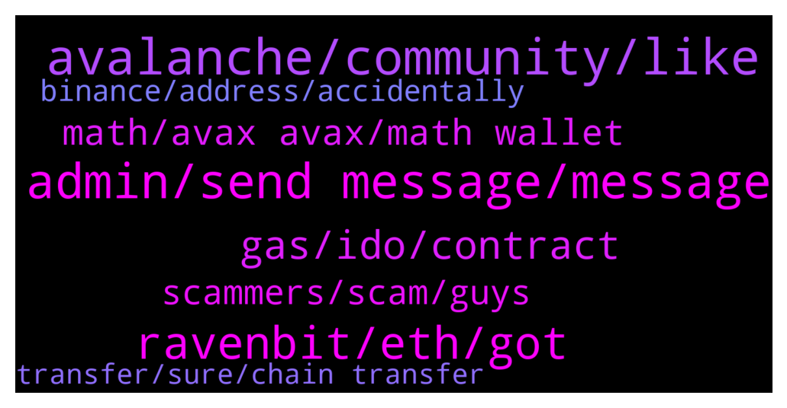

# **@avalancheavax**
 ## Analysis for **2022-01-16** - **2022-01-17**.

---

## 📊 **Basic Stats**

**n_messages_sent**: 156

---

---

## 🔝 **Top keywords and related messages**

1. **avalanche, community, like**

    @Alex --- *Do you have Avalanche network in metamask? What is your problem?* **--->** [TG Discussion](https://t.me/avalancheavax/322828)

    @oathtobarbatos --- *Try to get in contact with Binance support, you could also ask for help in the Avalanche discord server chat.avax.network* **--->** [TG Discussion](https://t.me/avalancheavax/322618)

    @Nicolas_A --- *Nothing to do with Avalanche. It’s the exchange that takes time to process deposits / withdrawals sometimes* **--->** [TG Discussion](https://t.me/avalancheavax/322897)

    @selimaykut --- *it means, there's a Blizzard Fund, with a growing team, who talk to potential project owners + invest in projects that can benefit the Avalanche ecosystem & that the Blizzard Fund can also support/help grow.* **--->** [TG Discussion](https://t.me/avalancheavax/322673)

    @geekmidget --- *What do you think about the Wonderland project, which uses Avalanche blockchain? I know it's not strictly official talk but the ROI just seems insane* **--->** [TG Discussion](https://t.me/avalancheavax/322739)

    @alexbwork --- *Network Name: Avalanche Network  New RPC URL: https://api.avax.network/ext/bc/C/rpc  ChainID: 43114  Symbol: AVAX  Explorer: https://snowtrace.io/* **--->** [TG Discussion](https://t.me/avalancheavax/322631)

2. **admin, send message, message**

    @ruch149 --- *Dude you cannot seriously think that it's coming from that lol* **--->** [TG Discussion](https://t.me/avalancheavax/322956)

    @Jborum --- *Said I can only send message to mutual user* **--->** [TG Discussion](https://t.me/avalancheavax/322930)

    @omnirick --- *Thank you. I got the correct email and sent an application.* **--->** [TG Discussion](https://t.me/avalancheavax/322697)

    @Jborum --- *is this some kind of joke* **--->** [TG Discussion](https://t.me/avalancheavax/322904)

    @Jborum --- *I don’t know who the real admin is that why I’m texting* **--->** [TG Discussion](https://t.me/avalancheavax/322906)

    @nacikuyumcu --- *Hey admin  is this your staff to send message like this?* **--->** [TG Discussion](https://t.me/avalancheavax/322794)

3. **ravenbit, eth, got**

    @Jborum --- *I have trouble withdrawing out of my ravenbit* **--->** [TG Discussion](https://t.me/avalancheavax/322880)

    @Nicolas_A --- *It’s written admin in the members list. Anyway told you to contact Ravenbit can’t really help with exchange issues* **--->** [TG Discussion](https://t.me/avalancheavax/322912)

    @Ayo 👳‍♀️👦👳 --- *How do I transfer ETH from Ravenbit* **--->** [TG Discussion](https://t.me/avalancheavax/322813)

    @CreepyJoe --- *How to I transfer crypto to another exchange* **--->** [TG Discussion](https://t.me/avalancheavax/322844)

    @Nicolas_A --- *Is ravenbit an exchange ? Never heard of it* **--->** [TG Discussion](https://t.me/avalancheavax/322892)

    @TheSEOdude --- *I'm not an admin, nor I know what ravenbit is.* **--->** [TG Discussion](https://t.me/avalancheavax/322885)

4. **gas, ido, contract**

    @makiob --- *does anyone what dapp is this contract ? https://snowtrace.io/address/0x41ed99efeab7f5e82cc2ba69fa1b81f7abb7b064 ? it is consuming a lot of gas* **--->** [TG Discussion](https://t.me/avalancheavax/322938)

    @l0nEr00 --- *seriously whats up with the gas fees now.... the IGO sale isnt filling up very fast... but gas is so high* **--->** [TG Discussion](https://t.me/avalancheavax/322966)

    @mkchaves --- *Network is not down, it's just busy. This IDO has 30k participants I don't know how many are trying to buy at the same time* **--->** [TG Discussion](https://t.me/avalancheavax/322953)

    @ruch149 --- *Wtf is this? 3$ to swap from one token to the other? Why are gas fees so high* **--->** [TG Discussion](https://t.me/avalancheavax/322939)

    @mkchaves --- *Exactly. I mean you have literally 15 hours to buy it.* **--->** [TG Discussion](https://t.me/avalancheavax/322955)

    @Nicolas_A --- *A lot of apes that think they have to rush to buy. Happens each time …* **--->** [TG Discussion](https://t.me/avalancheavax/322954)

5. **math, avax avax, math wallet**

    @Sordan_1917 --- *Math wallet support avax or avax-c ?* **--->** [TG Discussion](https://t.me/avalancheavax/322712)

    @edding3k --- *Can I still get tickets for the AVAX SUMMIT in Barcelona? I would love to attend in the name of a cyber security consultancy firm.* **--->** [TG Discussion](https://t.me/avalancheavax/322735)

    @onerrorresumenext --- *avax has already gone to the moon* **--->** [TG Discussion](https://t.me/avalancheavax/322609)

    @Juan --- *What is the protocol that gives the most profitability in avax?* **--->** [TG Discussion](https://t.me/avalancheavax/322865)

    @geekmidget --- *Do you think AVAX will again pass $150 in price this year?* **--->** [TG Discussion](https://t.me/avalancheavax/322737)

    @ColinYNWA2021 --- *yes i got avax in my wallet which i want to send back to dex* **--->** [TG Discussion](https://t.me/avalancheavax/322830)

6. **scammers, scam, guys**

    @soilyworm --- *Yea so many scammers messaging me, on the website it says usual reply time is 1 day 🤣* **--->** [TG Discussion](https://t.me/avalancheavax/322888)

    @pupmkin_l --- *But I know the right ones so I can’t get scammed tho* **--->** [TG Discussion](https://t.me/avalancheavax/322839)

    @w4zii --- *Thanks...tried all that..no luck.  F**k me these scammers are bugging me* **--->** [TG Discussion](https://t.me/avalancheavax/322619)

    @pupmkin_l --- *Lol 😂 so many scams actually especially in this group* **--->** [TG Discussion](https://t.me/avalancheavax/322838)

    @ColinYNWA2021 --- *ok lost in all the scam. thanks but no thanks. its solved* **--->** [TG Discussion](https://t.me/avalancheavax/322837)

    @ColinYNWA2021 --- *yes. still blocking. 1 msg 10 scam msgs back* **--->** [TG Discussion](https://t.me/avalancheavax/322840)

7. **binance, address, accidentally**

    @geekmidget --- *If someone accidentally sent AVAX to an Avalanche deposit address in Binance, is there a way to move it to a C-Chain deposit address?  It has not been my case, but a friend of mine asked me.* **--->** [TG Discussion](https://t.me/avalancheavax/322742)

    @Nicolas_A --- *You can but might want to ask Binance instead* **--->** [TG Discussion](https://t.me/avalancheavax/322687)

    @w4zii --- *I sent some BnB from avax chain on metamask to binance ... accidentally chose to send to smart chain....anything I can do to retrieve it?  Tried to get in contact with binance, but no help* **--->** [TG Discussion](https://t.me/avalancheavax/322617)

    @Amyfootwears --- *How do I send avax from Binance to metamask?* **--->** [TG Discussion](https://t.me/avalancheavax/322822)

    @geekmidget --- *May I ask a question regarding sending AVAX from Binance US to Binance international?  (Scammers, don't bother contacting me in PM, you will only get blocked/reported)* **--->** [TG Discussion](https://t.me/avalancheavax/322685)

    @pupmkin_l --- *Just copy your Avax address from the meta mask and go to binance then send* **--->** [TG Discussion](https://t.me/avalancheavax/322831)

8. **transfer, sure, chain transfer**

    @Nicolas_A --- *You can't make transfer from an X chain address to a C chain address and vice versa. It won't be accepted by the network* **--->** [TG Discussion](https://t.me/avalancheavax/322747)

    @dnbrk --- *Hello! I have sent some avax from C chain to x chain but it seems it stuck or something like that what should I do* **--->** [TG Discussion](https://t.me/avalancheavax/322744)

    @Nicolas_A --- *Go to the advanced tab and click Import X from C* **--->** [TG Discussion](https://t.me/avalancheavax/322745)

    @deverloop --- *Hello, I found NFT on my avax wallet at X chain, how I can transfer it to c chain?* **--->** [TG Discussion](https://t.me/avalancheavax/322860)

    @Nicolas_A --- *Did you select the deposit as Avax C chain ?* **--->** [TG Discussion](https://t.me/avalancheavax/322832)

    @TexasCryptonite --- *hI, how do I transfer AVAX from Aurora Network to Avalaunche Network.. Both are on Metamask Wallet* **--->** [TG Discussion](https://t.me/avalancheavax/322799)

