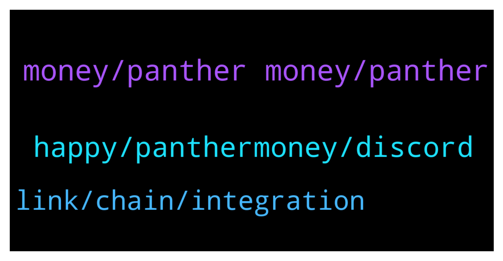

# **@chainlinkofficial**
 ## Analysis for **2022-01-16** - **2022-01-17**.

---

## 📊 **Basic Stats**

**n_messages_sent**: 76

---

---

## 🔝 **Top keywords and related messages**

1. **money, panther money, panther**

    @Sylvarantt --- *The benefit of forbidding price discussion in this chat to the signal:noise ratio vastly outweights the possible disadvantages. A lot of people come in here because they want to learn, build useful hybrid smart contracts and applications with real world use cases and basically educate themselves on what the blockchain is. That is a huge opportunity for everyone involved in this group to grow together.  If price, trading and token value is the thing you want to talk about there are dozens of other non-official groups that allow that sort of discussion. You can find them by searching in Telegram "Chainlink Community"* **--->** [TG Discussion](https://t.me/chainlinkofficial/365190)

    @mgfreedom --- *I repeat that I am very clear about the purpose of the group and I do not need any group to know the price trend.  I know many very experienced analysts but if I write in this group it is because I would like the same team to start thinking about increasing the value for investors* **--->** [TG Discussion](https://t.me/chainlinkofficial/365191)

    @Mario --- *I did not talk any numbers.* **--->** [TG Discussion](https://t.me/chainlinkofficial/365296)

    @Johannes --- *What do you think about the price prediction in 2022* **--->** [TG Discussion](https://t.me/chainlinkofficial/365337)

    @Joypokkamol --- *Lastly, where can the audience follow Panther Money and stay up to date for our community members who are watching today?* **--->** [TG Discussion](https://t.me/chainlinkofficial/365565)

    @Joypokkamol --- *In just a few moments, we will have a Community Q&A with Panther Money, who recently announced that it integrates Chainlink Price Feeds to Support Prediction Markets on Harmony. https://twitter.com/chainlink/status/1476538393865687041?s=20* **--->** [TG Discussion](https://t.me/chainlinkofficial/365535)

2. **happy, panthermoney, discord**

    @Joypokkamol --- *Hi everyone, please be ready in 15 minutes! https://twitter.com/CL_Community/status1482439488257277954?s=20* **--->** [TG Discussion](https://t.me/chainlinkofficial/365534)

    @Gouzetsu --- *Is there a sphynx labs ama today?* **--->** [TG Discussion](https://t.me/chainlinkofficial/365500)

    @amit29199 --- *Hi everyone! Thanks for having us.* **--->** [TG Discussion](https://t.me/chainlinkofficial/365538)

    @JoshSimenhoff --- *Hey Nathan I'd be happy to talk to you* **--->** [TG Discussion](https://t.me/chainlinkofficial/365356)

    @harrumphharrumph --- *Oh Josh is here. You’re in good hands!* **--->** [TG Discussion](https://t.me/chainlinkofficial/365360)

    @Robina --- *Thanks Anas for adding me on* **--->** [TG Discussion](https://t.me/chainlinkofficial/365506)

3. **link, chain, integration**

    @sportsparis --- *I really don't see a better project than prosper chainlink congratulations to the team I'm going to look at this, where can I buy prosper?* **--->** [TG Discussion](https://t.me/chainlinkofficial/365603)

    @LaVyyyyyy --- *We have partnered with Chainlink in order for us to grow using their technologies, these are the details on the technologies: gryphondao Is this true???* **--->** [TG Discussion](https://t.me/chainlinkofficial/365392)

    @jouby44 --- *hi, is it possible to bridge link from eth to fantom ?* **--->** [TG Discussion](https://t.me/chainlinkofficial/365450)

    @sam122a --- *Yes link is truth machine. Dyor* **--->** [TG Discussion](https://t.me/chainlinkofficial/365132)

    @sportsparis --- *Prosper - chainlink best ama comming 18/01* **--->** [TG Discussion](https://t.me/chainlinkofficial/365587)

    @harrumphharrumph --- *"Partnership” is an overused word in crypto.  Current integrations are announced through Twitter and later listed on Chainlink Ecosystem.  The nature of the integration will be included in the official announcement you can find through the above links.  If an integration has not been announced there are two possibilities: * A project is using Chainlink on it’s own accord since Chainlink is an open source project that anyone can use. * An announcement is forthcoming acknowledging the integration.  Please be aware that an announcement of an integration is not an endorsement of another project and that you should perform due diligence.* **--->** [TG Discussion](https://t.me/chainlinkofficial/365393)

