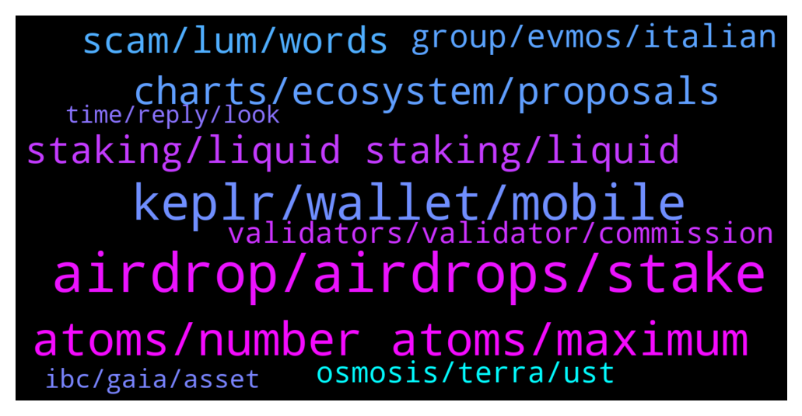

# **@cosmosproject**
 ## Analysis for **2022-01-16** - **2022-01-17**.

---

## 📊 **Basic Stats**

**n_messages_sent**: 326

---

---

## 🔝 **Top keywords and related messages**

1. **airdrop, airdrops, stake**

    @AtomJazz --- *If you stake now you'll likely be eligible for next airdrops. You can join airdrop channel to stay on top of it https://t.me/CosmosAirdrops* **--->** [TG Discussion](https://t.me/cosmosproject/476044)

    @staycat1on --- *I suddenly received a good number of HUAHUA 9 hours before. Was that a airdrop that I didn’t notice of?* **--->** [TG Discussion](https://t.me/cosmosproject/475584)

    @Tarek4080 --- *where to find airdrop news ❓* **--->** [TG Discussion](https://t.me/cosmosproject/475158)

    @AtomJazz --- *No, you'll not get airdrops delegating to them* **--->** [TG Discussion](https://t.me/cosmosproject/476066)

    @Kryptex31 --- *Maybe is to early to passed airdrop mission* **--->** [TG Discussion](https://t.me/cosmosproject/476200)

    @k_y_l_e_p --- *This is tricky mate sorry let me think I definitely know I had followed all the rules for the airdrop but we didn’t here news for ages after this I have just logged into Cosmostation but I don’t see anything* **--->** [TG Discussion](https://t.me/cosmosproject/475779)

2. **keplr, wallet, mobile**

    @DAD_DEFI --- *Guys, is keplr mobile on android acting weird on your end? Mine will load up to the intro screen only.* **--->** [TG Discussion](https://t.me/cosmosproject/475264)

    @movefaster --- *Is Keplr better or Cosmostatjon better?* **--->** [TG Discussion](https://t.me/cosmosproject/475436)

    @AtomJazz --- *No I think you'll need desktop Keplr* **--->** [TG Discussion](https://t.me/cosmosproject/476269)

    @Jacopo --- *i have keplr set up and ready! but Idk how to move funds from terrastation to keplr* **--->** [TG Discussion](https://t.me/cosmosproject/476272)

    @CeeNario --- *Also where do these tokens/coins go? To my ATOM address? Is it kinda like how ERC20 tokens nest under my ETH address, or ASAs under my ALGO, etc etc?  Also do I need specific wallet to see them?    I keep everything in my Ledger, and manage either from Ledger Live or Cosmostation on the web… just downloaded Keplr today, gonna link it to my ledger as well just cuz I keep hearing everyone continue to kinda push it lol* **--->** [TG Discussion](https://t.me/cosmosproject/475978)

    @k_y_l_e_p --- *I was new and had only just started crypto* **--->** [TG Discussion](https://t.me/cosmosproject/475771)

3. **atoms, number atoms, maximum**

    @loyer_one --- *Oh, my fault, i mean atom, of course* **--->** [TG Discussion](https://t.me/cosmosproject/476101)

    @Socrates --- *Anybody know why ATOM is up almost 10% while everything else is in the red* **--->** [TG Discussion](https://t.me/cosmosproject/475852)

    @StevenM1314 --- *Admin, I now hold ATOM, what are the ways to get income?* **--->** [TG Discussion](https://t.me/cosmosproject/476030)

    @ergots --- *Atom is just taking off 👽🪐😅* **--->** [TG Discussion](https://t.me/cosmosproject/475877)

    @danvans007 --- *stars later.. and people still sleep on atom.. more for us 🤣🤣* **--->** [TG Discussion](https://t.me/cosmosproject/476098)

    @TicoJohnny --- *Yeah it’s ridiculous, atom news has the vultures out* **--->** [TG Discussion](https://t.me/cosmosproject/475769)

4. **charts, ecosystem, proposals**

    @donut_rider --- *pleased to see that Cosmos was mentioned in the Economist Top story of the week https://www.economist.com/finance-and-economics/the-race-to-power-the-defi-ecosystem-is-on/21807229 The race to power the DeFi ecosystem is on from TheEconomist* **--->** [TG Discussion](https://t.me/cosmosproject/476068)

    @vladc1 --- *We made the @Cosmosproject Ecosystem Proposal Tracker — t.me/govproposalsbot  It is a #Telegram bot that tracks new proposals in networks related to the #CosmosEcosystem  To activate the bot follow the link t.me/govproposalsbot and press “Start”  $ATOM* **--->** [TG Discussion](https://t.me/cosmosproject/475259)

    @vladc1 --- *Follow the most recent Cosmos Proposals using this bot. It also tracks proposals from other Cosmos Ecosystem Networks. Proved to be a great toll to keep yourself updated and always vote on time.* **--->** [TG Discussion](https://t.me/cosmosproject/475261)

    @ZoltanAtom --- *Hello.sorry for late answer. We do not have direct contact with their team. As you well know, at Cosmos each chain sovereign. So I do not have details of ongoing project. Many different team were collaborating for hashgard project. Don’t want to speculate anything here. Better to do your own research.* **--->** [TG Discussion](https://t.me/cosmosproject/475996)

    @Thomas --- *Where can we see nice charts of cosmos tokens please ? Like, not from osmosis, some charts where you can adjust candles, timeline, indicators, like pro charts ? Thx* **--->** [TG Discussion](https://t.me/cosmosproject/475177)

    @Vadim_everstake --- *In this case you can discover comfy explorer cosmoscan.net built by Everstake.one validator. There are many charts of the main essentials of the blockchain. Currently Cosmoscan supprts 3 chains: Cosmos, Persistence, Bitsong. Please read our article about its features: https://stake.is/YF/* **--->** [TG Discussion](https://t.me/cosmosproject/475182)

5. **staking, liquid staking, liquid**

    @TicoJohnny --- *There were some steps involved, voting, staking, LPing. Couple of clicks* **--->** [TG Discussion](https://t.me/cosmosproject/475830)

    @fabellon --- *It there any fee? In staking?* **--->** [TG Discussion](https://t.me/cosmosproject/476249)

    @Steven --- *So Binance staking is not great?* **--->** [TG Discussion](https://t.me/cosmosproject/476065)

    @AtomJazz --- *Hey. You can stake to earn staking rewards or you can provide liquidity on Osmosis or Sifchain* **--->** [TG Discussion](https://t.me/cosmosproject/476032)

    @StevenM1314 --- *thanks. Is it possible to get new project tokens by staking at any node?* **--->** [TG Discussion](https://t.me/cosmosproject/476047)

    @Cordtus --- *You send a single tx 'claim all rewards'  The only downside is you can't use the one button/one tx claim and restake function on cosmostation. You'd have to do it for each validator* **--->** [TG Discussion](https://t.me/cosmosproject/475300)

6. **scam, lum, words**

    @benjaaa17 --- *and how they will differ from scam projects to good projects?* **--->** [TG Discussion](https://t.me/cosmosproject/475894)

    @k_y_l_e_p --- *Wow I just got like loads of dms ffs lol* **--->** [TG Discussion](https://t.me/cosmosproject/475768)

    @kodive --- *Hi folks ..is Lum a genuine project ? Or a rug pull coated with honey ?* **--->** [TG Discussion](https://t.me/cosmosproject/475413)

    @Cordtus --- *Yeah the scam websites are for lack of a better word, impressive. The people behind them would do well to just get a real job in web development or something.* **--->** [TG Discussion](https://t.me/cosmosproject/475556)

    @Cinnamon --- *Ok thanks, these scams are getting very good* **--->** [TG Discussion](https://t.me/cosmosproject/475552)

    @TicoJohnny --- *We can keep convo here lots of scammers out there* **--->** [TG Discussion](https://t.me/cosmosproject/475766)

7. **group, evmos, italian**

    @gerardo9111 --- *hello there is a group in Italian ? essendoc he do not speak English ? or I have to move here with the translator* **--->** [TG Discussion](https://t.me/cosmosproject/476162)

    @JayusJay --- *Hi please anyone knows who the founder of evmos is?* **--->** [TG Discussion](https://t.me/cosmosproject/476179)

    @ZoltanAtom --- *Hello,please join Evmos Chanel and learn more ;  https://t.me/EvmosOrg* **--->** [TG Discussion](https://t.me/cosmosproject/476180)

    @John --- *Can someone please send me an invite for Chihuahua community chat? I see that it's private* **--->** [TG Discussion](https://t.me/cosmosproject/476262)

    @ZoltanAtom --- *Unfortunately there is no Italian one.* **--->** [TG Discussion](https://t.me/cosmosproject/476164)

    @AtomJazz --- *I think you're in a wrong group 😁* **--->** [TG Discussion](https://t.me/cosmosproject/476100)

8. **osmosis, terra, ust**

    @AtomJazz --- *https://discord.gg/vcExX9T is better place for this. Also this is Osmosis thing afaik* **--->** [TG Discussion](https://t.me/cosmosproject/475695)

    @Cordtus --- *if that was Osmosis you were thinking of the window to claim has ended. not sure about Juno though oof 2500 atom would have been absolutely massive* **--->** [TG Discussion](https://t.me/cosmosproject/475839)

    @ZoltanAtom --- *You may find many liquidity pools with high apr at Osmosis Amm or Sifchain Dex;  https://t.me/osmosis_chat  https://t.me/sifchain* **--->** [TG Discussion](https://t.me/cosmosproject/475345)

    @SoulRa1ser --- *Osmosis Crypto Review 2022 : This Is The Year Of DeFi https://www.youtube.com/watch?v=OVYV3MyEFVY* **--->** [TG Discussion](https://t.me/cosmosproject/475146)

    @Jordan --- *Thanks youve been really helpful, with the heartbreak lol out of interest do you know the ratio of osmosis tokens to atom? 😂😭* **--->** [TG Discussion](https://t.me/cosmosproject/475831)

    @TicoJohnny --- *There was a claiming user interface right on the osmosis app* **--->** [TG Discussion](https://t.me/cosmosproject/475829)

9. **validators, validator, commission**

    @ZoltanAtom --- *Make sure you avoid exchange validators! Other than that...The best validator is always subjective, here are some factors that might help:   - Commission Rate:  This is the % of earned rewards that go to the validator. Not the % of your total stake, just to eliminate that confusion.   - Self-Bonded rate:  This is the % of bonded ATOM that belong to the validator. Think of this as their skin in the game.   - Decentralization:  Choosing the smaller validators helps to decentralize the network which improves security overall. Again, decentralization should be a priority. On this point, centralized exchanges are not the best choice as they don't really support the network at all.   You can learn more about each validator in their profiles on the wallets and explorers.  The 8-10% is almost for everyone, feel free to use this reward calculator  https://www.stakingrewards.com/earn/cosmos  Commissions can be changed anytime so keep an eye on your validator via telegram or twitter* **--->** [TG Discussion](https://t.me/cosmosproject/476019)

    @AtomJazz --- *Usually selecting a validator between #10 and #150 is best to support decentralization of the network* **--->** [TG Discussion](https://t.me/cosmosproject/476062)

    @WaterWorldArt --- *So basically Avoid exchange and 0% validators?* **--->** [TG Discussion](https://t.me/cosmosproject/475174)

    @a1sunny --- *Means which have 5 to 10% commission those are suitable?  And is there is any risk involved? Like chance of losing of our token during delegation ?* **--->** [TG Discussion](https://t.me/cosmosproject/476021)

    @AtomJazz --- *Yeah that's usually the case but avoid exchange validators* **--->** [TG Discussion](https://t.me/cosmosproject/476090)

    @Vadim_everstake --- *Usually validators owned by exchanges may be excluded as well as validators with 0% fee. Other conditions regarding threshold, date of snapshot etc vary from drop to drop.* **--->** [TG Discussion](https://t.me/cosmosproject/475170)

10. **ibc, gaia, asset**

    @bitangel84 --- *Yes, I don't remember the endpoint but is something like ibc denom trace* **--->** [TG Discussion](https://t.me/cosmosproject/475235)

    @Hindrhasha --- *Sorry, bit new to coding in anything other then R. What is the client, is that an api? Or its only possible to call IBC names within gaia?* **--->** [TG Discussion](https://t.me/cosmosproject/475241)

    @Hindrhasha --- *Seems to be the same, but thanks! Btw is there a query for ibc asset codes?* **--->** [TG Discussion](https://t.me/cosmosproject/475233)

    @Cordtus --- *all of IBC is doing very well. people are finall yseeing the development that has been happening unbeknownst to them all along.* **--->** [TG Discussion](https://t.me/cosmosproject/475854)

    @Hindrhasha --- *Oh thats on gaia itself. I"m trying to make some data tracing tools in R but never used gaia.* **--->** [TG Discussion](https://t.me/cosmosproject/475238)

    @quoctoress --- *Fetch.ai Q1 - Q2 2022 roadmap! IBC will be enabled after specific standards are met.  ⚛️⚛️🚀🚀  https://twitter.com/quoctoress/status/1483077995271434243* **--->** [TG Discussion](https://t.me/cosmosproject/476182)

