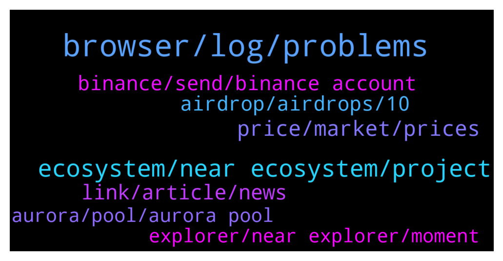

# **@cryptonear**
 ## Analysis for **2022-01-16** - **2022-01-17**.

---

## 📊 **Basic Stats**

**n_messages_sent**: 832

---

---

## 🔝 **Top keywords and related messages**

1. **browser, log, problems**

    @GeorgePro1 --- *Sorry for the inconvenience   Please check this https://t.me/cryptonear/289288* **--->** [TG Discussion](https://t.me/cryptonear/289607)

    @pburns2002 --- *Great points. How can there not be a log out feature?  That’s crazy.* **--->** [TG Discussion](https://t.me/cryptonear/288008)

    @larry_lang --- *yes this is happening due to an known error, the details can be found here: https://t.me/cryptonear/289288* **--->** [TG Discussion](https://t.me/cryptonear/289394)

    @GeorgePro1 --- *yes this is happening due to an known error, the details can be found here: https://t.me/cryptonear/289288* **--->** [TG Discussion](https://t.me/cryptonear/289412)

    @larry_lang --- *there was some problems, u can check it here. https://t.me/cryptonear/289288* **--->** [TG Discussion](https://t.me/cryptonear/289339)

    @Kripto_Raptor --- *👆 this is the reason for the latest issues or the rpc idk. waiting for a response from the team* **--->** [TG Discussion](https://t.me/cryptonear/288889)

2. **ecosystem, near ecosystem, project**

    @kv9990 --- *Have you checked out our governance forum yet..? gov.near.org* **--->** [TG Discussion](https://t.me/cryptonear/287878)

    @ontopofmyhead --- *hi guys are there some grants exactly for creating dapps at near ecosystem right now? is there any support for new dapps and etc...?* **--->** [TG Discussion](https://t.me/cryptonear/288841)

    @JAbioye1 --- *Yo what are the best near projects to buy and hold rn* **--->** [TG Discussion](https://t.me/cryptonear/288021)

    @JonD26 --- *Thanks for the reply. I saw this before. Anyone can set up a 'foundation' in Switzerland. It looks to me like a huge 'not actually decentralised' red flag to be honest.* **--->** [TG Discussion](https://t.me/cryptonear/287872)

    @kv9990 --- *Hey guys,incase anyone missed out The L1 WARS Podcast with Co-Founders of NEAR,Solana and AVAX, checkout this thread.  My favourite part was when Naval summarised NEAR as "NEAR seems like ETH 2.0 Roadmap actually implemented"  https://twitter.com/cmsintern/status/1482171812259708932  Checkout the whole podcast here* **--->** [TG Discussion](https://t.me/cryptonear/288311)

    @kv9990 --- *Can you be more specific..? NEAR is a Blockchain run by a network of Validators.* **--->** [TG Discussion](https://t.me/cryptonear/287862)

3. **price, market, prices**

    @Kripto_Raptor --- *and please use https://t.me/merchantsofnear or https://t.me/nearforce for price discussions 😍* **--->** [TG Discussion](https://t.me/cryptonear/289853)

    @cccckg --- *I just bought in Near at $19.6 this morning …..am I the highest purchasing price in the group?😂😂😂* **--->** [TG Discussion](https://t.me/cryptonear/289199)

    @TobiSchwab85 --- *Whats up with price? Whole market?* **--->** [TG Discussion](https://t.me/cryptonear/289791)

    @IAMMSB --- *I personally spent three weeks observing Near price chart from when it was $8 consistently maintaining price floors and with strong support is then I realized that this is a strong project dive into* **--->** [TG Discussion](https://t.me/cryptonear/289016)

    @Kripto_Raptor --- *price? discuss it here please   https://t.me/merchantsofnear or https://t.me/nearforce* **--->** [TG Discussion](https://t.me/cryptonear/288651)

    @larry_lang --- *uhh yes we all love the good price but next time it will good for us both if u move that to the price channel: https://t.me/merchantsofnear* **--->** [TG Discussion](https://t.me/cryptonear/288458)

4. **link, article, news**

    @Kripto_Raptor --- *yep, as told on the article* **--->** [TG Discussion](https://t.me/cryptonear/288576)

    @OjosdePez --- *Where to find more info about this* **--->** [TG Discussion](https://t.me/cryptonear/289854)

    @stedareal --- *I will send the link in a bit pls* **--->** [TG Discussion](https://t.me/cryptonear/289461)

    @larry_lang --- *https://gov.near.org/t/protocol-development-roadmap/2903?u=hiimhuyhai more details about it can be find here* **--->** [TG Discussion](https://t.me/cryptonear/289378)

    @cody905 --- *Any link / article to it ?* **--->** [TG Discussion](https://t.me/cryptonear/288362)

    @larry_lang --- *https://twitter.com/oct_network/status/1482378519799861253 i think this should be enough to prove the link between them* **--->** [TG Discussion](https://t.me/cryptonear/288368)

5. **binance, send, binance account**

    @Kripto_Raptor --- *you can see https://explorer.near.org/transactions/4U79pa16G7XUf7nDhBMLxuWWWNxH3Uh2ErmxoUfHjdUC 14.99 (0.01 deducted by Binance for withdrawal/transfer fees) was successfully transferred* **--->** [TG Discussion](https://t.me/cryptonear/288530)

    @anasemb --- *Hi, I'm new here How can I send Near from my wallet to binance? It only gives me the Account ID option* **--->** [TG Discussion](https://t.me/cryptonear/288746)

    @Budisalimm --- *Does binance give the lowest gas fee to send near to near wallet?* **--->** [TG Discussion](https://t.me/cryptonear/288182)

    @mvich --- *when i paste the binance adress in the metamask send function it says invalid adress* **--->** [TG Discussion](https://t.me/cryptonear/288934)

    @cryptodadyy --- *can i ask sir. when i first make near wallet, i send from binance to near wallet.  it is number  next time i resend that number address, but cannot received $near  how can i solve it!?* **--->** [TG Discussion](https://t.me/cryptonear/288338)

    @kv9990 --- *Enter the 64 digits "NEAR NETWORK" address from binance, it'll be accepted.* **--->** [TG Discussion](https://t.me/cryptonear/288747)

6. **airdrop, airdrops, 10**

    @larry_lang --- *Was this the airdrop u were talking about=]]]* **--->** [TG Discussion](https://t.me/cryptonear/289538)

    @Zorgan67 --- *Is AirDrop on the way ??* **--->** [TG Discussion](https://t.me/cryptonear/288701)

    @stedareal --- *Who can help me with 2 NEAR I can't get airdrops,any good Samaritan🙏* **--->** [TG Discussion](https://t.me/cryptonear/289458)

    @larry_lang --- *ah yess=))) waiting patiently for the project to go live=)) and of course airdrop=)))* **--->** [TG Discussion](https://t.me/cryptonear/288356)

    @larry_lang --- *and to my understanding we dont have any airdrop for $NEAR at this moment* **--->** [TG Discussion](https://t.me/cryptonear/289469)

    @larry_lang --- *what airdrop may i ask u?* **--->** [TG Discussion](https://t.me/cryptonear/289460)

7. **aurora, pool, aurora pool**

    @baniagui --- *I am currently staking my near. Is there a specific pool where i can stake near to earn aurora? Thanjs* **--->** [TG Discussion](https://t.me/cryptonear/288291)

    @TheGo1denBull --- *Except for the Aurora pool that rewards with Aurora instead of Near there is no difference.* **--->** [TG Discussion](https://t.me/cryptonear/288815)

    @toxa3333 --- *yes they take near rewards, and give aurora* **--->** [TG Discussion](https://t.me/cryptonear/289871)

    @Ong --- *If i stake my NEAR with aurora validator, will i be receiving NEAR or Aurora as reward? or will i be getting both? thanks* **--->** [TG Discussion](https://t.me/cryptonear/289024)

    @supersaiyan_goku --- *Hi guys, I can start to stake Near to receive Aurora from now, correct?* **--->** [TG Discussion](https://t.me/cryptonear/288575)

    @TheGo1denBull --- *That particular pool doesn't reward you with NEAR but Aurora* **--->** [TG Discussion](https://t.me/cryptonear/288868)

