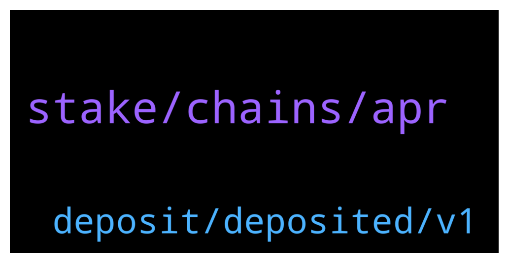

# **@dypfinance**
 ## Analysis for **2022-01-16** - **2022-01-17**.

---

## 📊 **Basic Stats**

**n_messages_sent**: 187

---

---

## 🔝 **Top keywords and related messages**

1. **stake, chains, apr**

    @appliepietrade --- *i am doing avax farming, so if the avax token price rise, the lp value that I am currently farming will also increase, is this a fair statement?* **--->** [TG Discussion](https://t.me/dypfinance/240058)

    @Otthrice --- *good evening guys, when was the TGE and may i ask about publicsale price?* **--->** [TG Discussion](https://t.me/dypfinance/240057)

    @Drake --- *Excited to learn more about DeFi!* **--->** [TG Discussion](https://t.me/dypfinance/240355)

    @H --- *Team they must offer dyp to Binance to listen on Binance exchange* **--->** [TG Discussion](https://t.me/dypfinance/240201)

    @Drake --- *Is DYP considered a web 3.0 player?  Thanks for the link I'll read it* **--->** [TG Discussion](https://t.me/dypfinance/240357)

    @Disguy125 --- *@Tekkol @timdyp  anything new being released this week. Bridge completion etc.* **--->** [TG Discussion](https://t.me/dypfinance/240379)

2. **deposit, deposited, v1**

    @tejchand --- *hi i deposited 66.8 wavax with no lock period but when i withdraw i only get 16 wavax back. dont know what went wrong. please help* **--->** [TG Discussion](https://t.me/dypfinance/240567)

    @iamJubi --- *Hello. Done digging into your wallet, apologies it took time as etherscan is under maintenance.  You added liquidity (DYP-ETH pair) and approved but I think you did not deposit on the farming pool as I can not find the deposit transaction you made. Remove liquidity here https://app.uniswap.org/#/remove/v2/0x961C8c0B1aaD0c0b10a51FeF6a867E3091BCef17/ETH* **--->** [TG Discussion](https://t.me/dypfinance/240122)

    @BeachLifeX --- *I was collecting rewards on Jan 10th* **--->** [TG Discussion](https://t.me/dypfinance/240415)

    @Justin --- *I have a question about an old farm I deposited 27 Defiyield into about 14 months ago. I cant see it list in the dapp but can see it on Etherscan..can I still remove it and sell it back to Eth?* **--->** [TG Discussion](https://t.me/dypfinance/240118)

    @timdyp --- *If you removed your funds, it's impossible to get it back. You can get the assets affected by the IL only if the value of your deposited assets will recover in value, this can happen only when you still providing liquidity. Again, before joining farming and providing liquidity, you should read about IL and understand the concept.  https://academy.binance.com/en/articles/impermanent-loss-explained* **--->** [TG Discussion](https://t.me/dypfinance/240572)

    @hemanrock --- *No. also, please check this article to know more about FARMS https://dypfinance.medium.com/staking-farming-and-buyback-v2-is-live-on-avalanche-c0d16bf1961c* **--->** [TG Discussion](https://t.me/dypfinance/240315)

