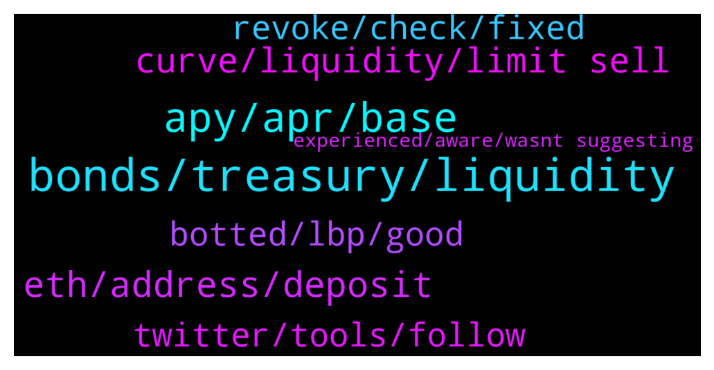

# **@lobsters_chat**
 ## Analysis for **2022-01-16** - **2022-01-17**.

---

## 📊 **Basic Stats**

**n_messages_sent**: 259

---

---

## 🔝 **Top keywords and related messages**

1. **bonds, treasury, liquidity**

    @N1ckchong --- *There was an initial exploit they whitehatted, then returned funds to depositors the next day and then there was an interest rate accrual bug that put the protocol into some debt iirc* **--->** [TG Discussion](https://t.me/lobsters_chat/315867)

    @hugeshoe --- *I think the biggest issue is cost https://twitter.com/wilburforce_/status/1481667039253176328?s=21* **--->** [TG Discussion](https://t.me/lobsters_chat/315895)

    @ivangbi --- *Ser me no supporter and no simp for this, but if we take away the past and view it just as a "big treasury" since IV now - almost the FDV, then it becomes o-k? Then it needs to make products and use that liquidity well, like what Dani does w "his" bags? Imho, kill the staking APYs (it's not token dilution for no reason, just let it go at the big dip, let people exit). There is no point innit since bonds can't really bring that much anymore: likely token dilution % will be larger than $ of treasury accrual. And... just pivot 100%* **--->** [TG Discussion](https://t.me/lobsters_chat/316123)

    @ArkyEvi --- *From what info they shared last year, the hope lies with the transition to DAO that "will" make users and protocols FOMO into ohm for treasury control. So in theory the inflation could stop there, with the recent trend of ve model nowadays, maybe ve (3, 3) and they could have a solution.* **--->** [TG Discussion](https://t.me/lobsters_chat/315968)

    @tandeloff --- *Sorry for being nerdish but there is far easier way to prove that (5) statement. 1. since for every positive sum S and a+b = S a*b is maximazed at a=b, sqrt(a*b) is also maximazed at a=b. So weight Wnx is maximized at stablecoin deposit equal vePTP value.  2. Since respective value increases when absolute value increases, a = b also maximized allocative share q.e.d  https://cdn.platypus.finance/Platypus_Liquidity_Mining_Paper.pdf* **--->** [TG Discussion](https://t.me/lobsters_chat/316050)

    @Praguebrewer --- *Under their WP: "Platypus uses accounts of token to record assets and liabilities. Such design allows singled-sided liquidity provision. Platypus also uses coverage ratio as the input parameter for AMM (instead of liquidity), hence removes the same liquidity equilibrium constraint from Curve’s stableswap invariant, allows token to grow organically based on its nature demand and supply". So they declared that can add new tokens into existing pools hence better efficiency* **--->** [TG Discussion](https://t.me/lobsters_chat/316013)

2. **apy, apr, base**

    @Lorddimiter --- *no sir , thats the APY calculation, you will get something which is much closer to 10% every 5 days , which is like 300% APR , so after 3 months u will have increased your ohm to say between 1750-2000 OHM depends on variance* **--->** [TG Discussion](https://t.me/lobsters_chat/316096)

    @syed_jafri --- *1000% APY compounded daily is only 240% APR* **--->** [TG Discussion](https://t.me/lobsters_chat/316084)

    @ivangbi --- *Altho wait I am sleepy… hm isn’t that just how APY is calculated? It assumes re-compounding, right. The same case for convex or yearn?* **--->** [TG Discussion](https://t.me/lobsters_chat/316087)

    @Lorddimiter --- *Yes it is, but the base for re-compounding is important here , if the base is very high, then the effect on the re-compounding calc will be extreamly high as well* **--->** [TG Discussion](https://t.me/lobsters_chat/316091)

    @Lorddimiter --- *The secret is how the apy is calculated sir ;) compound interest indeed starts to kick in hard :) in the last couple of 8 hour rebases during a 12 month period , so those numbers of 3000-5000% are calculated based on you keeping your stack there for more or less full 12 months* **--->** [TG Discussion](https://t.me/lobsters_chat/316083)

    @pussinboots --- *the apys on yearn aren't denominated in a rebasing token* **--->** [TG Discussion](https://t.me/lobsters_chat/316089)

3. **eth, address, deposit**

    @ivangbi --- *No, some exchanges did allow / still do. Currently kraken has that. Before okex did/does, and a few orders. Google if an exchange u might want allows for that* **--->** [TG Discussion](https://t.me/lobsters_chat/316019)

    @Alphamint --- *Is there a way to change binance's  deposit address for my account?* **--->** [TG Discussion](https://t.me/lobsters_chat/316018)

    @naps62 --- *NFts don't have an address. they are assigned to one (their current owner), and can usually be freely transferred. you need to use actual different accounts (or different contracts)* **--->** [TG Discussion](https://t.me/lobsters_chat/315953)

    @PythiaPythia --- *Hey guys, I have 0 experience with erc721. I am wondering if NFTs could be used to take several separte positions for example on Aave. Say with one I deposit some wbtc and take out a loan and, with another NFT i deposit some eth. This would prevend an eventual liquidation to sell also my eth. My assumption is that NFTs have an address. If not, what would the best approach be? Create some contracts and make each deposit with a different contract.* **--->** [TG Discussion](https://t.me/lobsters_chat/315952)

    @xRugMe --- *FTX has separate addresses for subaccounts* **--->** [TG Discussion](https://t.me/lobsters_chat/316021)

    @euler_mab --- *Sounds like you want some kind of sub-account feature, where you can manage multiple individual positions from a single wallet address. Would be cool if you could even build those individual positions using batch transactions to minimise gas. We offer both on Euler (still in soft launch phase, but also available to test on ropsten).* **--->** [TG Discussion](https://t.me/lobsters_chat/316007)

4. **curve, liquidity, limit sell**

    @Monkeyontheloose --- *What if one wanted to supply liquidity on his own schedule, like a different curve ,is that possible? Does balancer let you do this?* **--->** [TG Discussion](https://t.me/lobsters_chat/315875)

    @sonicblend --- *Ahhh I thought you wanted flexibility on the curve. Not concentrated liquidity with a limit sell? (And perhaps stop loss)* **--->** [TG Discussion](https://t.me/lobsters_chat/315926)

    @Monkeyontheloose --- *i think this can be done without an outside oracle  and example use case would be, say I want to supply liquidity and cash out my 1BTC when the value reaches 10m$* **--->** [TG Discussion](https://t.me/lobsters_chat/315925)

    @sonicblend --- *I believe Dodo Exchange let's you do this with their PMM (Proactive Market Maker):  > Parameters such as asset ratio and curve slope can be flexibly set. At the same time, an oracle machine can be introduced to guide prices or price discovery by the market on the chain. This oracle also gathers more funds near the market price and provides sufficient liquidity.* **--->** [TG Discussion](https://t.me/lobsters_chat/315924)

    @sonicblend --- *Ah problem is if someone apes and your target of $10M wBTC gets hit, but then price crashes back to $42k 😂 Hence thinking you need a limit sell, which I'm not sure is otherwise possible.* **--->** [TG Discussion](https://t.me/lobsters_chat/315929)

    @tandeloff --- *So price curve is defined by black scholes equation instead of x*y = c or x + y = c or their compositions* **--->** [TG Discussion](https://t.me/lobsters_chat/316146)

5. **botted, lbp, good**

    @Sp33dyTT --- *I participated in almost every LBP in late 2021 and 2022* **--->** [TG Discussion](https://t.me/lobsters_chat/315981)

    @XekFukOff --- *10 to 15 percent would've made it worth it taking a shot. But 5, no. LBP cannot be botted, though, by design.* **--->** [TG Discussion](https://t.me/lobsters_chat/315974)

    @Cryptographic --- *Copper is the best example of anti bot lbp measures makes 0 sense to bot a copper launch* **--->** [TG Discussion](https://t.me/lobsters_chat/315992)

    @XekFukOff --- *I said by design it can't be botted, which technically I guess it can.. but why would you frontrun into an auction that purposely has a much higher starting price to discourage frontrunning* **--->** [TG Discussion](https://t.me/lobsters_chat/315991)

    @XekFukOff --- *I've looked at every single LBP every conducted. Are u new to this? 1 lbp was botted and it was HydraDX and it was front run for $50k* **--->** [TG Discussion](https://t.me/lobsters_chat/315980)

    @XekFukOff --- *Starts at top left @ much higher starting price and drops until it is met by a sizable demand. Really good lbps usually drop 50-65 percent, and then begin to rise in price.* **--->** [TG Discussion](https://t.me/lobsters_chat/315976)

6. **revoke, check, fixed**

    @mogglet --- *well checked and handled perfectly, some users have not revoked yet ! I suggest check here : https://app.multichain.org/#/approvals* **--->** [TG Discussion](https://t.me/lobsters_chat/316241)

    @mogglet --- *no, just check here : https://app.multichain.org/#/approvals if you are affected you will get notification ! if you don't then no worries then* **--->** [TG Discussion](https://t.me/lobsters_chat/316249)

    @PmRiviere --- *Jay is right though the warning update seems to say the revoke is unnecessary* **--->** [TG Discussion](https://t.me/lobsters_chat/316250)

    @SpikeSpiege1 --- *Since you said in your last Twitter update that everything was fixed you should clarify that ppl still need to revoke.* **--->** [TG Discussion](https://t.me/lobsters_chat/316247)

    @SpikeSpiege1 --- *You still need to revoke even though everything is fixed?🧐* **--->** [TG Discussion](https://t.me/lobsters_chat/316242)

    @sambacha --- *nothing stopping applications from confirming state* **--->** [TG Discussion](https://t.me/lobsters_chat/315854)

7. **twitter, tools, follow**

    @rektivist --- *Heya. Anyone knows what tools can be used for twitter new follow tracking?  https://github.com/twintproject/twint proposed by @farm42 stopped working since twitter removed some crucial legacy apis* **--->** [TG Discussion](https://t.me/lobsters_chat/316181)

    @XTO_Crypto --- *Hi everyone, i’m looking for a way to check my PNL & history at specific time ? For instance if I want a recap of what I did frm October 1st to October 31th with graphs & tx history. Is there any tool out there to do that ? Or ready made Dune dashboard may be ? Couldn’t find one to do that all so far. Thanks in advance* **--->** [TG Discussion](https://t.me/lobsters_chat/316200)

    @t_slam --- *is there a notification system in twint in real time to track followers? or is it a chronjob that compares followers?* **--->** [TG Discussion](https://t.me/lobsters_chat/316197)

    @sovsignal --- *I have seen some tools like DropsAnalytics that show follow/unfollow for "influencer" accounts on Twitter but I haven't found anything that allows you to customize what accounts you would like alerts on.  Would be interested myself to check out any tools that might be available for this.  DropsAnalytics: https://t.me/drops_analytics* **--->** [TG Discussion](https://t.me/lobsters_chat/316198)

    @XekFukOff --- *Twint is having issues rn. And some people want to monitor Twitter user changes in the accts they follow/unfollow* **--->** [TG Discussion](https://t.me/lobsters_chat/316235)

    @XekFukOff --- *Nothing. I posted an osint Twitter tool that is paid, so that someone that was asking about something similar earlier, had a good example to find a free alternative..* **--->** [TG Discussion](https://t.me/lobsters_chat/316234)

