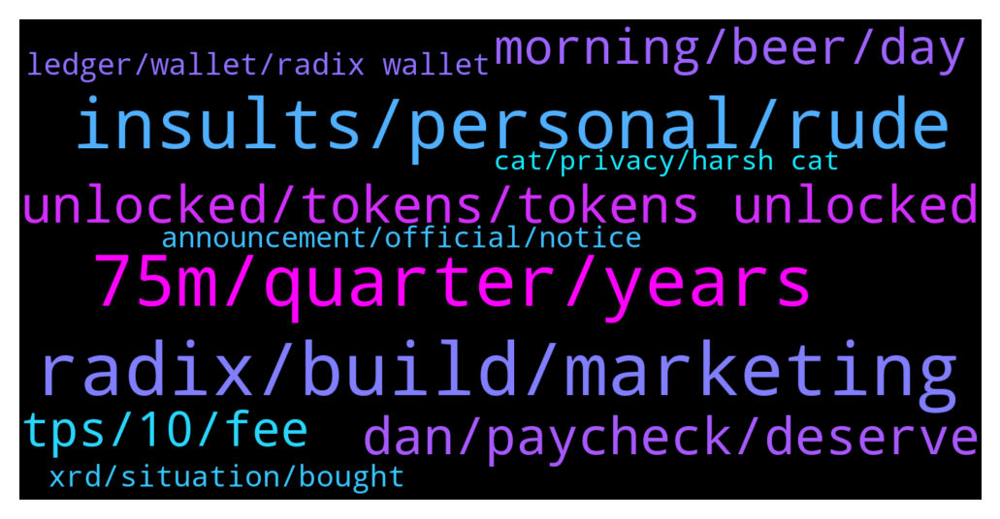

# **@radix_dlt**
 ## Analysis for **2022-01-16** - **2022-01-17**.

---

## 📊 **Basic Stats**

**n_messages_sent**: 1224

---

---

## 🔝 **Top keywords and related messages**

1. **radix, build, marketing**

    @Crypto --- *Quite honestly, not the impression I get.  Some of the team are great, especially tech team. With others, it just seems like Radix is a refuge for people to have well-paid tech jobs that would be unemployable elsewhere.   A lot of free riders in the company. For instance, a head of exchanges who gets no exchanges… A ton of “marketing” people yet no one has ever heard of “Radix".* **--->** [TG Discussion](https://t.me/radix_dlt/341883)

    @Al_Bunderino --- *Yeah, but they claim to use radix tech...* **--->** [TG Discussion](https://t.me/radix_dlt/341552)

    @postnutcIarity --- *Here you go https://youtu.be/fp4YzAgnIqk?t=380 (timestamped) 😁  He didn't mention Radix, but talks about GoodFi with Radix mentioned in the article :)* **--->** [TG Discussion](https://t.me/radix_dlt/340218)

    @FreeTixDao --- *He should mention Radix a bit more but at the end of the day as the platform grows this stuff will happen more and more* **--->** [TG Discussion](https://t.me/radix_dlt/341524)

    @postnutcIarity --- *Did anyone notice CoinBureau did a little feature of Radix in his Aave video? 👀* **--->** [TG Discussion](https://t.me/radix_dlt/340203)

    @FreeTixDao --- *I don't see that they are borrowing any tech, you're right in that they "should" mention Radix a but more but essentially all they are trying to do is build a code library that will run on the Radix platform, as you know the more Dapps built on the Radix platform the better for XRD as a whole so it can only be good.* **--->** [TG Discussion](https://t.me/radix_dlt/341521)

2. **75m, quarter, years**

    @fpieper --- *On this point I agree, it is not clear in the announcement.  Though 75M over 4 years would be too low to make sense. But "roughly quarterly" is not in direct context to the 75M XRD.  @Adam_XRD* **--->** [TG Discussion](https://t.me/radix_dlt/341505)

    @fpieper --- *It is written 75M quarterly in the announcement. 75M over 4 years wouldn't make much sense also.* **--->** [TG Discussion](https://t.me/radix_dlt/341098)

    @danhughes --- *"Much" is subjective  If it was 1M it would be too much in some opinions ... for others 200M per quater would be fine.  75M seemed reasonable to me given the market conditions, our roadmap etc* **--->** [TG Discussion](https://t.me/radix_dlt/341194)

    @SnowflakeOfDeath --- *I don’t think anyone would think 200M a quarter would be too little 😅🥲  Don’t dump all at once please. Think of the poor schmucks who bought tiny bags at 50c because they believe in you and the project* **--->** [TG Discussion](https://t.me/radix_dlt/341302)

    @Wolvy74 --- *Oh yes, I see 75M times 16 is 1.2Bn. I'm just trying to understand what is happening here reading all emotional messages* **--->** [TG Discussion](https://t.me/radix_dlt/341028)

    @coathanger1 --- *750 mil xrd over 4 years seems reasonable to me* **--->** [TG Discussion](https://t.me/radix_dlt/341067)

3. **insults, personal, rude**

    @Crypto --- *@Adam_XRD I assume Leo is not allowed to take it upon himself to silence me when you personally solicited my opinions here? i guess mods are not allowed to be so corrupt* **--->** [TG Discussion](https://t.me/radix_dlt/341936)

    @samuskycoin --- *Shouldn’t insult people for having genuine concerns mate* **--->** [TG Discussion](https://t.me/radix_dlt/341151)

    @samuskycoin --- *No need to make personal accusations here.* **--->** [TG Discussion](https://t.me/radix_dlt/341439)

    @Jazzer9F --- *I'm not 100% if you were already warned, but here you go. Please refrain from personal insults.* **--->** [TG Discussion](https://t.me/radix_dlt/341733)

    @Radstakes --- *Make your comments by all means, but keep it civil please* **--->** [TG Discussion](https://t.me/radix_dlt/340980)

    @samuskycoin --- *Thanks for the personal attacks anyway.* **--->** [TG Discussion](https://t.me/radix_dlt/341200)

4. **unlocked, tokens, tokens unlocked**

    @Thalrian --- *its almost like the people who voted FOR unlocks want just their own tokens unlocked but everyone else's locked...* **--->** [TG Discussion](https://t.me/radix_dlt/341509)

    @jafaroff55 --- *Why everyone is surprised about this announcement? These tokens were unlocked last year with the community voting. Unlocked means they can be sold anytime by the holder whether it is RDX Work or Dan or any other whale/investor. This was something we were all aware of. And it will happen over next 4 years which means we will have more exhanges listing and product milestones delivered.* **--->** [TG Discussion](https://t.me/radix_dlt/341485)

    @fpieper --- *Folks relax a bit 🤷‍♂. First of all the community voted to unlock all tokens last September. Second nobody is getting rugged.* **--->** [TG Discussion](https://t.me/radix_dlt/340981)

    @supermariogram --- *again: the tokens were unlocked months ago, they just transfer them internally to the team members, founders.* **--->** [TG Discussion](https://t.me/radix_dlt/341047)

    @Marcin36 --- *When is the first unlock ?* **--->** [TG Discussion](https://t.me/radix_dlt/341002)

    @WardNijmegen --- *But those 1.2BN tokens are ALREADY unlocked right?* **--->** [TG Discussion](https://t.me/radix_dlt/341084)

5. **dan, paycheck, deserve**

    @saeglopur10 --- *It was honestly a little insulting when Dan said that he's been going paycheck to paycheck for the last 10 years and deserves a big pay day. There are a bunch of people who have been going paycheck to paycheck their entire working life and who have been carving out what they can to support the projects that they believe in. That money that I have been dollar cost averaging over years, which is now primarily in Radix, is threatened so that the team can possibly cash tens of millions per quarter. Feels like a transfer of money rather than the team getting the payout that they deserve, honestly. But yeah, I hope we get the listings and volume, not just ledger support which we already had really* **--->** [TG Discussion](https://t.me/radix_dlt/341870)

    @samuskycoin --- *I hate to always be the pessimist.  Let’s say Dan and Piers have a falling out over the DeFi direction of company. One of them decides to leave. What do you think happens to the tokens then?  Overall, it’s not my place to criticise Dan for receiving his own tokens.   I just hate the timing and wording of announcement. Terrible PR, a couple of good exchanges first would have absorbed the negative sentiment.* **--->** [TG Discussion](https://t.me/radix_dlt/341146)

    @Alex --- *Absolutely, imagine Dan and the team are suddenly fed up of crypto, cash their coins out after babylon launch and disappear. Everything is possible but with a team like this very unlikely.. the two mainreasons I’m in radix is because the tech is superior and i TRUST that the team takes reasonable decisions.* **--->** [TG Discussion](https://t.me/radix_dlt/341841)

    @PeachyKeehn --- *Look at it this way. Some of us have been involved in the project DAILY (yes...DAILY) for over 8 years.    We've chatted with Dan personally on topics from everything under the sun (and some that should be buried and never see the light of day 😂).    I've also flown over to the UK multiple times on my own dime to meet and have drinks on several occasions.    As such, I think I have a pretty solid understanding of his motivations, ethics, morals and goals.  NOT ONCE during any of those daily-8+years of meetings and chats did he ever waver from how he presented himself to the public and myself.  As such, I'm still 100% confident in this project to take over not only the world of Finance, but pretty much nearly all forms of general internet applications.* **--->** [TG Discussion](https://t.me/radix_dlt/341740)

    @saeglopur10 --- *I'm not putting more money in. It was honestly a little insulting when Dan said that he's been going paycheck to paycheck for the last 10 years and deserves a big pay day. There are a bunch of people who have been going paycheck to paycheck their entire working life and who have been carving out what they can to support the projects that they believe in. That money that I have been dollar cost averaging over years, which is now primarily in Radix, is threatened so that the team can possibly cash tens of millions per quarter. Feels like a transfer of money rather than the team getting the payout that they deserve, honestly. But yeah, I hope we get the listings and volume. We're starting to bleed and I really hope that this isn't the new trend.* **--->** [TG Discussion](https://t.me/radix_dlt/341805)

    @a00000333 --- *Why does dan say he lives paycheck to paycheck? Does the radix team not earn enough salary?* **--->** [TG Discussion](https://t.me/radix_dlt/341344)

6. **morning, beer, day**

    @danhughes --- *Morning? Where the hell are you? Still 2 hrs of beer time left in the uk* **--->** [TG Discussion](https://t.me/radix_dlt/340131)

    @mx471 --- *I hate mornings. Fortunately it’s night where i live 😂* **--->** [TG Discussion](https://t.me/radix_dlt/340784)

    @CryptoRadix --- *Bourbon o clock in the US* **--->** [TG Discussion](https://t.me/radix_dlt/340143)

    @PeachyKeehn --- *Was a lovely day here in PR.  We hiked to this spot a few days ago* **--->** [TG Discussion](https://t.me/radix_dlt/340181)

    @danhughes --- *Clouds and frost in UK! Go away peachy* **--->** [TG Discussion](https://t.me/radix_dlt/340185)

    @Stefan --- *2am in Germany, beer hours over soon* **--->** [TG Discussion](https://t.me/radix_dlt/340222)

7. **tps, 10, fee**

    @Shang En --- *I have a question  It would sounds a little crazy to have this tps But it’s really possible cause I asked two devs team members, they talked about the tps in this channel before. If we really did it at 100m tps, or even 1 billion tps, I have two questions. 1:  In this video,the total tps include current global financial system would be 100m. It’s from https://youtu.be/Z6Nof-FtSDA That’s @Ben_XRD  told me. How much XRD will burn if we achieve 100m tps per year? 2:  if we look at it more aggressively, from @magel36 told me, he said it at the channel before. He said: overall tech breakthroughs like these are underestimated when they go mainstream. In the early days of the internet, they estimated traffic based on phone calls.... We believe millions or even billions of tps will be necessary, and Radix is the only one future proof that will be able to scale without bottlenecks  So in the future, if we have 1 billion tps, how much XRD will burn per year?  Is 300m XRD really enough? If not, does the devs team have any solution?  Thank you for reading it, hope I can get some answers.* **--->** [TG Discussion](https://t.me/radix_dlt/341464)

    @fpieper --- *One error is probably it should be 1 million TPS 10^6 and not 1 trillion TPS.  Then 10^9 is billion and 10^12 is trillion.  Meaning 1.6*10^12 = 1.6 trillion (not 1600 trillion)  Overall, without these errors we should be in the same range of 1.2B (1.6B in your case).  In your case you also ignored minting which is adding 300M per year. After that it is 1.2B vs 1.3B. Basically the same result 😊 (ignoring rounding error)* **--->** [TG Discussion](https://t.me/radix_dlt/340597)

    @ahsimon --- *AFAIK the plan was always to decrease fees (as measured in XRD) so that fees (as measured in dollars) stays about the same 1c-10c.  I expect the team will make a manual adjustment as soon as more urgent tasks are behind them.  After Babylon, I expect an oracle based SC to automate the process, so I don't expect a lot of future  deflation.   Plus, the whole fee model is likely to change once there is time to address the 40-year cliff, which I think comes with or after  Xi'an.* **--->** [TG Discussion](https://t.me/radix_dlt/340087)

    @ahsimon --- *I made a "small" change to my reply, based on Florian's comments.  As a result NOT 1600 trillionXRD burned by year. "Only" 1.6 trillion and not the 1.6 Bln that Florian suggested.  A mistake on my part of 10^3 was bad enough, but not 10^6.  "I don’t understand why not increase the fee if $200/XRD, would there be some purpose to do so?"      The reason for keeping the fee in the range of 1-10c was that we wanted to make sure Radix was accessible to even the poor among the 9 billion among us, when it is fully implemented.  Some people subsist on $1/day  "I don’t understand how Allen’s point about diverting some of the burn is answered?"    I was not explicit about "How", because the team will make that decision.  But I can address "why?"  We want to keep the minimal fee in the range of 1-10c as just stated.  But burning all the fees, under these assumptions, burns to much.  So let's just burn enough to manage the amount of deflation we think is needed, and do something useful with the rest of the fee.* **--->** [TG Discussion](https://t.me/radix_dlt/340640)

    @ahsimon --- *Thanks, 1.6*10^12 is-not-equal to 1600 trillion XRD/year burned as I stated, only 1.6 trillion burned per year.  My mistake, at the very last step.    But that does not change the thrust of my comment, just its magnitude.  1.6 trillion is 1600/24 == 67 times more than the maximum possible supply after 40 years, namely 24 billion.  Put differently, under the given assumptions, it would only take about 6 days to burn every XRD that will ever exist.  SOMETHING STILL MUST CHANGE.  What were those assumptions?  It is 5-10 years from now and Radix is wildly successful running on sharded Xian.   It can handle 1 trillion TPS,  The price has risen to $200/XRD, and the fee (not counting Component royalties) has been adjusted to $0.01 per transaction.  My reply (https://t.me/radix_dlt/340581) was in reference to a response to my recent AMA concerning validator incentives, with those assumptions.* **--->** [TG Discussion](https://t.me/radix_dlt/340628)

    @ITProfligate --- *So, 900M XRD more than break even are burned this way, with $200/XRD and 1ct txs fee. That is 3 x as deflationary (more burn) as break even. I don’t understand why not increase the fee if $200/XRD, would there be some purpose to do so? I don’t understand how Allen’s point about diverting some of the burn is answered? I think that diverting some of the burn may prove necessary to continue to encourage investment in the ecosystem. I admit I may be misunderstanding too much in these questions?* **--->** [TG Discussion](https://t.me/radix_dlt/340611)

8. **ledger, wallet, radix wallet**

    @Mleekko --- *are you trying to uninstall the sideloaded app?  If so, you can do it via your Nano S. 1. write down all apps you have installed 2. Go to the Settings (just hold both buttons) -> "Uninstall all apps". 3. connect to Ledger Live and install them again (+ Radix)* **--->** [TG Discussion](https://t.me/radix_dlt/341420)

    @soulkiller7 --- *Hey Florian I know but I don’t have access to the Mac I did it on originally. Now I want to uninstall the side loaded info on the ledger S but I first need to download the developer tool and stuff in windows so that I can do that 🙈  So basically I side loaded using a Mac and now I want to unisnstall using a window 11 machine* **--->** [TG Discussion](https://t.me/radix_dlt/341411)

    @Radstakes --- *I'm not sure I understand your question, the Ledger determines your Ethereum address and Radix address using the same 24 word seed phrase. They are both secured in exactly the same way.* **--->** [TG Discussion](https://t.me/radix_dlt/340103)

    @fpieper --- *You don't need to side load anymore, just use the Ledger live manager (with experimental mode enabled)* **--->** [TG Discussion](https://t.me/radix_dlt/341399)

    @ABC4632 --- *Ahh radix wallet is protected with 24 word seed phrase same as Ledger.* **--->** [TG Discussion](https://t.me/radix_dlt/340106)

    @yassineyaak --- *GM everyone. I have a question about the developer mode on Ledger. I am currently on the Side-loaded version. Is it better to upgrade to the developer version or can I just wait untill the public version comes out and upgrade than..* **--->** [TG Discussion](https://t.me/radix_dlt/340325)

9. **xrd, situation, bought**

    @coathanger1 --- *At XRD's current price half of that is 8 Million USD a quarter tho lol quite a pay day...* **--->** [TG Discussion](https://t.me/radix_dlt/341115)

    @SnowflakeOfDeath --- *I bought XRD because I believe in the technology.   I’m not rich, but I was happy with my bag size.  Now I feel like a trivial insect as the team receive enormous payouts of 75 million tokens 4 times a year. I give up.* **--->** [TG Discussion](https://t.me/radix_dlt/341425)

    @mattiabe98 --- *Guys, help me convert a Cardano maxi to XRD 😂 https://twitter.com/0xMattia/status/1482675730374971395* **--->** [TG Discussion](https://t.me/radix_dlt/340349)

    @saeglopur10 --- *As I moved most of my money into this project and am now stuck with it as there is no way for me to swap out of XRD in the US. If the price tanks, those who are sitting on the sidelines can jump in at an extreme discount while we're sitting on loss* **--->** [TG Discussion](https://t.me/radix_dlt/341800)

    @saeglopur10 --- *Word. I just moved my other bags into xrd a few days ago* **--->** [TG Discussion](https://t.me/radix_dlt/341336)

    @samuskycoin --- *XRD volume has been under 0.5M for a while…* **--->** [TG Discussion](https://t.me/radix_dlt/340873)

10. **announcement, official, notice**

    @tesslerc --- *Just try to phrase stuff with a little more sensitivity in the future. And ideally time such announcements with good news / positive market sentiment. Optimally not to release anything can that be perceived as bad news at the pico bottom 😢* **--->** [TG Discussion](https://t.me/radix_dlt/341497)

    @SnowflakeOfDeath --- *Literally zero clarity.  Clear as mud misleading announcement. Still no idea who is receiving funds and how much each* **--->** [TG Discussion](https://t.me/radix_dlt/341001)

    @samuskycoin --- *https://www.radixdlt.com/post/founder-retention-notice-from-rdx-works-limited  The wording of this announcement is a bit lumpy.* **--->** [TG Discussion](https://t.me/radix_dlt/340850)

    @danhughes --- *my personal wants shouldnt really go out in an offical statement that needs to confirm to regulations lol* **--->** [TG Discussion](https://t.me/radix_dlt/341140)

    @No_Goats_No_Glory --- *Hence why someone up needs to overlook before posting it to the world. Look what it did. This could be avoided.   Not strange to ask for a billion dollar company.* **--->** [TG Discussion](https://t.me/radix_dlt/341256)

    @SnowflakeOfDeath --- *The wording of that announcement literally seems intended to defraud the market.  I Wayback Machined it in current form in case we need it later on.* **--->** [TG Discussion](https://t.me/radix_dlt/340921)

