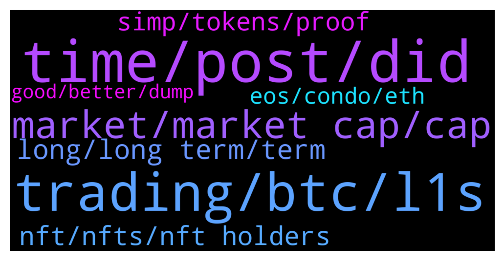

# **@shitpool**
 ## Analysis for **2022-01-16** - **2022-01-17**.

---

## 📊 **Basic Stats**

**n_messages_sent**: 208

---

---

## 🔝 **Top keywords and related messages**

1. **time, post, did**

    @brendanplayford --- *lol - I appreciate the confidence but I do not always have time to post exits or changes to strat,* **--->** [TG Discussion](https://t.me/shitpool/717074)

    @brendanplayford --- *Hmm when you say it like that* **--->** [TG Discussion](https://t.me/shitpool/717173)

    @pizza_dog --- *ohm did it so why wouldn't time* **--->** [TG Discussion](https://t.me/shitpool/717375)

    @brendanplayford --- *Maybe just need to give a load away to WP.* **--->** [TG Discussion](https://t.me/shitpool/717174)

    @onchainjoe --- *did you copy paste what you forwarded yesterday?* **--->** [TG Discussion](https://t.me/shitpool/717513)

    @Chnuschper --- *Every great era starts with memes tbf* **--->** [TG Discussion](https://t.me/shitpool/717544)

2. **trading, btc, l1s**

    @wonderwarraior --- *I don't think it can outperform buying early in L1s and holding for many multiples but maybe it works for you. thanks for sharing anyways* **--->** [TG Discussion](https://t.me/shitpool/717117)

    @Horselorde --- *Tbh I wouldn’t sell rn. Everything is down aside from a few coins.* **--->** [TG Discussion](https://t.me/shitpool/717380)

    @wonderwarraior --- *Why do you day trade L1s sir? it's very simple to buy L1s low and sell when 5x-10x and move to the next one* **--->** [TG Discussion](https://t.me/shitpool/717111)

    @brendanplayford --- *I also like selling into positive money flow as the green shows money flowing-in. I like buying when money is flowing out which would be red* **--->** [TG Discussion](https://t.me/shitpool/717102)

    @BeAMightyKing --- *I'm thinking similarly, as it's hard for me to see most top 20 L1s seeing significantly more upside without BTC 1st clearing $69k, past $100k & beyond.  But maybe this is old skool thinking and perhaps we've transitioned to a market where BTC & alts move up together without a surge in BTC dominance* **--->** [TG Discussion](https://t.me/shitpool/717142)

    @da0man --- *best trade here is to go all in KEEP and sell for 50%-200% when T gets listed on every exchange soon* **--->** [TG Discussion](https://t.me/shitpool/717082)

3. **market, market cap, cap**

    @rogerredis --- *I kinda think that too, that man is behind this girl nfts. Either boyfriend or smth  Literally get a model and split the profits* **--->** [TG Discussion](https://t.me/shitpool/717455)

    @BigBombo --- *Shiba $69bn market cap: everything is fine Top tier explosive growth hugely influential influencer launching Decentralized version of OnlyFans, Discord, Twitch, and Patreon being valued at $4m market cap: End of times; civilization has fallen; what have we become; shit has gone too far; this is all definitely a ponzi I see it clearly now* **--->** [TG Discussion](https://t.me/shitpool/717480)

    @BigBombo --- *almost everyone here / most ppl in crypto generally started from somewhere between nothing and not much* **--->** [TG Discussion](https://t.me/shitpool/717509)

    @BigBombo --- *It's a $10m market cap bet on decentralized onlyfans/Patreon/twitch/discord by top 3 overall and top growth crypto girl influencer* **--->** [TG Discussion](https://t.me/shitpool/717566)

    @BigBombo --- *She has 400k insta followes, 100k+ twitter followers and been konomi CM for a year ish, she's not some fiverr / stock photo hire* **--->** [TG Discussion](https://t.me/shitpool/717501)

    @BigBombo --- *Launched by the number 1 growth crypto-girl-influencer in a very competitive crowded market* **--->** [TG Discussion](https://t.me/shitpool/717304)

4. **long, long term, term**

    @Horselorde --- *Been taking profits here and there, still have about 1/4 my original bag* **--->** [TG Discussion](https://t.me/shitpool/717128)

    @wonderwarraior --- *Currently Near and FTM. Added some DOGE too on the recent dump + long term Avax bags* **--->** [TG Discussion](https://t.me/shitpool/717127)

    @brendanplayford --- *I have been in the space since 2013 and have long term bags - I enjoy day trading as well* **--->** [TG Discussion](https://t.me/shitpool/717120)

    @brendanplayford --- *I do have very long term DOGE from 2013 first blocks hahah* **--->** [TG Discussion](https://t.me/shitpool/717135)

    @wonderwarraior --- *Wow, so you didn't sell even at 0.8$!? It will be very difficult for DOGE to ever go back there now* **--->** [TG Discussion](https://t.me/shitpool/717136)

    @Horselorde --- *Love me some radix, been  holding for a few years now, done very well* **--->** [TG Discussion](https://t.me/shitpool/717124)

5. **nft, nfts, nft holders**

    @Rjknew --- *probably, but more to NFT holders is my guess* **--->** [TG Discussion](https://t.me/shitpool/717450)

    @Rjknew --- *Next step > Airdrop to NFT holders > Which can be used to mint shit on there Dao* **--->** [TG Discussion](https://t.me/shitpool/717448)

    @Bobbycat32 --- *Guys are you grinding discord to get nft whitelist too?* **--->** [TG Discussion](https://t.me/shitpool/717263)

    @BigBombo --- *I missed the NFT mania largely but this I can get behind* **--->** [TG Discussion](https://t.me/shitpool/717546)

    @R0mster --- *Broke: NFTs becoming productive assets Woke; Reproductive assets becoming NFTs* **--->** [TG Discussion](https://t.me/shitpool/717356)

    @mrlurah --- *Ftm looking ready to reclaim ath* **--->** [TG Discussion](https://t.me/shitpool/717253)

6. **simp, tokens, proof**

    @brendanplayford --- *One day. Building a defi credit protocol to replace equifax, Experian, transunion first. Lending needs democratization* **--->** [TG Discussion](https://t.me/shitpool/717168)

    @BigBombo --- *I literally built my bankroll off Dovey Wan tweets about chinese inside info about ltc segwit stuff, btc bans, plustoken etc scams there - simping is in my crypto DNA* **--->** [TG Discussion](https://t.me/shitpool/717547)

    @BigBombo --- *Dont take this one too seriously lol, but if an earnest SoCol effort for decentralised onlyfans / patreon etc actually happens, I like the EV @ this puny market cap. I'm sure a huge chunk of $socol supply will be dropped to proof of simpers* **--->** [TG Discussion](https://t.me/shitpool/717542)

    @Rjknew --- *claim your simp based on following time on Twitter or somethign* **--->** [TG Discussion](https://t.me/shitpool/717453)

    @BigBombo --- *I think huge chunk of socal tokens will be airdropped to proof of simpers* **--->** [TG Discussion](https://t.me/shitpool/717452)

    @BigBombo --- *Literally burning $170 per tx to buy simp tokens.  What is life tho.* **--->** [TG Discussion](https://t.me/shitpool/717313)

7. **eos, condo, eth**

    @kekurikekukaka --- *Take care of XRP and EOS, please kind sir.* **--->** [TG Discussion](https://t.me/shitpool/717177)

    @da0man --- *much easier to write contracts on EOS, because ETH is super limited in terms of processing power* **--->** [TG Discussion](https://t.me/shitpool/717572)

    @brendanplayford --- *ETH starting is painful (for some) journey to $2600* **--->** [TG Discussion](https://t.me/shitpool/717534)

    @BigBombo --- *"I was living in a 34sqm condo.  All I had was a pathetic 49" 4k tv with gross to look at LED tech.  I had one 27" monitor only, a 4 year old dell, thick bezels, with a 4th gen intel i7.  I couldn't even afford a watercooler for it.  I was using a $10 mic for teamspeak.  My desk was so small it restricted movement through my condo and was attached to my kitchen table.  But I believed in bitcoin, and I kept longing the dips 10x or more on mex.  Now I live in a 120sqm condo.  I have 2 oled TV's, one of them 65".  Multiple monitors.  An office with a massive sit stand desk and my mic is professional quality on a fully articulating boom stand.  Because I believed in mewn and BTFD like I am now again too"* **--->** [TG Discussion](https://t.me/shitpool/717506)

    @Chnuschper --- *Eos and shib were worse imo* **--->** [TG Discussion](https://t.me/shitpool/717557)

    @da0man --- *what did you guys thought I sold my EOS ?* **--->** [TG Discussion](https://t.me/shitpool/717570)

