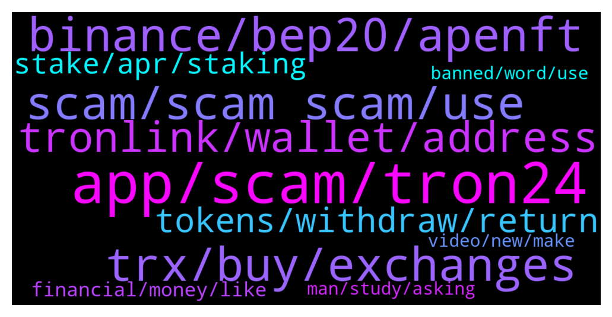

# **@tronnetworkEN**
 ## Analysis for **2022-01-16** - **2022-01-17**.

---

## 📊 **Basic Stats**

**n_messages_sent**: 451

---

---

## 🔝 **Top keywords and related messages**

1. **app, scam, tron24**

    @N/A --- *I was scammed for $400 from a fake Tron site yesterday so any compensation would be welcome here* **--->** [TG Discussion](https://t.me/tronnetworkEN/3835029)

    @Neeraj --- *Tron24 use tron name that way people join this app auther name not join this app* **--->** [TG Discussion](https://t.me/tronnetworkEN/3837251)

    @Kd --- *Is tron24 mining app is real app or fake app from tron community?* **--->** [TG Discussion](https://t.me/tronnetworkEN/3836146)

    @mcoshor2010 --- *What is happening here. Is it tron24 telegram group?* **--->** [TG Discussion](https://t.me/tronnetworkEN/3837122)

    @agentpiki --- *Does it say tron24?   IT IS TRON ONLY.   Tron24 is scam* **--->** [TG Discussion](https://t.me/tronnetworkEN/3837195)

    @PiterSpain --- *I'm sorry for your loss :(  There is no mining on TRON so stay away from mining apps   Please next time use the search 🔎 and search for key words, you will see many negative comments about tron24* **--->** [TG Discussion](https://t.me/tronnetworkEN/3835590)

2. **trx, buy, exchanges**

    @zingustan --- *Sir the transaction fee is too high make it low then I invest all my money in tron* **--->** [TG Discussion](https://t.me/tronnetworkEN/3837700)

    @Apurv9 --- *Then how tron buy and sell from TRX ?* **--->** [TG Discussion](https://t.me/tronnetworkEN/3837201)

    @Pablo_oss --- *But trx has the least growth among them* **--->** [TG Discussion](https://t.me/tronnetworkEN/3834787)

    @Pablo_oss --- *Yes. That's right I've been holding trx for 16 months and bought it at 2.5 cents when the bnb was $ 20 ada 5 cents   Why hasn't trx grown with this powerful network like them? I'm totally confused* **--->** [TG Discussion](https://t.me/tronnetworkEN/3834795)

    @Pablo_oss --- *Sir, why is not the main focus of the team on trx? How long has it been just talking about btt sun...* **--->** [TG Discussion](https://t.me/tronnetworkEN/3834779)

    @ccmedianetwork --- *Trx maximum 0.4 this year, next maybe hit 1-1.5$, not 10. Commission on transaction big from eth.* **--->** [TG Discussion](https://t.me/tronnetworkEN/3834648)

3. **scam, scam scam, use**

    @Moneyversac --- *And you didn't think it was a scam hahhahahah* **--->** [TG Discussion](https://t.me/tronnetworkEN/3835603)

    @Neeraj --- *How do you not know about this scam* **--->** [TG Discussion](https://t.me/tronnetworkEN/3836712)

    @Carlos_TRX --- *Scam, nobody will give you free money* **--->** [TG Discussion](https://t.me/tronnetworkEN/3835403)

    @PiterSpain --- *I can't figure out how people still fall in such low level scams* **--->** [TG Discussion](https://t.me/tronnetworkEN/3837237)

    @7777777777777777777 --- *I got 100 scamers in pm...* **--->** [TG Discussion](https://t.me/tronnetworkEN/3835645)

    @agentpiki --- *Can deploy bot which says these kind of stuff are scams?* **--->** [TG Discussion](https://t.me/tronnetworkEN/3837241)

4. **binance, bep20, apenft**

    @TGamechanger --- *How can you verify on Binance.US that USDT TRC20 is the option that you are buying?* **--->** [TG Discussion](https://t.me/tronnetworkEN/3837562)

    @simon866 --- *Yeah currently if you still hold ETH version it is automatically converted on binance* **--->** [TG Discussion](https://t.me/tronnetworkEN/3833692)

    @Devithan --- *i didnt get transfer of trx from tronlink to binance* **--->** [TG Discussion](https://t.me/tronnetworkEN/3836408)

    @Rick --- *Issue with Binance is its limited to which coumntry they allow you to trade* **--->** [TG Discussion](https://t.me/tronnetworkEN/3833706)

    @Rick --- *Hi Jason, I cannot use Binance* **--->** [TG Discussion](https://t.me/tronnetworkEN/3833738)

    @7777777777777777777 --- *Hello everyone, how converte bep20 nft to trc20? 🤔* **--->** [TG Discussion](https://t.me/tronnetworkEN/3835424)

5. **tronlink, wallet, address**

    @NguraSailo --- *i have trx bep20 on Trust Wallet. How do I exchange it for tron mainnet* **--->** [TG Discussion](https://t.me/tronnetworkEN/3836944)

    @Rick --- *Quick question, is there a way to convert old TRX token to the current token?* **--->** [TG Discussion](https://t.me/tronnetworkEN/3833689)

    @TGamechanger --- *Can TRONLINK accept ACH or wire transfers from the bank?  I can’t find the option* **--->** [TG Discussion](https://t.me/tronnetworkEN/3837542)

    @cryptonikko --- *I tried to deposit 10 TRX from other wallet to new wallet but it says insufficient fund. I tried to adjust to 8 TRX but still same error. I don't have this problem my other wallet.* **--->** [TG Discussion](https://t.me/tronnetworkEN/3835871)

    @mada6344 --- *Can i deposit trc20 to tronlink* **--->** [TG Discussion](https://t.me/tronnetworkEN/3835245)

    @Certis --- *I used the address Collectibles - APENFT - contact address. Which is listed in my TronLink wallet, it's been about 40 minutes and still nothing has come* **--->** [TG Discussion](https://t.me/tronnetworkEN/3834712)

6. **tokens, withdraw, return**

    @RvRvRv577 --- *They promised 2-2.5* return with in 20 days* **--->** [TG Discussion](https://t.me/tronnetworkEN/3835599)

    @Tshi --- *Thank you. My balance is below 100 000. I guess moving the tokens back to the exchange might be a better option* **--->** [TG Discussion](https://t.me/tronnetworkEN/3835084)

    @Moneyversac --- *Check their issuer wallet, maybe they made a contract* **--->** [TG Discussion](https://t.me/tronnetworkEN/3837311)

    @metacrylic --- *Hello Jason i can't restake jUSDJ on any platform ?* **--->** [TG Discussion](https://t.me/tronnetworkEN/3834567)

    @metacrylic --- *what can i do with jUSDJ tokens ?* **--->** [TG Discussion](https://t.me/tronnetworkEN/3834561)

    @MilNoslen --- *Then you essentially have dead tokens now, sorry* **--->** [TG Discussion](https://t.me/tronnetworkEN/3833740)

7. **stake, apr, staking**

    @PiterSpain --- *🔥Application for SUN.  io #Governance Mining Is OPEN Now  🚨ATTENTION: We only accept applications submitted via the application form https://docs.google.com/forms/d/e/1FAIpQLSdjbpyBr4JVVlHoj6PUDLOxoqKE33EuCnkwSU04_DMaFkFePg/viewform  🙌Details for joining and increasing the project awareness: https://sunio.zendesk.com/hc/en-us/articles/4413888219161   📩How to apply?  ✅Create #SunSwap V2 LP in token pairs with #TRX or #USDT ✅The value & daily trading volume of your LP reach a certain amount over 14 days ✅Lock over 10,000,000 $SUN on SUN.io for 4 years to gain voting rights (veSUN)  https://twitter.com/defi_sunio/status/1481864510231429124* **--->** [TG Discussion](https://t.me/tronnetworkEN/3833887)

    @Ivan --- *hi guys, just one question, pls. What does it mean to stake tron. in one sentence.* **--->** [TG Discussion](https://t.me/tronnetworkEN/3835883)

    @Moneyversac --- *Well then just calculate with 6%* **--->** [TG Discussion](https://t.me/tronnetworkEN/3837357)

    @simon866 --- *Then you times the results by 3 then add that percentage to the amount you want to stake 👍* **--->** [TG Discussion](https://t.me/tronnetworkEN/3837338)

    @sirahtifa --- *Hello friend i want to stake 10000 tron in trust wallet through tronscan. But what i don't understand is this APR  3.54_ 5% what is that mean? Note am new to staking. Thanks* **--->** [TG Discussion](https://t.me/tronnetworkEN/3837546)

    @afrifaba --- *Please what is the meaning of stake?  I'm a newbie* **--->** [TG Discussion](https://t.me/tronnetworkEN/3836937)

8. **financial, money, like**

    @Moneyversac --- *Like google for financial Strategies and money Management* **--->** [TG Discussion](https://t.me/tronnetworkEN/3835621)

    @agentpiki --- *Use the search option here man. Keyword is "earn"* **--->** [TG Discussion](https://t.me/tronnetworkEN/3837824)

    @Moneyversac --- *I will make Neeraj24 now so your friends Believe it's you and invest in me I am going to be rich wohoo🙏* **--->** [TG Discussion](https://t.me/tronnetworkEN/3837301)

    @BOY_CRYPTO --- *help me to earn money pls* **--->** [TG Discussion](https://t.me/tronnetworkEN/3836465)

    @agentpiki --- *Read message above by Moneyversac  Good content about earning* **--->** [TG Discussion](https://t.me/tronnetworkEN/3835630)

    @ccmedianetwork --- *Hi my financial advisor ))) Joke bro 😁* **--->** [TG Discussion](https://t.me/tronnetworkEN/3834341)

9. **video, new, make**

    @afrifaba --- *I'm a newbie that's why but I'm sorry* **--->** [TG Discussion](https://t.me/tronnetworkEN/3837800)

    @Neeraj --- *But you don’t about this all YouTube with web site* **--->** [TG Discussion](https://t.me/tronnetworkEN/3836711)

    @Uchiha --- *This is not funny at all* **--->** [TG Discussion](https://t.me/tronnetworkEN/3837617)

    @Moneyversac --- *Need to make new videos soon* **--->** [TG Discussion](https://t.me/tronnetworkEN/3835638)

    @Moneyversac --- *Now you know for next time. It hurts but you will never forget to do research from now on* **--->** [TG Discussion](https://t.me/tronnetworkEN/3835583)

    @Moneyversac --- *Yesterday I tried to do a quick new Video but there was just sooo many things I could explain that the video was already to long. I ended up deleting it 😅* **--->** [TG Discussion](https://t.me/tronnetworkEN/3835339)

10. **man, study, asking**

    @agentpiki --- *No man, you are just asking tons of questions. Seriously, I studied on my own without any help. You just need to ask if sources are legit or not but that is common sense too* **--->** [TG Discussion](https://t.me/tronnetworkEN/3837798)

    @afrifaba --- *Naa bro, we are learning together🙏* **--->** [TG Discussion](https://t.me/tronnetworkEN/3837794)

    @agentpiki --- *You are taking us for granted. You study on your own is the right thing to do man* **--->** [TG Discussion](https://t.me/tronnetworkEN/3837790)

    @Moneyversac --- *Did you guys all sleep in math class?* **--->** [TG Discussion](https://t.me/tronnetworkEN/3837336)

    @agentpiki --- *I am glad you want to learn more, I think you a cool guy. 👌 pls read for more info* **--->** [TG Discussion](https://t.me/tronnetworkEN/3837808)

    @ccmedianetwork --- *No, how i understand question dude - i answer.* **--->** [TG Discussion](https://t.me/tronnetworkEN/3834721)

