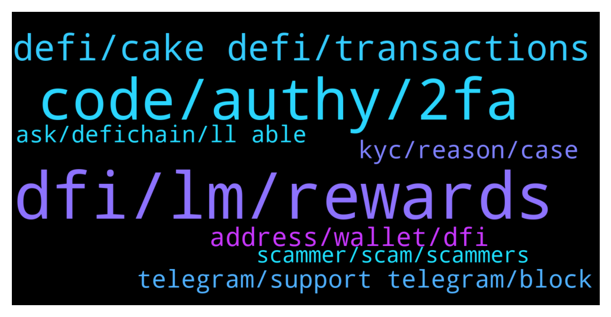

# **@CakeDeFi_EN**
 ## Analysis for **2022-01-17** - **2022-01-18**.

---

## 📊 **Basic Stats**

**n_messages_sent**: 162

---

---

## 🔝 **Top keywords and related messages**

1. **dfi, lm, rewards**

    @rent_e_motion --- *What is better : stacking 2000 usd as dfi or mining with 1000 dusd/ dfi? What are ups and downs of both methods?* **--->** [TG Discussion](https://t.me/CakeDeFi_EN/165652)

    @J --- *Are there any plans of adding the mining of more coins like Solana, XRP, Luna, DOT, etc?* **--->** [TG Discussion](https://t.me/CakeDeFi_EN/165688)

    @TaosBE --- *Hello, anyone got trouble when he wants to add liquidity ? I always got 'price expired' right after confirmation page pops up 😥* **--->** [TG Discussion](https://t.me/CakeDeFi_EN/165487)

    @busukman --- *Q: lets say total assets worth usd 100, and my rewards is usd1. Does that reward usd1 already included in my total assets worth?* **--->** [TG Discussion](https://t.me/CakeDeFi_EN/165560)

    @Basti_850 --- *Why is DUSD not 1 Dollar? I dont understand* **--->** [TG Discussion](https://t.me/CakeDeFi_EN/165620)

    @trzglhome --- *Hello, 30 dollars for my reference, how many dollars is the dfi worth to me?* **--->** [TG Discussion](https://t.me/CakeDeFi_EN/165759)

2. **code, authy, 2fa**

    @William --- *Sorry.  I am looking at my “activity” but don’t see “export”* **--->** [TG Discussion](https://t.me/CakeDeFi_EN/165470)

    @adghuunb --- *The aop has not be update since one month so may be we need nee update for it* **--->** [TG Discussion](https://t.me/CakeDeFi_EN/165862)

    @Cryptoziano --- *Is the platform down right now? I cannot log in.* **--->** [TG Discussion](https://t.me/CakeDeFi_EN/165718)

    @Neil --- *I did have it enabled but authy has forgotten that I had a cake account. So cake isn't recognising the code I generate* **--->** [TG Discussion](https://t.me/CakeDeFi_EN/165885)

    @Neil --- *Thanks, im not looking to disable it but when I updated authy it seems to.have lost cake as an account. So not sure how to re add without a qr code* **--->** [TG Discussion](https://t.me/CakeDeFi_EN/165882)

    @BerndMack --- *it is not available on the mobile yet. please use the browser* **--->** [TG Discussion](https://t.me/CakeDeFi_EN/165473)

3. **defi, cake defi, transactions**

    @BerndMack --- *cake is a company, not a blockchain. At the moment cake supports the following blockchains: Bitcoin, Ethereum, Defichain, Dash, Litecoin, BitcoinCash* **--->** [TG Discussion](https://t.me/CakeDeFi_EN/165443)

    @BerndMack --- *i would use the deposit address, but perhaps you should check out the transaction report for the taxes* **--->** [TG Discussion](https://t.me/CakeDeFi_EN/165437)

    @William --- *I sent from Blockfi to cake* **--->** [TG Discussion](https://t.me/CakeDeFi_EN/165445)

    @Serenity --- *Hello Cake Defi EN Team, im waiting for verification in my account to complete. Appreciate if you can have it reviewed faster. Thank you.* **--->** [TG Discussion](https://t.me/CakeDeFi_EN/165835)

    @BerndMack --- *if you sent BTC it is the bitcoin blockchain, for ethereum it is the ethereum blockchain.* **--->** [TG Discussion](https://t.me/CakeDeFi_EN/165448)

    @Rotua2 --- *Hello admin, i am from indonesia. I want to complain about KYC. In cake defi web, there is no form for ID citizen. I do not have pasport. And also my home address ,that is not recognize in website cake defi* **--->** [TG Discussion](https://t.me/CakeDeFi_EN/165971)

4. **address, wallet, dfi**

    @Roxxiej --- *Ok thank you, im battling with my proof of address on my bank statement my physical address is on there and defi keeps rejecting it* **--->** [TG Discussion](https://t.me/CakeDeFi_EN/166092)

    @GK --- *Hi, I've set up a DFI wallet on my desktop. I've also set up a receive address and given it a label. I know this is probably obvious, but if I want to add DFI tokens can I confirm that I now simply use the new receive address for a withdrawal from my cake dfi wallet?* **--->** [TG Discussion](https://t.me/CakeDeFi_EN/165526)

    @William --- *They need to know what blockchain that address is on.* **--->** [TG Discussion](https://t.me/CakeDeFi_EN/165447)

    @William --- *Ok so what about the wallet address.* **--->** [TG Discussion](https://t.me/CakeDeFi_EN/165436)

    @BerndMack --- *perhaps just use that address where you sent to* **--->** [TG Discussion](https://t.me/CakeDeFi_EN/165446)

    @kisundamotekar --- *I cant verify my identity, cause I only have National Identity Card not Passport* **--->** [TG Discussion](https://t.me/CakeDeFi_EN/165956)

5. **kyc, reason, case**

    @springle0514 --- *Hello I just signed up for cake And I submitted all my documents for KYC and then the next day I got a message saying that I was banned for violating the terms and conditions. Is there an admin here who can help me with this and tell me exactly what I did to violate the terms?  Thanks* **--->** [TG Discussion](https://t.me/CakeDeFi_EN/165777)

    @springle0514 --- *Is it possible I can get a little more explanation? I’m from Los Angeles, CA USA and provided my DL. Is it not allowed from where I am?* **--->** [TG Discussion](https://t.me/CakeDeFi_EN/165787)

    @jezzkng --- *For banned account, it's subject to our kyc team's decision by referencing the local law. sorry we prob might not be able to help.* **--->** [TG Discussion](https://t.me/CakeDeFi_EN/165785)

    @jezzkng --- *Hello, the email should have explained you the message with details. There are rules and regulatory guideline in place, so some cases could be flagged.* **--->** [TG Discussion](https://t.me/CakeDeFi_EN/165779)

    @Serenity --- *to whom can i report it? She goes by the name Merit. Got a screenshot of her profile.* **--->** [TG Discussion](https://t.me/CakeDeFi_EN/166051)

    @DmgBautista --- *You always get an email informing if your KYC procedure was successful or not and in case it was unsuccessful, the reason why, so you can act upon it. If you dis not received an email approving your KYC, you will need to wait. KYC procedures take at least 24h usualy to be processed if everything is ok* **--->** [TG Discussion](https://t.me/CakeDeFi_EN/165784)

6. **telegram, support telegram, block**

    @Roxxiej --- *I have and they gave me the option to use telegram* **--->** [TG Discussion](https://t.me/CakeDeFi_EN/166098)

    @DmgBautista --- *Also, tale care with scammers, as this is a public chat. No mod will DM or call you directly, as well as there is also not support in telegram, so also block and report any fictional support that might DM or call you. Only the Cake official channels are the way to go. Stay safe! 👍* **--->** [TG Discussion](https://t.me/CakeDeFi_EN/165791)

    @DmgBautista --- *Could you be a bit more clear? Please have in mind that there is no official support in telegram. Block and report any DM or call from anyone claiming to be a mod or a fictional support. No Mod will ever DM or call you and there is no support in telegram. Only this channel or Cake official contacts must be considered. Other than that, boa tarde!  Any issue can be adressed to   https://cake.zendesk.com/hc/en-us/requests/new  But if you could be more specific, we can better direct you 🙂* **--->** [TG Discussion](https://t.me/CakeDeFi_EN/165671)

    @zachgax --- *The kyc procedure includes sensitive private information. I highly doubt they would ask you to contact anyone via telegram. Especially a public chat group. Do take care and double check your email source. Amd don’t answer private telegram messages. There is no support on telegram.* **--->** [TG Discussion](https://t.me/CakeDeFi_EN/166101)

    @Kassius84 --- *I whould recommend to check you privacy settings on Telegram* **--->** [TG Discussion](https://t.me/CakeDeFi_EN/165462)

    @DmgBautista --- *He doesnt need to see your phone. Telegram allows anyone to contact you directly, just by clicking in the call icon.   To block that, you need to change your telegram settings to only allow your direct contacts to write/call you.  Other than that, always remember that no mod will ever DM you or call you. Also, there is no support on telegram.  So just block and report any unsolicited DM or call. Take care! 👍* **--->** [TG Discussion](https://t.me/CakeDeFi_EN/165461)

7. **ask, defichain, ll able**

    @springle0514 --- *Thanks man. I sent a message. I’ve already received 5 admins messages lol* **--->** [TG Discussion](https://t.me/CakeDeFi_EN/165792)

    @rbteixeira7 --- *Hello guys, I need support !!!!! Do you have a email?* **--->** [TG Discussion](https://t.me/CakeDeFi_EN/165669)

    @YSL --- *Pls join defichain channel, moderator in defichain ll be able to assist you   https://t.me/defiblockchain* **--->** [TG Discussion](https://t.me/CakeDeFi_EN/165563)

    @Michael_Schredl --- *Sure, ask your question in the group (:* **--->** [TG Discussion](https://t.me/CakeDeFi_EN/166091)

    @AtefHabita --- *Am new member Am from Tunisia 🇹🇳* **--->** [TG Discussion](https://t.me/CakeDeFi_EN/166002)

    @happysunday12 --- *Hello everyone  I’m a new in here so nice to meet you.* **--->** [TG Discussion](https://t.me/CakeDeFi_EN/165962)

