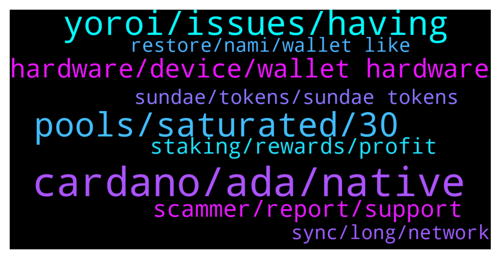

# **@Cardano**
 ## Analysis for **2022-01-17** - **2022-01-18**.

---

## 📊 **Basic Stats**

**n_messages_sent**: 329

---

---

## 🔝 **Top keywords and related messages**

1. **cardano, ada, native**

    @colombos1991 --- *I think is more trusted to use cardano wallet that was made by cardano and not other company..* **--->** [TG Discussion](https://t.me/Cardano/771283)

    @ExInfernis --- *Does anyone know why most of the dapps on cardano are not supporting official wallets like yoroi/daedalus? For example sundae swap is supporting nami and ccvault. I dont see any good reason for this is as a lot of people are using the official wallets for safety.* **--->** [TG Discussion](https://t.me/Cardano/770948)

    @MrBrinker --- *Bep20 is not ADA the native currency of Cardano blockchain, it is a token o  Binance Chain. If you want to stake or use any other native Cardano Dapp you need to have native ADA* **--->** [TG Discussion](https://t.me/Cardano/770262)

    @apex_pool_spo --- *not really, and that was not the reason.* **--->** [TG Discussion](https://t.me/Cardano/771360)

    @BabyImReckless --- *does anyone know if there is a wallet that lets you stake bep20 Cardano?  for standard Cardano?* **--->** [TG Discussion](https://t.me/Cardano/771207)

    @colombos1991 --- *Last question:) So the only wallet that cardano team itself was made is deadalus?* **--->** [TG Discussion](https://t.me/Cardano/771281)

2. **pools, saturated, 30**

    @mostudio --- *any of the scooper pools are good, just make sure the one you are joining is not over saturated* **--->** [TG Discussion](https://t.me/Cardano/771454)

    @Naheem --- *Yeah was thinking it mist be that* **--->** [TG Discussion](https://t.me/Cardano/770604)

    @Joshua --- *What iso pools do yall recommend staking in?* **--->** [TG Discussion](https://t.me/Cardano/771443)

    @mostudio --- *30 pools out of normally 3000 pools* **--->** [TG Discussion](https://t.me/Cardano/771471)

    @glitch04 --- *pooltool.io top left "export for taxes"* **--->** [TG Discussion](https://t.me/Cardano/770911)

    @Tustyrusty --- *Hi does anyone know the exact purpose of the "waitlist" under the 30 preferred pools? Tia* **--->** [TG Discussion](https://t.me/Cardano/771372)

3. **yoroi, issues, having**

    @awilliams_8 --- *Yeah, I just get an error message saying "Error received from server".. I have contacted Yoroi support and waiting for a reply* **--->** [TG Discussion](https://t.me/Cardano/769961)

    @Heather --- *Thank you so much for that confirmation. I think yproi has had an upgrade so, just soring tbis now..* **--->** [TG Discussion](https://t.me/Cardano/770488)

    @pool0AAAA --- *Yes, problem with Yoroi, you are not alone. :)* **--->** [TG Discussion](https://t.me/Cardano/770838)

    @Shark1alfa --- *Hi. Brave says "yoroi is dissabled". How can i fix it?* **--->** [TG Discussion](https://t.me/Cardano/771021)

    @Sexy_Stacie --- *I have been having issues connecting with Yoroi since last night.* **--->** [TG Discussion](https://t.me/Cardano/769972)

    @MrBrinker --- *Yeah, unfortunately Yoroi is having issues.* **--->** [TG Discussion](https://t.me/Cardano/770258)

4. **hardware, device, wallet hardware**

    @colombos1991 --- *So you can say that to use hardware wallet with Adalite os better than to use deadalus without hardware wallet?* **--->** [TG Discussion](https://t.me/Cardano/771277)

    @glitch04 --- *Depends on if you have resources to run the full wallet or not* **--->** [TG Discussion](https://t.me/Cardano/771253)

    @glitch04 --- *they use less resources but the risk is you losing a little bit of the security unless you have the wallet hardware secured* **--->** [TG Discussion](https://t.me/Cardano/771269)

    @MrBrinker --- *Yes, Daedalus is a full node client so you have a copy of the blockchain, this days you would need at least 16GB RAM to have a good experience* **--->** [TG Discussion](https://t.me/Cardano/770284)

    @glitch04 --- *No need to transfer the data is on the block chain not the wallet interface just be careful where you enter those recovery seeds as they are the master key to your wallet* **--->** [TG Discussion](https://t.me/Cardano/770575)

    @colombos1991 --- *What you mean is light version? Is less safe?* **--->** [TG Discussion](https://t.me/Cardano/771266)

5. **scammer, report, support**

    @glitch04 --- *dm me and I can take a look anyone that dm's you first is a scammer* **--->** [TG Discussion](https://t.me/Cardano/771145)

    @glitch04 --- *Don't respond to anyone that dm's you acting as support use the channel listed above* **--->** [TG Discussion](https://t.me/Cardano/770562)

    @glitch04 --- *Not a problem, just remember no support or staff will dm you so anyone that does please block and report them as they are scammers trying to get your ada* **--->** [TG Discussion](https://t.me/Cardano/770489)

    @glitch04 --- *Anyone that sends you a dm acting as support is a scammer no admin will message you first.* **--->** [TG Discussion](https://t.me/Cardano/771243)

    @glitch04 --- *Support/admins will not message you directly if someone does block and report that account they are a scammer.  If you need #support us the channel listed below* **--->** [TG Discussion](https://t.me/Cardano/771034)

    @glitch04 --- *Also be warned that anyone sending you dm's is a scammer even if they appear to be from one of our accounts we will not send you messages first.* **--->** [TG Discussion](https://t.me/Cardano/770619)

6. **staking, rewards, profit**

    @AndyCryptos --- *Hi, Is there a software/website where I can get brake down of all my staking rewards and £price attached per epoch? I'm in the UK and have to declare it all as income on my tax return. Doing it manually will take days considering I have several wallets.* **--->** [TG Discussion](https://t.me/Cardano/770797)

    @glitch04 --- *As long as you are holding an asset that fluctuates it will continue to do so, Unless you are planning to sell all now and wait for that asset to drop and re-buy at a lower price later ada will continue to rise and fall with the markets.  So If you want to take some profit from the holdings you can just send the amount you want to convert to stables to the exchange directly. You may have to claim your rewards first depending on how much that is you want to send over to the exchange.* **--->** [TG Discussion](https://t.me/Cardano/770494)

    @Heather --- *Im confused. Im only wanting to take profits from.my total investment..Once i have done this. I would like to restake.* **--->** [TG Discussion](https://t.me/Cardano/770491)

    @glitch04 --- *If you are done staking you would claim your rewards so they are part of your balance send them to your choice of exchange then sell them to a stable coin or convert to your preferred currency* **--->** [TG Discussion](https://t.me/Cardano/770483)

    @glitch04 --- *If you are completely finished with your investment never to stake again you would want to use the red button when you claim your rewards but be warned this would void your 2 pending epochs of rewards by doing so* **--->** [TG Discussion](https://t.me/Cardano/770486)

    @Heather --- *What Id like to do is take profit from my total investment. Not just my rewards. Do I have to take the rewards from yoroi and then restake. Sorry.. feeling out of my depth.* **--->** [TG Discussion](https://t.me/Cardano/770480)

7. **sundae, tokens, sundae tokens**

    @CryptoM22 --- *But you will receive the sundae tokens from the Screenshots the first on January 25th?* **--->** [TG Discussion](https://t.me/Cardano/771598)

    @Aaron --- *when sundae swap launches, can I swap ada to sundae on their dex? Or how can I buy sundae?* **--->** [TG Discussion](https://t.me/Cardano/771322)

    @Dandimatt --- *Hello is this the right place for a question about sundaswap?* **--->** [TG Discussion](https://t.me/Cardano/770037)

    @mostudio --- *Are you looking to stake for sundaeswap tokens too?* **--->** [TG Discussion](https://t.me/Cardano/771452)

    @franzxzd --- *20th to start staking to get sundae?* **--->** [TG Discussion](https://t.me/Cardano/771301)

    @trollthetyrants --- *Hi.  What should i do to get free sundae tokens?* **--->** [TG Discussion](https://t.me/Cardano/771583)

8. **sync, long, network**

    @glitch04 --- *Then you haven't used a full node wallet, light wallets sync the transactions in the background and you don't typically notice the delay* **--->** [TG Discussion](https://t.me/Cardano/770288)

    @glitch04 --- *The more transactions that are processed on the network while it's offline the longer it will take* **--->** [TG Discussion](https://t.me/Cardano/770286)

    @Opopotomis --- *My Cardano Daedalus wallet is really sluggish and taking a long time to sync. Is this a normal experience?* **--->** [TG Discussion](https://t.me/Cardano/770283)

    @mostudio --- *please explain, i had no issues apart from sync time, which is network traffic* **--->** [TG Discussion](https://t.me/Cardano/771362)

    @Opopotomis --- *I understand... just never seen any wallet take this long... just seemed a bit excessive, time wise.* **--->** [TG Discussion](https://t.me/Cardano/770287)

    @TJSP2024 --- *How long does it usually take to restore a wallet in yoroi? Seems like its been a while 🤔* **--->** [TG Discussion](https://t.me/Cardano/771102)

