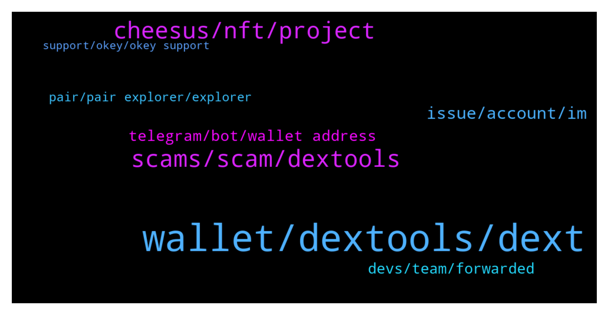

# **@DEXToolsCommunity**
 ## Analysis for **2022-01-16** - **2022-01-18**.

---

## 📊 **Basic Stats**

**n_messages_sent**: 363

---

---

## 🔝 **Top keywords and related messages**

1. **wallet, dextools, dext**

    @trojantechltd --- *Says no activity , but it’s at 5 cents not 1 cent* **--->** [TG Discussion](https://t.me/DEXToolsCommunity/326504)

    @Uturn --- *One more question, regards to the price alert feature, is there a way that Dev team can create a one reactivate button to reactivate all the price alert within one token? It’s really a hassle to reactivate one by one for just one token.* **--->** [TG Discussion](https://t.me/DEXToolsCommunity/325572)

    @bastardganpunk --- *you got the new coin airdropped into your wallet. you just need to add the contract address and you'll be able to see it 🙂* **--->** [TG Discussion](https://t.me/DEXToolsCommunity/325044)

    @JoeyDieleman --- *You don't pay for that  if you mean to let the price bot show charts it has to be available in dextools. Remember to set the PAIR contract, not the contract itself.  See this: https://link.medium.com/rvhhUpbSSmb* **--->** [TG Discussion](https://t.me/DEXToolsCommunity/325877)

    @stanes --- *You can hold 1k DEXT or pay the monthly membership. For that, connect your wallet to the app and follow instructions: https://www.dextools.io/app/user/account* **--->** [TG Discussion](https://t.me/DEXToolsCommunity/325005)

    @stanes --- *DEXT UNISWAP PAIR Chart and trade: https://www.dextools.io/app/uniswap/pair-explorer/0xa29fe6ef9592b5d408cca961d0fb9b1faf497d6d Contract: 0xfb7b4564402e5500db5bb6d63ae671302777c75a  DEXT PANCAKESWAP PAIR Chart and trade: https://www.dextools.io/app/pancakeswap/pair-explorer/0x4b729d5d871057f3a9c424792729217cde72410d Contract: 0xe91a8d2c584ca93c7405f15c22cdfe53c29896e3* **--->** [TG Discussion](https://t.me/DEXToolsCommunity/325009)

2. **scams, scam, dextools**

    @DiamondHandDaniel --- *You have read my DMs @pablojan but have given me no response  It's been weeks, please be professional and help us get this done* **--->** [TG Discussion](https://t.me/DEXToolsCommunity/325903)

    @stanes --- *Please DM @guillermorodriguez78 he is the person-in-charge.  Be aware of scammers, HE WILL NEVER DM YOU FIRST.* **--->** [TG Discussion](https://t.me/DEXToolsCommunity/325532)

    @napascual --- *Sure, just remember admins never dm first* **--->** [TG Discussion](https://t.me/DEXToolsCommunity/326413)

    @bastardganpunk --- *For ads and marketing please send a DM to @guillermorodriguez78 🙂* **--->** [TG Discussion](https://t.me/DEXToolsCommunity/325302)

    @stanes --- *Please be aware we can't avoid scams being created. We also can't stop smartcontracts doing what they are programmed to do.  We have some ways to alert people of a scam like the "contract details" and the community votes. Can we do more? Yes, we are working on adding more tools to reduce the risk for our users to fall into scams. But be sure there is no way to be secure if you don't DYOR.* **--->** [TG Discussion](https://t.me/DEXToolsCommunity/325424)

    @Ford_Probe1 --- *Hi can i dm you regarding a question?* **--->** [TG Discussion](https://t.me/DEXToolsCommunity/326410)

3. **cheesus, nft, project**

    @Natalia_Ave --- *well it depends on feature itself  Main things we’ve done already: - Beta tools launch on https://cheesus.ai/en  - Analyzed Uniswap and Pancakeswap Trading activity https://uniswap.defirating.finance/  - list of the most profitable wallets trading on Uni & Pancake - list of the most tradable tokens on Uni & Pancake - DeFi & NFT projects report https://888defi.biz/crypto/  - NFT Holders report  - Token - token holders report for ETH, BSC, Avalanche and Polygon  - Profit - tracking all trading history on ETH and BSC networks  - NFT market data for all NFT projects on Opensea with inside information - Flippers - report of Flippers and Diamond Hands (real holders) ETH, BSC, Avalanche, Polygon tokens - Avalanche and Polygon expansion  - NFT Metaverse tracker   Our long term plans are quite simple:  1. Expanding on other blockchains: Solana, Polkadot, Kusama  2. Implementing new features: Tax calculation, Bridge analytics, more DEXes to track more projects and data to review. 3. Updating current features   it's all for Q1-Q2 2022!  done* **--->** [TG Discussion](https://t.me/DEXToolsCommunity/326073)

    @xbtwael --- *I saw Cheesus launched  https://cheesus.ai/en/main can you share what that is?* **--->** [TG Discussion](https://t.me/DEXToolsCommunity/326058)

    @Natalia_Ave --- *Right! TGE is scheduled on 20 January and let's look through utilities  Paying for API access - our API is open and you can create your own applications and tools using our data and pay for it with the Cheesus token.  Paying for subscriptions  We are making 5 types of subscription where one of them is fully free.  As I've mentioned before MVPs are ready to use and some features are available.  According to our subscription system you'll need fixed amount of tokens to get access to expanded features including copytrading bot, VIP chat, API access and others.   Staking/Farmig token rewards   Data mining rewards + DAO governance  For this purpose we've made an achievement system, where it is users who decide to give achievement or not! Also you can create new ones.  For example they are: best researcher, best NFT researcher, best language localizator, project auditor.   and as we are launching soon, we prepared some perks for users!  Unlimited access to Cheesus’ premium services Access to private airdrops A passkey to NFT drops Bonuses when using Strong & Weak Hands staking A subscription to weekly newsletters with project reviews Access to a closed Discord channel with insider info Private Diamond Hands & Flippers report  done* **--->** [TG Discussion](https://t.me/DEXToolsCommunity/326064)

    @Natalia_Ave --- *Cheesus is a multi-chain DeFi analyzer that helps users find real gems without getting caught in any mouse traps focused on NFT Metaverses.   We scan blockchains like google scan the internet, where you can find anything and besides open, easy to find and easy to use info we give inside information like real movements of token, amount of bots, fake and insiders wallets. After all this data helps you to decide whether the project is worth investing in or not.  Our main goal is to give onchain truth to users including all DeFi segments like NFT Metaverses, Trading, token movements, insiders info about token holders, flippers & diamond hands. done* **--->** [TG Discussion](https://t.me/DEXToolsCommunity/326056)

    @Natalia_Ave --- *This is landing page for Cheesus project where you can find info about products, main usecases etc and go and try MVP tools already they are open for users!  done* **--->** [TG Discussion](https://t.me/DEXToolsCommunity/326060)

    @Natalia_Ave --- *Cheesus provides pure data and objective metrics to give you onchain truth, but we don't give you any financial advices or fully ensure security of any project  So metrics for every project includes: - project profit and loss  - different types of holders e.g. traders, who bring life by selling and buying tokens, holders, who just hold tokens, do nothing with them, freeloaders who receive tokens by airdrop or any free distribution. Moreover we can track bots and fake wallets who pump prices and increase trading volume.  These data show how active the project are and you can conclude whether the project is worth investing in.  done* **--->** [TG Discussion](https://t.me/DEXToolsCommunity/326087)

4. **issue, account, im**

    @cryptopete69 --- *it did show as this name, I already blocked this person anyway, sorry for the confusion* **--->** [TG Discussion](https://t.me/DEXToolsCommunity/326425)

    @rpoole69 --- *Having same issue, no vpn, intermittent* **--->** [TG Discussion](https://t.me/DEXToolsCommunity/326483)

    @gumbercules --- *Have you tried a different RPC? Are you on the ethereum network? If neither works then it's probably a honeypot contract. Also check if you have enough gas to cover the tx* **--->** [TG Discussion](https://t.me/DEXToolsCommunity/325638)

    @matt_000110 --- *It is annoying. I think they gave up w me* **--->** [TG Discussion](https://t.me/DEXToolsCommunity/326241)

    @ebuzerxy --- *alarm worked on ethereum network not working on binance network* **--->** [TG Discussion](https://t.me/DEXToolsCommunity/326559)

    @Monolithof --- *Ok the issue has been solved. Im back to standard account again* **--->** [TG Discussion](https://t.me/DEXToolsCommunity/325826)

5. **telegram, bot, wallet address**

    @fiesta_0604 --- *Members are abusing to watch the charts in Telegram and I want people not to use the command anymore!* **--->** [TG Discussion](https://t.me/DEXToolsCommunity/325234)

    @bastardganpunk --- *check here all telegram price bot functionalities https://dextools.medium.com/introducing-the-dextools-telegram-price-bot-21fdae07bb78* **--->** [TG Discussion](https://t.me/DEXToolsCommunity/325238)

    @bastardganpunk --- *Maybe you can ask your question here? The dev can’t respond every message on telegram, he needs to do his dev work. The admins can help you and answer your question 🙂* **--->** [TG Discussion](https://t.me/DEXToolsCommunity/325906)

    @stanes --- *Remove the bot from the group.* **--->** [TG Discussion](https://t.me/DEXToolsCommunity/325247)

    @JoeyDieleman --- *Yes easy peasy. The bot has no more use then giving prices, if you don't want it just remove it. And if you add it later on you can use it again* **--->** [TG Discussion](https://t.me/DEXToolsCommunity/325254)

    @bastardganpunk --- *you mean turn off the chart in the telegram bot* **--->** [TG Discussion](https://t.me/DEXToolsCommunity/325235)

6. **devs, team, forwarded**

    @kemosabemontoya --- *I see you have Fantom and Cronos live! Great Updates team!* **--->** [TG Discussion](https://t.me/DEXToolsCommunity/325812)

    @JoeyDieleman --- *Hmm.. will forward it to the devs* **--->** [TG Discussion](https://t.me/DEXToolsCommunity/326484)

    @stanes --- *Ok, forwarded to the devs, thanks.* **--->** [TG Discussion](https://t.me/DEXToolsCommunity/326353)

    @bastardganpunk --- *I forwarded it to the devs* **--->** [TG Discussion](https://t.me/DEXToolsCommunity/326329)

    @gumbercules --- *Cool, glad the classic worked lol* **--->** [TG Discussion](https://t.me/DEXToolsCommunity/325827)

    @FredericDEXT --- *@napascual is our lead dev, he can check.* **--->** [TG Discussion](https://t.me/DEXToolsCommunity/325763)

7. **pair, pair explorer, explorer**

    @Ri_maxy --- *I know this might sound dumb but please, where to I see the pair explorer?* **--->** [TG Discussion](https://t.me/DEXToolsCommunity/325912)

    @KDawgPL --- *had to come in and let you know how disgusting the new UI is. thought u would have changed it by now wtf* **--->** [TG Discussion](https://t.me/DEXToolsCommunity/325253)

    @rpoole69 --- *This pair is acting very strange, displaying duplicates, pauses for 30s then shows a bunch, etc bsc/pair-explorer/0x1ce76390dd210b9c9ae28373fdf79714206ecb73* **--->** [TG Discussion](https://t.me/DEXToolsCommunity/326530)

    @hjdhvfjgyng --- *Hot search, who should I look for* **--->** [TG Discussion](https://t.me/DEXToolsCommunity/325602)

    @stanes --- *When you are on a pair page it's the pair explorer. https://www.dextools.io/app/ether/pair-explorer/* **--->** [TG Discussion](https://t.me/DEXToolsCommunity/325914)

    @napascual --- *We’ve recovered a snapshot from yesterday, the pair should be updating in background 🙏* **--->** [TG Discussion](https://t.me/DEXToolsCommunity/326506)

