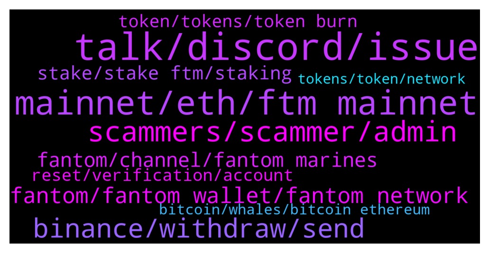

# **@Fantom_English**
 ## Analysis for **2022-01-17** - **2022-01-18**.

---

## 📊 **Basic Stats**

**n_messages_sent**: 495

---

---

## 🔝 **Top keywords and related messages**

1. **talk, discord, issue**

    @AirCincy --- *Hi Mcjigs, are you able to ping Simone? It's regarding a partnership for our launch* **--->** [TG Discussion](https://t.me/Fantom_English/633339)

    @hansolowalker --- *Thanks for looking into my problem though, i appreciate it.* **--->** [TG Discussion](https://t.me/Fantom_English/633904)

    @pajamasfreak --- *you can follow instruction on the pinned message in discord.* **--->** [TG Discussion](https://t.me/Fantom_English/633734)

    @aceanderson1906 --- *I’ll get you back as well!* **--->** [TG Discussion](https://t.me/Fantom_English/634498)

    @Christel --- *OK So I have to wait ?* **--->** [TG Discussion](https://t.me/Fantom_English/634831)

    @wkaplan --- *Ok so do I just wait ? Or is there another website to use ?* **--->** [TG Discussion](https://t.me/Fantom_English/634811)

2. **mainnet, eth, ftm mainnet**

    @exten_vision --- *Why is FTM falling and will there be growth again?* **--->** [TG Discussion](https://t.me/Fantom_English/634352)

    @Darth_Tr4der --- *hey bros u think ftm can stay above 2.80?* **--->** [TG Discussion](https://t.me/Fantom_English/634537)

    @ezwada --- *Any admins here? I send FTM from my metamask on FTM Mainnet to Kucoin's ETH address for FTM deposits. It appears they have access to the wallet, but not sure if they will return it. Could any devs help me?* **--->** [TG Discussion](https://t.me/Fantom_English/634319)

    @tomorrowsbread --- *Is FTM gonna keep on dipping? I want to buy at a good entry* **--->** [TG Discussion](https://t.me/Fantom_English/633950)

    @Andre --- *I just purchased 75 FTM today🏃🏽‍♂️🔥🔥🔥💯* **--->** [TG Discussion](https://t.me/Fantom_English/634218)

    @JustinBouchure --- *What is the rule here? Are we allowed to talk about FTM price?* **--->** [TG Discussion](https://t.me/Fantom_English/633711)

3. **scammers, scammer, admin**

    @JC --- *There will be sooo many scammers going yo text you* **--->** [TG Discussion](https://t.me/Fantom_English/633655)

    @alishaik123 --- *Admin, plz confirm if you have any other official group apart from this. Lot of scammers are trying to create groups and working hard to make them look legit* **--->** [TG Discussion](https://t.me/Fantom_English/634984)

    @ZarkNC --- *Rumours, and trying to be scammer* **--->** [TG Discussion](https://t.me/Fantom_English/635119)

    @hansolowalker --- *someone pretending to be you just tried to scam me in DMs saying they had a solution for me!* **--->** [TG Discussion](https://t.me/Fantom_English/633901)

    @Adog8 --- *I love all the scammers that reach out ..* **--->** [TG Discussion](https://t.me/Fantom_English/633297)

    @Johnnyfantom --- *Be careful, admins will never DM you first* **--->** [TG Discussion](https://t.me/Fantom_English/633299)

4. **binance, withdraw, send**

    @pajamasfreak --- *We can’t help with anything like that. Imagine how scary would be if foundation have such control on that. They can retrieve those using metamask and help you send to specific wallet.* **--->** [TG Discussion](https://t.me/Fantom_English/633756)

    @Solmoon90 --- *Im buying ftm with visa on binance. Will I be able to swap it to foundation?* **--->** [TG Discussion](https://t.me/Fantom_English/634299)

    @PastorLasim --- *But I can locate it on binance* **--->** [TG Discussion](https://t.me/Fantom_English/634419)

    @pajamasfreak --- *There is nothing we could as it is a custodian wallet owned by Binance. We have no control on users’ wallets..* **--->** [TG Discussion](https://t.me/Fantom_English/633750)

    @Connor --- *Any UK guys have a decent way to buy FTM now that Binance blocks most bank accounts? I’ve sold a big chunk of shares and the 4% + that KuCoin charges is too high. Any advice appreciated* **--->** [TG Discussion](https://t.me/Fantom_English/633908)

    @Mcjig --- *binance non us is best place right now* **--->** [TG Discussion](https://t.me/Fantom_English/634418)

5. **fantom, fantom wallet, fantom network**

    @Janevietani --- *We are Fantom. Phantom wallet are for solana* **--->** [TG Discussion](https://t.me/Fantom_English/635214)

    @javadi1998 --- *where is the best place to do a presale/ buy for new fantom tokens* **--->** [TG Discussion](https://t.me/Fantom_English/633203)

    @elbo64 --- *Hi guys ,, we’re is the  safest/best return for steaking  fantom for 1 year plus* **--->** [TG Discussion](https://t.me/Fantom_English/635141)

    @Vickytara --- *How to buy and sell in fantom ecosystem* **--->** [TG Discussion](https://t.me/Fantom_English/634109)

    @tonydog81 --- *Hey all! In a little bit of strife here. Sent my fantom from CoinSpot to fantom wallet but it was as erc-20 so hasn’t showed up in my wallet. Any help greatly appreciated 🙏* **--->** [TG Discussion](https://t.me/Fantom_English/634566)

    @Loggo_Voitto --- *Hi any suggestion on the best fantom wallet? Not cold wallet pls🙏. Thank you😊* **--->** [TG Discussion](https://t.me/Fantom_English/633432)

6. **fantom, channel, fantom marines**

    @Joe --- *Which platform is the fantom launch site  And how can you have access to the idos* **--->** [TG Discussion](https://t.me/Fantom_English/633716)

    @yododo --- *Bro do you have the link to Fantom Marines TG?* **--->** [TG Discussion](https://t.me/Fantom_English/634356)

    @riqua01 --- *are the fantom bought on kucoin erc20?* **--->** [TG Discussion](https://t.me/Fantom_English/635177)

    @pgngm --- *Seems so. I found this TG link from the fantom website* **--->** [TG Discussion](https://t.me/Fantom_English/635180)

    @MS_01234 --- *how you are doin, guys is it true that Fantom awards developers and if it is true howmuch it awards* **--->** [TG Discussion](https://t.me/Fantom_English/633346)

    @I_am_FTM_ADA_Degen --- *FantomTrading channel is just 45 members? Looks more like spam channel* **--->** [TG Discussion](https://t.me/Fantom_English/634605)

7. **stake, stake ftm, staking**

    @jonnytot --- *What’s the easiest/ best protocol to stake or farm ? I’m looking at tomb or spooky swap..  been holding ftm for a long long time but now want to get my hands dirty . TIA* **--->** [TG Discussion](https://t.me/Fantom_English/634795)

    @Johnnyfantom --- *Depends on the length of time you want to stake, some have longer durations and some shorter, you will need to check them out* **--->** [TG Discussion](https://t.me/Fantom_English/634161)

    @Solidpaul --- *Please does FTM have any staking features?* **--->** [TG Discussion](https://t.me/Fantom_English/633644)

    @Redje4 --- *If I stake how do I know what a good validator is?* **--->** [TG Discussion](https://t.me/Fantom_English/634140)

    @First --- *Is there a borrow farm? like stake BTC, borrow other coins* **--->** [TG Discussion](https://t.me/Fantom_English/634693)

    @Ts --- *where can i stake my ftm* **--->** [TG Discussion](https://t.me/Fantom_English/634772)

8. **token, tokens, token burn**

    @Janevietani --- *If you have ever approved any of these 6 tokens, pls log in https://app.multichain.org/#/approvals asap to revoke the approvals, otherwise, your assets are at risk.* **--->** [TG Discussion](https://t.me/Fantom_English/634067)

    @slickrick6 --- *Proper FUSD will be released in Q1. You will be able to swap for new token pegged 1:1* **--->** [TG Discussion](https://t.me/Fantom_English/633907)

    @Abdulsalam --- *Is there any possibility for token burn???* **--->** [TG Discussion](https://t.me/Fantom_English/633199)

    @dylansmi --- *yes my tokens are on erc20 L1* **--->** [TG Discussion](https://t.me/Fantom_English/633260)

    @Mcjig --- *you can get boo or spirit tokens* **--->** [TG Discussion](https://t.me/Fantom_English/634273)

    @Mcjig --- *there are no tokens available. they are all circulating except the ones reserved for rewards* **--->** [TG Discussion](https://t.me/Fantom_English/633202)

9. **reset, verification, account**

    @hansolowalker --- *ok sure, what settings do i change?* **--->** [TG Discussion](https://t.me/Fantom_English/633890)

    @Sebonacci --- *Do you just hit 'reset account' in settings?* **--->** [TG Discussion](https://t.me/Fantom_English/633033)

    @JustinBouchure --- *I did and it asked to turn VPN off which I did, but still didn’t get through after I finish the verification process and return to DC* **--->** [TG Discussion](https://t.me/Fantom_English/633735)

    @pajamasfreak --- *Can you rejoin and start the verification again?* **--->** [TG Discussion](https://t.me/Fantom_English/633737)

    @JustinBouchure --- *Can’t do the verification. Can you please help?* **--->** [TG Discussion](https://t.me/Fantom_English/633733)

    @Mcjig --- *reset account just clears your transaction history* **--->** [TG Discussion](https://t.me/Fantom_English/633041)

10. **bitcoin, whales, bitcoin ethereum**

    @I_am_FTM_ADA_Degen --- *Nothing. All are just shilling like degen* **--->** [TG Discussion](https://t.me/Fantom_English/634622)

    @Nemos13 --- *Just wait.. Big hedge fund and institution money will leave Bitcoin and ethereum because of interest rate and inflation.. handful of whales is holding Bitcoin and ethereum..* **--->** [TG Discussion](https://t.me/Fantom_English/634188)

    @zenkert --- *As there are no whales in other coins and tokens 🙈 Stupidity post.* **--->** [TG Discussion](https://t.me/Fantom_English/634191)

    @Ts --- *at least we are shilling hahahha* **--->** [TG Discussion](https://t.me/Fantom_English/634629)

    @Nemos13 --- *There is but unlike Satoshi vision , Bitcoin is now controlled by big institution indirectly...There is need for people currency* **--->** [TG Discussion](https://t.me/Fantom_English/634196)

    @Nemos13 --- *Fun fact; Shiba Inu and baby doge have more holders than Bitcoin and ethereum... 😄😄* **--->** [TG Discussion](https://t.me/Fantom_English/634184)

