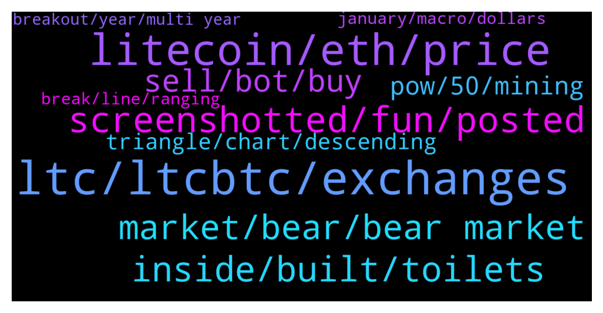

# **@Litecoin**
 ## Analysis for **2022-01-17** - **2022-01-18**.

---

## 📊 **Basic Stats**

**n_messages_sent**: 270

---

---

## 🔝 **Top keywords and related messages**

1. **ltc, ltcbtc, exchanges**

    @nltox --- *ltc will moon next month once mimblewimble is active and moonsie is unmuted* **--->** [TG Discussion](https://t.me/Litecoin/2049098)

    @jrx486 --- *today is the first day of ltcbtc trend reversal* **--->** [TG Discussion](https://t.me/Litecoin/2048710)

    @jrx486 --- *LTCBTC right now looks a lot loge DOGEBTC a year ago* **--->** [TG Discussion](https://t.me/Litecoin/2048644)

    @Bigcfidolla --- *If you can't afford ltc spread try neo* **--->** [TG Discussion](https://t.me/Litecoin/2049027)

    @Augusto --- *But im still waiting ltc reach 200 or more,* **--->** [TG Discussion](https://t.me/Litecoin/2048967)

    @Augusto --- *But if ltc reach this point again, Ada can 2X* **--->** [TG Discussion](https://t.me/Litecoin/2048970)

2. **litecoin, eth, price**

    @National_Instruments --- *Bitcoin against litecoin and etherium against cardano* **--->** [TG Discussion](https://t.me/Litecoin/2048665)

    @Macro5674 --- *And I heard litecoin the 3rd largest transferred coin out there ! So people are indeed using it as as payments and means of exchange and moving money ! But I think people just not using as store value yet and so the price more of less stable 🤔i think !* **--->** [TG Discussion](https://t.me/Litecoin/2048259)

    @Decentralized_Nomad --- *That's because Litecoin is an almost finished project. What do you want from Litecoin?* **--->** [TG Discussion](https://t.me/Litecoin/2048812)

    @ryanswright --- *Moving money with Litecoin is a great use case. Me and the boys use it for such a purpose and more. MWEB is what we've all been waiting for.* **--->** [TG Discussion](https://t.me/Litecoin/2048627)

    @Macro5674 --- *But litecoin.com says its can ! https://litecoin.com/en/news/litecoin-smart-contracts-daos-tokenised-assets-and-nfts-are-here ! This kind of marketing then creates alot 😕 confusion then !* **--->** [TG Discussion](https://t.me/Litecoin/2048274)

    @Macro5674 --- *Litecoin will only go POS if bitcoin goes POS! While mining industry depends on both algorithms alot !* **--->** [TG Discussion](https://t.me/Litecoin/2048235)

3. **screenshotted, fun, posted**

    @jrx486 --- *Zoom out. Stop trolling if you are.* **--->** [TG Discussion](https://t.me/Litecoin/2048567)

    @Michael --- *if you keep writing nonsense Mr. Putin will come after you and kick your ass* **--->** [TG Discussion](https://t.me/Litecoin/2048743)

    @jrx486 --- *There are many trolls and no-coiners here* **--->** [TG Discussion](https://t.me/Litecoin/2048544)

    @BennyBennyBlanco --- *@TonyNakamoto  You think if I carried this around, I get a lot of likes or hate 😂😂* **--->** [TG Discussion](https://t.me/Litecoin/2048980)

    @jrx486 --- *You said you give false info here on purpose* **--->** [TG Discussion](https://t.me/Litecoin/2048576)

    @Erion --- *thought I would get some help 😂 but Im only getting trolled here* **--->** [TG Discussion](https://t.me/Litecoin/2048997)

4. **inside, built, toilets**

    @TonyNakamoto --- *R werk'd at a Walm0rt once and the bathroom was always a rek* **--->** [TG Discussion](https://t.me/Litecoin/2048883)

    @TonyNakamoto --- *Could just hook it up 2 flush out the exhaust pipe lol* **--->** [TG Discussion](https://t.me/Litecoin/2048880)

    @cloudlite15 --- *I can just park at the Walmart EV charging station and go inside the store for the toilets* **--->** [TG Discussion](https://t.me/Litecoin/2048879)

    @cloudlite15 --- *They said theres going to be built in air purifieyers* **--->** [TG Discussion](https://t.me/Litecoin/2048868)

    @cloudlite15 --- *There's a built in air purifier so you won't mind my armpit and feet stench sir* **--->** [TG Discussion](https://t.me/Litecoin/2048891)

    @cloudlite15 --- *Hopefully the toilets won't be clogged up with mud like geysers* **--->** [TG Discussion](https://t.me/Litecoin/2048881)

5. **market, bear, bear market**

    @LemuelE03 --- *Bear market not yet confirmed tho, right?* **--->** [TG Discussion](https://t.me/Litecoin/2049113)

    @🔺ᬼ⃝ℝ🔺 --- *I like to see LTC 3$ and  SHIB 1000$ to show all of you  that cryptocurrency is a big lie and big bet. It's never business* **--->** [TG Discussion](https://t.me/Litecoin/2049189)

    @Mary --- *I came seen a crypto fantasy coin that I'd like to follow, everything is in the game* **--->** [TG Discussion](https://t.me/Litecoin/2048639)

    @TonyNakamoto --- *he has decided 2 leave the crypt0sphere til March in an attempt 2 get price moving* **--->** [TG Discussion](https://t.me/Litecoin/2048343)

    @jrx486 --- *Make sure you look at binance or bitfinex chart to see full history. Put it on monthly candles.* **--->** [TG Discussion](https://t.me/Litecoin/2048560)

    @adamozi --- *why would we be here if not on the crypto train ?* **--->** [TG Discussion](https://t.me/Litecoin/2048542)

6. **sell, bot, buy**

    @ck42069 --- *U sell and buy at lower price* **--->** [TG Discussion](https://t.me/Litecoin/2048373)

    @jrx486 --- *my bot bought back too. (not selling the bot or any service btw) 🚀🚀🚀* **--->** [TG Discussion](https://t.me/Litecoin/2048525)

    @M. Asım --- *👌 i can buy then 60 usd* **--->** [TG Discussion](https://t.me/Litecoin/2049020)

    @Tiger --- *Choose,choose,chose!buy,sell ,buy,sell!u just lost the direction!* **--->** [TG Discussion](https://t.me/Litecoin/2048686)

    @ck42069 --- *Pull up the daily SMA s* **--->** [TG Discussion](https://t.me/Litecoin/2048580)

    @shahabszd --- *Sell know and buy to 600$ after a month))* **--->** [TG Discussion](https://t.me/Litecoin/2048308)

7. **pow, 50, mining**

    @morningzone --- *Without PoW it's not Bitcoin anymore.* **--->** [TG Discussion](https://t.me/Litecoin/2048500)

    @Macro5674 --- *But pow is switching to renewable source at great pace and POS is less secure than POW as it needs far less capital to 51%  attack !* **--->** [TG Discussion](https://t.me/Litecoin/2048458)

    @Zer0fact0r --- *Anything can happen in 50 years. We won't be around to see whose right. I think there will be another attempt to fork btc in the future.* **--->** [TG Discussion](https://t.me/Litecoin/2048522)

    @Zer0fact0r --- *I think BTC will eventually switch out of pow. Maybe in 50-100 years. It's makes no sense to continue pow at the tailend of the emission.* **--->** [TG Discussion](https://t.me/Litecoin/2048456)

    @Macro5674 --- *El Salvador whole country is now heavily dependent on POW now ! As group of investors I think are depended on it !* **--->** [TG Discussion](https://t.me/Litecoin/2048245)

    @ck42069 --- *Invested into mining machines and there are even companies in the us based on mining btc* **--->** [TG Discussion](https://t.me/Litecoin/2048239)

8. **triangle, chart, descending**

    @professional --- *I’m watching chart and no triangle is there , i mean it’s not triangle* **--->** [TG Discussion](https://t.me/Litecoin/2048571)

    @jrx486 --- *That’s a descending triangle, mr professional* **--->** [TG Discussion](https://t.me/Litecoin/2048555)

    @professional --- *Can you show me ABCDE on chart?* **--->** [TG Discussion](https://t.me/Litecoin/2048557)

    @professional --- *I’m looking right now and can’t find a descending triangle* **--->** [TG Discussion](https://t.me/Litecoin/2048563)

    @professional --- *Check it on your chart and screenshot* **--->** [TG Discussion](https://t.me/Litecoin/2048595)

    @TonyNakamoto --- *It's on the linear ratio chart* **--->** [TG Discussion](https://t.me/Litecoin/2048742)

9. **break, line, ranging**

    @professional --- *So check yourself and you will get still didn’t break the line* **--->** [TG Discussion](https://t.me/Litecoin/2048599)

    @ck42069 --- *Now its time to do lows again* **--->** [TG Discussion](https://t.me/Litecoin/2048506)

    @James --- *it's got to get to 200 to break even* **--->** [TG Discussion](https://t.me/Litecoin/2048952)

    @professional --- *If break one of the lines Price will start ranging* **--->** [TG Discussion](https://t.me/Litecoin/2048579)

    @jrx486 --- *Look how explosive this line is* **--->** [TG Discussion](https://t.me/Litecoin/2048490)

    @ck42069 --- *However if this shit dips even more it can go 100 or sub 100* **--->** [TG Discussion](https://t.me/Litecoin/2048379)

10. **january, macro, dollars**

    @ck42069 --- *Not just because of the macro reasons but because of the massive 3.5 billion USD liquidation drawdown that happened in november december and january* **--->** [TG Discussion](https://t.me/Litecoin/2048827)

    @RorschachTesst --- *Too much supply in circulation for this to happen* **--->** [TG Discussion](https://t.me/Litecoin/2049023)

    @jrx486 --- *This transaction volume on January 12th 2022 is insane. It dwarfs all previous peaks. 43 billion dollars!* **--->** [TG Discussion](https://t.me/Litecoin/2048625)

    @jrx486 --- *+ they got hacked, which is the reason ETC exists* **--->** [TG Discussion](https://t.me/Litecoin/2048255)

    @jrx486 --- *i think it dumped because it was overbought and bitcoin went down* **--->** [TG Discussion](https://t.me/Litecoin/2048654)

    @jrx486 --- *What’s kicking up the transactions so much?* **--->** [TG Discussion](https://t.me/Litecoin/2048477)

