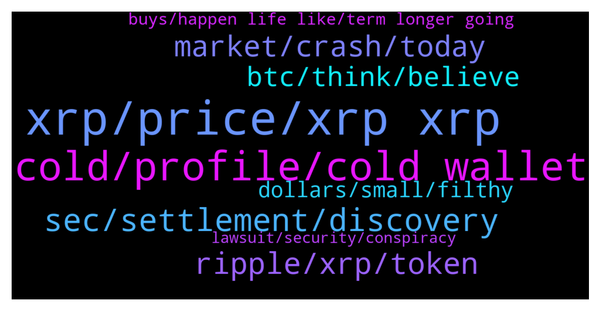

# **@Ripple**
 ## Analysis for **2022-01-17** - **2022-01-18**.

---

## 📊 **Basic Stats**

**n_messages_sent**: 207

---

---

## 🔝 **Top keywords and related messages**

1. **xrp, price, xrp xrp**

    @Josefa29 --- *xrp is a treasure and I'm obsessed with it. xrp will eventually change the lives of us all. Only idiots and cowards sell it. I have all my life and property in xrp. And this will be the biggest and best gamble of my life.* **--->** [TG Discussion](https://t.me/Ripple/3041209)

    @Alyerma --- *Hello how do I get xrp* **--->** [TG Discussion](https://t.me/Ripple/3041490)

    @chuckwagon --- *Yes, but you have to buy $10,000 worth. XRP is a good buy right now too.* **--->** [TG Discussion](https://t.me/Ripple/3041218)

    @Josefa29 --- *Has no effect on price.xrp Every project and technical advancement it makes does not affect its price.😡* **--->** [TG Discussion](https://t.me/Ripple/3041516)

    @anuj90322 --- *So what y think will happen to xrp price?* **--->** [TG Discussion](https://t.me/Ripple/3041563)

    @marianmp --- *Bro do your mathematics.For the amount of supply that xrp has ....you need a huge amount vof money to come .... Dreams ar good but we need to wake up....people think xrp will go from 80 cents to 100$ - 1000$* **--->** [TG Discussion](https://t.me/Ripple/3041587)

2. **cold, profile, cold wallet**

    @xiaolang122 --- *It's say no news for this security Is there something wrong with ur language* **--->** [TG Discussion](https://t.me/Ripple/3041346)

    @John_Teflon --- *I would also like to know this* **--->** [TG Discussion](https://t.me/Ripple/3041480)

    @rahul135790 --- *2465 members are online but no one is chatting amazing* **--->** [TG Discussion](https://t.me/Ripple/3041843)

    @scott5271 --- *Should I be storing my coins in a cold wallet?* **--->** [TG Discussion](https://t.me/Ripple/3041288)

    @tilizs --- *Lol you guys love banning people* **--->** [TG Discussion](https://t.me/Ripple/3041426)

    @JesusJames --- *just the ones who don't follow the rules like yourself ( lol )* **--->** [TG Discussion](https://t.me/Ripple/3041437)

3. **sec, settlement, discovery**

    @Voltaire123 --- *Hopefully change it in a good way. Positive. Are you that sure they will win the lawsuit?* **--->** [TG Discussion](https://t.me/Ripple/3041247)

    @gerrymchugh --- *Days, weeks, months or years... who knows with court cases! Settlement is more likely that judgement in my opinion.* **--->** [TG Discussion](https://t.me/Ripple/3041430)

    @Voltaire123 --- *How long will it takes after discovery phase for a settlement or outcome from the judge?* **--->** [TG Discussion](https://t.me/Ripple/3041429)

    @Ali --- *Why does it take so long for the case to end? At this stage they have probably talk already about anything.. so many hours of talking and still no solution and even a extended time* **--->** [TG Discussion](https://t.me/Ripple/3041827)

    @tilizs --- *Hoping discovery phase ends once and for all - dragging far too long now* **--->** [TG Discussion](https://t.me/Ripple/3041428)

    @VidaLoca100 --- *Without the regulation and ability to track and tax funds... the government loses control and in turn the ability to control inland revenue..SEC is going to regulate it so transactions and funds can be tracked. That's what I reckon...* **--->** [TG Discussion](https://t.me/Ripple/3041562)

4. **ripple, xrp, token**

    @Pbgis --- *If banks adopt Ripple's technology it must be through XRP?* **--->** [TG Discussion](https://t.me/Ripple/3041472)

    @Pbgis --- *Hi friends I have a question In case Ripple replaces Swift. What will be the exact use of xrp?* **--->** [TG Discussion](https://t.me/Ripple/3041397)

    @gerrymchugh --- *There was a time previously where the XRPL may have been used without the XRP token, but Ripple changed that ages ago. So yes, XRP will be used and it gives it utility.* **--->** [TG Discussion](https://t.me/Ripple/3041466)

    @Maxence --- *Its a good time to buy ripple right* **--->** [TG Discussion](https://t.me/Ripple/3041214)

    @Pbgis --- *Or I'll ask it otherwise. Does Ripple's payment system have to cause xrp's price flight?* **--->** [TG Discussion](https://t.me/Ripple/3041398)

    @Heather --- *Ripple is a member of the WEF.. Just saying* **--->** [TG Discussion](https://t.me/Ripple/3041794)

5. **market, crash, today**

    @JustNNM --- *The stock market did not crash today, people use the word crash very loosely.* **--->** [TG Discussion](https://t.me/Ripple/3041786)

    @arunmaster --- *Stock market crashed today. Btc may crash to 38k today* **--->** [TG Discussion](https://t.me/Ripple/3041753)

    @marianmp --- *Guys market may go down bad .... So hold your horses 😉* **--->** [TG Discussion](https://t.me/Ripple/3041505)

    @anuj90322 --- *It is so easy to say the market is going to crash,but no one ever manages to time crashes* **--->** [TG Discussion](https://t.me/Ripple/3041800)

    @anuj90322 --- *No point investing when market is gone up* **--->** [TG Discussion](https://t.me/Ripple/3041652)

    @sanyena --- *The market is very down.. scary* **--->** [TG Discussion](https://t.me/Ripple/3041646)

6. **btc, think, believe**

    @MarcBMW --- *Last thing. This bullrun is NOT over! In my Opinion, I believe the second this lawsuit nonsense ends, that will start the biggest Alt run in history followed by the biggest BTC run to date. We've seen btc hit a 17x in a cycle. We're only at an 11X from it's low after the cycle. Big things are absolutely coming! I also believe the SEC and the Biden Administration (The worst in history) are trying to stop that from happening. You can't destroy a country if it's citizens are getting rich in the crypto space. I think this is all connected. Think about why China suddenly stopped mining Bitcoin! Ironic they chose to do that while Biden was in office! don't you find that strange? That is the very thing that stopped the Bullrun! XRP will be what starts it back up, in my opinion.* **--->** [TG Discussion](https://t.me/Ripple/3041317)

    @Maxence --- *Do u guys think btc will have have bearish phase again?* **--->** [TG Discussion](https://t.me/Ripple/3041223)

    @anuj90322 --- *Who knows what will happen..better to expect the unexpected since we all are chatting nonsense 😁* **--->** [TG Discussion](https://t.me/Ripple/3041796)

    @g_ss_1 --- *Hmmm idk I still believe anything can happen* **--->** [TG Discussion](https://t.me/Ripple/3041643)

    @marianmp --- *People are misinformed ...  Be realistic ....don't fomo or fud* **--->** [TG Discussion](https://t.me/Ripple/3041588)

    @Voltaire123 --- *Hope so. At the moment it is a disaster.* **--->** [TG Discussion](https://t.me/Ripple/3041536)

7. **dollars, small, filthy**

    @anuj90322 --- *Have u made filthy gains yet* **--->** [TG Discussion](https://t.me/Ripple/3041599)

    @anuj90322 --- *Let's make that 10 dollars each* **--->** [TG Discussion](https://t.me/Ripple/3041614)

    @anuj90322 --- *That is not high amount from small amount.. filthy gain is big gain from small amount* **--->** [TG Discussion](https://t.me/Ripple/3041603)

    @VidaLoca100 --- *A friend of mine had some serious amount in SHIB... before the boom..* **--->** [TG Discussion](https://t.me/Ripple/3041601)

    @anuj90322 --- *But hey that is better than less* **--->** [TG Discussion](https://t.me/Ripple/3041625)

    @anuj90322 --- *I am happy with 30 dollars my friend* **--->** [TG Discussion](https://t.me/Ripple/3041590)

8. **buys, happen life like, term longer going**

    @JustNNM --- *Crypto is long term, some longer then others. You are going to stress yourself out by worrying about the price daily. Once you develop tough skin you only have the end game in mind. Diversification helps to.* **--->** [TG Discussion](https://t.me/Ripple/3041518)

    @anuj90322 --- *Other 2 Are  gaming crypto and* **--->** [TG Discussion](https://t.me/Ripple/3041628)

    @anuj90322 --- *😅yeah who ever buys a crypto expecting Extremely good things to happen..no one* **--->** [TG Discussion](https://t.me/Ripple/3041594)

    @anuj90322 --- *Some people's life is like fairy tale. No one expected them to be so rich* **--->** [TG Discussion](https://t.me/Ripple/3041582)

    @anuj90322 --- *Hope not because all crypto depends on it* **--->** [TG Discussion](https://t.me/Ripple/3041581)

    @JJ --- *ITs funny that it is the main US crypto and they are crushing it. The only reason I can find is they want a piece of pie. Why risk falling behind the curve??* **--->** [TG Discussion](https://t.me/Ripple/3041725)

9. **lawsuit, security, conspiracy**

    @Voltaire123 --- *I thought xrp isnt a security? Thats what the lawsuit about or not?* **--->** [TG Discussion](https://t.me/Ripple/3041349)

    @Voltaire123 --- *Why cnn says ‘there is no news about xrp as a security’? What they know??* **--->** [TG Discussion](https://t.me/Ripple/3041335)

    @Cezto --- *Only one resistance xrp has: the lawsuit. Nothing else* **--->** [TG Discussion](https://t.me/Ripple/3041932)

    @marianmp --- *Xrp conspiracy is like 👽 conspiracy* **--->** [TG Discussion](https://t.me/Ripple/3041559)

    @xiaolang122 --- *This is all the lawsuit are about. Until this lawsuit end. Will know XRP is a security or not.* **--->** [TG Discussion](https://t.me/Ripple/3041351)

