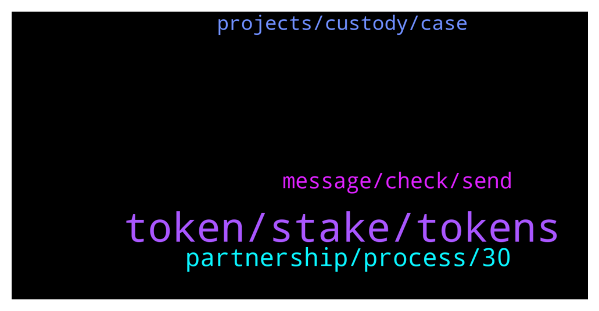

# **@Synthetixi**
 ## Analysis for **2022-01-17** - **2022-01-18**.

---

## 📊 **Basic Stats**

**n_messages_sent**: 103

---

---

## 🔝 **Top keywords and related messages**

1. **token, stake, tokens**

    @Hossein --- *I had asked if it can be sent to an ether address that accepts erc20s awhile back* **--->** [TG Discussion](https://t.me/Synthetixi/18559)

    @Benjamin --- *There's no details yet regarding binance supporting Synthetix staking. If there's any update, we'll announce it to the community.* **--->** [TG Discussion](https://t.me/Synthetixi/18718)

    @Oscar --- *I want to ask how much will be maximum reward if i stake 4000 or more thousands token* **--->** [TG Discussion](https://t.me/Synthetixi/18613)

    @Benjamin --- *Some validator nodes could charge some fees from the stakers, so it depends the fee amount each is charging because it's different.* **--->** [TG Discussion](https://t.me/Synthetixi/18666)

    @Oscar --- *Hey guys If I hold my tokens on the enjin wallet do I need to swap my tokens for the mainnet?* **--->** [TG Discussion](https://t.me/Synthetixi/18552)

    @Keith --- *Synthetix token staking by trust wallet?* **--->** [TG Discussion](https://t.me/Synthetixi/18686)

2. **partnership, process, 30**

    @Alex --- *I'm just thankful I found Synthetix before complete mass adoption.....it's coming* **--->** [TG Discussion](https://t.me/Synthetixi/18706)

    @Moira --- *is there possibility of partnership of Synthetix with microsoft?* **--->** [TG Discussion](https://t.me/Synthetixi/18662)

    @Chi --- *Excellent write up.....amazing what Synthetix has going for it....over the coming weeks and months Synthetix will grow at a fast pace and easy to see Synthetix in top 30 at the very least very soon* **--->** [TG Discussion](https://t.me/Synthetixi/18725)

    @Alex --- *Next thing Synthetix needs to achieve is: get companies like Circle/Tether/MakerDAO/Binance to mint/transfer some of their USDC/USDT/DAI/BUSD onto Synthetix ASAP. The more the better. Imagine 500 Million $ in stablecoins sitting on top of Synthetix and being transacted with daily. That would be insane and would make Synthetix stand out massively. One step at a time though, I'm happy with all the news we already have so far 😁* **--->** [TG Discussion](https://t.me/Synthetixi/18643)

    @Muhammad --- *I heard that Synthetix is sky rocking soon how true is that?* **--->** [TG Discussion](https://t.me/Synthetixi/18573)

    @Crypto --- *Thank you Chi Liun, and thank you for the /up vote! I appreciate those a lot. Synthetix is one of my greatest passions and I'm honored to help educate fellow community members!  And whoever else replied to my comment with /up I appreciate it.  I've been saying for a long time, top 30 is within reach very soon, maybe even top 10 in next 12 months.  Some may say this is conservative, some may say not aggresive enough target. Will not please everyone, but this is just my thought process.* **--->** [TG Discussion](https://t.me/Synthetixi/18726)

3. **message, check, send**

    @Thomas --- *Can I check directly from the app?* **--->** [TG Discussion](https://t.me/Synthetixi/18563)

    @Benjamin --- *There's an account impersonating me, please I won't Pm you first. Be sure to check it's me you're chatting with* **--->** [TG Discussion](https://t.me/Synthetixi/18734)

    @Benjamin --- *English please or send me a direct message* **--->** [TG Discussion](https://t.me/Synthetixi/18704)

    @Benjamin --- *Please check pinned message, you can send me a direct message* **--->** [TG Discussion](https://t.me/Synthetixi/18698)

    @Benjamin --- *Are you trying a transaction? Send me a dm* **--->** [TG Discussion](https://t.me/Synthetixi/18660)

    @Cuong CY --- *Hi admin ,I just sent you a DM* **--->** [TG Discussion](https://t.me/Synthetixi/18623)

4. **projects, custody, case**

    @Armitpal --- *Dear Team, Kudos to your effort, your commitment is really making difference. Glad to saw your great team profile. I believe recent partnerships will take this project to new heights and will invite other big institutions as well.   I knows Infosys very well since last 10 years. My profile is of GovtTech  consultant so that with my experience in this field I can see a BIG Picture from here.  Really feeling proud as an Indian.  Cheers!!* **--->** [TG Discussion](https://t.me/Synthetixi/18684)

    @Crypto --- *I can't give you any financial advice, but I can tell you why I believe in Synthetix   My investment thesis: Ethereum is clearly winning the platform wars. Matic is clearly winning the wars, & platforms.   1A. Use case A - Synthetix provides 1000x throughput on top of Ethereum  1B. Use case B - 1% of normal gas fees  1C. Use case C - <1sec blocktimes  1D. Use case D - interoperability with other chains  2. Adoption - Mainnet isn't fully released, yet we still have huge adoption already. The influx of projects will climb exponentially after full Mainnet is rolling. Decentraland, Neon District, MakerDao, 0x, & tons of others are joining... FAST.   3. The team - We've worked with over 20 projects at a professional capacity with our company Lunar Digital Assets, & watch the rest of the projects in the industry, and I have NEVER, and I mean NEVER seen a team that is so hungry and so dedicated to using every minute of every day to make sure Synthetix gets mass adoption. They're totally insane Beasts. I've met them in person several times.   4. Community - In crypto, community is everything. Our company LDA believes this very firmly. Synthetix has one of the best communities in the industry, by far. We are frequently number 1 in social engagement metrics as seen on Lunar Crush and other analyses. It continues to climb, gaining more and more momentum.   5. Investor backers - The biggest institutions in the game back Synthetix. Coinbase and Binance are big investors in Synthetix. To put it simply, they WILL make sure Synthetix succeeds, and they've got all the money and power in the world to insure this. Read below for expansion on 5.   This is slightly updated version of something I wrote here recently. It is relevant to the current question of "Why Synthetix?"   5A. Coinbase has been exploring using Synthetix for their wallet features and tech. I believe something to do with NFTs primarily, I forget the exact details.  Coinbase was an original seed investor of Synthetix, then Binance came in later.   Coinbase Ventures invested in Synthetix, and also essentially placed one of their executives, Pete Kim, Head of Engineering, for Coinbase Wallet as an advisor of Synthetix. Coinbase, and Brian Armstrong have a STRONG vested interest in Synthetix succeeding.   Around 6 months ago they listed Synthetix as one of the next projects they were exploring to list at Coinbase. I personally think that they're waiting until Synthetix's final Mainnet is released within about 2-4 weeks to list on Coinbase.   Recently they listed on Coinbase Custody which is a huge deal because this shows that they're confident that Synthetix is not a security in the eyes of US regulators, namely the SEC and also CFTC to an extent. Keep in mind Coinbase Custody is a New York Bitlicenced corporation and a fiduciary under NY State Banking Law.  The projects on Coinbase Custody are an elite cluster of projects that Coinbase believes big institutional investors, banks, etc will have desire to hold.   It seems pretty clear that Coinbase will list Synthetix, and in my opinion probably very soon. Also Coinbase will very likely do staking for Synthetix.   5B. To add to this, I think this will lead to Binance US listing Synthetix soon as well. Binance US is playing by the books and taking their time to make sure regulators are happy. Now that Coinbase Custody listed Synthetix, and by doing so, implicitly expressed that Synthetix is not a security, I think it opens up other US exchanges to listing Synthetix, particularly Binance US.   Binance very clearly loves Synthetix, is invested in Synthetix, and thinks Synthetix tech is cutting edge. CZ personally tweets about Synthetix . Synthetix is Binance's poster child, and they need it to succeed to continue to have successful IEOs and keep their reputation as the best exchange in the world at everything they do.   Binance has added Synthetix to their lending platform, margin platform,* **--->** [TG Discussion](https://t.me/Synthetixi/18723)

    @Chen --- *Have you made a tweet on this? Your insights are quite remarkable.* **--->** [TG Discussion](https://t.me/Synthetixi/18727)

    @Armitpal --- *Yeah, that would actually be funny if people spam elon musk media with "when tesla". People would get called mental in real life. As we said before... too much instant gratification pressure for uneducated people.* **--->** [TG Discussion](https://t.me/Synthetixi/18652)

    @Philips --- *Critics are fine, stupid critics are irrelevant* **--->** [TG Discussion](https://t.me/Synthetixi/18580)

    @Aahan --- *Wow. These things keep getting more and more interesting! The graphics are getting better too. This really does help developers to do more* **--->** [TG Discussion](https://t.me/Synthetixi/18551)

