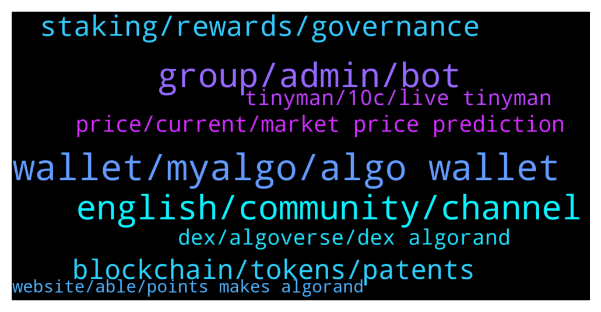

# **@algorand**
 ## Analysis for **2022-01-17** - **2022-01-18**.

---

## 📊 **Basic Stats**

**n_messages_sent**: 180

---

---

## 🔝 **Top keywords and related messages**

1. **wallet, myalgo, algo wallet**

    @Ricky --- *I moved all of my algo into my algo wallet from Coinbase. Does anyone have a source on the actual myalgo wallet APY?* **--->** [TG Discussion](https://t.me/algorand/333366)

    @namhuycp --- *hi everyone. i am trying to connect myalgo wallet but it disable always. and the wallet.myalgo requests password too much.* **--->** [TG Discussion](https://t.me/algorand/333516)

    @BranTaco --- *my algo wallet I use for desktop* **--->** [TG Discussion](https://t.me/algorand/333384)

    @namhuycp --- *i think wallet.myalgo has some problem* **--->** [TG Discussion](https://t.me/algorand/333526)

    @JDLA8 --- *Thank you. Is there a desktop wallet?* **--->** [TG Discussion](https://t.me/algorand/333383)

    @Tjopchie --- *hi new to Algorand, i've got a new wallet but is there a extention for chrome?* **--->** [TG Discussion](https://t.me/algorand/333309)

2. **english, community, channel**

    @SonTrab --- *có bác nào VN đầu tư con này ko cho em hỏi xíu, em cảm ơn* **--->** [TG Discussion](https://t.me/algorand/333302)

    @NightAlgorand --- *Please speak English here as this is a English speaking group.* **--->** [TG Discussion](https://t.me/algorand/333304)

    @JorAlc --- *Hola, no sé mucho sobre la red algorand. ¿Cuáles son los principales intercambiadores de esta red?* **--->** [TG Discussion](https://t.me/algorand/333015)

    @NightAlgorand --- *Hi @Biandzg @tobby00 , please refer to Chinese community channel 👇  https://t.me/AlgorandFoundationCN* **--->** [TG Discussion](https://t.me/algorand/333427)

    @MackDenver --- *Good day, Algorand Community! How is everyone doing today?* **--->** [TG Discussion](https://t.me/algorand/333445)

    @NightAlgorand --- *Hey, there is a spanish chat here https://t.me/algorand_es* **--->** [TG Discussion](https://t.me/algorand/333017)

3. **group, admin, bot**

    @Wurzelbear --- *This is an Algorand group and not a promotion group for scammers.* **--->** [TG Discussion](https://t.me/algorand/333142)

    @S --- *The number of obvious bots in this channel is absurd. Would be nice if an admin cleaned this place out* **--->** [TG Discussion](https://t.me/algorand/333276)

    @Rb_71dex --- *admin enable verification bot for new members* **--->** [TG Discussion](https://t.me/algorand/333292)

    @Fundzbtc --- *lol calling admin right now to send u outta the group* **--->** [TG Discussion](https://t.me/algorand/333251)

    @开心 --- *Why are there so many scammers in this group, they all want to deceive my Bitcoin🤔🤔🤔* **--->** [TG Discussion](https://t.me/algorand/333155)

    @theycallme_Jon --- *Lol yeah I know, I was testing for spammers. Now who can ban these guys? 😂😂* **--->** [TG Discussion](https://t.me/algorand/333394)

4. **staking, rewards, governance**

    @TinyBit --- *Sorry for the news but no staking anymore* **--->** [TG Discussion](https://t.me/algorand/333064)

    @Boevojxomjk --- *Why did the reward for algorand holders decrease from 5% to 0.66% for a long time?* **--->** [TG Discussion](https://t.me/algorand/333285)

    @Holdfor --- *How can I participate in The $ZONE IDO?* **--->** [TG Discussion](https://t.me/algorand/333032)

    @Hermingwayy --- *Algorand staking rewards now small in virtually all wallets. I hold some algo in Atomic reward same as myalgo wallet.* **--->** [TG Discussion](https://t.me/algorand/333307)

    @RIV --- *How long after the governance period ends they distribute the rewards?* **--->** [TG Discussion](https://t.me/algorand/333031)

    @xM3Dx --- *Still there, but it's peanuts... what was worst passed... I still can't believe from what they started how faster they distro the tokens... LTAD was actually LTFD 😂* **--->** [TG Discussion](https://t.me/algorand/333068)

5. **blockchain, tokens, patents**

    @kunalmedhe --- *Call me a noob.  i want to understand what does ALGO do overcome collusion of major stakeholders.* **--->** [TG Discussion](https://t.me/algorand/333453)

    @Rb_71dex --- *guess not good mate seeing algo going too dip been while week now 😃* **--->** [TG Discussion](https://t.me/algorand/333446)

    @Happy --- *Or Algo will be stable at $1😁😁* **--->** [TG Discussion](https://t.me/algorand/333073)

    @jakaaaas --- *Just because other cryptos consume more energy which has environmental issues.* **--->** [TG Discussion](https://t.me/algorand/333009)

    @jakaaaas --- *US government to address the ramifications of cryptocurrencies on January 20th* **--->** [TG Discussion](https://t.me/algorand/333008)

    @jakaaaas --- *US will probably ban Energy consuming Mining, Proud that ALGO is already Carbon Negative and a Green Crypto* **--->** [TG Discussion](https://t.me/algorand/333005)

6. **price, current, market price prediction**

    @Happy --- *Allright so current price is a bottom in 2022?* **--->** [TG Discussion](https://t.me/algorand/333056)

    @Happy --- *And still price has not move at all...* **--->** [TG Discussion](https://t.me/algorand/333400)

    @defirlkp --- *depends on when you check the price tho, at times im up 40% right* **--->** [TG Discussion](https://t.me/algorand/333406)

    @MackDenver --- *Hi there, We don't talk about the market or price prediction on this chat.* **--->** [TG Discussion](https://t.me/algorand/333147)

    @Brightmoon23 --- *Nobody can tell no matter how great they sounds but we may see $1.15~1.20 minimum I think not for sure* **--->** [TG Discussion](https://t.me/algorand/333091)

    @开心 --- *Do you know the current unit price of Bitcoin?* **--->** [TG Discussion](https://t.me/algorand/333135)

7. **dex, algoverse, dex algorand**

    @kriptonk --- *we have no dex... Algorand inc should build a dex...* **--->** [TG Discussion](https://t.me/algorand/333463)

    @plymak3r --- *Hi guys,   Any thing like dextools, poocoin for Algo?* **--->** [TG Discussion](https://t.me/algorand/333204)

    @Nelsonok --- *Please what other app can I swap algo project with aside from tinyman* **--->** [TG Discussion](https://t.me/algorand/333188)

    @Nbnam --- *is there a current active dex right now in algorand* **--->** [TG Discussion](https://t.me/algorand/333390)

    @mcmaxims --- *humbleswap, Algoverse, Algodex But all the 3 dexes coming soon and are not on mainnet yet* **--->** [TG Discussion](https://t.me/algorand/333190)

    @mcmaxims --- *check Algoverse, we are working on a dex + launchpad* **--->** [TG Discussion](https://t.me/algorand/333039)

8. **tinyman, 10c, live tinyman**

    @Adrian --- *When tinyman will be back on mainnet? 🧐* **--->** [TG Discussion](https://t.me/algorand/333505)

    @MackDenver --- *Please check in with Tinyman team about this* **--->** [TG Discussion](https://t.me/algorand/333507)

    @MackDenver --- *Hi, Tinyman will be live soon too.* **--->** [TG Discussion](https://t.me/algorand/333470)

    @Pablo_cast --- *with tinyman down they are not working properly* **--->** [TG Discussion](https://t.me/algorand/333206)

    @fabio1515k --- *Sorry I’m not familiar w any other than tinyman which has been exploited* **--->** [TG Discussion](https://t.me/algorand/333098)

    @WorthlessGreenbacks --- *ADA retakes ALGO by 10c. Meanwhile, Keli Callahan congratulates TinyMan on getting hacked.  #winning?* **--->** [TG Discussion](https://t.me/algorand/333043)

9. **website, able, points makes algorand**

    @NightAlgorand --- *check out this link for all project built on Algorand https://www.algorand.com/ecosystem/use-cases* **--->** [TG Discussion](https://t.me/algorand/333326)

    @MackDenver --- *Hey Kunal, Please head over to our website and have a good read. You will find everything you want to know about Algorand.  https://www.algorand.com/about/sustainability* **--->** [TG Discussion](https://t.me/algorand/333454)

    @Owl321 --- *Is there a list of algorand tokens?* **--->** [TG Discussion](https://t.me/algorand/333320)

    @TacoCoinFounder --- *Don't forget the Algorand Asa's also!* **--->** [TG Discussion](https://t.me/algorand/333012)

    @NightAlgorand --- *You should be able to find everything on the website :)* **--->** [TG Discussion](https://t.me/algorand/333359)

    @thenotthatgreat --- *Does anyone have any quick points to what makes algorand stand out compared to Solana, Kadena, Radix, Near, Harmony, Multivac etc?* **--->** [TG Discussion](https://t.me/algorand/333178)

