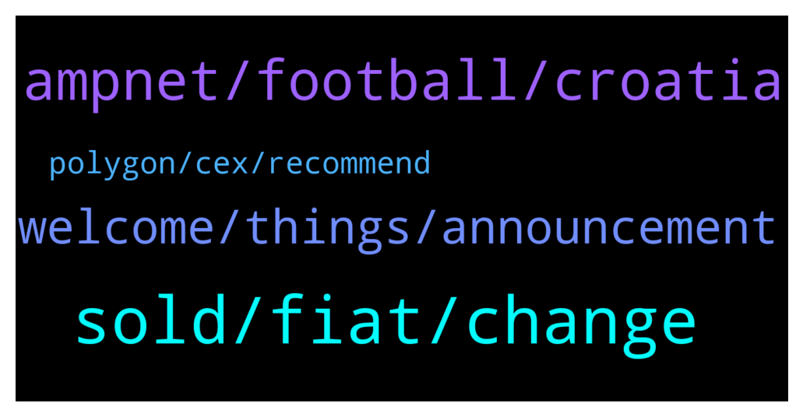

# **@ampnetapxchat**
 ## Analysis for **2022-01-13** - **2022-01-18**.

---

## 📊 **Basic Stats**

**n_messages_sent**: 116

---

---

## 🔝 **Top keywords and related messages**

1. **sold, fiat, change**

    @PFCBLic --- *Cool. Thanks for answer! So setup fee will be generating buybacks? Will this be visible as  public event?  I think validating that buyback actualy works is very important for future of this token  I understand that price cant be fixation for the team but some focus is to be expected since this community also supported this financial stabilty team has in upcomming period* **--->** [TG Discussion](https://t.me/ampnetapxchat/36622)

    @North --- *I really hope so. There are no details on how it benefits AAPX holders yet though which is unfortunate, but at least we have a great partner and some exposure now* **--->** [TG Discussion](https://t.me/ampnetapxchat/36339)

    @matejmz --- *How many tokens are going to be sold during this ICO? I only found total supply info.* **--->** [TG Discussion](https://t.me/ampnetapxchat/36373)

    @Hydayashi --- *Stop selling people...let it grow. This guys will make it in the end. Mark my words.* **--->** [TG Discussion](https://t.me/ampnetapxchat/36294)

    @scemodonore --- *guess aapx will benefit from buybacks but let's wait for the ama later* **--->** [TG Discussion](https://t.me/ampnetapxchat/36341)

    @Hydayashi --- *Will the foobal token be sold for crypto or only for fiat? it doesnt say anywhere...* **--->** [TG Discussion](https://t.me/ampnetapxchat/36382)

2. **ampnet, football, croatia**

    @panos_dim --- *So AMPnet is focused purely in Croatia market?* **--->** [TG Discussion](https://t.me/ampnetapxchat/36550)

    @mislavjavor --- *Yes - players will directly marekt* **--->** [TG Discussion](https://t.me/ampnetapxchat/36385)

    @North --- *Thanks. Do you think there may be potential for AmpNet to do on an international stage what Chiliz is doing with professional football teams? Chiliz work with a lot of big clubs like Juventus, Atheltico Madrid etc. Their platform and token really took off from this* **--->** [TG Discussion](https://t.me/ampnetapxchat/36391)

    @tradingjo98 --- *partnership with a national football team, oh god this must be kinda bullish* **--->** [TG Discussion](https://t.me/ampnetapxchat/36338)

    @mislavjavor --- *As always, there will be buybacks - the revenue for those, however, will not be coming only from the successfull collection of funds to the campaign, but also continuously - since AMPnet has several other fees included in the loyalty token business model. As for visibility - AMPnet has been assigned as the main sponsor for the HNS-CFF season and will be featured prominently on all football federation materials.* **--->** [TG Discussion](https://t.me/ampnetapxchat/36371)

    @mislavjavor --- *When there is a chargeable event on AMPnet* **--->** [TG Discussion](https://t.me/ampnetapxchat/36374)

3. **welcome, things, announcement**

    @TroopSep --- *Hi @jakovtradingmentor! Thanks for taking care of us! Welcome! 😊* **--->** [TG Discussion](https://t.me/ampnetapxchat/36423)

    @mislavjavor --- *Yes - details still being panned out, don’t want to rush with announcement* **--->** [TG Discussion](https://t.me/ampnetapxchat/36388)

    @tradingjo98 --- *Maybe you wanna tell us some things about you?* **--->** [TG Discussion](https://t.me/ampnetapxchat/36422)

    @jakovtradingmentor --- *So in the future any questions you lads might have, i'm your guy* **--->** [TG Discussion](https://t.me/ampnetapxchat/36418)

    @jakovtradingmentor --- *good good, was a very busy week so friday is welcome* **--->** [TG Discussion](https://t.me/ampnetapxchat/36528)

    @tradingjo98 --- *let‘s wait for the AMA :)* **--->** [TG Discussion](https://t.me/ampnetapxchat/36344)

4. **polygon, cex, recommend**

    @adhamalkhaja --- *I think polymath does something similar* **--->** [TG Discussion](https://t.me/ampnetapxchat/36545)

    @mislavjavor --- *Agreed, for low fees at this time, though - I can recommend the Polygon network* **--->** [TG Discussion](https://t.me/ampnetapxchat/36387)

    @<UNK> --- *You kinda answered to this already, but I'd like to recommend atleast some CEX since ETH is congested all the time. I understand that something like Kucoin is now "pointless" until there is enough progression from this "new start", but there is some smaller CEXes like MEXC or AscendEX where you can get listed quite easily and can have decent userbase & volume* **--->** [TG Discussion](https://t.me/ampnetapxchat/36383)

    @panos_dim --- *Cool, lowcap, do you guys have any competitors in other chains?* **--->** [TG Discussion](https://t.me/ampnetapxchat/36544)

    @<UNK> --- *Yea Polygon is fine, but TBH I never found it more convinient to use than some cex where I can quickly to trade different pairs and withdraw the coins I like. But maybe I should learn it better:)* **--->** [TG Discussion](https://t.me/ampnetapxchat/36398)

    @matejmz --- *Just wondering - wouldnt it be better for them to deploy on Polygon?* **--->** [TG Discussion](https://t.me/ampnetapxchat/36366)

