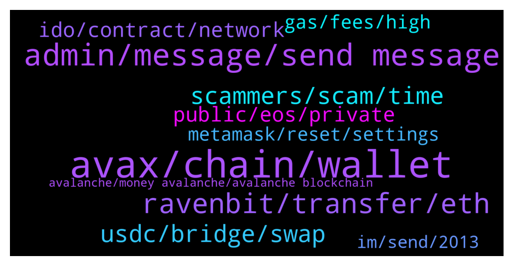

# **@avalancheavax**
 ## Analysis for **2022-01-17** - **2022-01-18**.

---

## 📊 **Basic Stats**

**n_messages_sent**: 217

---

---

## 🔝 **Top keywords and related messages**

1. **avax, chain, wallet**

    @Amyfootwears --- *How do I send avax from Binance to metamask?* **--->** [TG Discussion](https://t.me/avalancheavax/322822)

    @ShinJaiya --- *Hey all what is the easiest way to transfer ust from terra chain to avax ?* **--->** [TG Discussion](https://t.me/avalancheavax/323150)

    @alexanderppkv --- *Hi there! Could someone from AVAX team contact me? I’m representing ChangeNOW exchange service and we’ve gor some difficulties with integration of the AVAX on our platform – would like to ask for some assistance* **--->** [TG Discussion](https://t.me/avalancheavax/323181)

    @geekmidget --- *If someone accidentally sent AVAX to an Avalanche deposit address in Binance, is there a way to move it to a C-Chain deposit address?  It has not been my case, but a friend of mine asked me.* **--->** [TG Discussion](https://t.me/avalancheavax/322742)

    @dnbrk --- *Hello! I have sent some avax from C chain to x chain but it seems it stuck or something like that what should I do* **--->** [TG Discussion](https://t.me/avalancheavax/322744)

    @Hakan_Mdn --- *Yes I know but this shouldn't be important because future is blockchain and chains will be more busy. Now Avax price appr. 90 usd x 0.034 Avax fees: 3 usd, but if Avax will be 3000 usd (in future) 3000 x 0.034: 102 usd.* **--->** [TG Discussion](https://t.me/avalancheavax/322990)

2. **admin, message, send message**

    @debrakingston --- *I've tried bullpump about two months ago,and the admin was fake* **--->** [TG Discussion](https://t.me/avalancheavax/323104)

    @Jborum --- *I don’t know who the real admin is that why I’m texting* **--->** [TG Discussion](https://t.me/avalancheavax/322906)

    @suleyboi --- *About 3 people has messaged me, pls how will i know an admin from scammers?* **--->** [TG Discussion](https://t.me/avalancheavax/323058)

    @nacikuyumcu --- *Hey admin  is this your staff to send message like this?* **--->** [TG Discussion](https://t.me/avalancheavax/322794)

    @SeqAnto --- *The admin will never message you* **--->** [TG Discussion](https://t.me/avalancheavax/323059)

    @debrakingston --- *Everyone claim to be the admin* **--->** [TG Discussion](https://t.me/avalancheavax/322981)

3. **ravenbit, transfer, eth**

    @Jborum --- *I have trouble withdrawing out of my ravenbit* **--->** [TG Discussion](https://t.me/avalancheavax/322880)

    @Nicolas_A --- *It’s written admin in the members list. Anyway told you to contact Ravenbit can’t really help with exchange issues* **--->** [TG Discussion](https://t.me/avalancheavax/322912)

    @Ayo 👳‍♀️👦👳 --- *How do I transfer ETH from Ravenbit* **--->** [TG Discussion](https://t.me/avalancheavax/322813)

    @CreepyJoe --- *How to I transfer crypto to another exchange* **--->** [TG Discussion](https://t.me/avalancheavax/322844)

    @Gregwulf --- *Copy your eth address on trustwallet and paste on Ravenbit and send, please confirm if Ravenbit Eth is also on ETH network* **--->** [TG Discussion](https://t.me/avalancheavax/322817)

    @Jborum --- *I got problem withdrawing my coin on ravenbit i lodged a complaint which I got about a 100 More than replies from different customer service wanting me to click on a link* **--->** [TG Discussion](https://t.me/avalancheavax/322903)

4. **scammers, scam, time**

    @soilyworm --- *Yea so many scammers messaging me, on the website it says usual reply time is 1 day 🤣* **--->** [TG Discussion](https://t.me/avalancheavax/322888)

    @pupmkin_l --- *Lol 😂 so many scams actually especially in this group* **--->** [TG Discussion](https://t.me/avalancheavax/322838)

    @ColinYNWA2021 --- *ok lost in all the scam. thanks but no thanks. its solved* **--->** [TG Discussion](https://t.me/avalancheavax/322837)

    @pupmkin_l --- *But I know the right ones so I can’t get scammed tho* **--->** [TG Discussion](https://t.me/avalancheavax/322839)

    @ColinYNWA2021 --- *yes. still blocking. 1 msg 10 scam msgs back* **--->** [TG Discussion](https://t.me/avalancheavax/322840)

    @M --- *Everyone dming you is a scammer* **--->** [TG Discussion](https://t.me/avalancheavax/323060)

5. **usdc, bridge, swap**

    @AceInTheHat --- *What are the fees to bridge ETH USDC to AVAX USDC.e on https://bridge.avax.network/login? Is there a tutorial on how to use?* **--->** [TG Discussion](https://t.me/avalancheavax/322773)

    @Nicolas_A --- *Bridge only has USDC.e if you usdc you have to swap it afterwards for example* **--->** [TG Discussion](https://t.me/avalancheavax/323186)

    @wireframester --- *Hello, I cant find USDC on the avalanche bridge, I only see USDC.e, which is not what i want! any advice? Scammer and anyone else, spare me your PMs!* **--->** [TG Discussion](https://t.me/avalancheavax/323184)

    @wireframester --- *you mean, swap USDC for USDC.e? is that possible on traderjoe or Pangolin?* **--->** [TG Discussion](https://t.me/avalancheavax/323187)

    @Nicolas_A --- *Yes that's what I mean. Should be possible yes* **--->** [TG Discussion](https://t.me/avalancheavax/323188)

    @Nicolas_A --- *Not really sure there is a way at the moment* **--->** [TG Discussion](https://t.me/avalancheavax/323157)

6. **ido, contract, network**

    @mkchaves --- *Network is not down, it's just busy. This IDO has 30k participants I don't know how many are trying to buy at the same time* **--->** [TG Discussion](https://t.me/avalancheavax/322953)

    @ruch149 --- *But dude that's not possible, network doesn't go down when poeple are just claiming are you kidding me* **--->** [TG Discussion](https://t.me/avalancheavax/322950)

    @makiob --- *does anyone what dapp is this contract ? https://snowtrace.io/address/0x41ed99efeab7f5e82cc2ba69fa1b81f7abb7b064 ? it is consuming a lot of gas* **--->** [TG Discussion](https://t.me/avalancheavax/322938)

    @Laikevin --- *Omg the network is so congested* **--->** [TG Discussion](https://t.me/avalancheavax/323012)

    @Nicolas_A --- *Yeah can take some time to go down if demand is sustained* **--->** [TG Discussion](https://t.me/avalancheavax/322973)

    @Juan David Jaramillo 🇨🇴 --- *is the network congested now or something?* **--->** [TG Discussion](https://t.me/avalancheavax/323042)

7. **public, eos, private**

    @86u_yhLx30 --- *https://nitter.net/pic/media%2FE1l8L2dXMAExklv.jpg%3Fname%3Dorig  Not sure if what you says makes much sense. 42% initially belonged to VCs and insiders. 19% was allocated to foundations.* **--->** [TG Discussion](https://t.me/avalancheavax/323031)

    @ManyWizzard --- *Wsup guys. Look at the article which I've found. It seems like btc and eth maxis desperately trying to keep their chains alive. What do you think about it? https://yanmaani.github.io/proof-of-stake-is-a-scam-and-the-people-promoting-it-are-scammers/* **--->** [TG Discussion](https://t.me/avalancheavax/323177)

    @86u_yhLx30 --- *I'm not saying EOS is fundamentally better overall. Just saying its allocations are considerably less shady.* **--->** [TG Discussion](https://t.me/avalancheavax/323032)

    @Nicolas_A --- *60% of initial tokens are for public and the ecosystem. The public was able to purchase at the same price / terms as any VC. Except ETH all the tokens you mentioned are excuse me quite underwhelming. Really cute to make a 4 billion public raise (wow big public allocation 👏👏👏) like EOS and deliver nothing* **--->** [TG Discussion](https://t.me/avalancheavax/323030)

    @86u_yhLx30 --- *eth, cardano, eos, tezos all have around 80% belonging to the public* **--->** [TG Discussion](https://t.me/avalancheavax/323027)

    @86u_yhLx30 --- *Yeah, i see that. It's inflation of over 30% isn't a great thing either* **--->** [TG Discussion](https://t.me/avalancheavax/323037)

8. **gas, fees, high**

    @Nicolas_A --- *Fees will be adjusted if price goes up as it was done previously* **--->** [TG Discussion](https://t.me/avalancheavax/322991)

    @l0nEr00 --- *seriously whats up with the gas fees now.... the IGO sale isnt filling up very fast... but gas is so high* **--->** [TG Discussion](https://t.me/avalancheavax/322966)

    @ruch149 --- *Wtf is this? 3$ to swap from one token to the other? Why are gas fees so high* **--->** [TG Discussion](https://t.me/avalancheavax/322939)

    @faisala777 --- *are gas fees higher than normal right now?* **--->** [TG Discussion](https://t.me/avalancheavax/323047)

    @mkchaves --- *Exactly. I mean you have literally 15 hours to buy it.* **--->** [TG Discussion](https://t.me/avalancheavax/322955)

    @Nicolas_A --- *A lot of apes that think they have to rush to buy. Happens each time …* **--->** [TG Discussion](https://t.me/avalancheavax/322954)

9. **metamask, reset, settings**

    @TheSEOdude --- *You need to reset your metamask, the pending transaction will get cancelled/reverted.* **--->** [TG Discussion](https://t.me/avalancheavax/322881)

    @gillbates1212 --- *i have had 2 transactions pending on my metamask for a few hours. i can't see them on snowtrace. how can i fix this?* **--->** [TG Discussion](https://t.me/avalancheavax/323076)

    @faisala777 --- *others reported the same? here's my transaction. I didn't want to mess with the fee settings on MetaMask - https://snowtrace.io/tx/0xf38dc6e319fe20cf9203cbd21fda1329b78c9baa8e4c006573290257c110a7b7* **--->** [TG Discussion](https://t.me/avalancheavax/323053)

    @soilyworm --- *Had a transaction pending for nearly 2 hours now* **--->** [TG Discussion](https://t.me/avalancheavax/322879)

    @oathtobarbatos --- *Try resetting your Metamask account. Metamask settings > advanced > reset* **--->** [TG Discussion](https://t.me/avalancheavax/323077)

    @oathtobarbatos --- *Metamask settings > advanced > reset* **--->** [TG Discussion](https://t.me/avalancheavax/322762)

10. **im, send, 2013**

    @Nicolas_A --- *Sure you can send me a dm* **--->** [TG Discussion](https://t.me/avalancheavax/323182)

    @abrian73 --- *Halo evry one...im new in the club* **--->** [TG Discussion](https://t.me/avalancheavax/322875)

    @debrakingston --- *I have numbers of them calming to be in my dm* **--->** [TG Discussion](https://t.me/avalancheavax/323113)

    @Pedro --- *Im in since early 2013, so dont bother* **--->** [TG Discussion](https://t.me/avalancheavax/323121)

    @donomanji --- *hi @Nicolas_A please check dm when you get a chance* **--->** [TG Discussion](https://t.me/avalancheavax/322961)

    @Jborum --- *I can’t send you a dm* **--->** [TG Discussion](https://t.me/avalancheavax/322923)

