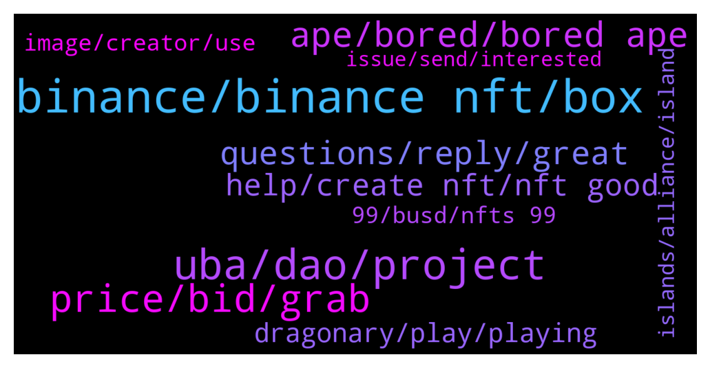

# **@binancenfts**
 ## Analysis for **2022-01-17** - **2022-01-18**.

---

## 📊 **Basic Stats**

**n_messages_sent**: 528

---

---

## 🔝 **Top keywords and related messages**

1. **binance, binance nft, box**

    @Kid_dummy --- *How do I sell my NFT on Binance* **--->** [TG Discussion](https://t.me/binancenfts/436040)

    @Bikasba --- *I'm new in binance ..  Is there any roles for new user..* **--->** [TG Discussion](https://t.me/binancenfts/436209)

    @fqkissfire --- *Why can't I see the blind box I hold in the APP ~NFT~personal center recently?  Can only see ordinary collections* **--->** [TG Discussion](https://t.me/binancenfts/435923)

    @fqkissfire --- *Yes I do it . But no blind box option shows up.* **--->** [TG Discussion](https://t.me/binancenfts/435931)

    @ChibiMaya_bnb --- *!warn @StriderX88 only binance nfts screenshots here* **--->** [TG Discussion](https://t.me/binancenfts/435823)

    @StriderX88 --- *Please delete warning as I am talking about binance nfts, thanks* **--->** [TG Discussion](https://t.me/binancenfts/435833)

2. **uba, dao, project**

    @irfanecruz --- *Does higher 3D Avatar Rank mean more DAO rights in the UBA Community? If I get the lowest rank can I still participate in DAO? #UBA @LeviBini* **--->** [TG Discussion](https://t.me/binancenfts/435252)

    @Dinc3 --- *Hi @LeviBini  "UBA can be mined by Everyone!" This is what you say in your website. For sure it is great you let everybody this possibility, but I would like to know if Anybody really can mine UBA? Is it easy and simple to mine UBA for everybody? How Strong System do I need to mine?  #UBA* **--->** [TG Discussion](https://t.me/binancenfts/435240)

    @ilA60m --- *Does UBA serve globally? If yes, how will you manage a multilingual and, more importantly, multicultural platform? #UBA* **--->** [TG Discussion](https://t.me/binancenfts/435249)

    @semeerkv --- *Your PROJECT NAME seems to be very INTERESTING . Does it have any STORY behind it? Can you share us with the inspiron for approaching to this Name? Who are the team behind this project? #UBA @LeviBini* **--->** [TG Discussion](https://t.me/binancenfts/435247)

    @YilanGulsum --- *I learned about you today. great project. I couldn't think of anything to ask. So my question will be this. What question would you ask for UBA if you were in our place? #UBA* **--->** [TG Discussion](https://t.me/binancenfts/435253)

    @LeviBini --- *Because UBA DAO users will be voting on many different SocialFi ideas, we have developed an Influence system in which users can build more influence in the DAO community.* **--->** [TG Discussion](https://t.me/binancenfts/435201)

3. **price, bid, grab**

    @michaelmc87 --- *I've made some bids in parts of four auction but my BUSD didn't return to my wallet. It's been 2 weeks since then and Binance support couldn't solve my problem* **--->** [TG Discussion](https://t.me/binancenfts/435433)

    @peach_colours --- *Be OK with BTC! Hurry up to place your bid, only 40 minutes left! Last chance!* **--->** [TG Discussion](https://t.me/binancenfts/435604)

    @Gauravtak7 --- *how much can i get for this??* **--->** [TG Discussion](https://t.me/binancenfts/435593)

    @Anand_jio --- *U minted and u listed..no one buyied...price also high* **--->** [TG Discussion](https://t.me/binancenfts/435769)

    @catZ_z --- *Bidding is up, feel free to grab while available.* **--->** [TG Discussion](https://t.me/binancenfts/435920)

    @lollo260599 --- *The auction is open . It started by only 38€ . Do fast* **--->** [TG Discussion](https://t.me/binancenfts/434842)

4. **ape, bored, bored ape**

    @Anand_jio --- *Lowest price from seller...grab soon guys....soon it will became 100$+....Already bored ape series reached 100$+..so get soon....* **--->** [TG Discussion](https://t.me/binancenfts/435754)

    @nftman87 --- *BORED APE #10067  Bid sarts 550 busd  Nft with 197 ❤️  Tomorrow half day ends  Don't miss your Bored Ape and place your bid.* **--->** [TG Discussion](https://t.me/binancenfts/436545)

    @EM --- *Ending in the next 1 hour:  $10.96 giveaway price for the cheapest "Bored Gorilla 08" in the market.* **--->** [TG Discussion](https://t.me/binancenfts/434848)

    @Jallenreyesm --- *this is first time to see a girl ape* **--->** [TG Discussion](https://t.me/binancenfts/436586)

    @EM --- *Ending in the next 1 hour!  28 BUSD for this rare "Bored Ape Soldier Club" NFT* **--->** [TG Discussion](https://t.me/binancenfts/434847)

    @bugrasevindik --- *Rank 74! Badass Ape Guild. Ssr. Waiting for ur offers. 🔥* **--->** [TG Discussion](https://t.me/binancenfts/435493)

5. **questions, reply, great**

    @Kenikky --- *please reply to your favourite questions.* **--->** [TG Discussion](https://t.me/binancenfts/435237)

    @semeerkv --- *Thanks great AMA 👏 @LeviBini @Kenikky* **--->** [TG Discussion](https://t.me/binancenfts/435292)

    @Noahh99 --- *Or this one its up to you.* **--->** [TG Discussion](https://t.me/binancenfts/435563)

    @RealJassia --- *Yes please. What are your questions ?* **--->** [TG Discussion](https://t.me/binancenfts/435707)

    @RealJassia --- *Congratulations you to all Winners 🏆🏆🏆* **--->** [TG Discussion](https://t.me/binancenfts/435345)

    @YilanGulsum --- *good for you Yana. keep it up this way* **--->** [TG Discussion](https://t.me/binancenfts/435504)

6. **help, create nft, nft good**

    @ashwin24aug --- *Okay. I am not doing all this in fact. We are implementing nft project in our organization. So trying to get answer of above queries* **--->** [TG Discussion](https://t.me/binancenfts/436187)

    @Vin1222 --- *Is there a free course about nft’s?* **--->** [TG Discussion](https://t.me/binancenfts/436547)

    @ivan93la --- *Hey guys Who Can help me with nft questions?* **--->** [TG Discussion](https://t.me/binancenfts/435706)

    @Kid_dummy --- *How will they know my work is perfect....where do I post my nft for them to see it* **--->** [TG Discussion](https://t.me/binancenfts/436048)

    @katelynMal --- *Can anyone explain something about the NFTs* **--->** [TG Discussion](https://t.me/binancenfts/435977)

    @just_text_me --- *How do I create a nft* **--->** [TG Discussion](https://t.me/binancenfts/436044)

7. **dragonary, play, playing**

    @famian99 --- *I deposited my first CYT my Coinary wallet today, however these are still not displayed even though the transaction is confirmed, is there a certain delay? And also why can't I connect to the desktop version of Dragonary?#Dragonary* **--->** [TG Discussion](https://t.me/binancenfts/436337)

    @elmakhannam --- *I’m actually a bit of a noob in blockchain game,How do i play Dragonary on my Desktop? How many players are playing Dragonary?anyone can play it or any requirement for play? #Dragonary* **--->** [TG Discussion](https://t.me/binancenfts/436291)

    @Jallenreyesm --- *In order to play Dragonary, users can login to the game using their Gmail or Facebook account. By this feature, could you please elaborate to us your game's security feature and mechanism? How would your users ensure that their connected social media account will be protected from Dragonary?   #Dragonary* **--->** [TG Discussion](https://t.me/binancenfts/436295)

    @acoinary --- *Dragonary was launched in August 2021, before its launch we made a starting campaign, where it attracted a lot of interest from both the gaming and crypto community. At this time Dragonary has over 1m created accounts and over 235k active users per month. After its launch, we achieved Binance MVBIII August Monthly Stars.  The problem that Coinary encounters in this ecosystem is that for a user not familiarized with the crypto world, it’s really difficult to understand how to take every step needed to participate in NFTs projects or GameFi. On Coinary HUB, there’s no need to have a wallet, it’s generated automatically once you create an account with Google or Facebook.  We believe this is a simpler way for everyone to interact with GameFi world. We want to encourage people to have a great experience when interacting with decentralized platforms, and we are aware that sometimes the process can be stressful or annoying. Also, they have the chance to have contact with a Marketplace and certain currencies.* **--->** [TG Discussion](https://t.me/binancenfts/436238)

    @mrHarry57 --- *Do you still plan to add metamask-type Wallets later on?#Dragonary* **--->** [TG Discussion](https://t.me/binancenfts/436320)

    @irfanecruz --- *@RamiroCH   @acoinary  As a beginner or newbie, Is it required to have a Coinary HUB account in order to play Dragonary? Can I use metamask or trustwallet in account creation? #Dragonary* **--->** [TG Discussion](https://t.me/binancenfts/436288)

8. **99, busd, nfts 99**

    @c_hinmay --- *Price? Just out of curiosity coz I know the nft star 😅😁* **--->** [TG Discussion](https://t.me/binancenfts/436411)

    @carlonf --- *don't miss fifteen nfts s only 99 busd* **--->** [TG Discussion](https://t.me/binancenfts/436105)

    @Andrew_7677 --- *Who can give me 1 nft?* **--->** [TG Discussion](https://t.me/binancenfts/436107)

    @Legit34 --- *Any one want free nft 🤔  Floor price 1 sol* **--->** [TG Discussion](https://t.me/binancenfts/436535)

    @carlonf --- *only 99 deals in fifteen NFTs* **--->** [TG Discussion](https://t.me/binancenfts/435871)

    @carlonf --- *opportunity don't miss fifteen nfts s only 99 busd* **--->** [TG Discussion](https://t.me/binancenfts/436108)

9. **image, creator, use**

    @devonrog --- *How can there be 2 same ?* **--->** [TG Discussion](https://t.me/binancenfts/436175)

    @Anand_jio --- *1x55 2x 55 Up to 55x55 same Pic with different series came* **--->** [TG Discussion](https://t.me/binancenfts/436200)

    @RamiroCH --- *My answer to that question is the same one :D* **--->** [TG Discussion](https://t.me/binancenfts/436239)

    @ChibiMaya_bnb --- *same same, or copy from same series? like if there are 50 copies of same image is possible? or you mean same image but different name, please tell me.* **--->** [TG Discussion](https://t.me/binancenfts/436198)

    @ChibiMaya_bnb --- *no, I saw twice same image, but I deleted one. same image once or twice a day, if you have several nfts, then make some collage or screenshot as others. and welcome ^__^* **--->** [TG Discussion](https://t.me/binancenfts/434881)

    @ChibiMaya_bnb --- *please share only once or twice a day same image, I have seen this one several times.* **--->** [TG Discussion](https://t.me/binancenfts/434864)

10. **islands, alliance, island**

    @TripleN1506 --- *Q: if you have 2 islands same element, the dragons of that element of my team is improved twice? #Dragonary* **--->** [TG Discussion](https://t.me/binancenfts/436342)

    @pedroveraj --- *the game is great.  I ask you: Will the islands be able to communicate with each other if they are from the same clan or friends to join forces for the clan?  It would also be great if you can progress on the islands in small steps with improvements like in Clash of clan.  Thank you very much and keep it up family. #dragonary* **--->** [TG Discussion](https://t.me/binancenfts/436311)

    @Kenikky --- *It's all interesting, so these islands are prime virtual real estate!* **--->** [TG Discussion](https://t.me/binancenfts/436260)

    @CYT12345 --- *Based on the blog, we can also have a mythic ember, the question is. How often does the mythic ember appear on an island? Should we expect to have atleast 1 every month?* **--->** [TG Discussion](https://t.me/binancenfts/436336)

    @Kenikky --- *What role will the “Islands” play inside Dragonary?* **--->** [TG Discussion](https://t.me/binancenfts/436258)

    @RamiroCH --- *Our goal is to create a system where Island, alliance and tournament are linked. As I mentioned before, to create an Alliance you will need an Island, and to host a Tournament you need an Alliance. The more Island an alliance has, the bigger it will be. A big alliance will be able to host a bigger tournament. So we aim to add benefits, to encourage people to create big alliances.* **--->** [TG Discussion](https://t.me/binancenfts/436357)

