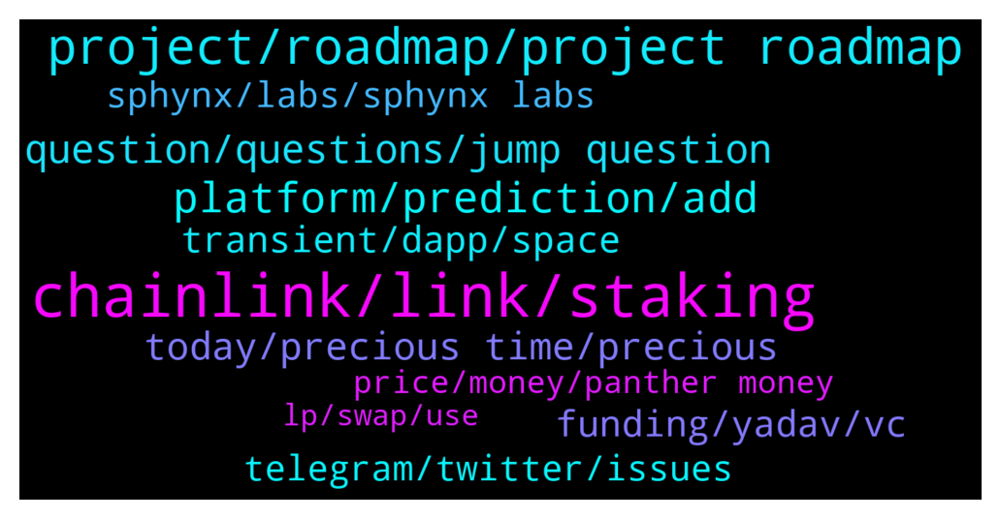

# **@chainlinkofficial**
 ## Analysis for **2022-01-17** - **2022-01-18**.

---

## 📊 **Basic Stats**

**n_messages_sent**: 218

---

---

## 🔝 **Top keywords and related messages**

1. **chainlink, link, staking**

    @twinturbo_dev --- *like someone from chain link works jere* **--->** [TG Discussion](https://t.me/chainlinkofficial/365652)

    @manhhhg --- *Hello I'am new? How do I know where the chainlink is in the roadmap.* **--->** [TG Discussion](https://t.me/chainlinkofficial/366054)

    @marcromeron --- *Any integration will be announced through official channels like twitter.com/chainlink. Anything else can be considered speculation. Also you can check chainlinkecosystem.com* **--->** [TG Discussion](https://t.me/chainlinkofficial/365717)

    @ivansnowmobile --- *Chainlink has been our trusted partner from the very start of our project. Our main partnership directions are: using their price feeds and their oracle technology for defining the final prices of each pool. Recently we have integrated Chainlink Keepers for automatic commission claims, so we can say for sure that top tech solutions presented by the Chainlink team have been a great help for Prosper’s development. We hope that we will extend this partnership and make our project better together.* **--->** [TG Discussion](https://t.me/chainlinkofficial/365842)

    @Dubem --- *Please sir all am asking is that is chainlink good to invest* **--->** [TG Discussion](https://t.me/chainlinkofficial/365629)

    @marcromeron --- *Take in consideration that once staking is live the LINK token, will be used as collateral by node operators to take on high value jobs.* **--->** [TG Discussion](https://t.me/chainlinkofficial/365628)

2. **project, roadmap, project roadmap**

    @The_Stache --- *I like that you guys are building a solid foundation before the influx of traffic. This is the right way. Do you expect and increase of launches on your Launchpad?* **--->** [TG Discussion](https://t.me/chainlinkofficial/365978)

    @marcromeron --- *Where can the audience follow you and your project?* **--->** [TG Discussion](https://t.me/chainlinkofficial/365951)

    @ivansnowmobile --- *Currently, we do not have any plans regarding it - only slight renewals of our frontpage, but if some big updates will come, our team might think of it. Besides, we are constantly gathering feedback from our community, so if it will feel that current logo does not represent the project's values, we will also consider the change.* **--->** [TG Discussion](https://t.me/chainlinkofficial/365864)

    @Joypokkamol --- *What’s next on your project’s roadmap that we may expect soon?* **--->** [TG Discussion](https://t.me/chainlinkofficial/365561)

    @Sylvarantt --- *There is no formal roadmap. The Whitepaper indicates future features (and some that are now live), this blogpost gives a good overview https://blog.chain.link/chainlink-2-0-lays-foundation-for-adoption-of-hybrid-smart-contracts/* **--->** [TG Discussion](https://t.me/chainlinkofficial/366057)

    @twinturbo_dev --- *what are the fees to launch projects off the launch pad* **--->** [TG Discussion](https://t.me/chainlinkofficial/365972)

3. **platform, prediction, add**

    @Lonzocrypto --- *With the help of Chainlink we have been able to add extra features to our platform and change the way people tend to trade by implementing stop loss and limit orders through the chainlink keepers. This is the start for us using keepers as we plan to implement in many more places on our platform.  We have implemented VRF to the lottery contract to make it a more verified random generation of the numbers so players feel more confident with our platform and the fact it’s a way being more certified of being decentralised.   We also implement price feeds which allows us to receive accurate, real-time token pricing data.* **--->** [TG Discussion](https://t.me/chainlinkofficial/365937)

    @ivansnowmobile --- *For example, last summer we have launched predictions for EURO 2020 matches: thus this was our first attempt to give our users opportunity to predict not only in crypto field.* **--->** [TG Discussion](https://t.me/chainlinkofficial/365828)

    @Johannes --- *What do you think about the price prediction in 2022* **--->** [TG Discussion](https://t.me/chainlinkofficial/365337)

    @oppotoken --- *Is there a plan to allow using credit/ debit cards to buy crypto or will it stay as decentralised as possible? If so, would this be rolled out in the app?* **--->** [TG Discussion](https://t.me/chainlinkofficial/365958)

    @Lonzocrypto --- *Simple! Head on over to https://thesphynx.co  Connect your wallet, explore our Ecosystem, and get familiar with our platform. Whether it's the token, charts, DEX, Lottery, or Launchpad - there are many ways to get involved.  We also have our Limit Orders and Stop Loss going Live soon!   We encourage everyone to come take them for a spin and see how smooth our integration with Chainlink Keepers has made that functionality.* **--->** [TG Discussion](https://t.me/chainlinkofficial/365942)

    @BeauTransient --- *We are really excited to be able to bring Gamescorekeepers extensive data set of esports data on-chain via Chainlink. This integration will be critical in keeping the integrity of tournament and player stats to power our prediction pools.  This will go along way to powering a completely decentralised experience of resulting outcomes of matches and giving the foundation for automated execution of pay outs and tournament resulting.* **--->** [TG Discussion](https://t.me/chainlinkofficial/366081)

4. **question, questions, jump question**

    @Marino_locos --- *So do we just ask questions?* **--->** [TG Discussion](https://t.me/chainlinkofficial/365914)

    @PolivodaTatiana --- *I'm sure our readers have the same question* **--->** [TG Discussion](https://t.me/chainlinkofficial/366085)

    @marcromeron --- *I know that you could not tell me nothing about that. So I think the best way to know is asking my last question....* **--->** [TG Discussion](https://t.me/chainlinkofficial/365949)

    @marcromeron --- *Lets' jump to our first question....* **--->** [TG Discussion](https://t.me/chainlinkofficial/365925)

    @marcromeron --- *Here we go with a very interesting question...* **--->** [TG Discussion](https://t.me/chainlinkofficial/365853)

    @marcromeron --- *Let's go to the second question...* **--->** [TG Discussion](https://t.me/chainlinkofficial/365831)

5. **today, precious time, precious**

    @marcromeron --- *Thank you very much @ivansnowmobile for your precious time!!* **--->** [TG Discussion](https://t.me/chainlinkofficial/365883)

    @PolivodaTatiana --- *Awesome, thank you so much for your time today* **--->** [TG Discussion](https://t.me/chainlinkofficial/366101)

    @marcromeron --- *Thank you very much @Lonzocrypto for your precious time.* **--->** [TG Discussion](https://t.me/chainlinkofficial/365993)

    @marcromeron --- *Welcome and thank you for your time today.* **--->** [TG Discussion](https://t.me/chainlinkofficial/365816)

    @Joypokkamol --- *Happy to have you with us today.* **--->** [TG Discussion](https://t.me/chainlinkofficial/365546)

    @marcromeron --- *Wait until the end. Thank you* **--->** [TG Discussion](https://t.me/chainlinkofficial/365915)

6. **funding, yadav, vc**

    @Lonzocrypto --- *but if u know a vc looking to fund, send them our way 😂* **--->** [TG Discussion](https://t.me/chainlinkofficial/365989)

    @jack2452 --- *Do you have a market capitalization management plan?* **--->** [TG Discussion](https://t.me/chainlinkofficial/365888)

    @Marino_locos --- *How are you guys funding such a big team? Do you guys have VC funding?* **--->** [TG Discussion](https://t.me/chainlinkofficial/365982)

    @marcromeron --- *For a better comprehension of Keepers check our site: https://chain.link/keepers* **--->** [TG Discussion](https://t.me/chainlinkofficial/365846)

    @Lonzocrypto --- *hence why the ecosystem is set up for the investors* **--->** [TG Discussion](https://t.me/chainlinkofficial/365986)

    @ivansnowmobile --- *Right now we are being overseered by Animoca in terms of marketing and development. Their experienced team always ready to give us any advices we require, so we can name it as a mutual beneficiary partnership right now. Follow our project's social media for more info regarding that!* **--->** [TG Discussion](https://t.me/chainlinkofficial/365871)

7. **transient, dapp, space**

    @Lonzocrypto --- *What makes our project special is that we are looking to provide a decentralised platform that is simple enough to provide a newest entrant in the space the services to onboard and manage their portfolio from A to Z, while remaining sophisticated to satisfy the demands of more seasoned users.   We believe that this is one of the keys to fostering mass adoption in the space.* **--->** [TG Discussion](https://t.me/chainlinkofficial/365933)

    @Blockbaas --- *I have a question for the developers... Which Programming Language is the best to develope with Blockchain (of course solidity) and? Python or Js(react) ?* **--->** [TG Discussion](https://t.me/chainlinkofficial/366048)

    @BeauTransient --- *Other than the socials above you can keep across specific updates and launch our dapps from the link below - this is a great way to interact and starting using the dapps on Transient!* **--->** [TG Discussion](https://t.me/chainlinkofficial/366099)

    @BeauTransient --- *Keeping across our socials is a great way - that way you can see when our dapps are dropping, how they are impacting key industry and have some fund along the way :) Details below.* **--->** [TG Discussion](https://t.me/chainlinkofficial/366089)

    @BeauTransient --- *Transient represents the 1st use case for Esports data to be integrated on-chain and will be working with a large esports data provider - Gamescorekeeper - to bring event data on-chain. A great result for us and the Chainlink ecosystem. Even before that, on our 2nd dApp (CryptoPool), Chainlink already plays a key role by integrating the price data from external sources.  When Esports go live in late Q1 2022, a big chunk of tournament and match data will be integrated for live interactions on the platform.* **--->** [TG Discussion](https://t.me/chainlinkofficial/366077)

    @BeauTransient --- *The difference with Transient is the number of use cases we are hitting with similar patterns of development and tech - here are the dapps either on mainnet or are close to deployment - it shows the vast array of users and demographics we are targeting:  TSC-Core — our flagship product and the first proponent of the Transient Network focusing on standard Smart Contract creation and management. TSC-CryptoPool — our first dApp in our marketplace focusing on the ability for users to create their own pools for crypto-price predictions and share in the winnings with creators being rewarded for their contributions. TSC-eSports — our second dApp creating an ecosystem of P2P market creation of your favourite competitions and a number of services relating to facilitating eSports competitions and team management — taking social betting and content driven experiences to the next level. TSC-NDA — our third dApp creating a home for anything and everything to do with allowing you to work with your partners or clients* **--->** [TG Discussion](https://t.me/chainlinkofficial/366068)

8. **telegram, twitter, issues**

    @PolivodaTatiana --- *📲 Telegram: https://t.me/transientnetwork  🐦 Twitter: https://twitter.com/transient_sc  📝 Medium: https://medium.transientnetwork.io 🎥 YouTube: https://tnetwork.io/YouTube  💻 Website: https://www.transientnetwork.io* **--->** [TG Discussion](https://t.me/chainlinkofficial/366090)

    @Lonzocrypto --- *Our main platform is - https://thesphynx.co   As you know we made it simple so for EVERYTHING you'll find it here - https://linktr.ee/SphynxLabs  https://t.me/sphynxswap - telegram (BSC) https://t.me/sphynxswapETH - telegram (ETH)* **--->** [TG Discussion](https://t.me/chainlinkofficial/365952)

    @Sylvarantt --- *It seems there is a regional server downtime on some Telegram servers and our fantastic host -Joy Pokkamol- and our guest -AY, from PantherMoney- are having some issues to continue the AMA. Please feel free to follow PantherMoney on any of their social channels  Twitter: twitter.com/panthermoney1 Discord: https://discord.com/invite/kKECQjtFJw Website: https://www.panther.money/* **--->** [TG Discussion](https://t.me/chainlinkofficial/365569)

    @manhhhg --- *What is the meaning of color role here?* **--->** [TG Discussion](https://t.me/chainlinkofficial/365722)

    @Sylvarantt --- *There are no color roles in Telegram. That's a Discord feature* **--->** [TG Discussion](https://t.me/chainlinkofficial/365724)

    @Дмитрий --- *Почему так сильно увеличились объёмы, а цена на месте?* **--->** [TG Discussion](https://t.me/chainlinkofficial/365865)

9. **sphynx, labs, sphynx labs**

    @Gouzetsu --- *Is there a sphynx labs ama today?* **--->** [TG Discussion](https://t.me/chainlinkofficial/365500)

    @Crypto_MVP --- *Thanks a lot for the awesome AMA!🔥 SphynxLabs <> Chainlink* **--->** [TG Discussion](https://t.me/chainlinkofficial/366024)

    @marcromeron --- *COMMUNITY!! If you have any question about SPHYNX LABS feel free to drop it here* **--->** [TG Discussion](https://t.me/chainlinkofficial/365953)

    @MrCryptoNoob --- *#SphynxArmy is so excited to be a part of your community!* **--->** [TG Discussion](https://t.me/chainlinkofficial/365584)

    @Zach1229 --- *It like the “If you build it they will come” saying. 100% true in regards to Sphynx* **--->** [TG Discussion](https://t.me/chainlinkofficial/365988)

    @Zach1229 --- *Thank you Chainlink for having the #SphynxSwapARMY join you today!!!* **--->** [TG Discussion](https://t.me/chainlinkofficial/366011)

10. **price, money, panther money**

    @Joypokkamol --- *Lastly, where can the audience follow Panther Money and stay up to date for our community members who are watching today?* **--->** [TG Discussion](https://t.me/chainlinkofficial/365565)

    @Joypokkamol --- *In just a few moments, we will have a Community Q&A with Panther Money, who recently announced that it integrates Chainlink Price Feeds to Support Prediction Markets on Harmony. https://twitter.com/chainlink/status/1476538393865687041?s=20* **--->** [TG Discussion](https://t.me/chainlinkofficial/365535)

    @Joypokkamol --- *AMA with Panther Money at 9 am (ET) today! https://twitter.com/cl_community/status/1482439488257277954?s=21* **--->** [TG Discussion](https://t.me/chainlinkofficial/365487)

    @Joypokkamol --- *It is fascinating to see Panther Money Integrates with Chainlink Price Feeds* **--->** [TG Discussion](https://t.me/chainlinkofficial/365556)

    @amit29199 --- *1. Panther Money prediction game uses Chainlink’s ONE/USD price feed for resolution of each round. 2. There is a time window (currently 30 minutes) and at the end of the round, the actual price is fetched using Chainlink’s price feed and winners are decided using the fetched price.* **--->** [TG Discussion](https://t.me/chainlinkofficial/365558)

    @Joypokkamol --- *Please tell us about Panther Money. How does it work?* **--->** [TG Discussion](https://t.me/chainlinkofficial/365548)

