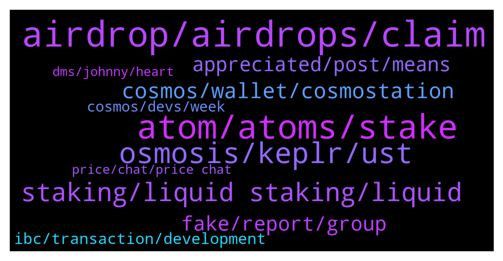

# **@cosmosproject**
 ## Analysis for **2022-01-17** - **2022-01-18**.

---

## 📊 **Basic Stats**

**n_messages_sent**: 418

---

---

## 🔝 **Top keywords and related messages**

1. **airdrop, airdrops, claim**

    @AtomJazz --- *If you stake now you'll likely be eligible for next airdrops. You can join airdrop channel to stay on top of it https://t.me/CosmosAirdrops* **--->** [TG Discussion](https://t.me/cosmosproject/476044)

    @CeeNario --- *Ok good advice 👍🏽 thanks!  So it sounds like they’re all/mostly for their own chains, and have directions… likely I’d use a different address to claim, kinda like how I use my ledgers Cosmos app to link to a special FET address?     I’ll continue looking into it. I went to that airdrop channel and some of the messages say “click here” to claim and I didn’t even wanna click those 😅🤣* **--->** [TG Discussion](https://t.me/cosmosproject/475982)

    @AtomJazz --- *Oh damn, you then have airdrops like stars, HUAHUA, desmos etc all waiting for you to claim* **--->** [TG Discussion](https://t.me/cosmosproject/476624)

    @AtomJazz --- *No, you'll not get airdrops delegating to them* **--->** [TG Discussion](https://t.me/cosmosproject/476066)

    @AtomJazz --- *Because exchange validators are not eligible for airdrops* **--->** [TG Discussion](https://t.me/cosmosproject/476052)

    @Edoardo --- *Hello everybody, I have a question. I would like to know if the atom which are in stake on crypto.com DeFi are counted for future airdrop  on the cosmos blockchain* **--->** [TG Discussion](https://t.me/cosmosproject/476444)

2. **atom, atoms, stake**

    @StevenM1314 --- *Admin, I now hold ATOM, what are the ways to get income?* **--->** [TG Discussion](https://t.me/cosmosproject/476030)

    @N8Biz --- *Where is the best place to stake ATOM and is there a lockup?* **--->** [TG Discussion](https://t.me/cosmosproject/476551)

    @Gabriel --- *Hi. I'm new, how can I get started in $ATOM staking?* **--->** [TG Discussion](https://t.me/cosmosproject/476886)

    @LED7NFT --- *Pardon .. what is the usecase of ATOM coin ?* **--->** [TG Discussion](https://t.me/cosmosproject/476829)

    @loyer_one --- *Oh, my fault, i mean atom, of course* **--->** [TG Discussion](https://t.me/cosmosproject/476101)

    @ZoltanAtom --- *Coinmarketcap does not show correct statistics of Atom. Better to use always Coingecko.* **--->** [TG Discussion](https://t.me/cosmosproject/476824)

3. **osmosis, keplr, ust**

    @AtomJazz --- *https://discord.gg/vcExX9T is better place for this. Also this is Osmosis thing afaik* **--->** [TG Discussion](https://t.me/cosmosproject/475695)

    @Kostas --- *i am trying to send ust from keplr to another address and i always get an error message of insufficient funds..does anyone know what the problem might be?* **--->** [TG Discussion](https://t.me/cosmosproject/476434)

    @ggwashinton1 --- *I just use Keplr, connect to Osmosis, press stake.    Pretty easy* **--->** [TG Discussion](https://t.me/cosmosproject/476461)

    @Dad_Dado --- *I was told to connect it to Keplr, and seems same to me* **--->** [TG Discussion](https://t.me/cosmosproject/476614)

    @Cordtus --- *if that was Osmosis you were thinking of the window to claim has ended. not sure about Juno though oof 2500 atom would have been absolutely massive* **--->** [TG Discussion](https://t.me/cosmosproject/475839)

    @AtomJazz --- *No I think you'll need desktop Keplr* **--->** [TG Discussion](https://t.me/cosmosproject/476269)

4. **staking, liquid staking, liquid**

    @TicoJohnny --- *There were some steps involved, voting, staking, LPing. Couple of clicks* **--->** [TG Discussion](https://t.me/cosmosproject/475830)

    @Steven --- *So Binance staking is not great?* **--->** [TG Discussion](https://t.me/cosmosproject/476065)

    @fabellon --- *It there any fee? In staking?* **--->** [TG Discussion](https://t.me/cosmosproject/476249)

    @AtomJazz --- *Staking is really simple. You need Keplr or Cosmostation wallet, you then need to select a validator (ideally someone with commission lower then 10% and not an exchange validator like Binance Coinbase or Kraken)* **--->** [TG Discussion](https://t.me/cosmosproject/476610)

    @tid3bit --- *I just drop by here if somebody know which one is good place to start for staking.* **--->** [TG Discussion](https://t.me/cosmosproject/475951)

    @AtomJazz --- *Hey. You can stake to earn staking rewards or you can provide liquidity on Osmosis or Sifchain* **--->** [TG Discussion](https://t.me/cosmosproject/476032)

5. **cosmos, wallet, cosmostation**

    @Vicky_Lynn1126 --- *This is cosmos pocket in tp* **--->** [TG Discussion](https://t.me/cosmosproject/476716)

    @ZoltanAtom --- *Hello,you can not import your Cosmos account to metamask.   Cosmos recommended wallets are Keplr and Cosmostation.   All you can do is ;  Use Sifchain Dex Connect your Metamask wallet Connect your Keplr wallet  Swap your assets between eth-Cosmos.   https://t.me/sifchain* **--->** [TG Discussion](https://t.me/cosmosproject/476819)

    @AtomJazz --- *Hey! You need a proper Cosmos wallet first. Keplr or Cosmostation are suggested wallets* **--->** [TG Discussion](https://t.me/cosmosproject/476887)

    @AtomJazz --- *It's a wallet specialized for Cosmos* **--->** [TG Discussion](https://t.me/cosmosproject/476616)

    @AtomJazz --- *Trust wallet is not recommended for Cosmos. We suggest Keplr or Cosmostation* **--->** [TG Discussion](https://t.me/cosmosproject/475696)

    @AtomJazz --- *That said, exodus is not recommended wallet for Cosmos* **--->** [TG Discussion](https://t.me/cosmosproject/476145)

6. **fake, report, group**

    @lindsey_with_an_e --- *how do I properly report something like this ? sorry never on telegram. and also why is it consistently replying to me with the bot “new users are restricted…” etc but the captcha bot doesnt even work for me when I click to complete it* **--->** [TG Discussion](https://t.me/cosmosproject/476844)

    @lindsey_with_an_e --- *oh gotcha thanks! but how do I properly report this? its DANGEROUS in how many fake posts theyve amassed that seem true with people receiving SO MUCH and also then taking advantage of the ACTUALLY amazing cosmos ecosystem and and how they do reward people involved more so than anyone ive seen in so many ways and playing off that...  only option for reporting seems to be spam that really doesnt fit exactly the issue?* **--->** [TG Discussion](https://t.me/cosmosproject/476847)

    @ZoltanAtom --- *It’s all bots. Not really community.* **--->** [TG Discussion](https://t.me/cosmosproject/476850)

    @AtomJazz --- *I don't need your money ser. I'm telling you like it is. It's up to you* **--->** [TG Discussion](https://t.me/cosmosproject/476635)

    @radiancedeploy --- *!!Be aware, Jazz fake’s write scam messages!!* **--->** [TG Discussion](https://t.me/cosmosproject/476317)

    @JasonOfArgonaut --- *The three dots beside group name.  Report as fake* **--->** [TG Discussion](https://t.me/cosmosproject/476864)

7. **appreciated, post, means**

    @ZoltanAtom --- *It’s for new users. Not for you.* **--->** [TG Discussion](https://t.me/cosmosproject/476846)

    @lindsey_with_an_e --- *@ZoltanAtom youre a rockstar In here - keep crushing it and know ur appreciated x1000 🙂 even if just from me askign u that 1 thing just now haha* **--->** [TG Discussion](https://t.me/cosmosproject/476859)

    @ZoltanAtom --- *Hello,you can send to me direct message about it.* **--->** [TG Discussion](https://t.me/cosmosproject/476758)

    @Dad_Dado --- *Idk what that means to me* **--->** [TG Discussion](https://t.me/cosmosproject/476618)

    @AtomJazz --- *Cool, thanks for posting it here* **--->** [TG Discussion](https://t.me/cosmosproject/476305)

    @megadev_bdm --- *Hi, dear mods! Where can I leave my business inquiry to the team?* **--->** [TG Discussion](https://t.me/cosmosproject/476753)

8. **ibc, transaction, development**

    @felipefig987 --- *It seems IBC is really necessary for the whole blockchain ecosystem* **--->** [TG Discussion](https://t.me/cosmosproject/476872)

    @Mordrew --- *Afternoon everybody.  I have written a subreddit article with some history on the new, soon to be IBC Gang member - Carbon (SWTH).  Here is the link: https://www.reddit.com/r/CryptoCurrency/comments/s6amnp/who_exactly_is_this_soon_to_be_ibc_gang_member/* **--->** [TG Discussion](https://t.me/cosmosproject/476303)

    @AtomJazz --- *Crazy right? Why would anyone try to make alternative to IBC. It's fully open sourced and without any rent accrual mechanism* **--->** [TG Discussion](https://t.me/cosmosproject/476344)

    @Cordtus --- *all of IBC is doing very well. people are finall yseeing the development that has been happening unbeknownst to them all along.* **--->** [TG Discussion](https://t.me/cosmosproject/475854)

    @AtomJazz --- *If you were trying to use IBC in the last hour we just had unprecedented traffic due to Stargaze airdrop and Osmosis epoch. Should resolve now soon* **--->** [TG Discussion](https://t.me/cosmosproject/476326)

    @quoctoress --- *Fetch.ai Q1 - Q2 2022 roadmap! IBC will be enabled after specific standards are met.  ⚛️⚛️🚀🚀  https://twitter.com/quoctoress/status/1483077995271434243* **--->** [TG Discussion](https://t.me/cosmosproject/476182)

9. **cosmos, devs, week**

    @ZoltanAtom --- *Whole Cosmos is the Web 3.0 !* **--->** [TG Discussion](https://t.me/cosmosproject/476546)

    @Lucas_Lukasiak --- *Thanks.  Ya, I’m reading they are using the Cosmos SDK to try and create their own alternative* **--->** [TG Discussion](https://t.me/cosmosproject/476342)

    @supersane7 --- *Im damn impressed with cosmos ecosystem. The devs have created something amazing here.* **--->** [TG Discussion](https://t.me/cosmosproject/475739)

    @ZoltanAtom --- *Hello.sorry for late answer. We do not have direct contact with their team. As you well know, at Cosmos each chain sovereign. So I do not have details of ongoing project. Many different team were collaborating for hashgard project. Don’t want to speculate anything here. Better to do your own research.* **--->** [TG Discussion](https://t.me/cosmosproject/475996)

    @lindsey_with_an_e --- *you all realize there’s a “Cosmos Network($ATOM)” group that is exact same name and photo as this one without the space between network and the parentheses right?* **--->** [TG Discussion](https://t.me/cosmosproject/476837)

    @JasonOfArgonaut --- *There is none.  Cosmos is its own chain* **--->** [TG Discussion](https://t.me/cosmosproject/476244)

10. **price, chat, price chat**

    @G45788 --- *Pls unban me from price trading or you can add me there* **--->** [TG Discussion](https://t.me/cosmosproject/476853)

    @ZoltanAtom --- *I have no control over there. Price chat is driven by community. Please DM to Price chat Admins.* **--->** [TG Discussion](https://t.me/cosmosproject/476854)

    @TicoJohnny --- *Party is in price spec ser dad, https://t.me/AtomPrice* **--->** [TG Discussion](https://t.me/cosmosproject/475900)

    @ZoltanAtom --- *There are many of them. Just check it price chat.* **--->** [TG Discussion](https://t.me/cosmosproject/476856)

    @Frankisblessed --- *Can you add me as contact* **--->** [TG Discussion](https://t.me/cosmosproject/476762)

    @ZoltanAtom --- *Join @Atomprice please. no price discussions allowed here.* **--->** [TG Discussion](https://t.me/cosmosproject/475973)

